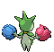
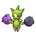
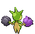
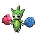
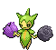
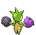

# #315 Roselia (Thorn Pokémon)

| Official Artwork | Shiny Artwork |
| --- | --- |
|  |  |

The more healthy the Roselia, the more pleasant its flowers’ aroma. Its scent deeply relaxes people.

---

## Media

### Sprites

| Front | Back | Front Shiny | Back Shiny |
| --- | --- | --- | --- |
|  |  |  |  |

### Female Sprites

| Front | Back | Front Shiny | Back Shiny |
| --- | --- | --- | --- |
|  |  |  |  |

### Cries

Latest (Gen VI+):

<audio controls>
<source src='../../assets/cries/roselia/latest.ogg' type='audio/ogg'>
  Your browser does not support the audio element.
</audio>

Legacy:

<audio controls>
<source src='../../assets/cries/roselia/legacy.ogg' type='audio/ogg'>
  Your browser does not support the audio element.
</audio>

---

## Pokédex Data

| National № | Type(s) | Height | Weight | Abilities | Local № |
|------------|---------|--------|--------|-----------|---------|
| #315 | {: width='48'} {: width='48'} | 0.3 m | 2.0 kg | 1. Natural-Cure 2. Poison-Point | N/A |

---

## Base Stats
|   | HP | Attack | Defense | Sp. Atk | Sp. Def | Speed |
|---|----|--------|---------|---------|---------|-------|
| **Base** | 50 | 60 | 45 | 100 | 80 | 65 |
| **Min** | 210 | 112 | 85 | 184 | 148 | 121 |
| **Max** | 304 | 240 | 207 | 328 | 284 | 251 |

The ranges shown above are for a level 100 Pokémon. Maximum values are based on a beneficial nature, 252 EVs, 31 IVs; minimum values are based on a hindering nature, 0 EVs, 0 IVs.

---

## Forms & Evolutions

!!! warning "WARNING"

    Information on evolutions may not be 100% accurate; differences between evolution methods across generations are not accounted for.

### Forms

Roselia has no alternate forms.

### Evolution Line

1. [Budew](budew.md/)
    1. Level Up: [Roselia](roselia.md/)
        1. Use Item: [Roserade](roserade.md/)

### Evolution Changes

---

## Training

| EV Yield | Catch Rate | Base Friendship | Base Exp. | Growth Rate | Held Items |
|----------|------------|-----------------|-----------|-------------|------------|
| 2 Special Attack | 150 | 50 | 140 | Medium-Slow | Poison Barb (5%) |

---

## Breeding

| Egg Groups | Egg Cycles | Gender | Dimorphic | Color | Shape |
|------------|------------|--------|-----------|-------|-------|
| 1. Fairy 2. Plant | 20 | 50.0% Male 50.0% Female | True | Green | Humanoid |

---

## Moves

!!! warning "WARNING"

    Specific move information may be incorrect. However, the general movepool should be accurate; this includes changes made in Blaze Black and Volt White.

### Level Up Moves

| Lv. | Move | Type | Cat. | Power | Acc. | PP |
| --- | --- | --- | --- | --- | --- | --- |
| 1 | Absorb | {: width='48'} | {: width='36'} | 50 | 100 | 25 |
| 4 | Growth | {: width='48'} | {: width='36'} | — | — | 20 |
| 7 | Poison Sting | {: width='48'} | {: width='36'} | 15 | 100 | 35 |
| 10 | Stun Spore | {: width='48'} | {: width='36'} | — | 75 | 30 |
| 13 | Mega Drain | {: width='48'} | {: width='36'} | 50 | 100 | 15 |
| 16 | Leech Seed | {: width='48'} | {: width='36'} | — | 90 | 10 |
| 19 | Magical Leaf | {: width='48'} | {: width='36'} | 60 | — | 20 |
| 22 | Grass Whistle | {: width='48'} | {: width='36'} | — | 55 | 15 |
| 25 | Giga Drain | {: width='48'} | {: width='36'} | 75 | 100 | 10 |
| 28 | Toxic Spikes | {: width='48'} | {: width='36'} | — | — | 20 |
| 31 | Sweet Scent | {: width='48'} | {: width='36'} | — | 100 | 20 |
| 34 | Ingrain | {: width='48'} | {: width='36'} | — | — | 20 |
| 37 | Toxic | {: width='48'} | {: width='36'} | — | 90 | 10 |
| 40 | Petal Dance | {: width='48'} | {: width='36'} | 120 | 100 | 10 |
| 43 | Aromatherapy | {: width='48'} | {: width='36'} | — | — | 5 |
| 46 | Synthesis | {: width='48'} | {: width='36'} | — | — | 5 |
| 49 | Sleep Powder | {: width='48'} | {: width='36'} | — | 75 | 15 |
| 52 | Leaf Storm | {: width='48'} | {: width='36'} | 130 | 90 | 5 |
| 55 | Quiver Dance | {: width='48'} | {: width='36'} | — | — | 20 |

### TM Moves

| TM | Move | Type | Cat. | Power | Acc. | PP |
| --- | --- | --- | --- | --- | --- | --- |
| HM01 | Cut | {: width='48'} | {: width='36'} | 60 | 100 | 20 |
| TM06 | Toxic | {: width='48'} | {: width='36'} | — | 90 | 10 |
| TM09 | Venoshock | {: width='48'} | {: width='36'} | 65 | 100 | 10 |
| TM10 | Hidden Power | {: width='48'} | {: width='36'} | 60 | 100 | 15 |
| TM11 | Sunny Day | {: width='48'} | {: width='36'} | — | — | 5 |
| TM17 | Protect | {: width='48'} | {: width='36'} | — | — | 10 |
| TM18 | Rain Dance | {: width='48'} | {: width='36'} | — | — | 5 |
| TM21 | Frustration | {: width='48'} | {: width='36'} | — | 100 | 20 |
| TM22 | Solar Beam | {: width='48'} | {: width='36'} | 120 | 100 | 10 |
| TM27 | Return | {: width='48'} | {: width='36'} | — | 100 | 20 |
| TM30 | Shadow Ball | {: width='48'} | {: width='36'} | 90 | 100 | 15 |
| TM32 | Double Team | {: width='48'} | {: width='36'} | — | — | 15 |
| TM36 | Sludge Bomb | {: width='48'} | {: width='36'} | 90 | 100 | 10 |
| TM42 | Facade | {: width='48'} | {: width='36'} | 70 | 100 | 20 |
| TM44 | Rest | {: width='48'} | {: width='36'} | — | — | 5 |
| TM45 | Attract | {: width='48'} | {: width='36'} | — | 100 | 15 |
| TM48 | Round | {: width='48'} | {: width='36'} | 60 | 100 | 15 |
| TM53 | Energy Ball | {: width='48'} | {: width='36'} | 90 | 100 | 10 |
| TM70 | Flash | {: width='48'} | {: width='36'} | — | 100 | 20 |
| TM75 | Swords Dance | {: width='48'} | {: width='36'} | — | — | 20 |
| TM77 | Psych Up | {: width='48'} | {: width='36'} | — | — | 10 |
| TM84 | Poison Jab | {: width='48'} | {: width='36'} | 80 | 100 | 20 |
| TM86 | Grass Knot | {: width='48'} | {: width='36'} | — | 100 | 20 |
| TM87 | Swagger | {: width='48'} | {: width='36'} | — | 85 | 15 |
| TM90 | Substitute | {: width='48'} | {: width='36'} | — | — | 10 |

### Egg Moves

| Move | Type | Cat. | Power | Acc. | PP |
| --- | --- | --- | --- | --- | --- |
| Pin Missile | {: width='48'} | {: width='36'} | 25 | 95 | 20 |
| Razor Leaf | {: width='48'} | {: width='36'} | 55 | 95 | 25 |
| Mind Reader | {: width='48'} | {: width='36'} | — | — | 5 |
| Cotton Spore | {: width='48'} | {: width='36'} | — | 100 | 40 |
| Spikes | {: width='48'} | {: width='36'} | — | — | 20 |
| Giga Drain | {: width='48'} | {: width='36'} | 75 | 100 | 10 |
| Synthesis | {: width='48'} | {: width='36'} | — | — | 5 |
| Grass Whistle | {: width='48'} | {: width='36'} | — | 55 | 15 |
| Natural Gift | {: width='48'} | {: width='36'} | — | 100 | 15 |
| Seed Bomb | {: width='48'} | {: width='36'} | 80 | 100 | 15 |

### Tutor Moves

Roselia cannot learn any moves from tutors.
