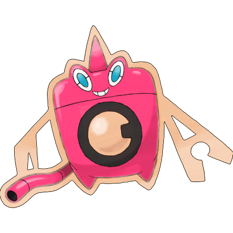
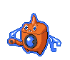
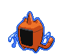
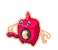
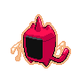

# #10009 Rotom Wash (Plasma Pokémon)

| Official Artwork | Shiny Artwork |
| --- | --- |
|  |  |

Its electric-like body can enter some kinds of machines and take control in order to make mischief.

---

## Media

### Sprites

| Front | Back | Front Shiny | Back Shiny |
| --- | --- | --- | --- |
|  |  |  |  |

### Cries

Latest (Gen VI+):

<audio controls>
  <source src='../assets/cries/10009/latest.ogg' type='audio/ogg'>
  Your browser does not support the audio element.
</audio>

Legacy:

<audio controls>
  <source src='../assets/cries/10009/legacy.ogg' type='audio/ogg'>
  Your browser does not support the audio element.
</audio>

---

## Pokédex Data

| National № | Type(s) | Height | Weight | Abilities | Local № |
|------------|---------|--------|--------|-----------|---------|
| #10009 | {: width='48'} {: width='48'} | 0.3 m | 0.3 kg | 1. Levitate | #N/A |

---

## Base Stats
---

## Base Stats
|   | HP | Attack | Defense | Sp. Atk | Sp. Def | Speed |
|---|----|--------|---------|---------|---------|-------|
| **Base** | 50 | 65 | 107 | 105 | 107 | 111 |
| **Min** | 210 | 121 | 197 | 193 | 197 | 204 |
| **Max** | 304 | 251 | 344 | 339 | 344 | 353 |

The ranges shown above are for a level 100 Pokémon. Maximum values are based on a beneficial nature, 252 EVs, 31 IVs; minimum values are based on a hindering nature, 0 EVs, 0 IVs.

---

## Forms & Evolutions

!!! warning "WARNING"

    Some forms may not be available in Blaze Black/Volt White. Also information on evolutions may not be 100% accurate; it is currently quite complex to track generational evolution data.

### Forms

1. [Rotom](rotom.md/)
2. [Rotom-Heat](rotom-heat.md/)
3. [Rotom-Wash](rotom-wash.md/)
4. [Rotom-Frost](rotom-frost.md/)
5. [Rotom-Fan](rotom-fan.md/)
6. [Rotom-Mow](rotom-mow.md/)

### Evolution Line

1. [Rotom](rotom.md/)

---

## Training

| EV Yield | Catch Rate | Base Friendship | Base Exp. | Growth Rate | Held Items |
|----------|------------|-----------------|-----------|-------------|------------|
| 1 Special Attack 1 Speed | 45 | 50 | 182 | Medium | N/A |

---

## Breeding

| Egg Groups | Egg Cycles | Gender | Dimorphic | Color | Shape |
|------------|------------|--------|-----------|-------|-------|
| 1. Indeterminate | 20 | Genderless | False | Red | Ball |

---

## Moves

!!! warning "WARNING"

    Specific move information may be incorrect. However, the general movepool should be accurate (including changes to learnset).

### Level Up Moves

Lv. | Move | Type | Cat. | Power | Acc. | PP
--- | --- | --- | --- | --- | --- | ---
| 1 | Astonish | {: width='48'} | {: width='36'} | 30 | 100 | 15 |
| 1 | Confuse Ray | {: width='48'} | {: width='36'} | — | 100 | 10 |
| 1 | Energy Ball | {: width='48'} | {: width='36'} | 90 | 100 | 10 |
| 1 | Glaciate | {: width='48'} | {: width='36'} | 100 | 100 | 10 |
| 1 | Hurricane | {: width='48'} | {: width='36'} | 110 | 70 | 10 |
| 1 | Lava Plume | {: width='48'} | {: width='36'} | 80 | 100 | 15 |
| 1 | Scald | {: width='48'} | {: width='36'} | 80 | 100 | 15 |
| 1 | Signal Beam | {: width='48'} | {: width='36'} | 75 | 100 | 15 |
| 1 | Thunder Shock | {: width='48'} | {: width='36'} | 40 | 100 | 30 |
| 1 | Thunder Wave | {: width='48'} | {: width='36'} | — | 90 | 20 |
| 1 | Trick | {: width='48'} | {: width='36'} | — | 100 | 10 |
| 8 | Uproar | {: width='48'} | {: width='36'} | 90 | 100 | 10 |
| 15 | Double Team | {: width='48'} | {: width='36'} | — | — | 15 |
| 22 | Shock Wave | {: width='48'} | {: width='36'} | 70 | — | 20 |
| 29 | Ominous Wind | {: width='48'} | {: width='36'} | 60 | 100 | 5 |
| 36 | Substitute | {: width='48'} | {: width='36'} | — | — | 10 |
| 43 | Electro Ball | {: width='48'} | {: width='36'} | — | 100 | 10 |
| 50 | Hex | {: width='48'} | {: width='36'} | 65 | 100 | 10 |
| 57 | Charge | {: width='48'} | {: width='36'} | — | — | 20 |
| 64 | Discharge | {: width='48'} | {: width='36'} | 80 | 100 | 15 |

### TM Moves

TM | Move | Type | Cat. | Power | Acc. | PP
--- | --- | --- | --- | --- | --- | ---
| TM06 | Toxic | {: width='48'} | {: width='36'} | — | 90 | 10 |
| TM10 | Hidden Power | {: width='48'} | {: width='36'} | 60 | 100 | 15 |
| TM11 | Sunny Day | {: width='48'} | {: width='36'} | — | — | 5 |
| TM16 | Light Screen | {: width='48'} | {: width='36'} | — | — | 30 |
| TM17 | Protect | {: width='48'} | {: width='36'} | — | — | 10 |
| TM18 | Rain Dance | {: width='48'} | {: width='36'} | — | — | 5 |
| TM19 | Telekinesis | {: width='48'} | {: width='36'} | — | — | 15 |
| TM21 | Frustration | {: width='48'} | {: width='36'} | — | 100 | 20 |
| TM24 | Thunderbolt | {: width='48'} | {: width='36'} | 90 | 100 | 15 |
| TM25 | Thunder | {: width='48'} | {: width='36'} | 110 | 70 | 10 |
| TM27 | Return | {: width='48'} | {: width='36'} | — | 100 | 20 |
| TM30 | Shadow Ball | {: width='48'} | {: width='36'} | 90 | 100 | 15 |
| TM32 | Double Team | {: width='48'} | {: width='36'} | — | — | 15 |
| TM33 | Reflect | {: width='48'} | {: width='36'} | — | — | 20 |
| TM42 | Facade | {: width='48'} | {: width='36'} | 70 | 100 | 20 |
| TM44 | Rest | {: width='48'} | {: width='36'} | — | — | 5 |
| TM46 | Thief | {: width='48'} | {: width='36'} | 60 | 100 | 25 |
| TM48 | Round | {: width='48'} | {: width='36'} | 60 | 100 | 15 |
| TM57 | Charge Beam | {: width='48'} | {: width='36'} | 50 | 90 | 10 |
| TM61 | Will O Wisp | {: width='48'} | {: width='36'} | — | 85 | 15 |
| TM70 | Flash | {: width='48'} | {: width='36'} | — | 100 | 20 |
| TM72 | Volt Switch | {: width='48'} | {: width='36'} | 70 | 100 | 20 |
| TM73 | Thunder Wave | {: width='48'} | {: width='36'} | — | 90 | 20 |
| TM77 | Psych Up | {: width='48'} | {: width='36'} | — | — | 10 |
| TM85 | Dream Eater | {: width='48'} | {: width='36'} | 100 | 100 | 15 |
| TM87 | Swagger | {: width='48'} | {: width='36'} | — | 85 | 15 |
| TM90 | Substitute | {: width='48'} | {: width='36'} | — | — | 10 |

### Egg Moves

Rotom Wash cannot learn any moves by breeding.
### Tutor Moves

Rotom Wash cannot learn any moves from tutors.
