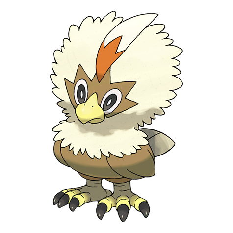
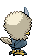
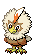
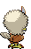

# #627 Rufflet (Eaglet Pokémon)

| Official Artwork | Shiny Artwork |
| --- | --- |
|  |  |

**Blaze Black:** They crush berries with their talons. They bravely stand up to any opponent, no matter how strong it is.

**Volt White:** They will challenge anything, even strong opponents, without fear. Their frequent fights help them become stronger.

---

## Media

### Sprites

| Front | Back | Front Shiny | Back Shiny |
| --- | --- | --- | --- |
|  |  |  |  |

### Cries

Latest (Gen VI+):

<audio controls>
<source src='../../assets/cries/rufflet/latest.ogg' type='audio/ogg'>
  Your browser does not support the audio element.
</audio>

Legacy:

<audio controls>
<source src='../../assets/cries/rufflet/legacy.ogg' type='audio/ogg'>
  Your browser does not support the audio element.
</audio>

---

## Pokédex Data

| National № | Type(s) | Height | Weight | Abilities | Local № |
|------------|---------|--------|--------|-----------|---------|
| #627 | {: width='48'} {: width='48'} | 0.5 m | 10.5 kg | 1. Hustle 2. Sheer-Force | #133 |

---

## Base Stats
|   | HP | Attack | Defense | Sp. Atk | Sp. Def | Speed |
|---|----|--------|---------|---------|---------|-------|
| **Base** | 70 | 83 | 50 | 37 | 50 | 60 |
| **Min** | 250 | 153 | 94 | 71 | 94 | 112 |
| **Max** | 344 | 291 | 218 | 190 | 218 | 240 |

The ranges shown above are for a level 100 Pokémon. Maximum values are based on a beneficial nature, 252 EVs, 31 IVs; minimum values are based on a hindering nature, 0 EVs, 0 IVs.

---

## Forms & Evolutions

!!! warning "WARNING"

    Information on evolutions may not be 100% accurate; differences between evolution methods across generations are not accounted for.

### Forms

Rufflet has no alternate forms.

### Evolution Line

1. [Rufflet](rufflet.md/)
    1. Level Up: [Braviary](braviary.md/)

### Evolution Changes

1. Level 39 [Rufflet]

---

## Training

| EV Yield | Catch Rate | Base Friendship | Base Exp. | Growth Rate | Held Items |
|----------|------------|-----------------|-----------|-------------|------------|
| 1 Attack | 190 | 50 | 70 | Slow | N/A |

---

## Breeding

| Egg Groups | Egg Cycles | Gender | Dimorphic | Color | Shape |
|------------|------------|--------|-----------|-------|-------|
| 1. Flying | 20 | 100.0% Male 0.0% Female | False | White | Wings |

---

## Moves

!!! warning "WARNING"

    Specific move information may be incorrect. However, the general movepool should be accurate; this includes changes made in Blaze Black and Volt White.

### Level Up Moves

| Lv. | Move | Type | Cat. | Power | Acc. | PP |
| --- | --- | --- | --- | --- | --- | --- |
| 1 | Leer | {: width='48'} | {: width='36'} | — | 100 | 30 |
| 1 | Peck | {: width='48'} | {: width='36'} | 35 | 100 | 35 |
| 5 | Fury Attack | {: width='48'} | {: width='36'} | 15 | 85 | 20 |
| 10 | Wing Attack | {: width='48'} | {: width='36'} | 75 | 100 | 35 |
| 14 | Hone Claws | {: width='48'} | {: width='36'} | — | — | 15 |
| 19 | Scary Face | {: width='48'} | {: width='36'} | — | 100 | 10 |
| 23 | Aerial Ace | {: width='48'} | {: width='36'} | 60 | — | 20 |
| 28 | Slash | {: width='48'} | {: width='36'} | 70 | 100 | 20 |
| 32 | Defog | {: width='48'} | {: width='36'} | — | — | 15 |
| 37 | Tailwind | {: width='48'} | {: width='36'} | — | — | 15 |
| 41 | Air Slash | {: width='48'} | {: width='36'} | 75 | 95 | 15 |
| 46 | Crush Claw | {: width='48'} | {: width='36'} | 75 | 95 | 10 |
| 50 | Sky Drop | {: width='48'} | {: width='36'} | 80 | 100 | 10 |
| 55 | Whirlwind | {: width='48'} | {: width='36'} | — | — | 20 |
| 59 | Brave Bird | {: width='48'} | {: width='36'} | 120 | 100 | 15 |
| 64 | Thrash | {: width='48'} | {: width='36'} | 120 | 100 | 10 |

### TM Moves

| TM | Move | Type | Cat. | Power | Acc. | PP |
| --- | --- | --- | --- | --- | --- | --- |
| HM01 | Cut | {: width='48'} | {: width='36'} | 60 | 100 | 20 |
| HM02 | Fly | {: width='48'} | {: width='36'} | 100 | 100 | 15 |
| HM04 | Strength | {: width='48'} | {: width='36'} | 85 | 100 | 15 |
| TM01 | Hone Claws | {: width='48'} | {: width='36'} | — | — | 15 |
| TM06 | Toxic | {: width='48'} | {: width='36'} | — | 90 | 10 |
| TM08 | Bulk Up | {: width='48'} | {: width='36'} | — | — | 20 |
| TM10 | Hidden Power | {: width='48'} | {: width='36'} | 60 | 100 | 15 |
| TM11 | Sunny Day | {: width='48'} | {: width='36'} | — | — | 5 |
| TM17 | Protect | {: width='48'} | {: width='36'} | — | — | 10 |
| TM18 | Rain Dance | {: width='48'} | {: width='36'} | — | — | 5 |
| TM21 | Frustration | {: width='48'} | {: width='36'} | — | 100 | 20 |
| TM27 | Return | {: width='48'} | {: width='36'} | — | 100 | 20 |
| TM32 | Double Team | {: width='48'} | {: width='36'} | — | — | 15 |
| TM39 | Rock Tomb | {: width='48'} | {: width='36'} | 60 | 95 | 15 |
| TM40 | Aerial Ace | {: width='48'} | {: width='36'} | 60 | — | 20 |
| TM42 | Facade | {: width='48'} | {: width='36'} | 70 | 100 | 20 |
| TM44 | Rest | {: width='48'} | {: width='36'} | — | — | 5 |
| TM45 | Attract | {: width='48'} | {: width='36'} | — | 100 | 15 |
| TM48 | Round | {: width='48'} | {: width='36'} | 60 | 100 | 15 |
| TM58 | Sky Drop | {: width='48'} | {: width='36'} | 80 | 100 | 10 |
| TM65 | Shadow Claw | {: width='48'} | {: width='36'} | 80 | 100 | 15 |
| TM67 | Retaliate | {: width='48'} | {: width='36'} | 70 | 100 | 5 |
| TM80 | Rock Slide | {: width='48'} | {: width='36'} | 80 | 95 | 10 |
| TM83 | Work Up | {: width='48'} | {: width='36'} | — | — | 30 |
| TM87 | Swagger | {: width='48'} | {: width='36'} | — | 85 | 15 |
| TM88 | Pluck | {: width='48'} | {: width='36'} | 60 | 100 | 20 |
| TM89 | U Turn | {: width='48'} | {: width='36'} | 70 | 100 | 20 |
| TM90 | Substitute | {: width='48'} | {: width='36'} | — | — | 10 |
| TM94 | Rock Smash | {: width='48'} | {: width='36'} | 40 | 100 | 15 |

### Egg Moves

Rufflet cannot learn any moves by breeding.
### Tutor Moves

Rufflet cannot learn any moves from tutors.
