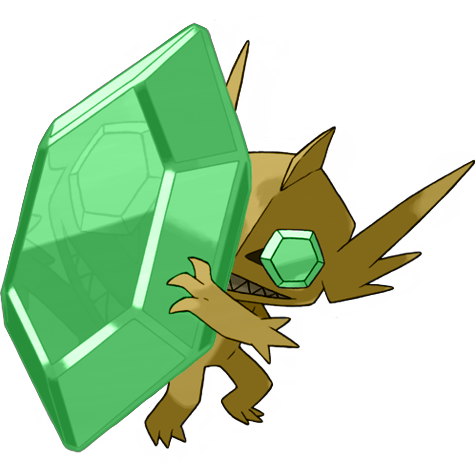
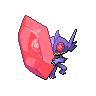
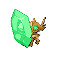

# #10066 Sableye Mega (Darkness Pokémon)

| Official Artwork | Shiny Artwork |
| --- | --- |
|  |  |

It hides in the darkness of caves. Its diet of gems has transformed its eyes into gemstones.

---

## Media

### Sprites

| Front | Front Shiny |
| --- | --- |
|  |  |

### Cries

Latest (Gen VI+):

<audio controls>
  <source src='../assets/cries/10066/latest.ogg' type='audio/ogg'>
  Your browser does not support the audio element.
</audio>

Legacy:

<audio controls>
  <source src='../assets/cries/10066/legacy.ogg' type='audio/ogg'>
  Your browser does not support the audio element.
</audio>

---

## Pokédex Data

| National № | Type(s) | Height | Weight | Abilities | Local № |
|------------|---------|--------|--------|-----------|---------|
| #10066 | {: width='48'} {: width='48'} | 0.5 m | 161.0 kg | 1. Magic-Bounce | #N/A |

---

## Base Stats
---

## Base Stats
|   | HP | Attack | Defense | Sp. Atk | Sp. Def | Speed |
|---|----|--------|---------|---------|---------|-------|
| **Base** | 50 | 85 | 125 | 85 | 115 | 20 |
| **Min** | 210 | 157 | 229 | 157 | 211 | 40 |
| **Max** | 304 | 295 | 383 | 295 | 361 | 152 |

The ranges shown above are for a level 100 Pokémon. Maximum values are based on a beneficial nature, 252 EVs, 31 IVs; minimum values are based on a hindering nature, 0 EVs, 0 IVs.

---

## Forms & Evolutions

!!! warning "WARNING"

    Some forms may not be available in Blaze Black/Volt White. Also information on evolutions may not be 100% accurate; it is currently quite complex to track generational evolution data.

### Forms

1. [Sableye](sableye.md/)
2. [Sableye-Mega](sableye-mega.md/)

### Evolution Line

1. [Sableye](sableye.md/)

---

## Training

| EV Yield | Catch Rate | Base Friendship | Base Exp. | Growth Rate | Held Items |
|----------|------------|-----------------|-----------|-------------|------------|
| 1 Attack 1 Defense | 45 | 35 | 168 | Medium-Slow | N/A |

---

## Breeding

| Egg Groups | Egg Cycles | Gender | Dimorphic | Color | Shape |
|------------|------------|--------|-----------|-------|-------|
| 1. Humanshape | 25 | 50.0% Male 50.0% Female | False | Purple | Humanoid |

---

## Moves

!!! warning "WARNING"

    Specific move information may be incorrect. However, the general movepool should be accurate (including changes to learnset).

### Level Up Moves

Lv. | Move | Type | Cat. | Power | Acc. | PP
--- | --- | --- | --- | --- | --- | ---
| 1 | Leer | {: width='48'} | {: width='36'} | — | 100 | 30 |
| 1 | Scratch | {: width='48'} | {: width='36'} | 40 | 100 | 35 |
| 4 | Foresight | {: width='48'} | {: width='36'} | — | — | 40 |
| 6 | Night Shade | {: width='48'} | {: width='36'} | — | 100 | 15 |
| 9 | Astonish | {: width='48'} | {: width='36'} | 30 | 100 | 15 |
| 11 | Fury Swipes | {: width='48'} | {: width='36'} | 18 | 80 | 15 |
| 14 | Detect | {: width='48'} | {: width='36'} | — | — | 5 |
| 16 | Shadow Sneak | {: width='48'} | {: width='36'} | 40 | 100 | 30 |
| 19 | Feint Attack | {: width='48'} | {: width='36'} | 60 | — | 20 |
| 21 | Fake Out | {: width='48'} | {: width='36'} | 40 | 100 | 10 |
| 24 | Punishment | {: width='48'} | {: width='36'} | — | 100 | 5 |
| 26 | Knock Off | {: width='48'} | {: width='36'} | 65 | 100 | 20 |
| 29 | Shadow Claw | {: width='48'} | {: width='36'} | 80 | 100 | 15 |
| 31 | Confuse Ray | {: width='48'} | {: width='36'} | — | 100 | 10 |
| 34 | Zen Headbutt | {: width='48'} | {: width='36'} | 80 | 90 | 15 |
| 36 | Power Gem | {: width='48'} | {: width='36'} | 90 | 100 | 20 |
| 39 | Shadow Ball | {: width='48'} | {: width='36'} | 90 | 100 | 15 |
| 41 | Foul Play | {: width='48'} | {: width='36'} | 95 | 100 | 15 |
| 44 | Quash | {: width='48'} | {: width='36'} | — | 100 | 15 |
| 46 | Mean Look | {: width='48'} | {: width='36'} | — | — | 5 |

### TM Moves

TM | Move | Type | Cat. | Power | Acc. | PP
--- | --- | --- | --- | --- | --- | ---
| TM04 | Calm Mind | {: width='48'} | {: width='36'} | — | — | 20 |
| TM06 | Toxic | {: width='48'} | {: width='36'} | — | 90 | 10 |
| TM10 | Hidden Power | {: width='48'} | {: width='36'} | 60 | 100 | 15 |
| TM100 | Confide | {: width='48'} | {: width='36'} | — | — | 20 |
| TM11 | Sunny Day | {: width='48'} | {: width='36'} | — | — | 5 |
| TM12 | Taunt | {: width='48'} | {: width='36'} | — | 100 | 20 |
| TM17 | Protect | {: width='48'} | {: width='36'} | — | — | 10 |
| TM18 | Rain Dance | {: width='48'} | {: width='36'} | — | — | 5 |
| TM21 | Frustration | {: width='48'} | {: width='36'} | — | 100 | 20 |
| TM27 | Return | {: width='48'} | {: width='36'} | — | 100 | 20 |
| TM29 | Psychic | {: width='48'} | {: width='36'} | 90 | 100 | 10 |
| TM30 | Shadow Ball | {: width='48'} | {: width='36'} | 90 | 100 | 15 |
| TM31 | Brick Break | {: width='48'} | {: width='36'} | 75 | 100 | 15 |
| TM32 | Double Team | {: width='48'} | {: width='36'} | — | — | 15 |
| TM39 | Rock Tomb | {: width='48'} | {: width='36'} | 60 | 95 | 15 |
| TM40 | Aerial Ace | {: width='48'} | {: width='36'} | 60 | — | 20 |
| TM41 | Torment | {: width='48'} | {: width='36'} | — | 100 | 15 |
| TM42 | Facade | {: width='48'} | {: width='36'} | 70 | 100 | 20 |
| TM44 | Rest | {: width='48'} | {: width='36'} | — | — | 5 |
| TM45 | Attract | {: width='48'} | {: width='36'} | — | 100 | 15 |
| TM46 | Thief | {: width='48'} | {: width='36'} | 60 | 100 | 25 |
| TM47 | Low Sweep | {: width='48'} | {: width='36'} | 65 | 100 | 20 |
| TM48 | Round | {: width='48'} | {: width='36'} | 60 | 100 | 15 |
| TM56 | Fling | {: width='48'} | {: width='36'} | — | 100 | 10 |
| TM60 | Quash | {: width='48'} | {: width='36'} | — | 100 | 15 |
| TM61 | Will O Wisp | {: width='48'} | {: width='36'} | — | 85 | 15 |
| TM63 | Embargo | {: width='48'} | {: width='36'} | — | 100 | 15 |
| TM65 | Shadow Claw | {: width='48'} | {: width='36'} | 80 | 100 | 15 |
| TM66 | Payback | {: width='48'} | {: width='36'} | 50 | 100 | 10 |
| TM77 | Psych Up | {: width='48'} | {: width='36'} | — | — | 10 |
| TM84 | Poison Jab | {: width='48'} | {: width='36'} | 80 | 100 | 20 |
| TM85 | Dream Eater | {: width='48'} | {: width='36'} | 100 | 100 | 15 |
| TM87 | Swagger | {: width='48'} | {: width='36'} | — | 85 | 15 |
| TM88 | Sleep Talk | {: width='48'} | {: width='36'} | — | — | 10 |
| TM90 | Substitute | {: width='48'} | {: width='36'} | — | — | 10 |
| TM95 | Snarl | {: width='48'} | {: width='36'} | 60 | 95 | 15 |
| TM97 | Dark Pulse | {: width='48'} | {: width='36'} | 90 | 100 | 15 |
| TM99 | Dazzling Gleam | {: width='48'} | {: width='36'} | 80 | 100 | 10 |

### Egg Moves

Move | Type | Cat. | Power | Acc. | PP
--- | --- | --- | --- | --- | ---
| Recover | {: width='48'} | {: width='36'} | — | — | 5 |
| Mean Look | {: width='48'} | {: width='36'} | — | — | 5 |
| Moonlight | {: width='48'} | {: width='36'} | — | — | 5 |
| Flatter | {: width='48'} | {: width='36'} | — | 100 | 15 |
| Trick | {: width='48'} | {: width='36'} | — | 100 | 10 |
| Imprison | {: width='48'} | {: width='36'} | — | — | 10 |
| Feint | {: width='48'} | {: width='36'} | 30 | 100 | 10 |
| Metal Burst | {: width='48'} | {: width='36'} | — | 100 | 10 |
| Sucker Punch | {: width='48'} | {: width='36'} | 70 | 100 | 5 |
| Nasty Plot | {: width='48'} | {: width='36'} | — | — | 20 |
| Captivate | {: width='48'} | {: width='36'} | — | 100 | 20 |

### Tutor Moves

Move | Type | Cat. | Power | Acc. | PP
--- | --- | --- | --- | --- | ---
| Fire Punch | {: width='48'} | {: width='36'} | 80 | 100 | 15 |
| Ice Punch | {: width='48'} | {: width='36'} | 80 | 100 | 15 |
| Thunder Punch | {: width='48'} | {: width='36'} | 80 | 100 | 15 |
| Low Kick | {: width='48'} | {: width='36'} | — | 100 | 20 |
| Snore | {: width='48'} | {: width='36'} | 50 | 100 | 15 |
| Spite | {: width='48'} | {: width='36'} | — | 100 | 10 |
| Icy Wind | {: width='48'} | {: width='36'} | 55 | 95 | 15 |
| Pain Split | {: width='48'} | {: width='36'} | — | — | 20 |
| Focus Punch | {: width='48'} | {: width='36'} | 150 | 100 | 20 |
| Trick | {: width='48'} | {: width='36'} | — | 100 | 10 |
| Role Play | {: width='48'} | {: width='36'} | — | — | 10 |
| Magic Coat | {: width='48'} | {: width='36'} | — | — | 15 |
| Knock Off | {: width='48'} | {: width='36'} | 65 | 100 | 20 |
| Snatch | {: width='48'} | {: width='36'} | — | — | 10 |
| Signal Beam | {: width='48'} | {: width='36'} | 75 | 100 | 15 |
| Shock Wave | {: width='48'} | {: width='36'} | 70 | — | 20 |
| Water Pulse | {: width='48'} | {: width='36'} | 60 | 100 | 20 |
| Gravity | {: width='48'} | {: width='36'} | — | — | 5 |
| Zen Headbutt | {: width='48'} | {: width='36'} | 80 | 90 | 15 |
| Wonder Room | {: width='48'} | {: width='36'} | — | — | 10 |
| Telekinesis | {: width='48'} | {: width='36'} | — | — | 15 |
| Foul Play | {: width='48'} | {: width='36'} | 95 | 100 | 15 |
| Ally Switch | {: width='48'} | {: width='36'} | — | — | 15 |

