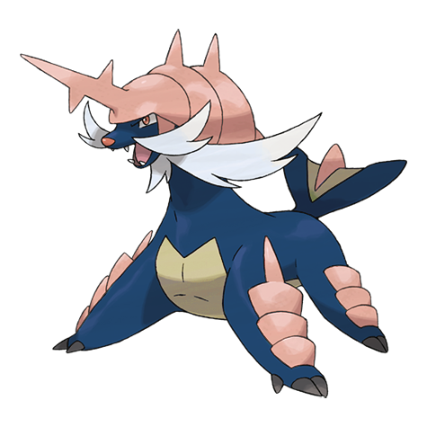
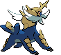
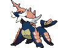
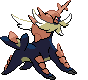

# #503 Samurott (Formidable Pokémon)

| Official Artwork | Shiny Artwork |
| --- | --- |
|  |  |

**Blaze Black:** One swing of the sword incorporated in its armor can fell an opponent. A simple glare from one of them quiets everybody.

**Volt White:** Part of the armor on its anterior legs becomes a giant sword. Its cry alone is enough to intimidate most enemies.

---

## Media

### Default Sprites

| Front | Back | Front Shiny | Back Shiny |
| --- | --- | --- | --- |
|  |  |  |  |

### Cries

Latest (Gen VI+):

<audio controls>
<source src='../../assets/cries/samurott/latest.ogg' type='audio/ogg'>
  Your browser does not support the audio element.
</audio>

Legacy:

<audio controls>
<source src='../../assets/cries/samurott/legacy.ogg' type='audio/ogg'>
  Your browser does not support the audio element.
</audio>

---

## Pokédex Data

| National № | Type(s) | Height | Weight | Abilities | Local № |
|------------|---------|--------|--------|-----------|---------|
| #503 | {: width="48"} {: width="48"} | 1.5 m / 4.9 ft | 94.6 kg / 208.6 lbs | Torrent Vital Spirit | #9 |

---

## Base Stats
|   | HP | Attack | Defense | Sp. Atk | Sp. Def | Speed |
|---|----|--------|---------|---------|---------|-------|
| **Base** | 95 | 100 | 85 | 105 | 70 | 80 |
| **Min** | 300 | 184 | 157 | 193 | 130 | 148 |
| **Max** | 394 | 328 | 295 | 339 | 262 | 284 |

The ranges shown above are for a level 100 Pokémon. Maximum values are based on a beneficial nature, 252 EVs, 31 IVs; minimum values are based on a hindering nature, 0 EVs, 0 IVs.

---

## Forms & Evolutions

!!! warning "WARNING"

    Information on evolutions may not be 100% accurate; differences between evolution methods across generations are not accounted for.

### Forms

Samurott has no alternate forms.

### Evolution Line

1. [Oshawott](oshawott.md/)
    1. Level Up: [Dewott](dewott.md/)
        1. Level Up: [Samurott](samurott.md/)

---

## Training

| EV Yield | Catch Rate | Base Friendship | Base Exp. | Growth Rate | Held Items |
|----------|------------|-----------------|-----------|-------------|------------|
| 3 Special Attack | 45 | 70 | 238 | Medium Slow | Mystic Water (50%) |

---

## Breeding

| Egg Groups | Egg Cycles | Gender | Dimorphic | Color | Shape |
|------------|------------|--------|-----------|-------|-------|
| 1. Ground | 20 | 87.5% Male 12.5% Female | False | Blue | Quadruped |

---

## Moves

!!! warning "WARNING"

    Specific move information may be incorrect. However, the general movepool should be accurate; this includes changes made in Blaze Black and Volt White.

### Level Up Moves

| Lv. | Move | Type | Cat. | Power | Acc. | PP |
| --- | --- | --- | --- | --- | --- | --- |
| 1 | Megahorn | {: width="48"} | {: width="36"} | 120 | 85 | 10 |
| 1 | Secret Sword | {: width="48"} | {: width="36"} | 85 | 100 | 10 |
| 1 | Tackle | {: width="48"} | {: width="36"} | 40 | 100 | 35 |
| 1 | Tail Whip | {: width="48"} | {: width="36"} | — | 100 | 30 |
| 1 | Water Gun | {: width="48"} | {: width="36"} | 40 | 100 | 25 |
| 1 | Water Sport | {: width="48"} | {: width="36"} | — | — | 15 |
| 5 | Tail Whip | {: width="48"} | {: width="36"} | — | 100 | 30 |
| 7 | Water Gun | {: width="48"} | {: width="36"} | 40 | 100 | 25 |
| 11 | Water Sport | {: width="48"} | {: width="36"} | — | — | 15 |
| 13 | Focus Energy | {: width="48"} | {: width="36"} | — | — | 30 |
| 17 | Karate Chop | {: width="48"} | {: width="36"} | 50 | 100 | 25 |
| 17 | Razor Shell | {: width="48"} | {: width="36"} | 75 | 95 | 10 |
| 20 | Fury Cutter | {: width="48"} | {: width="36"} | 40 | 95 | 20 |
| 25 | Water Pulse | {: width="48"} | {: width="36"} | 60 | 100 | 20 |
| 28 | Revenge | {: width="48"} | {: width="36"} | 60 | 100 | 10 |
| 33 | Aqua Jet | {: width="48"} | {: width="36"} | 40 | 100 | 20 |
| 36 | Sacred Sword | {: width="48"} | {: width="36"} | 90 | 100 | 15 |
| 36 | Slash | {: width="48"} | {: width="36"} | 70 | 100 | 20 |
| 38 | Encore | {: width="48"} | {: width="36"} | — | 100 | 5 |
| 45 | Aqua Tail | {: width="48"} | {: width="36"} | 90 | 90 | 10 |
| 50 | Retaliate | {: width="48"} | {: width="36"} | 70 | 100 | 5 |
| 57 | Swords Dance | {: width="48"} | {: width="36"} | — | — | 20 |
| 62 | Hydro Pump | {: width="48"} | {: width="36"} | 110 | 80 | 5 |
| 69 | Close Combat | {: width="48"} | {: width="36"} | 120 | 100 | 5 |
| 76 | Shell Smash | {: width="48"} | {: width="36"} | — | — | 15 |

### TM Moves

| TM | Move | Type | Cat. | Power | Acc. | PP |
| --- | --- | --- | --- | --- | --- | --- |
| HM01 | Cut | {: width="48"} | {: width="36"} | 60 | 100% | 25 |
| HM03 | Surf | {: width="48"} | {: width="36"} | 90 | 100 | 15 |
| HM04 | Strength | {: width="48"} | {: width="36"} | 100 | 100 | 15 |
| HM05 | Waterfall | {: width="48"} | {: width="36"} | 85 | 100 | 15 |
| HM06 | Dive | {: width="48"} | {: width="36"} | 80 | 100 | 10 |
| TM06 | Toxic | {: width="48"} | {: width="36"} | — | 90 | 10 |
| TM07 | Hail | {: width="48"} | {: width="36"} | — | — | 10 |
| TM10 | Hidden Power | {: width="48"} | {: width="36"} | 60 | 100 | 15 |
| TM12 | Taunt | {: width="48"} | {: width="36"} | — | 100 | 20 |
| TM13 | Ice Beam | {: width="48"} | {: width="36"} | 90 | 100 | 10 |
| TM14 | Blizzard | {: width="48"} | {: width="36"} | 110 | 70 | 5 |
| TM15 | Hyper Beam | {: width="48"} | {: width="36"} | 150 | 90 | 5 |
| TM17 | Protect | {: width="48"} | {: width="36"} | — | — | 10 |
| TM18 | Rain Dance | {: width="48"} | {: width="36"} | — | — | 5 |
| TM21 | Frustration | {: width="48"} | {: width="36"} | — | 100 | 20 |
| TM26 | Earthquake | {: width="48"} | {: width="36"} | 100 | 100 | 10 |
| TM27 | Return | {: width="48"} | {: width="36"} | — | 100 | 20 |
| TM28 | Dig | {: width="48"} | {: width="36"} | 100 | 100 | 10 |
| TM32 | Double Team | {: width="48"} | {: width="36"} | — | — | 15 |
| TM40 | Aerial Ace | {: width="48"} | {: width="36"} | 60 | — | 20 |
| TM42 | Facade | {: width="48"} | {: width="36"} | 70 | 100 | 20 |
| TM44 | Rest | {: width="48"} | {: width="36"} | — | — | 5 |
| TM45 | Attract | {: width="48"} | {: width="36"} | — | 100 | 15 |
| TM48 | Round | {: width="48"} | {: width="36"} | 60 | 100 | 15 |
| TM54 | False Swipe | {: width="48"} | {: width="36"} | 40 | 100 | 40 |
| TM55 | Scald | {: width="48"} | {: width="36"} | 80 | 100 | 15 |
| TM56 | Fling | {: width="48"} | {: width="36"} | — | 100 | 10 |
| TM67 | Retaliate | {: width="48"} | {: width="36"} | 70 | 100 | 5 |
| TM68 | Giga Impact | {: width="48"} | {: width="36"} | 150 | 90 | 5 |
| TM75 | Swords Dance | {: width="48"} | {: width="36"} | — | — | 20 |
| TM81 | X Scissor | {: width="48"} | {: width="36"} | 80 | 100 | 15 |
| TM82 | Dragon Tail | {: width="48"} | {: width="36"} | 60 | 90 | 10 |
| TM86 | Grass Knot | {: width="48"} | {: width="36"} | — | 100 | 20 |
| TM87 | Swagger | {: width="48"} | {: width="36"} | — | 85 | 15 |
| TM90 | Substitute | {: width="48"} | {: width="36"} | — | — | 10 |
| TM94 | Rock Smash | {: width="48"} | {: width="36"} | 60 | 100 | 15 |

### Egg Moves

Samurott cannot learn any moves by breeding.
### Tutor Moves

| Move | Type | Cat. | Power | Acc. | PP |
| --- | --- | --- | --- | --- | --- |
| Hydro Cannon | {: width="48"} | {: width="36"} | 150 | 90 | 5 |
| Water Pledge | {: width="48"} | {: width="36"} | 80 | 100 | 10 |

