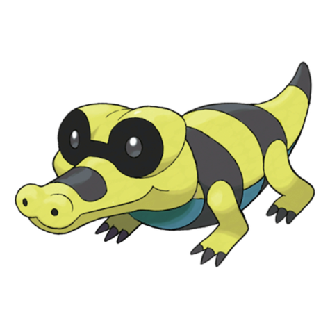
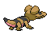
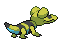

# Sandile (Desert Croc Pokémon)

| Official Artwork | Shiny Artwork |
| --- | --- |
|  |  |

**Blaze Black:** They live buried in the sands of the desert. The sun-warmed sands prevent their body temperature from dropping.

**Volt White:** It moves along below the sand’s surface, except for its nose and eyes. A dark membrane shields its eyes from the sun.

---

## Media

### Default Sprites

| Front | Back | Front Shiny | Back Shiny |
| --- | --- | --- | --- |
|  |  |  |  |

### Cries

Latest (Gen VI+):

<audio controls>
<source src='../../assets/cries/sandile/latest.ogg' type='audio/ogg'>
  Your browser does not support the audio element.
</audio>

Legacy:

<audio controls>
<source src='../../assets/cries/sandile/legacy.ogg' type='audio/ogg'>
  Your browser does not support the audio element.
</audio>

---

## Pokédex Data

| National № | Type(s) | Height | Weight | Abilities | Local № |
|------------|---------|--------|--------|-----------|---------|
| #551 | {: width='48'} {: width='48'} | 0.7 m | 15.2 kg | 1. Anger-Point 2. Moxie | #57 |

---

## Base Stats
|   | HP | Attack | Defense | Sp. Atk | Sp. Def | Speed |
|---|----|--------|---------|---------|---------|-------|
| **Base** | 50 | 72 | 35 | 35 | 35 | 65 |
| **Min** | 210 | 134 | 67 | 67 | 67 | 121 |
| **Max** | 304 | 267 | 185 | 185 | 185 | 251 |

The ranges shown above are for a level 100 Pokémon. Maximum values are based on a beneficial nature, 252 EVs, 31 IVs; minimum values are based on a hindering nature, 0 EVs, 0 IVs.

---

## Forms & Evolutions

!!! warning "WARNING"

    Information on evolutions may not be 100% accurate; differences between evolution methods across generations are not accounted for.

### Forms

Sandile has no alternate forms.

### Evolution Line

1. [Sandile](sandile.md/)
    1. Level Up: [Krokorok](krokorok.md/)
        1. Level Up: [Krookodile](krookodile.md/)

---

## Training

| EV Yield | Catch Rate | Base Friendship | Base Exp. | Growth Rate | Held Items |
|----------|------------|-----------------|-----------|-------------|------------|
| 1 Attack | 180 | 50 | 58 | Medium-Slow |  |

---

## Breeding

| Egg Groups | Egg Cycles | Gender | Dimorphic | Color | Shape |
|------------|------------|--------|-----------|-------|-------|
| 1. Ground | 20 | 50.0% Male 50.0% Female | False | Brown | Quadruped |

---

## Moves

!!! warning "WARNING"

    Specific move information may be incorrect. However, the general movepool should be accurate; this includes changes made in Blaze Black and Volt White.

### Level Up Moves

| Lv. | Move | Type | Cat. | Power | Acc. | PP |
| --- | --- | --- | --- | --- | --- | --- |
| 1 | Leer | {: width='48'} | {: width='36'} | — | 100 | 30 |
| 1 | Rage | {: width='48'} | {: width='36'} | 20 | 100 | 20 |
| 4 | Bite | {: width='48'} | {: width='36'} | 60 | 100 | 25 |
| 7 | Sand Attack | {: width='48'} | {: width='36'} | — | 100 | 15 |
| 10 | Torment | {: width='48'} | {: width='36'} | — | 100 | 15 |
| 13 | Bulldoze | {: width='48'} | {: width='36'} | 60 | 100 | 20 |
| 16 | Assurance | {: width='48'} | {: width='36'} | 60 | 100 | 10 |
| 19 | Mud Slap | {: width='48'} | {: width='36'} | 20 | 100 | 10 |
| 22 | Embargo | {: width='48'} | {: width='36'} | — | 100 | 15 |
| 25 | Swagger | {: width='48'} | {: width='36'} | — | 85 | 15 |
| 28 | Crunch | {: width='48'} | {: width='36'} | 80 | 100 | 15 |
| 31 | Dig | {: width='48'} | {: width='36'} | 100 | 100 | 10 |
| 34 | Scary Face | {: width='48'} | {: width='36'} | — | 100 | 10 |
| 37 | Foul Play | {: width='48'} | {: width='36'} | 95 | 100 | 15 |
| 40 | Sandstorm | {: width='48'} | {: width='36'} | — | — | 10 |
| 43 | Earthquake | {: width='48'} | {: width='36'} | 100 | 100 | 10 |
| 46 | Thrash | {: width='48'} | {: width='36'} | 120 | 100 | 10 |
| 49 | Sucker Punch | {: width='48'} | {: width='36'} | 70 | 100 | 5 |

### TM Moves

| TM | Move | Type | Cat. | Power | Acc. | PP |
| --- | --- | --- | --- | --- | --- | --- |
| HM01 | Cut | {: width='48'} | {: width='36'} | 60 | 100% | 25 |
| TM01 | Hone Claws | {: width='48'} | {: width='36'} | — | — | 15 |
| TM05 | Roar | {: width='48'} | {: width='36'} | — | — | 20 |
| TM06 | Toxic | {: width='48'} | {: width='36'} | — | 90 | 10 |
| TM10 | Hidden Power | {: width='48'} | {: width='36'} | 60 | 100 | 15 |
| TM12 | Taunt | {: width='48'} | {: width='36'} | — | 100 | 20 |
| TM17 | Protect | {: width='48'} | {: width='36'} | — | — | 10 |
| TM21 | Frustration | {: width='48'} | {: width='36'} | — | 100 | 20 |
| TM26 | Earthquake | {: width='48'} | {: width='36'} | 100 | 100 | 10 |
| TM27 | Return | {: width='48'} | {: width='36'} | — | 100 | 20 |
| TM28 | Dig | {: width='48'} | {: width='36'} | 100 | 100 | 10 |
| TM32 | Double Team | {: width='48'} | {: width='36'} | — | — | 15 |
| TM36 | Sludge Bomb | {: width='48'} | {: width='36'} | 90 | 100 | 10 |
| TM37 | Sandstorm | {: width='48'} | {: width='36'} | — | — | 10 |
| TM39 | Rock Tomb | {: width='48'} | {: width='36'} | 60 | 95 | 15 |
| TM41 | Torment | {: width='48'} | {: width='36'} | — | 100 | 15 |
| TM42 | Facade | {: width='48'} | {: width='36'} | 70 | 100 | 20 |
| TM44 | Rest | {: width='48'} | {: width='36'} | — | — | 5 |
| TM45 | Attract | {: width='48'} | {: width='36'} | — | 100 | 15 |
| TM46 | Thief | {: width='48'} | {: width='36'} | 60 | 100 | 25 |
| TM48 | Round | {: width='48'} | {: width='36'} | 60 | 100 | 15 |
| TM59 | Incinerate | {: width='48'} | {: width='36'} | 50 | 100 | 15 |
| TM63 | Embargo | {: width='48'} | {: width='36'} | — | 100 | 15 |
| TM66 | Payback | {: width='48'} | {: width='36'} | 50 | 100 | 10 |
| TM67 | Retaliate | {: width='48'} | {: width='36'} | 70 | 100 | 5 |
| TM71 | Stone Edge | {: width='48'} | {: width='36'} | 100 | 80 | 5 |
| TM78 | Bulldoze | {: width='48'} | {: width='36'} | 80 | 100 | 20 |
| TM80 | Rock Slide | {: width='48'} | {: width='36'} | 75 | 90 | 10 |
| TM87 | Swagger | {: width='48'} | {: width='36'} | — | 85 | 15 |
| TM90 | Substitute | {: width='48'} | {: width='36'} | — | — | 10 |
| TM95 | Snarl | {: width='48'} | {: width='36'} | 60 | 95 | 15 |

### Egg Moves

| Move | Type | Cat. | Power | Acc. | PP |
| --- | --- | --- | --- | --- | --- |
| Double Edge | {: width='48'} | {: width='36'} | 120 | 100 | 15 |
| Counter | {: width='48'} | {: width='36'} | — | 100 | 20 |
| Focus Energy | {: width='48'} | {: width='36'} | — | — | 30 |
| Mean Look | {: width='48'} | {: width='36'} | — | — | 5 |
| Pursuit | {: width='48'} | {: width='36'} | 40 | 100 | 20 |
| Beat Up | {: width='48'} | {: width='36'} | — | 100 | 10 |
| Uproar | {: width='48'} | {: width='36'} | 90 | 100 | 10 |
| Thunder Fang | {: width='48'} | {: width='36'} | 75 | 95 | 15 |
| Fire Fang | {: width='48'} | {: width='36'} | 75 | 95 | 15 |
| Rock Climb | {: width='48'} | {: width='36'} | 80 | 95% | 10 |

### Tutor Moves

Sandile cannot learn any moves from tutors.
