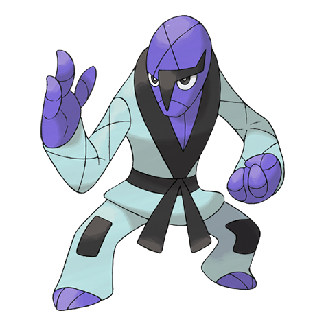
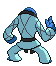
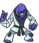
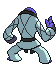

# #539 Sawk (Karate Pokémon)

| Official Artwork | Shiny Artwork |
| --- | --- |
|  |  |

**Blaze Black:** The sound of Sawk punching boulders and trees can be heard all the way from the mountains where they train.

**Volt White:** Tying their belts gets them pumped and makes their punches more destructive. Disturbing their training angers them.

---

## Media

### Default Sprites

| Front | Back | Front Shiny | Back Shiny |
| --- | --- | --- | --- |
|  |  |  |  |

### Cries

Latest (Gen VI+):

<audio controls>
<source src='../../assets/cries/sawk/latest.ogg' type='audio/ogg'>
  Your browser does not support the audio element.
</audio>

Legacy:

<audio controls>
<source src='../../assets/cries/sawk/legacy.ogg' type='audio/ogg'>
  Your browser does not support the audio element.
</audio>

---

## Pokédex Data

| National № | Type(s) | Height | Weight | Abilities | Local № |
|------------|---------|--------|--------|-----------|---------|
| #539 | {: width="48"} | 1.4 m / 4.6 ft | 51.0 kg / 112.4 lbs | Sturdy Mold Breaker | #45 |

---

## Base Stats
|   | HP | Attack | Defense | Sp. Atk | Sp. Def | Speed |
|---|----|--------|---------|---------|---------|-------|
| **Base** | 75 | 125 | 75 | 30 | 75 | 85 |
| **Min** | 260 | 229 | 139 | 58 | 139 | 157 |
| **Max** | 354 | 383 | 273 | 174 | 273 | 295 |

The ranges shown above are for a level 100 Pokémon. Maximum values are based on a beneficial nature, 252 EVs, 31 IVs; minimum values are based on a hindering nature, 0 EVs, 0 IVs.

---

## Forms & Evolutions

!!! warning "WARNING"

    Information on evolutions may not be 100% accurate; differences between evolution methods across generations are not accounted for.

### Forms

Sawk has no alternate forms.

### Evolution Line

1. [Sawk](sawk.md/)

---

## Training

| EV Yield | Catch Rate | Base Friendship | Base Exp. | Growth Rate | Held Items |
|----------|------------|-----------------|-----------|-------------|------------|
| 2 Atk | 45 | 50 | 163 | Medium | Black Belt (50%) Expert Belt (5%) |

---

## Breeding

| Egg Groups | Egg Cycles | Gender | Dimorphic | Color | Shape |
|------------|------------|--------|-----------|-------|-------|
| 1. Humanshape | 20 | 100.0% Male 0.0% Female | False | Blue | Humanoid |

---

## Moves

!!! warning "WARNING"

    Specific move information may be incorrect. However, the general movepool should be accurate; this includes changes made in Blaze Black and Volt White.

### Level Up Moves

| Lv. | Move | Type | Cat. | Power | Acc. | PP |
| --- | --- | --- | --- | --- | --- | --- |
| 1 | Fire Punch | {: width="48"} | {: width="36"} | 80 | 100 | 15 |
| 1 | Ice Punch | {: width="48"} | {: width="36"} | 80 | 100 | 15 |
| 1 | Leer | {: width="48"} | {: width="36"} | — | 100 | 30 |
| 1 | Rock Smash | {: width="48"} | {: width="36"} | 60 | 100 | 15 |
| 1 | Thunder Punch | {: width="48"} | {: width="36"} | 80 | 100 | 15 |
| 5 | Bide | {: width="48"} | {: width="36"} | — | — | 10 |
| 9 | Focus Energy | {: width="48"} | {: width="36"} | — | — | 30 |
| 13 | Double Kick | {: width="48"} | {: width="36"} | 30 | 100 | 30 |
| 17 | Low Sweep | {: width="48"} | {: width="36"} | 65 | 100 | 20 |
| 21 | Counter | {: width="48"} | {: width="36"} | — | 100 | 20 |
| 25 | Karate Chop | {: width="48"} | {: width="36"} | 50 | 100 | 25 |
| 29 | Brick Break | {: width="48"} | {: width="36"} | 75 | 100 | 15 |
| 33 | Bulk Up | {: width="48"} | {: width="36"} | — | — | 20 |
| 37 | Retaliate | {: width="48"} | {: width="36"} | 70 | 100 | 5 |
| 41 | Endure | {: width="48"} | {: width="36"} | — | — | 10 |
| 45 | Quick Guard | {: width="48"} | {: width="36"} | — | — | 15 |
| 49 | Close Combat | {: width="48"} | {: width="36"} | 120 | 100 | 5 |
| 53 | Reversal | {: width="48"} | {: width="36"} | — | 100 | 15 |
| 57 | Low Kick | {: width="48"} | {: width="36"} | — | 100 | 20 |

### TM Moves

| TM | Move | Type | Cat. | Power | Acc. | PP |
| --- | --- | --- | --- | --- | --- | --- |
| HM04 | Strength | {: width="48"} | {: width="36"} | 100 | 100 | 15 |
| TM06 | Toxic | {: width="48"} | {: width="36"} | — | 90 | 10 |
| TM08 | Bulk Up | {: width="48"} | {: width="36"} | — | — | 20 |
| TM10 | Hidden Power | {: width="48"} | {: width="36"} | 60 | 100 | 15 |
| TM11 | Sunny Day | {: width="48"} | {: width="36"} | — | — | 5 |
| TM12 | Taunt | {: width="48"} | {: width="36"} | — | 100 | 20 |
| TM17 | Protect | {: width="48"} | {: width="36"} | — | — | 10 |
| TM18 | Rain Dance | {: width="48"} | {: width="36"} | — | — | 5 |
| TM21 | Frustration | {: width="48"} | {: width="36"} | — | 100 | 20 |
| TM26 | Earthquake | {: width="48"} | {: width="36"} | 100 | 100 | 10 |
| TM27 | Return | {: width="48"} | {: width="36"} | — | 100 | 20 |
| TM28 | Dig | {: width="48"} | {: width="36"} | 100 | 100 | 10 |
| TM31 | Brick Break | {: width="48"} | {: width="36"} | 75 | 100 | 15 |
| TM32 | Double Team | {: width="48"} | {: width="36"} | — | — | 15 |
| TM39 | Rock Tomb | {: width="48"} | {: width="36"} | 60 | 95 | 15 |
| TM42 | Facade | {: width="48"} | {: width="36"} | 70 | 100 | 20 |
| TM44 | Rest | {: width="48"} | {: width="36"} | — | — | 5 |
| TM45 | Attract | {: width="48"} | {: width="36"} | — | 100 | 15 |
| TM47 | Low Sweep | {: width="48"} | {: width="36"} | 65 | 100 | 20 |
| TM48 | Round | {: width="48"} | {: width="36"} | 60 | 100 | 15 |
| TM52 | Focus Blast | {: width="48"} | {: width="36"} | 120 | 70 | 5 |
| TM56 | Fling | {: width="48"} | {: width="36"} | — | 100 | 10 |
| TM66 | Payback | {: width="48"} | {: width="36"} | 50 | 100 | 10 |
| TM67 | Retaliate | {: width="48"} | {: width="36"} | 70 | 100 | 5 |
| TM68 | Giga Impact | {: width="48"} | {: width="36"} | 150 | 90 | 5 |
| TM71 | Stone Edge | {: width="48"} | {: width="36"} | 100 | 80 | 5 |
| TM78 | Bulldoze | {: width="48"} | {: width="36"} | 80 | 100 | 20 |
| TM80 | Rock Slide | {: width="48"} | {: width="36"} | 75 | 90 | 10 |
| TM83 | Work Up | {: width="48"} | {: width="36"} | — | — | 30 |
| TM84 | Poison Jab | {: width="48"} | {: width="36"} | 80 | 100 | 20 |
| TM86 | Grass Knot | {: width="48"} | {: width="36"} | — | 100 | 20 |
| TM87 | Swagger | {: width="48"} | {: width="36"} | — | 85 | 15 |
| TM90 | Substitute | {: width="48"} | {: width="36"} | — | — | 10 |
| TM94 | Rock Smash | {: width="48"} | {: width="36"} | 60 | 100 | 15 |

### Egg Moves

Sawk cannot learn any moves by breeding.
### Tutor Moves

Sawk cannot learn any moves from tutors.
