# #586 Sawsbuck (Season Pokémon)

| Official Artwork | Shiny Artwork |
| --- | --- |
| 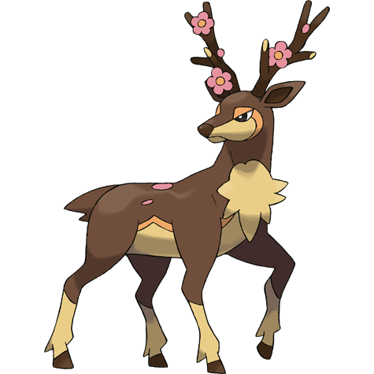 |  |

**Blaze Black:** They migrate according to the seasons. People can tell the season by looking at Sawsbuck’s horns.

**Volt White:** The plants growing on its horns change according to the season. The leaders of the herd possess magnificent horns.

---

## Media

### Default Sprites

| Front | Back | Front Shiny | Back Shiny |
| --- | --- | --- | --- |
|  | 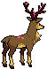 | 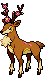 | 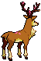 |

### Sawsbuck Summer Sprites

| Front | Back | Front Shiny | Back Shiny |
| --- | --- | --- | --- |
| 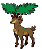 | 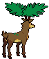 | 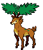 | 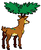 |

### Sawsbuck Autumn Sprites

| Front | Back | Front Shiny | Back Shiny |
| --- | --- | --- | --- |
| 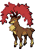 | 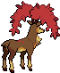 | 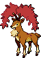 | 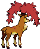 |

### Sawsbuck Winter Sprites

| Front | Back | Front Shiny | Back Shiny |
| --- | --- | --- | --- |
| 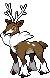 | 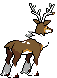 | 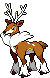 | 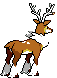 |

### Cries

Latest (Gen VI+):

<audio controls>
<source src='../../assets/cries/sawsbuck/latest.ogg' type='audio/ogg'>
  Your browser does not support the audio element.
</audio>

Legacy:

<audio controls>
<source src='../../assets/cries/sawsbuck/legacy.ogg' type='audio/ogg'>
  Your browser does not support the audio element.
</audio>

---

## Pokédex Data

| National № | Type(s) | Height | Weight | Abilities | Local № |
|------------|---------|--------|--------|-----------|---------|
| #586 | {: width="48"} {: width="48"} | 1.9 m / 6.2 ft | 92.5 kg / 203.9 lbs | Chlorophyll Serene Grace | #92 |

---

## Base Stats
|   | HP | Attack | Defense | Sp. Atk | Sp. Def | Speed |
|---|----|--------|---------|---------|---------|-------|
| **Base** | 80 | 115 | 70 | 60 | 70 | 105 |
| **Min** | 270 | 211 | 130 | 112 | 130 | 193 |
| **Max** | 364 | 361 | 262 | 240 | 262 | 339 |

The ranges shown above are for a level 100 Pokémon. Maximum values are based on a beneficial nature, 252 EVs, 31 IVs; minimum values are based on a hindering nature, 0 EVs, 0 IVs.

---

## Forms & Evolutions

!!! warning "WARNING"

    Information on evolutions may not be 100% accurate; differences between evolution methods across generations are not accounted for.

### Forms

Sawsbuck has no alternate forms.

### Evolution Line

1. [Deerling](deerling.md/)
    1. Level Up: [Sawsbuck](sawsbuck.md/)

---

## Training

| EV Yield | Catch Rate | Base Friendship | Base Exp. | Growth Rate | Held Items |
|----------|------------|-----------------|-----------|-------------|------------|
| 2 Attack | 75 | 70 | 166 | Medium | N/A |

---

## Breeding

| Egg Groups | Egg Cycles | Gender | Dimorphic | Color | Shape |
|------------|------------|--------|-----------|-------|-------|
| 1. Ground | 20 | 50.0% Male 50.0% Female | False | Brown | Quadruped |

---

## Moves

!!! warning "WARNING"

    Specific move information may be incorrect. However, the general movepool should be accurate; this includes changes made in Blaze Black and Volt White.

### Level Up Moves

| Lv. | Move | Type | Cat. | Power | Acc. | PP |
| --- | --- | --- | --- | --- | --- | --- |
| 1 | Camouflage | {: width="48"} | {: width="36"} | — | — | 20 |
| 1 | Growl | {: width="48"} | {: width="36"} | — | 100 | 40 |
| 1 | Megahorn | {: width="48"} | {: width="36"} | 120 | 85 | 10 |
| 1 | Sand Attack | {: width="48"} | {: width="36"} | — | 100 | 15 |
| 1 | Tackle | {: width="48"} | {: width="36"} | 40 | 100 | 35 |
| 1 | Wood Hammer | {: width="48"} | {: width="36"} | 120 | 100 | 15 |
| 4 | Growl | {: width="48"} | {: width="36"} | — | 100 | 40 |
| 7 | Sand Attack | {: width="48"} | {: width="36"} | — | 100 | 15 |
| 10 | Double Kick | {: width="48"} | {: width="36"} | 30 | 100 | 30 |
| 13 | Leech Seed | {: width="48"} | {: width="36"} | — | 90 | 10 |
| 16 | Feint Attack | {: width="48"} | {: width="36"} | 60 | — | 20 |
| 20 | Take Down | {: width="48"} | {: width="36"} | 90 | 85 | 20 |
| 24 | Jump Kick | {: width="48"} | {: width="36"} | 100 | 95 | 10 |
| 28 | Aromatherapy | {: width="48"} | {: width="36"} | — | — | 5 |
| 32 | Energy Ball | {: width="48"} | {: width="36"} | 90 | 100 | 10 |
| 36 | Charm | {: width="48"} | {: width="36"} | — | 100 | 20 |
| 37 | Horn Leech | {: width="48"} | {: width="36"} | 90 | 100 | 10 |
| 44 | Nature Power | {: width="48"} | {: width="36"} | — | — | 20 |
| 52 | Double Edge | {: width="48"} | {: width="36"} | 120 | 100 | 15 |
| 60 | Solar Beam | {: width="48"} | {: width="36"} | 120 | 100 | 10 |

### TM Moves

| TM | Move | Type | Cat. | Power | Acc. | PP |
| --- | --- | --- | --- | --- | --- | --- |
| HM01 | Cut | {: width="48"} | {: width="36"} | 60 | 100% | 25 |
| TM06 | Toxic | {: width="48"} | {: width="36"} | — | 90 | 10 |
| TM10 | Hidden Power | {: width="48"} | {: width="36"} | 60 | 100 | 15 |
| TM11 | Sunny Day | {: width="48"} | {: width="36"} | — | — | 5 |
| TM15 | Hyper Beam | {: width="48"} | {: width="36"} | 150 | 90 | 5 |
| TM16 | Light Screen | {: width="48"} | {: width="36"} | — | — | 30 |
| TM17 | Protect | {: width="48"} | {: width="36"} | — | — | 10 |
| TM18 | Rain Dance | {: width="48"} | {: width="36"} | — | — | 5 |
| TM20 | Safeguard | {: width="48"} | {: width="36"} | — | — | 25 |
| TM21 | Frustration | {: width="48"} | {: width="36"} | — | 100 | 20 |
| TM22 | Solar Beam | {: width="48"} | {: width="36"} | 120 | 100 | 10 |
| TM27 | Return | {: width="48"} | {: width="36"} | — | 100 | 20 |
| TM30 | Shadow Ball | {: width="48"} | {: width="36"} | 90 | 100 | 15 |
| TM32 | Double Team | {: width="48"} | {: width="36"} | — | — | 15 |
| TM42 | Facade | {: width="48"} | {: width="36"} | 70 | 100 | 20 |
| TM44 | Rest | {: width="48"} | {: width="36"} | — | — | 5 |
| TM45 | Attract | {: width="48"} | {: width="36"} | — | 100 | 15 |
| TM48 | Round | {: width="48"} | {: width="36"} | 60 | 100 | 15 |
| TM49 | Echoed Voice | {: width="48"} | {: width="36"} | 40 | 100 | 15 |
| TM53 | Energy Ball | {: width="48"} | {: width="36"} | 90 | 100 | 10 |
| TM67 | Retaliate | {: width="48"} | {: width="36"} | 70 | 100 | 5 |
| TM68 | Giga Impact | {: width="48"} | {: width="36"} | 150 | 90 | 5 |
| TM70 | Flash | {: width="48"} | {: width="36"} | — | 100 | 20 |
| TM73 | Thunder Wave | {: width="48"} | {: width="36"} | — | 90 | 20 |
| TM75 | Swords Dance | {: width="48"} | {: width="36"} | — | — | 20 |
| TM83 | Work Up | {: width="48"} | {: width="36"} | — | — | 30 |
| TM86 | Grass Knot | {: width="48"} | {: width="36"} | — | 100 | 20 |
| TM87 | Swagger | {: width="48"} | {: width="36"} | — | 85 | 15 |
| TM90 | Substitute | {: width="48"} | {: width="36"} | — | — | 10 |
| TM93 | Wild Charge | {: width="48"} | {: width="36"} | 90 | 100 | 15 |
| TM94 | Rock Smash | {: width="48"} | {: width="36"} | 60 | 100 | 15 |

### Egg Moves

Sawsbuck cannot learn any moves by breeding.
### Tutor Moves

Sawsbuck cannot learn any moves from tutors.
