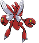
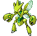
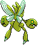
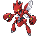
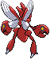
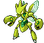
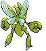

# #212 Scizor (Pincer Pokémon)

| Official Artwork | Shiny Artwork |
| --- | --- |
|  |  |

It raises its pincers with eyelike markings for intimidation. It also swings them down dangerously.

---

## Media

### Sprites

| Front | Back | Front Shiny | Back Shiny |
| --- | --- | --- | --- |
|  |  |  |  |

### Female Sprites

| Front | Back | Front Shiny | Back Shiny |
| --- | --- | --- | --- |
|  |  |  |  |

### Cries

Latest (Gen VI+):

<audio controls>
<source src='../../assets/cries/scizor/latest.ogg' type='audio/ogg'>
  Your browser does not support the audio element.
</audio>

Legacy:

<audio controls>
<source src='../../assets/cries/scizor/legacy.ogg' type='audio/ogg'>
  Your browser does not support the audio element.
</audio>

---

## Pokédex Data

| National № | Type(s) | Height | Weight | Abilities | Local № |
|------------|---------|--------|--------|-----------|---------|
| #212 | {: width='48'} {: width='48'} | 1.8 m | 118.0 kg | 1. Swarm 2. Technician | N/A |

---

## Base Stats
|   | HP | Attack | Defense | Sp. Atk | Sp. Def | Speed |
|---|----|--------|---------|---------|---------|-------|
| **Base** | 70 | 130 | 100 | 55 | 80 | 65 |
| **Min** | 250 | 238 | 184 | 103 | 148 | 121 |
| **Max** | 344 | 394 | 328 | 229 | 284 | 251 |

The ranges shown above are for a level 100 Pokémon. Maximum values are based on a beneficial nature, 252 EVs, 31 IVs; minimum values are based on a hindering nature, 0 EVs, 0 IVs.

---

## Forms & Evolutions

!!! warning "WARNING"

    Information on evolutions may not be 100% accurate; differences between evolution methods across generations are not accounted for.

### Forms

Scizor has no alternate forms.

### Evolution Line

1. [Scyther](scyther.md/)
    1. Trade: [Scizor](scizor.md/)

### Evolution Changes

---

## Training

| EV Yield | Catch Rate | Base Friendship | Base Exp. | Growth Rate | Held Items |
|----------|------------|-----------------|-----------|-------------|------------|
| 2 Attack | 25 | 50 | 175 | Medium | N/A |

---

## Breeding

| Egg Groups | Egg Cycles | Gender | Dimorphic | Color | Shape |
|------------|------------|--------|-----------|-------|-------|
| 1. Bug | 25 | 50.0% Male 50.0% Female | True | Red | Bug-Wings |

---

## Moves

!!! warning "WARNING"

    Specific move information may be incorrect. However, the general movepool should be accurate; this includes changes made in Blaze Black and Volt White.

### Level Up Moves

| Lv. | Move | Type | Cat. | Power | Acc. | PP |
| --- | --- | --- | --- | --- | --- | --- |
| 1 | Bullet Punch | {: width='48'} | {: width='36'} | 40 | 100 | 30 |
| 1 | Crabhammer | {: width='48'} | {: width='36'} | 100 | 90 | 10 |
| 1 | Leer | {: width='48'} | {: width='36'} | — | 100 | 30 |
| 1 | Night Slash | {: width='48'} | {: width='36'} | 70 | 100 | 15 |
| 1 | Quick Attack | {: width='48'} | {: width='36'} | 40 | 100 | 30 |
| 5 | Focus Energy | {: width='48'} | {: width='36'} | — | — | 30 |
| 9 | Pursuit | {: width='48'} | {: width='36'} | 40 | 100 | 20 |
| 13 | False Swipe | {: width='48'} | {: width='36'} | 40 | 100 | 40 |
| 17 | Agility | {: width='48'} | {: width='36'} | — | — | 30 |
| 21 | Metal Claw | {: width='48'} | {: width='36'} | 50 | 95 | 35 |
| 25 | Fury Cutter | {: width='48'} | {: width='36'} | 40 | 95 | 20 |
| 29 | Slash | {: width='48'} | {: width='36'} | 70 | 100 | 20 |
| 33 | Razor Wind | {: width='48'} | {: width='36'} | 80 | 100 | 10 |
| 37 | Iron Defense | {: width='48'} | {: width='36'} | — | — | 15 |
| 41 | X Scissor | {: width='48'} | {: width='36'} | 80 | 100 | 15 |
| 49 | Double Hit | {: width='48'} | {: width='36'} | 35 | 90 | 10 |
| 53 | Iron Head | {: width='48'} | {: width='36'} | 80 | 100 | 15 |
| 57 | Swords Dance | {: width='48'} | {: width='36'} | — | — | 20 |
| 61 | Feint | {: width='48'} | {: width='36'} | 30 | 100 | 10 |
| 65 | Bug Bite | {: width='48'} | {: width='36'} | 60 | 100 | 20 |

### TM Moves

| TM | Move | Type | Cat. | Power | Acc. | PP |
| --- | --- | --- | --- | --- | --- | --- |
| HM01 | Cut | {: width='48'} | {: width='36'} | 60 | 100 | 20 |
| HM04 | Strength | {: width='48'} | {: width='36'} | 85 | 100 | 15 |
| TM06 | Toxic | {: width='48'} | {: width='36'} | — | 90 | 10 |
| TM09 | Venoshock | {: width='48'} | {: width='36'} | 65 | 100 | 10 |
| TM10 | Hidden Power | {: width='48'} | {: width='36'} | 60 | 100 | 15 |
| TM11 | Sunny Day | {: width='48'} | {: width='36'} | — | — | 5 |
| TM15 | Hyper Beam | {: width='48'} | {: width='36'} | 150 | 90 | 5 |
| TM16 | Light Screen | {: width='48'} | {: width='36'} | — | — | 30 |
| TM17 | Protect | {: width='48'} | {: width='36'} | — | — | 10 |
| TM18 | Rain Dance | {: width='48'} | {: width='36'} | — | — | 5 |
| TM20 | Safeguard | {: width='48'} | {: width='36'} | — | — | 25 |
| TM21 | Frustration | {: width='48'} | {: width='36'} | — | 100 | 20 |
| TM27 | Return | {: width='48'} | {: width='36'} | — | 100 | 20 |
| TM31 | Brick Break | {: width='48'} | {: width='36'} | 75 | 100 | 15 |
| TM32 | Double Team | {: width='48'} | {: width='36'} | — | — | 15 |
| TM37 | Sandstorm | {: width='48'} | {: width='36'} | — | — | 10 |
| TM40 | Aerial Ace | {: width='48'} | {: width='36'} | 60 | — | 20 |
| TM42 | Facade | {: width='48'} | {: width='36'} | 70 | 100 | 20 |
| TM44 | Rest | {: width='48'} | {: width='36'} | — | — | 5 |
| TM45 | Attract | {: width='48'} | {: width='36'} | — | 100 | 15 |
| TM46 | Thief | {: width='48'} | {: width='36'} | 60 | 100 | 25 |
| TM48 | Round | {: width='48'} | {: width='36'} | 60 | 100 | 15 |
| TM54 | False Swipe | {: width='48'} | {: width='36'} | 40 | 100 | 40 |
| TM56 | Fling | {: width='48'} | {: width='36'} | — | 100 | 10 |
| TM62 | Acrobatics | {: width='48'} | {: width='36'} | 55 | 100 | 15 |
| TM68 | Giga Impact | {: width='48'} | {: width='36'} | 150 | 90 | 5 |
| TM75 | Swords Dance | {: width='48'} | {: width='36'} | — | — | 20 |
| TM76 | Struggle Bug | {: width='48'} | {: width='36'} | 50 | 100 | 20 |
| TM81 | X Scissor | {: width='48'} | {: width='36'} | 80 | 100 | 15 |
| TM87 | Swagger | {: width='48'} | {: width='36'} | — | 85 | 15 |
| TM89 | U Turn | {: width='48'} | {: width='36'} | 70 | 100 | 20 |
| TM90 | Substitute | {: width='48'} | {: width='36'} | — | — | 10 |
| TM91 | Flash Cannon | {: width='48'} | {: width='36'} | 80 | 100 | 10 |
| TM94 | Rock Smash | {: width='48'} | {: width='36'} | 40 | 100 | 15 |

### Egg Moves

Scizor cannot learn any moves by breeding.
### Tutor Moves

Scizor cannot learn any moves from tutors.
