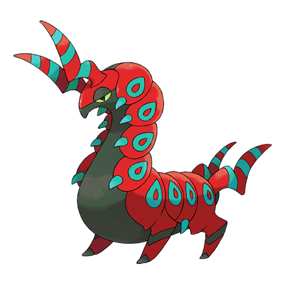
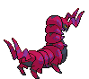
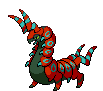
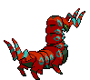

# #545 Scolipede (Megapede Pokémon)

| Official Artwork | Shiny Artwork |
| --- | --- |
|  |  |

**Blaze Black:** With quick movements, it chases down its foes, attacking relentlessly with its horns until it prevails.

**Volt White:** Highly aggressive, it uses the claws near its neck to dig into its opponents and poison them.

---

## Media

### Default Sprites

| Front | Back | Front Shiny | Back Shiny |
| --- | --- | --- | --- |
|  |  |  |  |

### Cries

Latest (Gen VI+):

<audio controls>
<source src='../../assets/cries/scolipede/latest.ogg' type='audio/ogg'>
  Your browser does not support the audio element.
</audio>

Legacy:

<audio controls>
<source src='../../assets/cries/scolipede/legacy.ogg' type='audio/ogg'>
  Your browser does not support the audio element.
</audio>

---

## Pokédex Data

| National № | Type(s) | Height | Weight | Abilities | Local № |
|------------|---------|--------|--------|-----------|---------|
| #545 | {: width="48"} {: width="48"} | 2.5 m / 8.2 ft | 200.5 kg / 442.0 lbs | Poison Touch Swarm | #51 |

---

## Base Stats
|   | HP | Attack | Defense | Sp. Atk | Sp. Def | Speed |
|---|----|--------|---------|---------|---------|-------|
| **Base** | 60 | 100 | 89 | 55 | 69 | 112 |
| **Min** | 230 | 184 | 164 | 103 | 128 | 206 |
| **Max** | 324 | 328 | 304 | 229 | 260 | 355 |

The ranges shown above are for a level 100 Pokémon. Maximum values are based on a beneficial nature, 252 EVs, 31 IVs; minimum values are based on a hindering nature, 0 EVs, 0 IVs.

---

## Forms & Evolutions

!!! warning "WARNING"

    Information on evolutions may not be 100% accurate; differences between evolution methods across generations are not accounted for.

### Forms

Scolipede has no alternate forms.

### Evolution Line

1. [Venipede](venipede.md/)
    1. Level Up: [Whirlipede](whirlipede.md/)
        1. Level Up: [Scolipede](scolipede.md/)

---

## Training

| EV Yield | Catch Rate | Base Friendship | Base Exp. | Growth Rate | Held Items |
|----------|------------|-----------------|-----------|-------------|------------|
| 3 Spd | 45 | 50 | 243 | Medium Slow | Pecha Berry (50%) Poison Barb (5%) |

---

## Breeding

| Egg Groups | Egg Cycles | Gender | Dimorphic | Color | Shape |
|------------|------------|--------|-----------|-------|-------|
| 1. Bug | 20 | 50.0% Male 50.0% Female | False | Red | Armor |

---

## Moves

!!! warning "WARNING"

    Specific move information may be incorrect. However, the general movepool should be accurate; this includes changes made in Blaze Black and Volt White.

### Level Up Moves

| Lv. | Move | Type | Cat. | Power | Acc. | PP |
| --- | --- | --- | --- | --- | --- | --- |
| 1 | Defense Curl | {: width="48"} | {: width="36"} | — | — | 40 |
| 1 | Megahorn | {: width="48"} | {: width="36"} | 120 | 85 | 10 |
| 1 | Poison Sting | {: width="48"} | {: width="36"} | 15 | 100 | 35 |
| 1 | Rollout | {: width="48"} | {: width="36"} | 30 | 90 | 20 |
| 1 | Screech | {: width="48"} | {: width="36"} | — | 85 | 40 |
| 1 | Spikes | {: width="48"} | {: width="36"} | — | — | 20 |
| 1 | Toxic Spikes | {: width="48"} | {: width="36"} | — | — | 20 |
| 5 | Poison Sting | {: width="48"} | {: width="36"} | 15 | 100 | 35 |
| 8 | Screech | {: width="48"} | {: width="36"} | — | 85 | 40 |
| 12 | Pursuit | {: width="48"} | {: width="36"} | 40 | 100 | 20 |
| 15 | Protect | {: width="48"} | {: width="36"} | — | — | 10 |
| 17 | Twineedle | {: width="48"} | {: width="36"} | 25 | 100 | 20 |
| 19 | Poison Tail | {: width="48"} | {: width="36"} | 90 | 100 | 15 |
| 23 | Bug Bite | {: width="48"} | {: width="36"} | 60 | 100 | 20 |
| 28 | Venoshock | {: width="48"} | {: width="36"} | 65 | 100 | 10 |
| 30 | Baton Pass | {: width="48"} | {: width="36"} | — | — | 40 |
| 33 | Agility | {: width="48"} | {: width="36"} | — | — | 30 |
| 39 | Steamroller | {: width="48"} | {: width="36"} | 80 | 100 | 20 |
| 44 | Toxic | {: width="48"} | {: width="36"} | — | 90 | 10 |
| 50 | Rock Climb | {: width="48"} | {: width="36"} | 80 | 95% | 10 |
| 55 | Double Edge | {: width="48"} | {: width="36"} | 120 | 100 | 15 |
| 61 | Superpower | {: width="48"} | {: width="36"} | 120 | 100 | 5 |

### TM Moves

| TM | Move | Type | Cat. | Power | Acc. | PP |
| --- | --- | --- | --- | --- | --- | --- |
| HM01 | Cut | {: width="48"} | {: width="36"} | 60 | 100% | 25 |
| HM04 | Strength | {: width="48"} | {: width="36"} | 100 | 100 | 15 |
| TM06 | Toxic | {: width="48"} | {: width="36"} | — | 90 | 10 |
| TM09 | Venoshock | {: width="48"} | {: width="36"} | 65 | 100 | 10 |
| TM10 | Hidden Power | {: width="48"} | {: width="36"} | 60 | 100 | 15 |
| TM11 | Sunny Day | {: width="48"} | {: width="36"} | — | — | 5 |
| TM15 | Hyper Beam | {: width="48"} | {: width="36"} | 150 | 90 | 5 |
| TM17 | Protect | {: width="48"} | {: width="36"} | — | — | 10 |
| TM21 | Frustration | {: width="48"} | {: width="36"} | — | 100 | 20 |
| TM22 | Solar Beam | {: width="48"} | {: width="36"} | 120 | 100 | 10 |
| TM26 | Earthquake | {: width="48"} | {: width="36"} | 100 | 100 | 10 |
| TM27 | Return | {: width="48"} | {: width="36"} | — | 100 | 20 |
| TM28 | Dig | {: width="48"} | {: width="36"} | 100 | 100 | 10 |
| TM32 | Double Team | {: width="48"} | {: width="36"} | — | — | 15 |
| TM36 | Sludge Bomb | {: width="48"} | {: width="36"} | 90 | 100 | 10 |
| TM39 | Rock Tomb | {: width="48"} | {: width="36"} | 60 | 95 | 15 |
| TM42 | Facade | {: width="48"} | {: width="36"} | 70 | 100 | 20 |
| TM44 | Rest | {: width="48"} | {: width="36"} | — | — | 5 |
| TM45 | Attract | {: width="48"} | {: width="36"} | — | 100 | 15 |
| TM48 | Round | {: width="48"} | {: width="36"} | 60 | 100 | 15 |
| TM66 | Payback | {: width="48"} | {: width="36"} | 50 | 100 | 10 |
| TM68 | Giga Impact | {: width="48"} | {: width="36"} | 150 | 90 | 5 |
| TM74 | Gyro Ball | {: width="48"} | {: width="36"} | — | 100 | 5 |
| TM75 | Swords Dance | {: width="48"} | {: width="36"} | — | — | 20 |
| TM76 | Struggle Bug | {: width="48"} | {: width="36"} | 50 | 100 | 20 |
| TM78 | Bulldoze | {: width="48"} | {: width="36"} | 80 | 100 | 20 |
| TM80 | Rock Slide | {: width="48"} | {: width="36"} | 75 | 90 | 10 |
| TM81 | X Scissor | {: width="48"} | {: width="36"} | 80 | 100 | 15 |
| TM84 | Poison Jab | {: width="48"} | {: width="36"} | 80 | 100 | 20 |
| TM87 | Swagger | {: width="48"} | {: width="36"} | — | 85 | 15 |
| TM90 | Substitute | {: width="48"} | {: width="36"} | — | — | 10 |
| TM94 | Rock Smash | {: width="48"} | {: width="36"} | 60 | 100 | 15 |

### Egg Moves

Scolipede cannot learn any moves by breeding.
### Tutor Moves

Scolipede cannot learn any moves from tutors.
