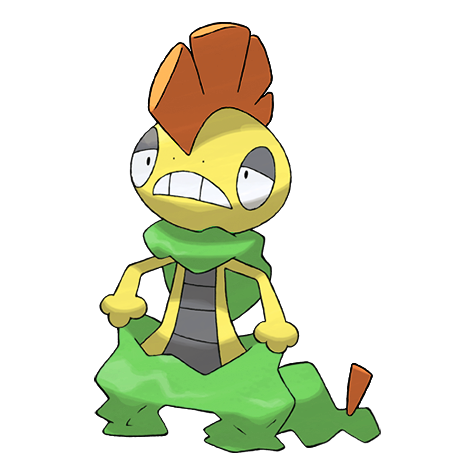
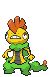
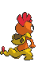
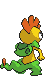

# #560 Scrafty (Hoodlum Pokémon)

| Official Artwork | Shiny Artwork |
|------------------|---------------|
|  |  |

**Blaze Black:** Groups of them beat up anything that enters their territory. Each can spit acidic liquid from its mouth.

**Volt White:** It can smash concrete blocks with its kicking attacks. The one with the biggest crest is the group leader.

---

## Media

### Default Sprites

| Front | Shiny | Back | Shiny |
|-------|-------|------|-------|
|  |  |  |  |

### Cries

Latest (Gen VI+):

<audio controls>
<source src='../../assets/cries/scrafty/latest.ogg' type='audio/ogg'>
  Your browser does not support the audio element.
</audio>

Legacy:

<audio controls>
<source src='../../assets/cries/scrafty/legacy.ogg' type='audio/ogg'>
  Your browser does not support the audio element.
</audio>

---

## Pokédex Data

| National № | Type(s) | Height | Weight | Abilities | Local № |
|------------|---------|--------|--------|-----------|---------|
| #560 | {: width="48"} {: width="48"} | 1.1 m / 3.6 ft | 30.0 kg / 66.1 lbs | 1. Shed Skin 2. Moxie | N/A |

---

## Base Stats
|   | HP | Attack | Defense | Sp. Atk | Sp. Def | Speed |
|---|----|--------|---------|---------|---------|-------|
| **Base** | 65 | 90 | 115 | 45 | 115 | 58 |
| **Min** | 240 | 166 | 211 | 85 | 211 | 108 |
| **Max** | 334 | 306 | 361 | 207 | 361 | 236 |

The ranges shown above are for a level 100 Pokémon. Maximum values are based on a beneficial nature, 252 EVs, 31 IVs; minimum values are based on a hindering nature, 0 EVs, 0 IVs.

---

## Forms & Evolutions

!!! warning "WARNING"

    Information on evolutions may not be 100% accurate; differences between evolution methods across generations are not accounted for.

### Forms

Scrafty has no alternate forms.

### Evolution Line

1. [Scraggy](scraggy.md/)
    1. Level Up: [Scrafty](scrafty.md/)

### Evolution Changes

1. Level 35 [Scraggy]

---

## Training

| EV Yield | Catch Rate | Base Friendship | Base Exp. | Growth Rate | Held Items |
|----------|------------|-----------------|-----------|-------------|------------|
| 1 Def 1 Sp. Def | 90 | 50 | 171 | Medium | Shed Shell (5%) |

---

## Breeding

| Egg Groups | Egg Cycles | Gender | Dimorphic | Color | Shape |
|------------|------------|--------|-----------|-------|-------|
| 1. Ground 2. Dragon | 15 | 50.0% Male 50.0% Female | False | Red | Upright |

---

## Moves

!!! warning "WARNING"

    Specific move information may be incorrect. However, the general movepool should be accurate; this includes changes made in Blaze Black and Volt White.

### Level Up Moves

| Lv. | Move | Type | Cat. | Power | Acc. | PP |
| --- | --- | --- | --- | --- | --- | --- |
| 1 | Drain Punch | {: width="48"} | {: width="36"} | 75 | 100 | 10 |
| 1 | Feint Attack | {: width="48"} | {: width="36"} | 60 | — | 20 |
| 1 | Fire Punch | {: width="48"} | {: width="36"} | 80 | 100 | 15 |
| 1 | Ice Punch | {: width="48"} | {: width="36"} | 80 | 100 | 15 |
| 1 | Leer | {: width="48"} | {: width="36"} | — | 100 | 30 |
| 1 | Low Kick | {: width="48"} | {: width="36"} | — | 100 | 20 |
| 1 | Sand Attack | {: width="48"} | {: width="36"} | — | 100 | 15 |
| 1 | Thunder Punch | {: width="48"} | {: width="36"} | 80 | 100 | 15 |
| 5 | Sand Attack | {: width="48"} | {: width="36"} | — | 100 | 15 |
| 9 | Feint Attack | {: width="48"} | {: width="36"} | 60 | — | 20 |
| 12 | Headbutt | {: width="48"} | {: width="36"} | 70 | 100 | 15 |
| 16 | Swagger | {: width="48"} | {: width="36"} | — | 85 | 15 |
| 20 | Brick Break | {: width="48"} | {: width="36"} | 75 | 100 | 15 |
| 23 | Payback | {: width="48"} | {: width="36"} | 50 | 100 | 10 |
| 25 | Zen Headbutt | {: width="48"} | {: width="36"} | 80 | 90 | 15 |
| 27 | Chip Away | {: width="48"} | {: width="36"} | 70 | 100 | 20 |
| 31 | High Jump Kick | {: width="48"} | {: width="36"} | 130 | 90 | 10 |
| 34 | Scary Face | {: width="48"} | {: width="36"} | — | 100 | 10 |
| 39 | Crunch | {: width="48"} | {: width="36"} | 80 | 100 | 15 |
| 45 | Facade | {: width="48"} | {: width="36"} | 70 | 100 | 20 |
| 51 | Sucker Punch | {: width="48"} | {: width="36"} | 70 | 100 | 5 |
| 58 | Focus Punch | {: width="48"} | {: width="36"} | 150 | 100 | 20 |
| 65 | Head Smash | {: width="48"} | {: width="36"} | 150 | 80 | 5 |
| 72 | Dragon Dance | {: width="48"} | {: width="36"} | — | — | 20 |

### TM Moves

| TM | Move | Type | Cat. | Power | Acc. | PP |
| --- | --- | --- | --- | --- | --- | --- |
| HM04 | Strength | {: width="48"} | {: width="36"} | 100 | 100 | 15 |
| TM02 | Dragon Claw | {: width="48"} | {: width="36"} | 80 | 100 | 15 |
| TM05 | Roar | {: width="48"} | {: width="36"} | — | — | 20 |
| TM06 | Toxic | {: width="48"} | {: width="36"} | — | 90 | 10 |
| TM08 | Bulk Up | {: width="48"} | {: width="36"} | — | — | 20 |
| TM10 | Hidden Power | {: width="48"} | {: width="36"} | 60 | 100 | 15 |
| TM11 | Sunny Day | {: width="48"} | {: width="36"} | — | — | 5 |
| TM12 | Taunt | {: width="48"} | {: width="36"} | — | 100 | 20 |
| TM15 | Hyper Beam | {: width="48"} | {: width="36"} | 150 | 90 | 5 |
| TM17 | Protect | {: width="48"} | {: width="36"} | — | — | 10 |
| TM18 | Rain Dance | {: width="48"} | {: width="36"} | — | — | 5 |
| TM21 | Frustration | {: width="48"} | {: width="36"} | — | 100 | 20 |
| TM23 | Smack Down | {: width="48"} | {: width="36"} | 50 | 100 | 15 |
| TM27 | Return | {: width="48"} | {: width="36"} | — | 100 | 20 |
| TM28 | Dig | {: width="48"} | {: width="36"} | 100 | 100 | 10 |
| TM31 | Brick Break | {: width="48"} | {: width="36"} | 75 | 100 | 15 |
| TM32 | Double Team | {: width="48"} | {: width="36"} | — | — | 15 |
| TM36 | Sludge Bomb | {: width="48"} | {: width="36"} | 90 | 100 | 10 |
| TM39 | Rock Tomb | {: width="48"} | {: width="36"} | 60 | 95 | 15 |
| TM41 | Torment | {: width="48"} | {: width="36"} | — | 100 | 15 |
| TM42 | Facade | {: width="48"} | {: width="36"} | 70 | 100 | 20 |
| TM44 | Rest | {: width="48"} | {: width="36"} | — | — | 5 |
| TM45 | Attract | {: width="48"} | {: width="36"} | — | 100 | 15 |
| TM46 | Thief | {: width="48"} | {: width="36"} | 60 | 100 | 25 |
| TM47 | Low Sweep | {: width="48"} | {: width="36"} | 65 | 100 | 20 |
| TM48 | Round | {: width="48"} | {: width="36"} | 60 | 100 | 15 |
| TM52 | Focus Blast | {: width="48"} | {: width="36"} | 120 | 70 | 5 |
| TM56 | Fling | {: width="48"} | {: width="36"} | — | 100 | 10 |
| TM59 | Incinerate | {: width="48"} | {: width="36"} | 50 | 100 | 15 |
| TM66 | Payback | {: width="48"} | {: width="36"} | 50 | 100 | 10 |
| TM67 | Retaliate | {: width="48"} | {: width="36"} | 70 | 100 | 5 |
| TM68 | Giga Impact | {: width="48"} | {: width="36"} | 150 | 90 | 5 |
| TM71 | Stone Edge | {: width="48"} | {: width="36"} | 100 | 80 | 5 |
| TM80 | Rock Slide | {: width="48"} | {: width="36"} | 75 | 90 | 10 |
| TM82 | Dragon Tail | {: width="48"} | {: width="36"} | 60 | 90 | 10 |
| TM83 | Work Up | {: width="48"} | {: width="36"} | — | — | 30 |
| TM84 | Poison Jab | {: width="48"} | {: width="36"} | 80 | 100 | 20 |
| TM86 | Grass Knot | {: width="48"} | {: width="36"} | — | 100 | 20 |
| TM87 | Swagger | {: width="48"} | {: width="36"} | — | 85 | 15 |
| TM90 | Substitute | {: width="48"} | {: width="36"} | — | — | 10 |
| TM94 | Rock Smash | {: width="48"} | {: width="36"} | 60 | 100 | 15 |
| TM95 | Snarl | {: width="48"} | {: width="36"} | 60 | 95 | 15 |

### Egg Moves

Scrafty cannot learn any moves by breeding.
### Tutor Moves

Scrafty cannot learn any moves from tutors.
