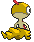
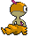

# #559 Scraggy (Shedding Pokémon)

| Official Artwork | Shiny Artwork |
| --- | --- |
|  |  |

**Blaze Black:** Its skin has a rubbery elasticity, so it can reduce damage by defensively pulling its skin up to its neck.

**Volt White:** It immediately headbutts anyone that makes eye contact with it. Its skull is massively thick.

---

## Media

### Default Sprites

| Front | Back | Front Shiny | Back Shiny |
| --- | --- | --- | --- |
|  |  |  |  |

### Cries

Latest (Gen VI+):

<audio controls>
<source src='../../assets/cries/scraggy/latest.ogg' type='audio/ogg'>
  Your browser does not support the audio element.
</audio>

Legacy:

<audio controls>
<source src='../../assets/cries/scraggy/legacy.ogg' type='audio/ogg'>
  Your browser does not support the audio element.
</audio>

---

## Pokédex Data

| National № | Type(s) | Height | Weight | Abilities | Local № |
|------------|---------|--------|--------|-----------|---------|
| #559 | {: width="48"} {: width="48"} | 0.6 m / 2.0 ft | 11.8 kg / 26.0 lbs |  | 1. Shed Skin 2. Moxie | #65 |

---

## Base Stats
|   | HP | Attack | Defense | Sp. Atk | Sp. Def | Speed |
|---|----|--------|---------|---------|---------|-------|
| **Base** | 50 | 75 | 70 | 35 | 70 | 48 |
| **Min** | 210 | 139 | 130 | 67 | 130 | 90 |
| **Max** | 304 | 273 | 262 | 185 | 262 | 214 |

The ranges shown above are for a level 100 Pokémon. Maximum values are based on a beneficial nature, 252 EVs, 31 IVs; minimum values are based on a hindering nature, 0 EVs, 0 IVs.

---

## Forms & Evolutions

!!! warning "WARNING"

    Information on evolutions may not be 100% accurate; differences between evolution methods across generations are not accounted for.

### Forms

Scraggy has no alternate forms.

### Evolution Line

1. [Scraggy](scraggy.md/)
    1. Level Up: [Scrafty](scrafty.md/)

### Evolution Changes

1. Level 35 [Scraggy]

---

## Training

| EV Yield | Catch Rate | Base Friendship | Base Exp. | Growth Rate | Held Items |
|----------|------------|-----------------|-----------|-------------|------------|
| 1 Atk | 180 | 35 | 70 | Medium | Shed Shell (5%) |

---

## Breeding

| Egg Groups | Egg Cycles | Gender | Dimorphic | Color | Shape |
|------------|------------|--------|-----------|-------|-------|
| 1. Ground 2. Dragon | 15 | 50.0% Male 50.0% Female | False | Yellow | Upright |

---

## Moves

!!! warning "WARNING"

    Specific move information may be incorrect. However, the general movepool should be accurate; this includes changes made in Blaze Black and Volt White.

### Level Up Moves

| Lv. | Move | Type | Cat. | Power | Acc. | PP |
| --- | --- | --- | --- | --- | --- | --- |
| 1 | Leer | {: width="48"} | {: width="36"} | — | 100 | 30 |
| 1 | Low Kick | {: width="48"} | {: width="36"} | — | 100 | 20 |
| 5 | Sand Attack | {: width="48"} | {: width="36"} | — | 100 | 15 |
| 9 | Feint Attack | {: width="48"} | {: width="36"} | 60 | — | 20 |
| 12 | Headbutt | {: width="48"} | {: width="36"} | 70 | 100 | 15 |
| 16 | Swagger | {: width="48"} | {: width="36"} | — | 85 | 15 |
| 20 | Brick Break | {: width="48"} | {: width="36"} | 75 | 100 | 15 |
| 23 | Payback | {: width="48"} | {: width="36"} | 50 | 100 | 10 |
| 25 | Zen Headbutt | {: width="48"} | {: width="36"} | 80 | 90 | 15 |
| 27 | Chip Away | {: width="48"} | {: width="36"} | 70 | 100 | 20 |
| 31 | High Jump Kick | {: width="48"} | {: width="36"} | 130 | 90 | 10 |
| 34 | Scary Face | {: width="48"} | {: width="36"} | — | 100 | 10 |
| 38 | Crunch | {: width="48"} | {: width="36"} | 80 | 100 | 15 |
| 42 | Facade | {: width="48"} | {: width="36"} | 70 | 100 | 20 |
| 45 | Rock Climb | {: width="48"} | {: width="36"} | 80 | 95% | 10 |
| 49 | Focus Punch | {: width="48"} | {: width="36"} | 150 | 100 | 20 |
| 53 | Head Smash | {: width="48"} | {: width="36"} | 150 | 80 | 5 |
| 57 | Dragon Dance | {: width="48"} | {: width="36"} | — | — | 20 |

### TM Moves

| TM | Move | Type | Cat. | Power | Acc. | PP |
| --- | --- | --- | --- | --- | --- | --- |
| HM04 | Strength | {: width="48"} | {: width="36"} | 100 | 100 | 15 |
| TM02 | Dragon Claw | {: width="48"} | {: width="36"} | 80 | 100 | 15 |
| TM05 | Roar | {: width="48"} | {: width="36"} | — | — | 20 |
| TM06 | Toxic | {: width="48"} | {: width="36"} | — | 90 | 10 |
| TM08 | Bulk Up | {: width="48"} | {: width="36"} | — | — | 20 |
| TM10 | Hidden Power | {: width="48"} | {: width="36"} | 60 | 100 | 15 |
| TM11 | Sunny Day | {: width="48"} | {: width="36"} | — | — | 5 |
| TM12 | Taunt | {: width="48"} | {: width="36"} | — | 100 | 20 |
| TM17 | Protect | {: width="48"} | {: width="36"} | — | — | 10 |
| TM18 | Rain Dance | {: width="48"} | {: width="36"} | — | — | 5 |
| TM21 | Frustration | {: width="48"} | {: width="36"} | — | 100 | 20 |
| TM23 | Smack Down | {: width="48"} | {: width="36"} | 50 | 100 | 15 |
| TM27 | Return | {: width="48"} | {: width="36"} | — | 100 | 20 |
| TM28 | Dig | {: width="48"} | {: width="36"} | 100 | 100 | 10 |
| TM31 | Brick Break | {: width="48"} | {: width="36"} | 75 | 100 | 15 |
| TM32 | Double Team | {: width="48"} | {: width="36"} | — | — | 15 |
| TM36 | Sludge Bomb | {: width="48"} | {: width="36"} | 90 | 100 | 10 |
| TM39 | Rock Tomb | {: width="48"} | {: width="36"} | 60 | 95 | 15 |
| TM41 | Torment | {: width="48"} | {: width="36"} | — | 100 | 15 |
| TM42 | Facade | {: width="48"} | {: width="36"} | 70 | 100 | 20 |
| TM44 | Rest | {: width="48"} | {: width="36"} | — | — | 5 |
| TM45 | Attract | {: width="48"} | {: width="36"} | — | 100 | 15 |
| TM47 | Low Sweep | {: width="48"} | {: width="36"} | 65 | 100 | 20 |
| TM48 | Round | {: width="48"} | {: width="36"} | 60 | 100 | 15 |
| TM52 | Focus Blast | {: width="48"} | {: width="36"} | 120 | 70 | 5 |
| TM56 | Fling | {: width="48"} | {: width="36"} | — | 100 | 10 |
| TM59 | Incinerate | {: width="48"} | {: width="36"} | 50 | 100 | 15 |
| TM66 | Payback | {: width="48"} | {: width="36"} | 50 | 100 | 10 |
| TM67 | Retaliate | {: width="48"} | {: width="36"} | 70 | 100 | 5 |
| TM71 | Stone Edge | {: width="48"} | {: width="36"} | 100 | 80 | 5 |
| TM80 | Rock Slide | {: width="48"} | {: width="36"} | 75 | 90 | 10 |
| TM82 | Dragon Tail | {: width="48"} | {: width="36"} | 60 | 90 | 10 |
| TM83 | Work Up | {: width="48"} | {: width="36"} | — | — | 30 |
| TM84 | Poison Jab | {: width="48"} | {: width="36"} | 80 | 100 | 20 |
| TM86 | Grass Knot | {: width="48"} | {: width="36"} | — | 100 | 20 |
| TM87 | Swagger | {: width="48"} | {: width="36"} | — | 85 | 15 |
| TM90 | Substitute | {: width="48"} | {: width="36"} | — | — | 10 |
| TM94 | Rock Smash | {: width="48"} | {: width="36"} | 60 | 100 | 15 |
| TM95 | Snarl | {: width="48"} | {: width="36"} | 60 | 95 | 15 |

### Egg Moves

| Move | Type | Cat. | Power | Acc. | PP |
| --- | --- | --- | --- | --- | --- |
| Fire Punch | {: width="48"} | {: width="36"} | 80 | 100 | 15 |
| Ice Punch | {: width="48"} | {: width="36"} | 80 | 100 | 15 |
| Thunder Punch | {: width="48"} | {: width="36"} | 80 | 100 | 15 |
| Counter | {: width="48"} | {: width="36"} | — | 100 | 20 |
| Amnesia | {: width="48"} | {: width="36"} | — | — | 20 |
| Feint Attack | {: width="48"} | {: width="36"} | 60 | — | 20 |
| Detect | {: width="48"} | {: width="36"} | — | — | 5 |
| Fake Out | {: width="48"} | {: width="36"} | 40 | 100 | 10 |
| Dragon Dance | {: width="48"} | {: width="36"} | — | — | 20 |
| Drain Punch | {: width="48"} | {: width="36"} | 75 | 100 | 10 |
| Zen Headbutt | {: width="48"} | {: width="36"} | 80 | 90 | 15 |

### Tutor Moves

Scraggy cannot learn any moves from tutors.
