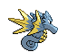

# Seadra (Dragon Pokémon)

| Official Artwork | Shiny Artwork |
| --- | --- |
|  |  |

Its spines provide protection. Its fins and bones are prized as traditional medicine ingredients.

---

## Media

### Default Sprites

| Front | Back | Front Shiny | Back Shiny |
| --- | --- | --- | --- |
|  |  |  |  |

### Cries

Latest (Gen VI+):

<audio controls>
<source src='../../assets/cries/seadra/latest.ogg' type='audio/ogg'>
  Your browser does not support the audio element.
</audio>

Legacy:

<audio controls>
<source src='../../assets/cries/seadra/legacy.ogg' type='audio/ogg'>
  Your browser does not support the audio element.
</audio>

---

## Pokédex Data

| National № | Type(s) | Height | Weight | Abilities | Local № |
|------------|---------|--------|--------|-----------|---------|
| #117 | {: width='48'} | 1.2 m | 25.0 kg | 1. Poison-Point 2. Poison-Touch | N/A |

---

## Base Stats
|   | HP | Attack | Defense | Sp. Atk | Sp. Def | Speed |
|---|----|--------|---------|---------|---------|-------|
| **Base** | 55 | 65 | 95 | 95 | 45 | 85 |
| **Min** | 220 | 121 | 175 | 175 | 85 | 157 |
| **Max** | 314 | 251 | 317 | 317 | 207 | 295 |

The ranges shown above are for a level 100 Pokémon. Maximum values are based on a beneficial nature, 252 EVs, 31 IVs; minimum values are based on a hindering nature, 0 EVs, 0 IVs.

---

## Forms & Evolutions

!!! warning "WARNING"

    Information on evolutions may not be 100% accurate; differences between evolution methods across generations are not accounted for.

### Forms

Seadra has no alternate forms.

### Evolution Line

1. [Horsea](horsea.md/)
    1. Level Up: [Seadra](seadra.md/)
        1. Trade: [Kingdra](kingdra.md/)

### Evolution Changes

1. Use the Dragon Scale.

---

## Training

| EV Yield | Catch Rate | Base Friendship | Base Exp. | Growth Rate | Held Items |
|----------|------------|-----------------|-----------|-------------|------------|
| 1 Defense 1 Special Attack | 75 | 50 | 154 | Medium | dragon-scale (5%) |

---

## Breeding

| Egg Groups | Egg Cycles | Gender | Dimorphic | Color | Shape |
|------------|------------|--------|-----------|-------|-------|
| 1. Water1 2. Dragon | 20 | 50.0% Male 50.0% Female | False | Blue | Blob |

---

## Moves

!!! warning "WARNING"

    Specific move information may be incorrect. However, the general movepool should be accurate; this includes changes made in Blaze Black and Volt White.

### Level Up Moves

| Lv. | Move | Type | Cat. | Power | Acc. | PP |
| --- | --- | --- | --- | --- | --- | --- |
| 1 | Bubble | {: width='48'} | {: width='36'} | 40 | 100 | 30 |
| 1 | Dragon Rage | {: width='48'} | {: width='36'} | — | 100 | 10 |
| 1 | Leer | {: width='48'} | {: width='36'} | — | 100 | 30 |
| 1 | Smokescreen | {: width='48'} | {: width='36'} | — | 100 | 20 |
| 1 | Water Gun | {: width='48'} | {: width='36'} | 40 | 100 | 25 |
| 4 | Smokescreen | {: width='48'} | {: width='36'} | — | 100 | 20 |
| 8 | Leer | {: width='48'} | {: width='36'} | — | 100 | 30 |
| 11 | Water Gun | {: width='48'} | {: width='36'} | 40 | 100 | 25 |
| 14 | Focus Energy | {: width='48'} | {: width='36'} | — | — | 30 |
| 18 | Bubble Beam | {: width='48'} | {: width='36'} | 65 | 100 | 20 |
| 21 | Octazooka | {: width='48'} | {: width='36'} | 65 | 85 | 10 |
| 23 | Agility | {: width='48'} | {: width='36'} | — | — | 30 |
| 26 | Twister | {: width='48'} | {: width='36'} | 50 | 100 | 20 |
| 30 | Brine | {: width='48'} | {: width='36'} | 65 | 100 | 10 |
| 32 | Dragon Breath | {: width='48'} | {: width='36'} | 60 | 100 | 20 |
| 40 | Hydro Pump | {: width='48'} | {: width='36'} | 110 | 80 | 5 |
| 48 | Dragon Dance | {: width='48'} | {: width='36'} | — | — | 20 |
| 57 | Dragon Pulse | {: width='48'} | {: width='36'} | 85 | 100 | 10 |

### TM Moves

| TM | Move | Type | Cat. | Power | Acc. | PP |
| --- | --- | --- | --- | --- | --- | --- |
| HM03 | Surf | {: width='48'} | {: width='36'} | 90 | 100 | 15 |
| HM05 | Waterfall | {: width='48'} | {: width='36'} | 85 | 100 | 15 |
| HM06 | Dive | {: width='48'} | {: width='36'} | 80 | 100 | 10 |
| TM06 | Toxic | {: width='48'} | {: width='36'} | — | 90 | 10 |
| TM07 | Hail | {: width='48'} | {: width='36'} | — | — | 10 |
| TM10 | Hidden Power | {: width='48'} | {: width='36'} | 60 | 100 | 15 |
| TM13 | Ice Beam | {: width='48'} | {: width='36'} | 90 | 100 | 10 |
| TM14 | Blizzard | {: width='48'} | {: width='36'} | 110 | 70 | 5 |
| TM15 | Hyper Beam | {: width='48'} | {: width='36'} | 150 | 90 | 5 |
| TM17 | Protect | {: width='48'} | {: width='36'} | — | — | 10 |
| TM18 | Rain Dance | {: width='48'} | {: width='36'} | — | — | 5 |
| TM21 | Frustration | {: width='48'} | {: width='36'} | — | 100 | 20 |
| TM27 | Return | {: width='48'} | {: width='36'} | — | 100 | 20 |
| TM32 | Double Team | {: width='48'} | {: width='36'} | — | — | 15 |
| TM42 | Facade | {: width='48'} | {: width='36'} | 70 | 100 | 20 |
| TM44 | Rest | {: width='48'} | {: width='36'} | — | — | 5 |
| TM45 | Attract | {: width='48'} | {: width='36'} | — | 100 | 15 |
| TM48 | Round | {: width='48'} | {: width='36'} | 60 | 100 | 15 |
| TM55 | Scald | {: width='48'} | {: width='36'} | 80 | 100 | 15 |
| TM68 | Giga Impact | {: width='48'} | {: width='36'} | 150 | 90 | 5 |
| TM79 | Frost Breath | {: width='48'} | {: width='36'} | 60 | 90 | 10 |
| TM87 | Swagger | {: width='48'} | {: width='36'} | — | 85 | 15 |
| TM90 | Substitute | {: width='48'} | {: width='36'} | — | — | 10 |
| TM91 | Flash Cannon | {: width='48'} | {: width='36'} | 80 | 100 | 10 |

### Egg Moves

Seadra cannot learn any moves by breeding.
### Tutor Moves

Seadra cannot learn any moves from tutors.
