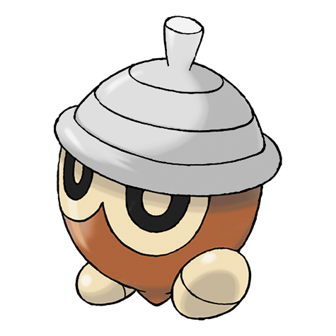
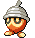

# #273 Seedot (Acorn Pokémon)

| Official Artwork | Shiny Artwork |
| --- | --- |
|  |  |

When it dangles from a tree branch, it looks just like an acorn. It enjoys scaring other Pokémon.

---

## Media

### Default Sprites

| Front | Back | Front Shiny | Back Shiny |
| --- | --- | --- | --- |
|  |  |  |  |

### Cries

Latest (Gen VI+):

<audio controls>
<source src='../../assets/cries/seedot/latest.ogg' type='audio/ogg'>
  Your browser does not support the audio element.
</audio>

Legacy:

<audio controls>
<source src='../../assets/cries/seedot/legacy.ogg' type='audio/ogg'>
  Your browser does not support the audio element.
</audio>

---

## Pokédex Data

| National № | Type(s) | Height | Weight | Abilities | Local № |
|------------|---------|--------|--------|-----------|---------|
| #273 | {: width='48'} | 0.5 m / 1.6 ft | 4.0 kg / 8.8 lbs | Pickpocket Early Bird | N/A |

---

## Base Stats
|   | HP | Attack | Defense | Sp. Atk | Sp. Def | Speed |
|---|----|--------|---------|---------|---------|-------|
| **Base** | 40 | 40 | 50 | 30 | 30 | 30 |
| **Min** | 190 | 76 | 94 | 58 | 58 | 58 |
| **Max** | 284 | 196 | 218 | 174 | 174 | 174 |

The ranges shown above are for a level 100 Pokémon. Maximum values are based on a beneficial nature, 252 EVs, 31 IVs; minimum values are based on a hindering nature, 0 EVs, 0 IVs.

---

## Forms & Evolutions

!!! warning "WARNING"

    Information on evolutions may not be 100% accurate; differences between evolution methods across generations are not accounted for.

### Forms

Seedot has no alternate forms.

### Evolution Line

1. [Seedot](seedot.md/)
    1. Level Up: [Nuzleaf](nuzleaf.md/)
        1. Use Item: [Shiftry](shiftry.md/)

---

## Training

| EV Yield | Catch Rate | Base Friendship | Base Exp. | Growth Rate | Held Items |
|----------|------------|-----------------|-----------|-------------|------------|
| 1 Defense | 255 | 50 | 44 | Medium Slo |

---

## Breeding

| Egg Groups | Egg Cycles | Gender | Dimorphic | Color | Shape |
|------------|------------|--------|-----------|-------|-------|
| 1. Ground 2. Plant | 15 | 50.0% Male 50.0% Female | False | Brown | Legs |

---

## Moves

!!! warning "WARNING"

    Specific move information may be incorrect. However, the general movepool should be accurate; this includes changes made in Blaze Black and Volt White.

### Level Up Moves

| Lv. | Move | Type | Cat. | Power | Acc. | PP |
| --- | --- | --- | --- | --- | --- | --- |
| 1 | Bide | {: width='48'} | {: width='36'} | — | — | 10 |
| 1 | Bullet Seed | {: width='48'} | {: width='36'} | 25 | 100 | 30 |
| 1 | Quick Attack | {: width='48'} | {: width='36'} | 40 | 100 | 30 |
| 3 | Harden | {: width='48'} | {: width='36'} | — | — | 30 |
| 7 | Growth | {: width='48'} | {: width='36'} | — | — | 20 |
| 13 | Nature Power | {: width='48'} | {: width='36'} | — | — | 20 |
| 17 | Seed Bomb | {: width='48'} | {: width='36'} | 80 | 100 | 15 |
| 21 | Synthesis | {: width='48'} | {: width='36'} | — | — | 5 |
| 26 | Leech Seed | {: width='48'} | {: width='36'} | — | 90 | 10 |
| 31 | Sunny Day | {: width='48'} | {: width='36'} | — | — | 5 |
| 43 | Explosion | {: width='48'} | {: width='36'} | 250 | 100 | 5 |

### TM Moves

| TM | Move | Type | Cat. | Power | Acc. | PP |
| --- | --- | --- | --- | --- | --- | --- |
| TM06 | Toxic | {: width='48'} | {: width='36'} | — | 90 | 10 |
| TM10 | Hidden Power | {: width='48'} | {: width='36'} | 60 | 100 | 15 |
| TM11 | Sunny Day | {: width='48'} | {: width='36'} | — | — | 5 |
| TM17 | Protect | {: width='48'} | {: width='36'} | — | — | 10 |
| TM21 | Frustration | {: width='48'} | {: width='36'} | — | 100 | 20 |
| TM22 | Solar Beam | {: width='48'} | {: width='36'} | 120 | 100 | 10 |
| TM27 | Return | {: width='48'} | {: width='36'} | — | 100 | 20 |
| TM28 | Dig | {: width='48'} | {: width='36'} | 100 | 100 | 10 |
| TM30 | Shadow Ball | {: width='48'} | {: width='36'} | 90 | 100 | 15 |
| TM32 | Double Team | {: width='48'} | {: width='36'} | — | — | 15 |
| TM42 | Facade | {: width='48'} | {: width='36'} | 70 | 100 | 20 |
| TM44 | Rest | {: width='48'} | {: width='36'} | — | — | 5 |
| TM45 | Attract | {: width='48'} | {: width='36'} | — | 100 | 15 |
| TM48 | Round | {: width='48'} | {: width='36'} | 60 | 100 | 15 |
| TM53 | Energy Ball | {: width='48'} | {: width='36'} | 90 | 100 | 10 |
| TM54 | False Swipe | {: width='48'} | {: width='36'} | 40 | 100 | 40 |
| TM64 | Explosion | {: width='48'} | {: width='36'} | 250 | 100 | 5 |
| TM67 | Retaliate | {: width='48'} | {: width='36'} | 70 | 100 | 5 |
| TM70 | Flash | {: width='48'} | {: width='36'} | — | 100 | 20 |
| TM75 | Swords Dance | {: width='48'} | {: width='36'} | — | — | 20 |
| TM86 | Grass Knot | {: width='48'} | {: width='36'} | — | 100 | 20 |
| TM87 | Swagger | {: width='48'} | {: width='36'} | — | 85 | 15 |
| TM90 | Substitute | {: width='48'} | {: width='36'} | — | — | 10 |
| TM94 | Rock Smash | {: width='48'} | {: width='36'} | 60 | 100 | 15 |

### Egg Moves

| Move | Type | Cat. | Power | Acc. | PP |
| --- | --- | --- | --- | --- | --- |
| Razor Wind | {: width='48'} | {: width='36'} | 80 | 100 | 10 |
| Take Down | {: width='48'} | {: width='36'} | 90 | 85 | 20 |
| Leech Seed | {: width='48'} | {: width='36'} | — | 90 | 10 |
| Quick Attack | {: width='48'} | {: width='36'} | 40 | 100 | 30 |
| Amnesia | {: width='48'} | {: width='36'} | — | — | 20 |
| Beat Up | {: width='48'} | {: width='36'} | — | 100 | 10 |
| Bullet Seed | {: width='48'} | {: width='36'} | 25 | 100 | 30 |
| Power Swap | {: width='48'} | {: width='36'} | — | — | 10 |
| Worry Seed | {: width='48'} | {: width='36'} | — | 100 | 10 |
| Nasty Plot | {: width='48'} | {: width='36'} | — | — | 20 |
| Defog | {: width='48'} | {: width='36'} | — | — | 15 |
| Foul Play | {: width='48'} | {: width='36'} | 95 | 100 | 15 |

### Tutor Moves

Seedot cannot learn any moves from tutors.
