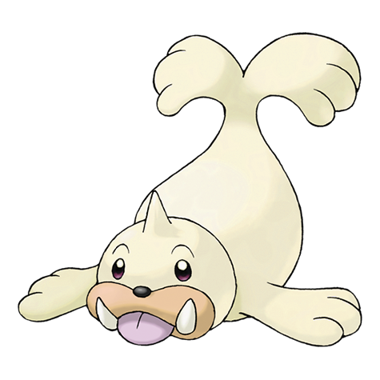

# Seel (Sea Lion Pokémon)

| Official Artwork | Shiny Artwork |
| --- | --- |
|  |  |

A Pokémon that lives on icebergs. It swims in the sea using the point on its head to break up ice.

---

## Media

### Default Sprites

| Front | Back | Front Shiny | Back Shiny |
| --- | --- | --- | --- |
|  |  |  |  |

### Cries

Latest (Gen VI+):

<audio controls>
<source src='../../assets/cries/seel/latest.ogg' type='audio/ogg'>
  Your browser does not support the audio element.
</audio>

Legacy:

<audio controls>
<source src='../../assets/cries/seel/legacy.ogg' type='audio/ogg'>
  Your browser does not support the audio element.
</audio>

---

## Pokédex Data

| National № | Type(s) | Height | Weight | Abilities | Local № |
|------------|---------|--------|--------|-----------|---------|
| #86 | {: width='48'} | 1.1 m | 90.0 kg | 1. Thick-Fat 2. Hydration | N/A |

---

## Base Stats
|   | HP | Attack | Defense | Sp. Atk | Sp. Def | Speed |
|---|----|--------|---------|---------|---------|-------|
| **Base** | 65 | 45 | 55 | 45 | 70 | 45 |
| **Min** | 240 | 85 | 103 | 85 | 130 | 85 |
| **Max** | 334 | 207 | 229 | 207 | 262 | 207 |

The ranges shown above are for a level 100 Pokémon. Maximum values are based on a beneficial nature, 252 EVs, 31 IVs; minimum values are based on a hindering nature, 0 EVs, 0 IVs.

---

## Forms & Evolutions

!!! warning "WARNING"

    Information on evolutions may not be 100% accurate; differences between evolution methods across generations are not accounted for.

### Forms

Seel has no alternate forms.

### Evolution Line

1. [Seel](seel.md/)
    1. Level Up: [Dewgong](dewgong.md/)

---

## Training

| EV Yield | Catch Rate | Base Friendship | Base Exp. | Growth Rate | Held Items |
|----------|------------|-----------------|-----------|-------------|------------|
| 1 Special Defense | 190 | 70 | 65 | Medium |  |

---

## Breeding

| Egg Groups | Egg Cycles | Gender | Dimorphic | Color | Shape |
|------------|------------|--------|-----------|-------|-------|
| 1. Water1 2. Ground | 20 | 50.0% Male 50.0% Female | False | White | Fish |

---

## Moves

!!! warning "WARNING"

    Specific move information may be incorrect. However, the general movepool should be accurate; this includes changes made in Blaze Black and Volt White.

### Level Up Moves

| Lv. | Move | Type | Cat. | Power | Acc. | PP |
| --- | --- | --- | --- | --- | --- | --- |
| 1 | Headbutt | {: width='48'} | {: width='36'} | 70 | 100 | 15 |
| 3 | Growl | {: width='48'} | {: width='36'} | — | 100 | 40 |
| 7 | Water Sport | {: width='48'} | {: width='36'} | — | — | 15 |
| 11 | Icy Wind | {: width='48'} | {: width='36'} | 55 | 95 | 15 |
| 13 | Encore | {: width='48'} | {: width='36'} | — | 100 | 5 |
| 17 | Ice Shard | {: width='48'} | {: width='36'} | 40 | 100 | 30 |
| 21 | Rest | {: width='48'} | {: width='36'} | — | — | 5 |
| 23 | Aqua Ring | {: width='48'} | {: width='36'} | — | — | 20 |
| 27 | Aurora Beam | {: width='48'} | {: width='36'} | 75 | 100 | 15 |
| 31 | Aqua Jet | {: width='48'} | {: width='36'} | 40 | 100 | 20 |
| 33 | Scald | {: width='48'} | {: width='36'} | 80 | 100 | 15 |
| 37 | Take Down | {: width='48'} | {: width='36'} | 90 | 85 | 20 |
| 41 | Dive | {: width='48'} | {: width='36'} | 80 | 100 | 10 |
| 43 | Aqua Tail | {: width='48'} | {: width='36'} | 90 | 90 | 10 |
| 47 | Ice Beam | {: width='48'} | {: width='36'} | 90 | 100 | 10 |
| 51 | Safeguard | {: width='48'} | {: width='36'} | — | — | 25 |
| 53 | Hail | {: width='48'} | {: width='36'} | — | — | 10 |

### TM Moves

| TM | Move | Type | Cat. | Power | Acc. | PP |
| --- | --- | --- | --- | --- | --- | --- |
| HM03 | Surf | {: width='48'} | {: width='36'} | 90 | 100 | 15 |
| HM05 | Waterfall | {: width='48'} | {: width='36'} | 85 | 100 | 15 |
| HM06 | Dive | {: width='48'} | {: width='36'} | 80 | 100 | 10 |
| TM06 | Toxic | {: width='48'} | {: width='36'} | — | 90 | 10 |
| TM07 | Hail | {: width='48'} | {: width='36'} | — | — | 10 |
| TM10 | Hidden Power | {: width='48'} | {: width='36'} | 60 | 100 | 15 |
| TM13 | Ice Beam | {: width='48'} | {: width='36'} | 90 | 100 | 10 |
| TM14 | Blizzard | {: width='48'} | {: width='36'} | 110 | 70 | 5 |
| TM17 | Protect | {: width='48'} | {: width='36'} | — | — | 10 |
| TM18 | Rain Dance | {: width='48'} | {: width='36'} | — | — | 5 |
| TM20 | Safeguard | {: width='48'} | {: width='36'} | — | — | 25 |
| TM21 | Frustration | {: width='48'} | {: width='36'} | — | 100 | 20 |
| TM27 | Return | {: width='48'} | {: width='36'} | — | 100 | 20 |
| TM32 | Double Team | {: width='48'} | {: width='36'} | — | — | 15 |
| TM42 | Facade | {: width='48'} | {: width='36'} | 70 | 100 | 20 |
| TM44 | Rest | {: width='48'} | {: width='36'} | — | — | 5 |
| TM45 | Attract | {: width='48'} | {: width='36'} | — | 100 | 15 |
| TM46 | Thief | {: width='48'} | {: width='36'} | 60 | 100 | 25 |
| TM48 | Round | {: width='48'} | {: width='36'} | 60 | 100 | 15 |
| TM49 | Echoed Voice | {: width='48'} | {: width='36'} | 40 | 100 | 15 |
| TM56 | Fling | {: width='48'} | {: width='36'} | — | 100 | 10 |
| TM87 | Swagger | {: width='48'} | {: width='36'} | — | 85 | 15 |
| TM90 | Substitute | {: width='48'} | {: width='36'} | — | — | 10 |

### Egg Moves

| Move | Type | Cat. | Power | Acc. | PP |
| --- | --- | --- | --- | --- | --- |
| Slam | {: width='48'} | {: width='36'} | 80 | 75 | 20 |
| Drill Run | {: width='48'} | {: width='36'} | 80 | 95 | 10 |
| Disable | {: width='48'} | {: width='36'} | — | 100 | 20 |
| Lick | {: width='48'} | {: width='36'} | 30 | 100 | 30 |
| Perish Song | {: width='48'} | {: width='36'} | — | — | 5 |
| Sleep Talk | {: width='48'} | {: width='36'} | — | — | 10 |
| Encore | {: width='48'} | {: width='36'} | — | 100 | 5 |
| Iron Tail | {: width='48'} | {: width='36'} | 100 | 75 | 15 |
| Fake Out | {: width='48'} | {: width='36'} | 40 | 100 | 10 |
| Stockpile | {: width='48'} | {: width='36'} | — | — | 20 |
| Spit Up | {: width='48'} | {: width='36'} | — | 100 | 10 |
| Swallow | {: width='48'} | {: width='36'} | — | — | 10 |
| Signal Beam | {: width='48'} | {: width='36'} | 75 | 100 | 15 |
| Icicle Spear | {: width='48'} | {: width='36'} | 25 | 100 | 30 |
| Water Pulse | {: width='48'} | {: width='36'} | 60 | 100 | 20 |

### Tutor Moves

Seel cannot learn any moves from tutors.
