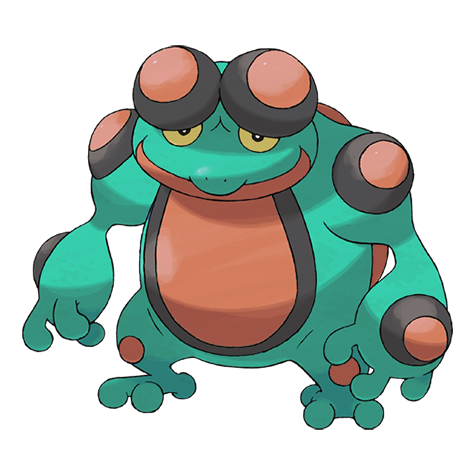
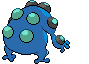
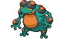
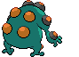

# Seismitoad (Vibration Pokémon)

| Official Artwork | Shiny Artwork |
| --- | --- |
|  |  |

**Blaze Black:** They shoot paralyzing liquid from their head bumps. They use vibration to hurt their opponents.

**Volt White:** It increases the power of its punches by vibrating the bumps on its fists. It can turn a boulder to rubble with one punch.

---

## Media

### Default Sprites

| Front | Back | Front Shiny | Back Shiny |
| --- | --- | --- | --- |
|  |  |  |  |

### Cries

Latest (Gen VI+):

<audio controls>
<source src='../../assets/cries/seismitoad/latest.ogg' type='audio/ogg'>
  Your browser does not support the audio element.
</audio>

Legacy:

<audio controls>
<source src='../../assets/cries/seismitoad/legacy.ogg' type='audio/ogg'>
  Your browser does not support the audio element.
</audio>

---

## Pokédex Data

| National № | Type(s) | Height | Weight | Abilities | Local № |
|------------|---------|--------|--------|-----------|---------|
| #537 | {: width='48'} {: width='48'} | 1.5 m | 62.0 kg | 1. Water-Absorb 2. Poison-Touch | #43 |

---

## Base Stats
|   | HP | Attack | Defense | Sp. Atk | Sp. Def | Speed |
|---|----|--------|---------|---------|---------|-------|
| **Base** | 105 | 95 | 75 | 95 | 75 | 74 |
| **Min** | 320 | 175 | 139 | 175 | 139 | 137 |
| **Max** | 414 | 317 | 273 | 317 | 273 | 271 |

The ranges shown above are for a level 100 Pokémon. Maximum values are based on a beneficial nature, 252 EVs, 31 IVs; minimum values are based on a hindering nature, 0 EVs, 0 IVs.

---

## Forms & Evolutions

!!! warning "WARNING"

    Information on evolutions may not be 100% accurate; differences between evolution methods across generations are not accounted for.

### Forms

Seismitoad has no alternate forms.

### Evolution Line

1. [Tympole](tympole.md/)
    1. Level Up: [Palpitoad](palpitoad.md/)
        1. Level Up: [Seismitoad](seismitoad.md/)

---

## Training

| EV Yield | Catch Rate | Base Friendship | Base Exp. | Growth Rate | Held Items |
|----------|------------|-----------------|-----------|-------------|------------|
| 3 Hp | 45 | 50 | 255 | Medium-Slow | persim-berry (50%) |

---

## Breeding

| Egg Groups | Egg Cycles | Gender | Dimorphic | Color | Shape |
|------------|------------|--------|-----------|-------|-------|
| 1. Water1 | 20 | 50.0% Male 50.0% Female | False | Blue | Humanoid |

---

## Moves

!!! warning "WARNING"

    Specific move information may be incorrect. However, the general movepool should be accurate; this includes changes made in Blaze Black and Volt White.

### Level Up Moves

| Lv. | Move | Type | Cat. | Power | Acc. | PP |
| --- | --- | --- | --- | --- | --- | --- |
| 1 | Bubble | {: width='48'} | {: width='36'} | 40 | 100 | 30 |
| 1 | Growl | {: width='48'} | {: width='36'} | — | 100 | 40 |
| 1 | Gunk Shot | {: width='48'} | {: width='36'} | 120 | 80 | 5 |
| 1 | Ice Punch | {: width='48'} | {: width='36'} | 80 | 100 | 15 |
| 1 | Round | {: width='48'} | {: width='36'} | 60 | 100 | 15 |
| 1 | Supersonic | {: width='48'} | {: width='36'} | — | 55 | 20 |
| 5 | Supersonic | {: width='48'} | {: width='36'} | — | 55 | 20 |
| 9 | Round | {: width='48'} | {: width='36'} | 60 | 100 | 15 |
| 12 | Bubble Beam | {: width='48'} | {: width='36'} | 75 | 100 | 15 |
| 16 | Mud Shot | {: width='48'} | {: width='36'} | 55 | 95 | 15 |
| 20 | Aqua Ring | {: width='48'} | {: width='36'} | — | — | 20 |
| 23 | Uproar | {: width='48'} | {: width='36'} | 90 | 100 | 10 |
| 28 | Muddy Water | {: width='48'} | {: width='36'} | 90 | 85 | 10 |
| 33 | Rain Dance | {: width='48'} | {: width='36'} | — | — | 5 |
| 36 | Acid | {: width='48'} | {: width='36'} | 40 | 100 | 30 |
| 39 | Flail | {: width='48'} | {: width='36'} | — | 100 | 15 |
| 44 | Drain Punch | {: width='48'} | {: width='36'} | 75 | 100 | 10 |
| 49 | Echoed Voice | {: width='48'} | {: width='36'} | 40 | 100 | 15 |
| 53 | Hydro Pump | {: width='48'} | {: width='36'} | 110 | 80 | 5 |
| 59 | Hyper Voice | {: width='48'} | {: width='36'} | 90 | 100 | 10 |
| 64 | Earth Power | {: width='48'} | {: width='36'} | 90 | 100 | 10 |

### TM Moves

| TM | Move | Type | Cat. | Power | Acc. | PP |
| --- | --- | --- | --- | --- | --- | --- |
| HM03 | Surf | {: width='48'} | {: width='36'} | 90 | 100 | 15 |
| HM04 | Strength | {: width='48'} | {: width='36'} | 100 | 100 | 15 |
| TM06 | Toxic | {: width='48'} | {: width='36'} | — | 90 | 10 |
| TM07 | Hail | {: width='48'} | {: width='36'} | — | — | 10 |
| TM09 | Venoshock | {: width='48'} | {: width='36'} | 65 | 100 | 10 |
| TM10 | Hidden Power | {: width='48'} | {: width='36'} | 60 | 100 | 15 |
| TM13 | Ice Beam | {: width='48'} | {: width='36'} | 90 | 100 | 10 |
| TM14 | Blizzard | {: width='48'} | {: width='36'} | 110 | 70 | 5 |
| TM15 | Hyper Beam | {: width='48'} | {: width='36'} | 150 | 90 | 5 |
| TM17 | Protect | {: width='48'} | {: width='36'} | — | — | 10 |
| TM18 | Rain Dance | {: width='48'} | {: width='36'} | — | — | 5 |
| TM21 | Frustration | {: width='48'} | {: width='36'} | — | 100 | 20 |
| TM26 | Earthquake | {: width='48'} | {: width='36'} | 100 | 100 | 10 |
| TM27 | Return | {: width='48'} | {: width='36'} | — | 100 | 20 |
| TM28 | Dig | {: width='48'} | {: width='36'} | 100 | 100 | 10 |
| TM31 | Brick Break | {: width='48'} | {: width='36'} | 75 | 100 | 15 |
| TM32 | Double Team | {: width='48'} | {: width='36'} | — | — | 15 |
| TM34 | Sludge Wave | {: width='48'} | {: width='36'} | 95 | 100 | 10 |
| TM36 | Sludge Bomb | {: width='48'} | {: width='36'} | 90 | 100 | 10 |
| TM39 | Rock Tomb | {: width='48'} | {: width='36'} | 60 | 95 | 15 |
| TM42 | Facade | {: width='48'} | {: width='36'} | 70 | 100 | 20 |
| TM44 | Rest | {: width='48'} | {: width='36'} | — | — | 5 |
| TM45 | Attract | {: width='48'} | {: width='36'} | — | 100 | 15 |
| TM48 | Round | {: width='48'} | {: width='36'} | 60 | 100 | 15 |
| TM49 | Echoed Voice | {: width='48'} | {: width='36'} | 40 | 100 | 15 |
| TM52 | Focus Blast | {: width='48'} | {: width='36'} | 120 | 70 | 5 |
| TM55 | Scald | {: width='48'} | {: width='36'} | 80 | 100 | 15 |
| TM56 | Fling | {: width='48'} | {: width='36'} | — | 100 | 10 |
| TM66 | Payback | {: width='48'} | {: width='36'} | 50 | 100 | 10 |
| TM68 | Giga Impact | {: width='48'} | {: width='36'} | 150 | 90 | 5 |
| TM78 | Bulldoze | {: width='48'} | {: width='36'} | 80 | 100 | 20 |
| TM80 | Rock Slide | {: width='48'} | {: width='36'} | 75 | 90 | 10 |
| TM84 | Poison Jab | {: width='48'} | {: width='36'} | 80 | 100 | 20 |
| TM86 | Grass Knot | {: width='48'} | {: width='36'} | — | 100 | 20 |
| TM87 | Swagger | {: width='48'} | {: width='36'} | — | 85 | 15 |
| TM90 | Substitute | {: width='48'} | {: width='36'} | — | — | 10 |
| TM94 | Rock Smash | {: width='48'} | {: width='36'} | 60 | 100 | 15 |

### Egg Moves

Seismitoad cannot learn any moves by breeding.
### Tutor Moves

Seismitoad cannot learn any moves from tutors.
