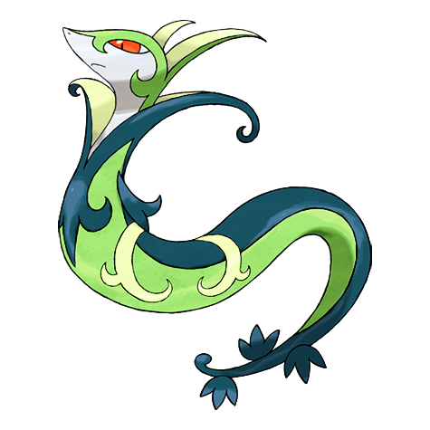

# #497 Serperior (Regal Pokémon)

| Official Artwork | Shiny Artwork |
| --- | --- |
|  |  |

**Blaze Black:** It can stop its opponents’ movements with just a glare. It takes in solar energy and boosts it internally.

**Volt White:** They raise their heads to intimidate opponents but only give it their all when fighting a powerful opponent.

---

## Media

### Default Sprites

| Front | Back | Front Shiny | Back Shiny |
| --- | --- | --- | --- |
|  |  |  |  |

### Cries

Latest (Gen VI+):

<audio controls>
<source src='../../assets/cries/serperior/latest.ogg' type='audio/ogg'>
  Your browser does not support the audio element.
</audio>

Legacy:

<audio controls>
<source src='../../assets/cries/serperior/legacy.ogg' type='audio/ogg'>
  Your browser does not support the audio element.
</audio>

---

## Pokédex Data

| National № | Type(s) | Height | Weight | Abilities | Local № |
|------------|---------|--------|--------|-----------|---------|
| #497 | {: width="48"} {: width="48"} | 3.3 m / 10.8 ft | 63.0 kg / 138.9 lbs |  | 1. Overgrow 2. Contrary | #3 |

---

## Base Stats
|   | HP | Attack | Defense | Sp. Atk | Sp. Def | Speed |
|---|----|--------|---------|---------|---------|-------|
| **Base** | 82 | 75 | 95 | 75 | 95 | 113 |
| **Min** | 274 | 139 | 175 | 139 | 175 | 207 |
| **Max** | 368 | 273 | 317 | 273 | 317 | 357 |

The ranges shown above are for a level 100 Pokémon. Maximum values are based on a beneficial nature, 252 EVs, 31 IVs; minimum values are based on a hindering nature, 0 EVs, 0 IVs.

---

## Forms & Evolutions

!!! warning "WARNING"

    Information on evolutions may not be 100% accurate; differences between evolution methods across generations are not accounted for.

### Forms

Serperior has no alternate forms.

### Evolution Line

1. [Snivy](snivy.md/)
    1. Level Up: [Servine](servine.md/)
        1. Level Up: [Serperior](serperior.md/)

---

## Training

| EV Yield | Catch Rate | Base Friendship | Base Exp. | Growth Rate | Held Items |
|----------|------------|-----------------|-----------|-------------|------------|
| 3 Spd | 45 | 0 | 238 | Medium Slow | Miracle Seed (50%) |

---

## Breeding

| Egg Groups | Egg Cycles | Gender | Dimorphic | Color | Shape |
|------------|------------|--------|-----------|-------|-------|
| 1. Ground 2. Plant | 20 | 87.5% Male 12.5% Female | False | Green | Squiggle |

---

## Moves

!!! warning "WARNING"

    Specific move information may be incorrect. However, the general movepool should be accurate; this includes changes made in Blaze Black and Volt White.

### Level Up Moves

| Lv. | Move | Type | Cat. | Power | Acc. | PP |
| --- | --- | --- | --- | --- | --- | --- |
| 1 | Leer | {: width="48"} | {: width="36"} | — | 100 | 30 |
| 1 | Tackle | {: width="48"} | {: width="36"} | 40 | 100 | 35 |
| 1 | Vine Whip | {: width="48"} | {: width="36"} | 45 | 100 | 25 |
| 1 | Wrap | {: width="48"} | {: width="36"} | 15 | 90 | 20 |
| 4 | Leer | {: width="48"} | {: width="36"} | — | 100 | 30 |
| 7 | Vine Whip | {: width="48"} | {: width="36"} | 45 | 100 | 25 |
| 10 | Wrap | {: width="48"} | {: width="36"} | 15 | 90 | 20 |
| 13 | Growth | {: width="48"} | {: width="36"} | — | — | 20 |
| 16 | Leaf Tornado | {: width="48"} | {: width="36"} | 65 | 90 | 10 |
| 17 | Hurricane | {: width="48"} | {: width="36"} | 110 | 70 | 10 |
| 20 | Leech Seed | {: width="48"} | {: width="36"} | — | 90 | 10 |
| 24 | Zen Headbutt | {: width="48"} | {: width="36"} | 80 | 90 | 15 |
| 28 | Slam | {: width="48"} | {: width="36"} | 80 | 75 | 20 |
| 32 | Leaf Blade | {: width="48"} | {: width="36"} | 90 | 100 | 15 |
| 36 | Dragon Breath | {: width="48"} | {: width="36"} | 60 | 100 | 20 |
| 38 | Coil | {: width="48"} | {: width="36"} | — | — | 20 |
| 44 | Iron Tail | {: width="48"} | {: width="36"} | 100 | 75 | 15 |
| 50 | Dragon Pulse | {: width="48"} | {: width="36"} | 85 | 100 | 10 |
| 56 | Power Whip | {: width="48"} | {: width="36"} | 120 | 85 | 10 |
| 62 | Outrage | {: width="48"} | {: width="36"} | 120 | 100 | 10 |
| 68 | Mirror Coat | {: width="48"} | {: width="36"} | — | 100 | 20 |
| 74 | Leaf Storm | {: width="48"} | {: width="36"} | 130 | 90 | 5 |

### TM Moves

| TM | Move | Type | Cat. | Power | Acc. | PP |
| --- | --- | --- | --- | --- | --- | --- |
| HM01 | Cut | {: width="48"} | {: width="36"} | 60 | 100% | 25 |
| HM04 | Strength | {: width="48"} | {: width="36"} | 100 | 100 | 15 |
| TM04 | Calm Mind | {: width="48"} | {: width="36"} | — | — | 20 |
| TM06 | Toxic | {: width="48"} | {: width="36"} | — | 90 | 10 |
| TM10 | Hidden Power | {: width="48"} | {: width="36"} | 60 | 100 | 15 |
| TM11 | Sunny Day | {: width="48"} | {: width="36"} | — | — | 5 |
| TM12 | Taunt | {: width="48"} | {: width="36"} | — | 100 | 20 |
| TM15 | Hyper Beam | {: width="48"} | {: width="36"} | 150 | 90 | 5 |
| TM16 | Light Screen | {: width="48"} | {: width="36"} | — | — | 30 |
| TM17 | Protect | {: width="48"} | {: width="36"} | — | — | 10 |
| TM20 | Safeguard | {: width="48"} | {: width="36"} | — | — | 25 |
| TM21 | Frustration | {: width="48"} | {: width="36"} | — | 100 | 20 |
| TM22 | Solar Beam | {: width="48"} | {: width="36"} | 120 | 100 | 10 |
| TM26 | Earthquake | {: width="48"} | {: width="36"} | 100 | 100 | 10 |
| TM27 | Return | {: width="48"} | {: width="36"} | — | 100 | 20 |
| TM32 | Double Team | {: width="48"} | {: width="36"} | — | — | 15 |
| TM33 | Reflect | {: width="48"} | {: width="36"} | — | — | 20 |
| TM40 | Aerial Ace | {: width="48"} | {: width="36"} | 60 | — | 20 |
| TM41 | Torment | {: width="48"} | {: width="36"} | — | 100 | 15 |
| TM42 | Facade | {: width="48"} | {: width="36"} | 70 | 100 | 20 |
| TM44 | Rest | {: width="48"} | {: width="36"} | — | — | 5 |
| TM45 | Attract | {: width="48"} | {: width="36"} | — | 100 | 15 |
| TM48 | Round | {: width="48"} | {: width="36"} | 60 | 100 | 15 |
| TM53 | Energy Ball | {: width="48"} | {: width="36"} | 90 | 100 | 10 |
| TM68 | Giga Impact | {: width="48"} | {: width="36"} | 150 | 90 | 5 |
| TM70 | Flash | {: width="48"} | {: width="36"} | — | 100 | 20 |
| TM75 | Swords Dance | {: width="48"} | {: width="36"} | — | — | 20 |
| TM82 | Dragon Tail | {: width="48"} | {: width="36"} | 60 | 90 | 10 |
| TM86 | Grass Knot | {: width="48"} | {: width="36"} | — | 100 | 20 |
| TM87 | Swagger | {: width="48"} | {: width="36"} | — | 85 | 15 |
| TM90 | Substitute | {: width="48"} | {: width="36"} | — | — | 10 |
| TM94 | Rock Smash | {: width="48"} | {: width="36"} | 60 | 100 | 15 |

### Egg Moves

Serperior cannot learn any moves by breeding.
### Tutor Moves

| Move | Type | Cat. | Power | Acc. | PP |
| --- | --- | --- | --- | --- | --- |
| Frenzy Plant | {: width="48"} | {: width="36"} | 150 | 90 | 5 |
| Grass Pledge | {: width="48"} | {: width="36"} | 80 | 100 | 10 |

