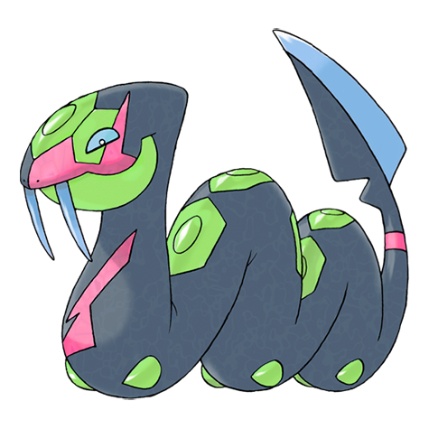
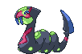
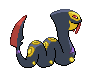
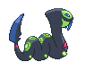

# #336 Seviper (Fang Snake Pokémon)

| Official Artwork | Shiny Artwork |
|------------------|---------------|
|  |  |

For many generations, it has feuded with Zangoose. It whets its bladed tail on rocks for battle.

---

## Media

### Default Sprites

| Front | Shiny | Back | Shiny |
|-------|-------|------|-------|
|  |  |  |  |

### Cries

Latest (Gen VI+):

<audio controls>
<source src='../../assets/cries/seviper/latest.ogg' type='audio/ogg'>
  Your browser does not support the audio element.
</audio>

Legacy:

<audio controls>
<source src='../../assets/cries/seviper/legacy.ogg' type='audio/ogg'>
  Your browser does not support the audio element.
</audio>

---

## Pokédex Data

| National № | Type(s) | Height | Weight | Abilities | Local № |
|------------|---------|--------|--------|-----------|---------|
| #336 | {: width="48"} | 2.7 m / 8.9 ft | 52.5 kg / 115.7 lbs | 1. Shed Skin 2. Infiltrator | N/A |

---

## Base Stats
|   | HP | Attack | Defense | Sp. Atk | Sp. Def | Speed |
|---|----|--------|---------|---------|---------|-------|
| **Base** | 73 | 100 | 60 | 100 | 60 | 65 |
| **Min** | 256 | 184 | 112 | 184 | 112 | 121 |
| **Max** | 350 | 328 | 240 | 328 | 240 | 251 |

The ranges shown above are for a level 100 Pokémon. Maximum values are based on a beneficial nature, 252 EVs, 31 IVs; minimum values are based on a hindering nature, 0 EVs, 0 IVs.

---

## Forms & Evolutions

!!! warning "WARNING"

    Information on evolutions may not be 100% accurate; differences between evolution methods across generations are not accounted for.

### Forms

Seviper has no alternate forms.

### Evolution Line

1. [Seviper](seviper.md/)

---

## Training

| EV Yield | Catch Rate | Base Friendship | Base Exp. | Growth Rate | Held Items |
|----------|------------|-----------------|-----------|-------------|------------|
| 1 Atk 1 Sp. Atk | 90 | 70 | 160 | Fast Then Very Slo |

---

## Breeding

| Egg Groups | Egg Cycles | Gender | Dimorphic | Color | Shape |
|------------|------------|--------|-----------|-------|-------|
| 1. Ground 2. Dragon | 20 | 50.0% Male 50.0% Female | False | Black | Squiggle |

---

## Moves

!!! warning "WARNING"

    Specific move information may be incorrect. However, the general movepool should be accurate; this includes changes made in Blaze Black and Volt White.

### Level Up Moves

| Lv. | Move | Type | Cat. | Power | Acc. | PP |
| --- | --- | --- | --- | --- | --- | --- |
| 1 | Wrap | {: width="48"} | {: width="36"} | 15 | 90 | 20 |
| 7 | Lick | {: width="48"} | {: width="36"} | 30 | 100 | 30 |
| 10 | Bite | {: width="48"} | {: width="36"} | 60 | 100 | 25 |
| 16 | Poison Tail | {: width="48"} | {: width="36"} | 90 | 100 | 15 |
| 19 | Screech | {: width="48"} | {: width="36"} | — | 85 | 40 |
| 25 | Glare | {: width="48"} | {: width="36"} | — | 100 | 30 |
| 28 | Crunch | {: width="48"} | {: width="36"} | 80 | 100 | 15 |
| 34 | Poison Fang | {: width="48"} | {: width="36"} | 65 | 95 | 15 |
| 37 | Swagger | {: width="48"} | {: width="36"} | — | 85 | 15 |
| 43 | Haze | {: width="48"} | {: width="36"} | — | — | 30 |
| 46 | Night Slash | {: width="48"} | {: width="36"} | 70 | 100 | 15 |
| 52 | Poison Jab | {: width="48"} | {: width="36"} | 80 | 100 | 20 |
| 55 | Venoshock | {: width="48"} | {: width="36"} | 65 | 100 | 10 |
| 61 | Wring Out | {: width="48"} | {: width="36"} | — | 100 | 5 |
| 64 | Coil | {: width="48"} | {: width="36"} | — | — | 20 |
| 67 | Gunk Shot | {: width="48"} | {: width="36"} | 120 | 80 | 5 |

### TM Moves

| TM | Move | Type | Cat. | Power | Acc. | PP |
| --- | --- | --- | --- | --- | --- | --- |
| HM04 | Strength | {: width="48"} | {: width="36"} | 100 | 100 | 15 |
| TM06 | Toxic | {: width="48"} | {: width="36"} | — | 90 | 10 |
| TM09 | Venoshock | {: width="48"} | {: width="36"} | 65 | 100 | 10 |
| TM10 | Hidden Power | {: width="48"} | {: width="36"} | 60 | 100 | 15 |
| TM11 | Sunny Day | {: width="48"} | {: width="36"} | — | — | 5 |
| TM12 | Taunt | {: width="48"} | {: width="36"} | — | 100 | 20 |
| TM17 | Protect | {: width="48"} | {: width="36"} | — | — | 10 |
| TM18 | Rain Dance | {: width="48"} | {: width="36"} | — | — | 5 |
| TM21 | Frustration | {: width="48"} | {: width="36"} | — | 100 | 20 |
| TM26 | Earthquake | {: width="48"} | {: width="36"} | 100 | 100 | 10 |
| TM27 | Return | {: width="48"} | {: width="36"} | — | 100 | 20 |
| TM28 | Dig | {: width="48"} | {: width="36"} | 100 | 100 | 10 |
| TM32 | Double Team | {: width="48"} | {: width="36"} | — | — | 15 |
| TM34 | Sludge Wave | {: width="48"} | {: width="36"} | 95 | 100 | 10 |
| TM35 | Flamethrower | {: width="48"} | {: width="36"} | 90 | 100 | 15 |
| TM36 | Sludge Bomb | {: width="48"} | {: width="36"} | 90 | 100 | 10 |
| TM42 | Facade | {: width="48"} | {: width="36"} | 70 | 100 | 20 |
| TM44 | Rest | {: width="48"} | {: width="36"} | — | — | 5 |
| TM45 | Attract | {: width="48"} | {: width="36"} | — | 100 | 15 |
| TM46 | Thief | {: width="48"} | {: width="36"} | 60 | 100 | 25 |
| TM48 | Round | {: width="48"} | {: width="36"} | 60 | 100 | 15 |
| TM66 | Payback | {: width="48"} | {: width="36"} | 50 | 100 | 10 |
| TM67 | Retaliate | {: width="48"} | {: width="36"} | 70 | 100 | 5 |
| TM78 | Bulldoze | {: width="48"} | {: width="36"} | 80 | 100 | 20 |
| TM81 | X Scissor | {: width="48"} | {: width="36"} | 80 | 100 | 15 |
| TM82 | Dragon Tail | {: width="48"} | {: width="36"} | 60 | 90 | 10 |
| TM84 | Poison Jab | {: width="48"} | {: width="36"} | 80 | 100 | 20 |
| TM87 | Swagger | {: width="48"} | {: width="36"} | — | 85 | 15 |
| TM90 | Substitute | {: width="48"} | {: width="36"} | — | — | 10 |
| TM94 | Rock Smash | {: width="48"} | {: width="36"} | 60 | 100 | 15 |

### Egg Moves

| Move | Type | Cat. | Power | Acc. | PP |
| --- | --- | --- | --- | --- | --- |
| Body Slam | {: width="48"} | {: width="36"} | 85 | 100 | 15 |
| Scary Face | {: width="48"} | {: width="36"} | — | 100 | 10 |
| Iron Tail | {: width="48"} | {: width="36"} | 100 | 75 | 15 |
| Stockpile | {: width="48"} | {: width="36"} | — | — | 20 |
| Spit Up | {: width="48"} | {: width="36"} | — | 100 | 10 |
| Swallow | {: width="48"} | {: width="36"} | — | — | 10 |
| Assurance | {: width="48"} | {: width="36"} | 60 | 100 | 10 |
| Wring Out | {: width="48"} | {: width="36"} | — | 100 | 5 |
| Punishment | {: width="48"} | {: width="36"} | — | 100 | 5 |
| Night Slash | {: width="48"} | {: width="36"} | 70 | 100 | 15 |
| Switcheroo | {: width="48"} | {: width="36"} | — | 100 | 10 |
| Final Gambit | {: width="48"} | {: width="36"} | — | 100 | 5 |

### Tutor Moves

Seviper cannot learn any moves from tutors.
