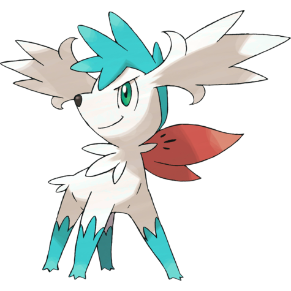
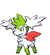
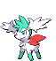
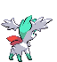

# #10006 Shaymin Sky (Gratitude Pokémon)

| Official Artwork | Shiny Artwork |
| --- | --- |
|  |  |

The flowers all over its body burst into bloom if it is lovingly hugged and senses gratitude.

---

## Media

### Default Sprites

| Front | Back | Front Shiny | Back Shiny |
| --- | --- | --- | --- |
|  |  |  |  |

### Cries

Latest (Gen VI+):

<audio controls>
<source src='../../assets/cries/shaymin-sky/latest.ogg' type='audio/ogg'>
  Your browser does not support the audio element.
</audio>

---

## Pokédex Data

| National № | Type(s) | Height | Weight | Abilities | Local № |
|------------|---------|--------|--------|-----------|---------|
| #10006 | {: width='48'} {: width='48'} | 0.4 m | 5.2 kg | 1. Serene-Grace | N/A |

---

## Base Stats
|   | HP | Attack | Defense | Sp. Atk | Sp. Def | Speed |
|---|----|--------|---------|---------|---------|-------|
| **Base** | 100 | 103 | 75 | 120 | 75 | 127 |
| **Min** | 310 | 189 | 139 | 220 | 139 | 233 |
| **Max** | 404 | 335 | 273 | 372 | 273 | 388 |

The ranges shown above are for a level 100 Pokémon. Maximum values are based on a beneficial nature, 252 EVs, 31 IVs; minimum values are based on a hindering nature, 0 EVs, 0 IVs.

---

## Forms & Evolutions

!!! warning "WARNING"

    Information on evolutions may not be 100% accurate; differences between evolution methods across generations are not accounted for.

### Forms

1. [Shaymin Land](shaymin-land.md/)

2. [Shaymin Sky](shaymin-sky.md/)

### Evolution Line

1. [Shaymin Land](shaymin-land.md/)

1. [Shaymin Sky](shaymin-sky.md/)

---

## Training

| EV Yield | Catch Rate | Base Friendship | Base Exp. | Growth Rate | Held Items |
|----------|------------|-----------------|-----------|-------------|------------|
| 3 Speed | 45 | 100 | 270 | Medium-Slow | lum-berry (100%) |

---

## Breeding

| Egg Groups | Egg Cycles | Gender | Dimorphic | Color | Shape |
|------------|------------|--------|-----------|-------|-------|
| 1. No-Eggs | 120 | Genderless | False | Green | Quadruped |

---

## Moves

!!! warning "WARNING"

    Specific move information may be incorrect. However, the general movepool should be accurate; this includes changes made in Blaze Black and Volt White.

### Level Up Moves

| Lv. | Move | Type | Cat. | Power | Acc. | PP |
| --- | --- | --- | --- | --- | --- | --- |
| 1 | Growth | {: width='48'} | {: width='36'} | — | — | 20 |
| 10 | Magical Leaf | {: width='48'} | {: width='36'} | 60 | — | 20 |
| 19 | Leech Seed | {: width='48'} | {: width='36'} | — | 90 | 10 |
| 28 | Quick Attack | {: width='48'} | {: width='36'} | 40 | 100 | 30 |
| 37 | Sweet Scent | {: width='48'} | {: width='36'} | — | 100 | 20 |
| 46 | Natural Gift | {: width='48'} | {: width='36'} | — | 100 | 15 |
| 55 | Worry Seed | {: width='48'} | {: width='36'} | — | 100 | 10 |
| 64 | Air Slash | {: width='48'} | {: width='36'} | 75 | 95 | 15 |
| 73 | Energy Ball | {: width='48'} | {: width='36'} | 90 | 100 | 10 |
| 82 | Sweet Kiss | {: width='48'} | {: width='36'} | — | 75 | 10 |
| 91 | Leaf Storm | {: width='48'} | {: width='36'} | 130 | 90 | 5 |
| 100 | Seed Flare | {: width='48'} | {: width='36'} | 120 | 85 | 5 |

### TM Moves

| TM | Move | Type | Cat. | Power | Acc. | PP |
| --- | --- | --- | --- | --- | --- | --- |
| TM06 | Toxic | {: width='48'} | {: width='36'} | — | 90 | 10 |
| TM10 | Hidden Power | {: width='48'} | {: width='36'} | 60 | 100 | 15 |
| TM11 | Sunny Day | {: width='48'} | {: width='36'} | — | — | 5 |
| TM15 | Hyper Beam | {: width='48'} | {: width='36'} | 150 | 90 | 5 |
| TM17 | Protect | {: width='48'} | {: width='36'} | — | — | 10 |
| TM20 | Safeguard | {: width='48'} | {: width='36'} | — | — | 25 |
| TM21 | Frustration | {: width='48'} | {: width='36'} | — | 100 | 20 |
| TM22 | Solar Beam | {: width='48'} | {: width='36'} | 120 | 100 | 10 |
| TM27 | Return | {: width='48'} | {: width='36'} | — | 100 | 20 |
| TM29 | Psychic | {: width='48'} | {: width='36'} | 90 | 100 | 10 |
| TM32 | Double Team | {: width='48'} | {: width='36'} | — | — | 15 |
| TM42 | Facade | {: width='48'} | {: width='36'} | 70 | 100 | 20 |
| TM44 | Rest | {: width='48'} | {: width='36'} | — | — | 5 |
| TM48 | Round | {: width='48'} | {: width='36'} | 60 | 100 | 15 |
| TM53 | Energy Ball | {: width='48'} | {: width='36'} | 90 | 100 | 10 |
| TM68 | Giga Impact | {: width='48'} | {: width='36'} | 150 | 90 | 5 |
| TM70 | Flash | {: width='48'} | {: width='36'} | — | 100 | 20 |
| TM75 | Swords Dance | {: width='48'} | {: width='36'} | — | — | 20 |
| TM77 | Psych Up | {: width='48'} | {: width='36'} | — | — | 10 |
| TM86 | Grass Knot | {: width='48'} | {: width='36'} | — | 100 | 20 |
| TM87 | Swagger | {: width='48'} | {: width='36'} | — | 85 | 15 |
| TM90 | Substitute | {: width='48'} | {: width='36'} | — | — | 10 |

### Egg Moves

Shaymin Sky cannot learn any moves by breeding.
### Tutor Moves

Shaymin Sky cannot learn any moves from tutors.
