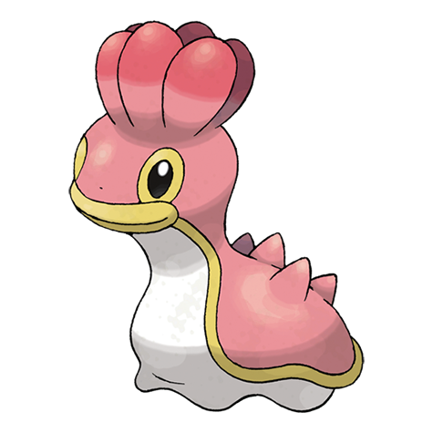
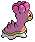
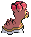

# #422 Shellos (Sea Slug Pokémon)

| Official Artwork | Shiny Artwork |
| --- | --- |
|  |  |

Beware of pushing strongly on its squishy body, as it makes a mysterious purple fluid ooze out.

---

## Media

### Sprites

| Front | Back | Front Shiny | Back Shiny |
| --- | --- | --- | --- |
|  |  |  |  |

### Cries

Latest (Gen VI+):

<audio controls>
  <source src='../assets/cries/422/latest.ogg' type='audio/ogg'>
  Your browser does not support the audio element.
</audio>

Legacy:

<audio controls>
  <source src='../assets/cries/422/legacy.ogg' type='audio/ogg'>
  Your browser does not support the audio element.
</audio>

---

## Pokédex Data

| National № | Type(s) | Height | Weight | Abilities | Local № |
|------------|---------|--------|--------|-----------|---------|
| #422 | {: width='48'} | 0.3 m | 6.3 kg | 1. Sticky-Hold 2. Storm-Drain | #N/A |

---

## Base Stats
---

## Base Stats
|   | HP | Attack | Defense | Sp. Atk | Sp. Def | Speed |
|---|----|--------|---------|---------|---------|-------|
| **Base** | 76 | 48 | 48 | 57 | 62 | 34 |
| **Min** | 262 | 90 | 90 | 107 | 116 | 65 |
| **Max** | 356 | 214 | 214 | 234 | 245 | 183 |

The ranges shown above are for a level 100 Pokémon. Maximum values are based on a beneficial nature, 252 EVs, 31 IVs; minimum values are based on a hindering nature, 0 EVs, 0 IVs.

---

## Forms & Evolutions

!!! warning "WARNING"

    Some forms may not be available in Blaze Black/Volt White. Also information on evolutions may not be 100% accurate; it is currently quite complex to track generational evolution data.

### Forms

Shellos has no alternate forms.

### Evolution Line

1. [Shellos](shellos.md/)
1. Level Up: [Gastrodon](gastrodon.md/)

---

## Training

| EV Yield | Catch Rate | Base Friendship | Base Exp. | Growth Rate | Held Items |
|----------|------------|-----------------|-----------|-------------|------------|
| 1 Hp | 190 | 50 | 65 | Medium | N/A |

---

## Breeding

| Egg Groups | Egg Cycles | Gender | Dimorphic | Color | Shape |
|------------|------------|--------|-----------|-------|-------|
| 1. Water1 2. Indeterminate | 20 | 50.0% Male 50.0% Female | False | Purple | Squiggle |

---

## Moves

!!! warning "WARNING"

    Specific move information may be incorrect. However, the general movepool should be accurate (including changes to learnset).

### Level Up Moves

Lv. | Move | Type | Cat. | Power | Acc. | PP
--- | --- | --- | --- | --- | --- | ---
| 1 | Mud Slap | {: width='48'} | {: width='36'} | 20 | 100 | 10 |
| 2 | Mud Sport | {: width='48'} | {: width='36'} | — | — | 15 |
| 4 | Harden | {: width='48'} | {: width='36'} | — | — | 30 |
| 7 | Water Pulse | {: width='48'} | {: width='36'} | 60 | 100 | 20 |
| 11 | Mud Bomb | {: width='48'} | {: width='36'} | 65 | 85 | 10 |
| 16 | Hidden Power | {: width='48'} | {: width='36'} | 60 | 100 | 15 |
| 19 | Brine | {: width='48'} | {: width='36'} | 65 | 100 | 10 |
| 22 | Rain Dance | {: width='48'} | {: width='36'} | — | — | 5 |
| 29 | Body Slam | {: width='48'} | {: width='36'} | 85 | 100 | 15 |
| 37 | Muddy Water | {: width='48'} | {: width='36'} | 90 | 85 | 10 |
| 41 | Earth Power | {: width='48'} | {: width='36'} | 90 | 100 | 10 |
| 46 | Recover | {: width='48'} | {: width='36'} | — | — | 5 |

### TM Moves

TM | Move | Type | Cat. | Power | Acc. | PP
--- | --- | --- | --- | --- | --- | ---
| HM03 | Surf | {: width='48'} | {: width='36'} | 90 | 100 | 15 |
| HM06 | Dive | {: width='48'} | {: width='36'} | 100 | 100 | 10 |
| TM06 | Toxic | {: width='48'} | {: width='36'} | — | 90 | 10 |
| TM07 | Hail | {: width='48'} | {: width='36'} | — | — | 10 |
| TM10 | Hidden Power | {: width='48'} | {: width='36'} | 60 | 100 | 15 |
| TM13 | Ice Beam | {: width='48'} | {: width='36'} | 90 | 100 | 10 |
| TM14 | Blizzard | {: width='48'} | {: width='36'} | 110 | 70 | 5 |
| TM17 | Protect | {: width='48'} | {: width='36'} | — | — | 10 |
| TM18 | Rain Dance | {: width='48'} | {: width='36'} | — | — | 5 |
| TM21 | Frustration | {: width='48'} | {: width='36'} | — | 100 | 20 |
| TM27 | Return | {: width='48'} | {: width='36'} | — | 100 | 20 |
| TM32 | Double Team | {: width='48'} | {: width='36'} | — | — | 15 |
| TM42 | Facade | {: width='48'} | {: width='36'} | 70 | 100 | 20 |
| TM44 | Rest | {: width='48'} | {: width='36'} | — | — | 5 |
| TM45 | Attract | {: width='48'} | {: width='36'} | — | 100 | 15 |
| TM48 | Round | {: width='48'} | {: width='36'} | 60 | 100 | 15 |
| TM55 | Scald | {: width='48'} | {: width='36'} | 80 | 100 | 15 |
| TM87 | Swagger | {: width='48'} | {: width='36'} | — | 85 | 15 |
| TM90 | Substitute | {: width='48'} | {: width='36'} | — | — | 10 |

### Egg Moves

Move | Type | Cat. | Power | Acc. | PP
--- | --- | --- | --- | --- | ---
| Mist | {: width='48'} | {: width='36'} | — | — | 30 |
| Counter | {: width='48'} | {: width='36'} | — | 100 | 20 |
| Fissure | {: width='48'} | {: width='36'} | — | 30 | 5 |
| Sludge | {: width='48'} | {: width='36'} | 65 | 100 | 20 |
| Amnesia | {: width='48'} | {: width='36'} | — | — | 20 |
| Curse | {: width='48'} | {: width='36'} | — | — | 10 |
| Mirror Coat | {: width='48'} | {: width='36'} | — | 100 | 20 |
| Stockpile | {: width='48'} | {: width='36'} | — | — | 20 |
| Spit Up | {: width='48'} | {: width='36'} | — | 100 | 10 |
| Swallow | {: width='48'} | {: width='36'} | — | — | 10 |
| Memento | {: width='48'} | {: width='36'} | — | 100 | 10 |
| Yawn | {: width='48'} | {: width='36'} | — | — | 10 |
| Trump Card | {: width='48'} | {: width='36'} | — | — | 5 |
| Clear Smog | {: width='48'} | {: width='36'} | 50 | — | 15 |

### Tutor Moves

Shellos cannot learn any moves from tutors.
