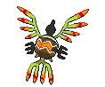

# #561 Sigilyph (Avianoid Pokémon)

| Official Artwork | Shiny Artwork |
| --- | --- |
|  |  |

**Blaze Black:** They never vary the route they fly, because their memories of guarding an ancient city remain steadfast.

**Volt White:** The guardians of an ancient city, they use their psychic power to attack enemies that invade their territory.

---

## Media

### Default Sprites

| Front | Back | Front Shiny | Back Shiny |
| --- | --- | --- | --- |
|  |  |  |  |

### Cries

Latest (Gen VI+):

<audio controls>
<source src='../../assets/cries/sigilyph/latest.ogg' type='audio/ogg'>
  Your browser does not support the audio element.
</audio>

Legacy:

<audio controls>
<source src='../../assets/cries/sigilyph/legacy.ogg' type='audio/ogg'>
  Your browser does not support the audio element.
</audio>

---

## Pokédex Data

| National № | Type(s) | Height | Weight | Abilities | Local № |
|------------|---------|--------|--------|-----------|---------|
| #561 | {: width='48'} {: width='48'} | 1.4 m / 4.6 ft | 14.0 kg / 30.9 lbs | Tinted Lens Magic Guard | #67 |

---

## Base Stats
|   | HP | Attack | Defense | Sp. Atk | Sp. Def | Speed |
|---|----|--------|---------|---------|---------|-------|
| **Base** | 72 | 58 | 80 | 108 | 80 | 102 |
| **Min** | 254 | 108 | 148 | 198 | 148 | 188 |
| **Max** | 348 | 236 | 284 | 346 | 284 | 333 |

The ranges shown above are for a level 100 Pokémon. Maximum values are based on a beneficial nature, 252 EVs, 31 IVs; minimum values are based on a hindering nature, 0 EVs, 0 IVs.

---

## Forms & Evolutions

!!! warning "WARNING"

    Information on evolutions may not be 100% accurate; differences between evolution methods across generations are not accounted for.

### Forms

Sigilyph has no alternate forms.

### Evolution Line

1. [Sigilyph](sigilyph.md/)

---

## Training

| EV Yield | Catch Rate | Base Friendship | Base Exp. | Growth Rate | Held Items |
|----------|------------|-----------------|-----------|-------------|------------|
| 2 Special Attack | 45 | 50 | 172 | Medium | N/A |

---

## Breeding

| Egg Groups | Egg Cycles | Gender | Dimorphic | Color | Shape |
|------------|------------|--------|-----------|-------|-------|
| 1. Flying | 20 | 50.0% Male 50.0% Female | False | Black | Wings |

---

## Moves

!!! warning "WARNING"

    Specific move information may be incorrect. However, the general movepool should be accurate; this includes changes made in Blaze Black and Volt White.

### Level Up Moves

| Lv. | Move | Type | Cat. | Power | Acc. | PP |
| --- | --- | --- | --- | --- | --- | --- |
| 1 | Gust | {: width='48'} | {: width='36'} | 40 | 100 | 35 |
| 1 | Miracle Eye | {: width='48'} | {: width='36'} | — | — | 40 |
| 4 | Hypnosis | {: width='48'} | {: width='36'} | — | 60 | 20 |
| 8 | Psywave | {: width='48'} | {: width='36'} | — | 100 | 15 |
| 11 | Tailwind | {: width='48'} | {: width='36'} | — | — | 15 |
| 14 | Whirlwind | {: width='48'} | {: width='36'} | — | — | 20 |
| 18 | Psybeam | {: width='48'} | {: width='36'} | 65 | 100 | 20 |
| 21 | Air Cutter | {: width='48'} | {: width='36'} | 60 | 95 | 25 |
| 24 | Light Screen | {: width='48'} | {: width='36'} | — | — | 30 |
| 26 | Roost | {: width='48'} | {: width='36'} | — | — | 5 |
| 28 | Reflect | {: width='48'} | {: width='36'} | — | — | 20 |
| 31 | Synchronoise | {: width='48'} | {: width='36'} | 120 | 100 | 10 |
| 34 | Mirror Move | {: width='48'} | {: width='36'} | — | — | 20 |
| 36 | Psycho Shift | {: width='48'} | {: width='36'} | — | 100 | 10 |
| 38 | Gravity | {: width='48'} | {: width='36'} | — | — | 5 |
| 41 | Air Slash | {: width='48'} | {: width='36'} | 75 | 95 | 15 |
| 44 | Psychic | {: width='48'} | {: width='36'} | 90 | 100 | 10 |
| 48 | Cosmic Power | {: width='48'} | {: width='36'} | — | — | 20 |
| 51 | Sky Attack | {: width='48'} | {: width='36'} | 140 | 90 | 5 |
| 54 | Stored Power | {: width='48'} | {: width='36'} | 20 | 100 | 10 |
| 57 | Hurricane | {: width='48'} | {: width='36'} | 110 | 70 | 10 |

### TM Moves

| TM | Move | Type | Cat. | Power | Acc. | PP |
| --- | --- | --- | --- | --- | --- | --- |
| HM02 | Fly | {: width='48'} | {: width='36'} | 100 | 100% | 15 |
| TM03 | Psyshock | {: width='48'} | {: width='36'} | 80 | 100 | 10 |
| TM04 | Calm Mind | {: width='48'} | {: width='36'} | — | — | 20 |
| TM06 | Toxic | {: width='48'} | {: width='36'} | — | 90 | 10 |
| TM10 | Hidden Power | {: width='48'} | {: width='36'} | 60 | 100 | 15 |
| TM13 | Ice Beam | {: width='48'} | {: width='36'} | 90 | 100 | 10 |
| TM15 | Hyper Beam | {: width='48'} | {: width='36'} | 150 | 90 | 5 |
| TM16 | Light Screen | {: width='48'} | {: width='36'} | — | — | 30 |
| TM17 | Protect | {: width='48'} | {: width='36'} | — | — | 10 |
| TM18 | Rain Dance | {: width='48'} | {: width='36'} | — | — | 5 |
| TM19 | Telekinesis | {: width='48'} | {: width='36'} | — | — | 15 |
| TM20 | Safeguard | {: width='48'} | {: width='36'} | — | — | 25 |
| TM21 | Frustration | {: width='48'} | {: width='36'} | — | 100 | 20 |
| TM22 | Solar Beam | {: width='48'} | {: width='36'} | 120 | 100 | 10 |
| TM23 | Smack Down | {: width='48'} | {: width='36'} | 50 | 100 | 15 |
| TM27 | Return | {: width='48'} | {: width='36'} | — | 100 | 20 |
| TM29 | Psychic | {: width='48'} | {: width='36'} | 90 | 100 | 10 |
| TM30 | Shadow Ball | {: width='48'} | {: width='36'} | 90 | 100 | 15 |
| TM32 | Double Team | {: width='48'} | {: width='36'} | — | — | 15 |
| TM33 | Reflect | {: width='48'} | {: width='36'} | — | — | 20 |
| TM40 | Aerial Ace | {: width='48'} | {: width='36'} | 60 | — | 20 |
| TM42 | Facade | {: width='48'} | {: width='36'} | 70 | 100 | 20 |
| TM44 | Rest | {: width='48'} | {: width='36'} | — | — | 5 |
| TM45 | Attract | {: width='48'} | {: width='36'} | — | 100 | 15 |
| TM46 | Thief | {: width='48'} | {: width='36'} | 60 | 100 | 25 |
| TM48 | Round | {: width='48'} | {: width='36'} | 60 | 100 | 15 |
| TM53 | Energy Ball | {: width='48'} | {: width='36'} | 90 | 100 | 10 |
| TM57 | Charge Beam | {: width='48'} | {: width='36'} | 50 | 90 | 10 |
| TM70 | Flash | {: width='48'} | {: width='36'} | — | 100 | 20 |
| TM73 | Thunder Wave | {: width='48'} | {: width='36'} | — | 90 | 20 |
| TM77 | Psych Up | {: width='48'} | {: width='36'} | — | — | 10 |
| TM85 | Dream Eater | {: width='48'} | {: width='36'} | 100 | 100 | 15 |
| TM87 | Swagger | {: width='48'} | {: width='36'} | — | 85 | 15 |
| TM88 | Pluck | {: width='48'} | {: width='36'} | 60 | 100 | 20 |
| TM90 | Substitute | {: width='48'} | {: width='36'} | — | — | 10 |
| TM91 | Flash Cannon | {: width='48'} | {: width='36'} | 80 | 100 | 10 |
| TM92 | Trick Room | {: width='48'} | {: width='36'} | — | — | 5 |

### Egg Moves

| Move | Type | Cat. | Power | Acc. | PP |
| --- | --- | --- | --- | --- | --- |
| Steel Wing | {: width='48'} | {: width='36'} | 70 | 90 | 25 |
| Ancient Power | {: width='48'} | {: width='36'} | 60 | 100 | 5 |
| Skill Swap | {: width='48'} | {: width='36'} | — | — | 10 |
| Roost | {: width='48'} | {: width='36'} | — | — | 5 |
| Psycho Shift | {: width='48'} | {: width='36'} | — | 100 | 10 |
| Stored Power | {: width='48'} | {: width='36'} | 20 | 100 | 10 |

### Tutor Moves

Sigilyph cannot learn any moves from tutors.
