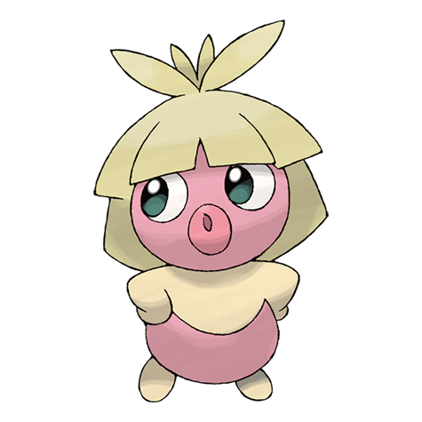

# #238 Smoochum (Kiss Pokémon)

| Official Artwork | Shiny Artwork |
| --- | --- |
|  |  |

It tests everything by touching with its lips, which remember what it likes and dislikes.

---

## Media

### Default Sprites

| Front | Back | Front Shiny | Back Shiny |
| --- | --- | --- | --- |
|  |  |  |  |

### Cries

Latest (Gen VI+):

<audio controls>
<source src='../../assets/cries/smoochum/latest.ogg' type='audio/ogg'>
  Your browser does not support the audio element.
</audio>

Legacy:

<audio controls>
<source src='../../assets/cries/smoochum/legacy.ogg' type='audio/ogg'>
  Your browser does not support the audio element.
</audio>

---

## Pokédex Data

| National № | Type(s) | Height | Weight | Abilities | Local № |
|------------|---------|--------|--------|-----------|---------|
| #238 | {: width='48'} {: width='48'} | 0.4 m | 6.0 kg | 1. Trace 2. Hydration | N/A |

---

## Base Stats
|   | HP | Attack | Defense | Sp. Atk | Sp. Def | Speed |
|---|----|--------|---------|---------|---------|-------|
| **Base** | 45 | 30 | 15 | 95 | 65 | 65 |
| **Min** | 200 | 58 | 31 | 175 | 121 | 121 |
| **Max** | 294 | 174 | 141 | 317 | 251 | 251 |

The ranges shown above are for a level 100 Pokémon. Maximum values are based on a beneficial nature, 252 EVs, 31 IVs; minimum values are based on a hindering nature, 0 EVs, 0 IVs.

---

## Forms & Evolutions

!!! warning "WARNING"

    Information on evolutions may not be 100% accurate; differences between evolution methods across generations are not accounted for.

### Forms

Smoochum has no alternate forms.

### Evolution Line

1. [Smoochum](smoochum.md/)
    1. Level Up: [Jynx](jynx.md/)

---

## Training

| EV Yield | Catch Rate | Base Friendship | Base Exp. | Growth Rate | Held Items |
|----------|------------|-----------------|-----------|-------------|------------|
| 1 Special Attack | 45 | 50 | 61 | Medium | aspear-berry (100%) |

---

## Breeding

| Egg Groups | Egg Cycles | Gender | Dimorphic | Color | Shape |
|------------|------------|--------|-----------|-------|-------|
| 1. No-Eggs | 25 | 0.0% Male 100.0% Female | False | Pink | Humanoid |

---

## Moves

!!! warning "WARNING"

    Specific move information may be incorrect. However, the general movepool should be accurate; this includes changes made in Blaze Black and Volt White.

### Level Up Moves

| Lv. | Move | Type | Cat. | Power | Acc. | PP |
| --- | --- | --- | --- | --- | --- | --- |
| 1 | Petal Dance | {: width='48'} | {: width='36'} | 120 | 100 | 10 |
| 1 | Pound | {: width='48'} | {: width='36'} | 40 | 100 | 35 |
| 5 | Lick | {: width='48'} | {: width='36'} | 30 | 100 | 30 |
| 8 | Sweet Kiss | {: width='48'} | {: width='36'} | — | 75 | 10 |
| 11 | Powder Snow | {: width='48'} | {: width='36'} | 40 | 100 | 25 |
| 15 | Confusion | {: width='48'} | {: width='36'} | 50 | 100 | 25 |
| 18 | Sing | {: width='48'} | {: width='36'} | — | 55 | 15 |
| 21 | Heart Stamp | {: width='48'} | {: width='36'} | 60 | 100 | 25 |
| 25 | Mean Look | {: width='48'} | {: width='36'} | — | — | 5 |
| 28 | Fake Tears | {: width='48'} | {: width='36'} | — | 100 | 20 |
| 30 | Metronome | {: width='48'} | {: width='36'} | — | — | 10 |
| 31 | Lucky Chant | {: width='48'} | {: width='36'} | — | — | 30 |
| 35 | Avalanche | {: width='48'} | {: width='36'} | 60 | 100 | 10 |
| 38 | Psychic | {: width='48'} | {: width='36'} | 90 | 100 | 10 |
| 41 | Copycat | {: width='48'} | {: width='36'} | — | — | 20 |
| 45 | Perish Song | {: width='48'} | {: width='36'} | — | — | 5 |
| 48 | Blizzard | {: width='48'} | {: width='36'} | 110 | 70 | 5 |
| 51 | Nasty Plot | {: width='48'} | {: width='36'} | — | — | 20 |

### TM Moves

| TM | Move | Type | Cat. | Power | Acc. | PP |
| --- | --- | --- | --- | --- | --- | --- |
| TM03 | Psyshock | {: width='48'} | {: width='36'} | 80 | 100 | 10 |
| TM04 | Calm Mind | {: width='48'} | {: width='36'} | — | — | 20 |
| TM06 | Toxic | {: width='48'} | {: width='36'} | — | 90 | 10 |
| TM07 | Hail | {: width='48'} | {: width='36'} | — | — | 10 |
| TM10 | Hidden Power | {: width='48'} | {: width='36'} | 60 | 100 | 15 |
| TM13 | Ice Beam | {: width='48'} | {: width='36'} | 90 | 100 | 10 |
| TM14 | Blizzard | {: width='48'} | {: width='36'} | 110 | 70 | 5 |
| TM16 | Light Screen | {: width='48'} | {: width='36'} | — | — | 30 |
| TM17 | Protect | {: width='48'} | {: width='36'} | — | — | 10 |
| TM18 | Rain Dance | {: width='48'} | {: width='36'} | — | — | 5 |
| TM21 | Frustration | {: width='48'} | {: width='36'} | — | 100 | 20 |
| TM27 | Return | {: width='48'} | {: width='36'} | — | 100 | 20 |
| TM29 | Psychic | {: width='48'} | {: width='36'} | 90 | 100 | 10 |
| TM30 | Shadow Ball | {: width='48'} | {: width='36'} | 90 | 100 | 15 |
| TM32 | Double Team | {: width='48'} | {: width='36'} | — | — | 15 |
| TM33 | Reflect | {: width='48'} | {: width='36'} | — | — | 20 |
| TM42 | Facade | {: width='48'} | {: width='36'} | 70 | 100 | 20 |
| TM44 | Rest | {: width='48'} | {: width='36'} | — | — | 5 |
| TM45 | Attract | {: width='48'} | {: width='36'} | — | 100 | 15 |
| TM46 | Thief | {: width='48'} | {: width='36'} | 60 | 100 | 25 |
| TM48 | Round | {: width='48'} | {: width='36'} | 60 | 100 | 15 |
| TM49 | Echoed Voice | {: width='48'} | {: width='36'} | 40 | 100 | 15 |
| TM56 | Fling | {: width='48'} | {: width='36'} | — | 100 | 10 |
| TM66 | Payback | {: width='48'} | {: width='36'} | 50 | 100 | 10 |
| TM70 | Flash | {: width='48'} | {: width='36'} | — | 100 | 20 |
| TM77 | Psych Up | {: width='48'} | {: width='36'} | — | — | 10 |
| TM79 | Frost Breath | {: width='48'} | {: width='36'} | 60 | 90 | 10 |
| TM85 | Dream Eater | {: width='48'} | {: width='36'} | 100 | 100 | 15 |
| TM86 | Grass Knot | {: width='48'} | {: width='36'} | — | 100 | 20 |
| TM87 | Swagger | {: width='48'} | {: width='36'} | — | 85 | 15 |
| TM90 | Substitute | {: width='48'} | {: width='36'} | — | — | 10 |
| TM92 | Trick Room | {: width='48'} | {: width='36'} | — | — | 5 |

### Egg Moves

| Move | Type | Cat. | Power | Acc. | PP |
| --- | --- | --- | --- | --- | --- |
| Ice Punch | {: width='48'} | {: width='36'} | 80 | 100 | 15 |
| Meditate | {: width='48'} | {: width='36'} | — | — | 40 |
| Fake Out | {: width='48'} | {: width='36'} | 40 | 100 | 10 |
| Wish | {: width='48'} | {: width='36'} | — | — | 10 |
| Miracle Eye | {: width='48'} | {: width='36'} | — | — | 40 |
| Wake Up Slap | {: width='48'} | {: width='36'} | 70 | 100 | 10 |
| Nasty Plot | {: width='48'} | {: width='36'} | — | — | 20 |
| Captivate | {: width='48'} | {: width='36'} | — | 100 | 20 |

### Tutor Moves

Smoochum cannot learn any moves from tutors.
