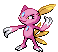
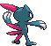
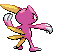
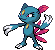
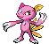
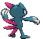
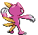

# #215 Sneasel (Sharp Claw Pokémon)

| Official Artwork | Shiny Artwork |
|------------------|---------------|
|  |  |

A smart and sneaky Pokémon. A pair may work together to steal eggs by having one lure the parents away.

---

## Media

### Default Sprites

| Front | Shiny | Back | Shiny |
|-------|-------|------|-------|
|  |  |  |  |

### Female Sprites

| Front | Shiny | Back | Shiny |
|-------|-------|------|-------|
|  |  |  |  |

### Cries

Latest (Gen VI+):

<audio controls>
<source src='../../assets/cries/sneasel/latest.ogg' type='audio/ogg'>
  Your browser does not support the audio element.
</audio>

Legacy:

<audio controls>
<source src='../../assets/cries/sneasel/legacy.ogg' type='audio/ogg'>
  Your browser does not support the audio element.
</audio>

---

## Pokédex Data

| National № | Type(s) | Height | Weight | Abilities | Local № |
|------------|---------|--------|--------|-----------|---------|
| #215 | {: width="48"} {: width="48"} | 0.9 m / 3.0 ft | 28.0 kg / 61.7 lbs | 1. Pickpocket 2. Technician | #144 |

---

## Base Stats
|   | HP | Attack | Defense | Sp. Atk | Sp. Def | Speed |
|---|----|--------|---------|---------|---------|-------|
| **Base** | 55 | 95 | 55 | 35 | 75 | 115 |
| **Min** | 220 | 175 | 103 | 67 | 139 | 211 |
| **Max** | 314 | 317 | 229 | 185 | 273 | 361 |

The ranges shown above are for a level 100 Pokémon. Maximum values are based on a beneficial nature, 252 EVs, 31 IVs; minimum values are based on a hindering nature, 0 EVs, 0 IVs.

---

## Forms & Evolutions

!!! warning "WARNING"

    Information on evolutions may not be 100% accurate; differences between evolution methods across generations are not accounted for.

### Forms

Sneasel has no alternate forms.

### Evolution Line

1. [Sneasel](sneasel.md/)
    1. Level Up: [Weavile](weavile.md/)

---

## Training

| EV Yield | Catch Rate | Base Friendship | Base Exp. | Growth Rate | Held Items |
|----------|------------|-----------------|-----------|-------------|------------|
| 1 Spd | 60 | 35 | 86 | Medium Slow | Quick Claw (5%) Grip Claw (50%) |

---

## Breeding

| Egg Groups | Egg Cycles | Gender | Dimorphic | Color | Shape |
|------------|------------|--------|-----------|-------|-------|
| 1. Ground | 20 | 50.0% Male 50.0% Female | True | Black | Upright |

---

## Moves

!!! warning "WARNING"

    Specific move information may be incorrect. However, the general movepool should be accurate; this includes changes made in Blaze Black and Volt White.

### Level Up Moves

| Lv. | Move | Type | Cat. | Power | Acc. | PP |
| --- | --- | --- | --- | --- | --- | --- |
| 1 | Leer | {: width="48"} | {: width="36"} | — | 100 | 30 |
| 1 | Moonlight | {: width="48"} | {: width="36"} | — | — | 5 |
| 1 | Scratch | {: width="48"} | {: width="36"} | 40 | 100 | 35 |
| 1 | Taunt | {: width="48"} | {: width="36"} | — | 100 | 20 |
| 8 | Quick Attack | {: width="48"} | {: width="36"} | 40 | 100 | 30 |
| 10 | Screech | {: width="48"} | {: width="36"} | — | 85 | 40 |
| 14 | Feint Attack | {: width="48"} | {: width="36"} | 60 | — | 20 |
| 21 | Fury Swipes | {: width="48"} | {: width="36"} | 18 | 80 | 15 |
| 24 | Agility | {: width="48"} | {: width="36"} | — | — | 30 |
| 28 | Icy Wind | {: width="48"} | {: width="36"} | 55 | 95 | 15 |
| 32 | Ice Punch | {: width="48"} | {: width="36"} | 80 | 100 | 15 |
| 35 | Hone Claws | {: width="48"} | {: width="36"} | — | — | 15 |
| 38 | Slash | {: width="48"} | {: width="36"} | 70 | 100 | 20 |
| 42 | Beat Up | {: width="48"} | {: width="36"} | — | 100 | 10 |
| 49 | Metal Claw | {: width="48"} | {: width="36"} | 50 | 95 | 35 |
| 51 | Ice Shard | {: width="48"} | {: width="36"} | 40 | 100 | 30 |
| 56 | Crunch | {: width="48"} | {: width="36"} | 80 | 100 | 15 |

### TM Moves

| TM | Move | Type | Cat. | Power | Acc. | PP |
| --- | --- | --- | --- | --- | --- | --- |
| HM01 | Cut | {: width="48"} | {: width="36"} | 60 | 100% | 25 |
| HM03 | Surf | {: width="48"} | {: width="36"} | 90 | 100 | 15 |
| HM04 | Strength | {: width="48"} | {: width="36"} | 100 | 100 | 15 |
| TM01 | Hone Claws | {: width="48"} | {: width="36"} | — | — | 15 |
| TM04 | Calm Mind | {: width="48"} | {: width="36"} | — | — | 20 |
| TM06 | Toxic | {: width="48"} | {: width="36"} | — | 90 | 10 |
| TM07 | Hail | {: width="48"} | {: width="36"} | — | — | 10 |
| TM10 | Hidden Power | {: width="48"} | {: width="36"} | 60 | 100 | 15 |
| TM11 | Sunny Day | {: width="48"} | {: width="36"} | — | — | 5 |
| TM12 | Taunt | {: width="48"} | {: width="36"} | — | 100 | 20 |
| TM13 | Ice Beam | {: width="48"} | {: width="36"} | 90 | 100 | 10 |
| TM14 | Blizzard | {: width="48"} | {: width="36"} | 110 | 70 | 5 |
| TM17 | Protect | {: width="48"} | {: width="36"} | — | — | 10 |
| TM18 | Rain Dance | {: width="48"} | {: width="36"} | — | — | 5 |
| TM21 | Frustration | {: width="48"} | {: width="36"} | — | 100 | 20 |
| TM27 | Return | {: width="48"} | {: width="36"} | — | 100 | 20 |
| TM28 | Dig | {: width="48"} | {: width="36"} | 100 | 100 | 10 |
| TM30 | Shadow Ball | {: width="48"} | {: width="36"} | 90 | 100 | 15 |
| TM31 | Brick Break | {: width="48"} | {: width="36"} | 75 | 100 | 15 |
| TM32 | Double Team | {: width="48"} | {: width="36"} | — | — | 15 |
| TM33 | Reflect | {: width="48"} | {: width="36"} | — | — | 20 |
| TM40 | Aerial Ace | {: width="48"} | {: width="36"} | 60 | — | 20 |
| TM41 | Torment | {: width="48"} | {: width="36"} | — | 100 | 15 |
| TM42 | Facade | {: width="48"} | {: width="36"} | 70 | 100 | 20 |
| TM44 | Rest | {: width="48"} | {: width="36"} | — | — | 5 |
| TM45 | Attract | {: width="48"} | {: width="36"} | — | 100 | 15 |
| TM46 | Thief | {: width="48"} | {: width="36"} | 60 | 100 | 25 |
| TM47 | Low Sweep | {: width="48"} | {: width="36"} | 65 | 100 | 20 |
| TM48 | Round | {: width="48"} | {: width="36"} | 60 | 100 | 15 |
| TM54 | False Swipe | {: width="48"} | {: width="36"} | 40 | 100 | 40 |
| TM56 | Fling | {: width="48"} | {: width="36"} | — | 100 | 10 |
| TM63 | Embargo | {: width="48"} | {: width="36"} | — | 100 | 15 |
| TM65 | Shadow Claw | {: width="48"} | {: width="36"} | 80 | 100 | 15 |
| TM66 | Payback | {: width="48"} | {: width="36"} | 50 | 100 | 10 |
| TM67 | Retaliate | {: width="48"} | {: width="36"} | 70 | 100 | 5 |
| TM75 | Swords Dance | {: width="48"} | {: width="36"} | — | — | 20 |
| TM77 | Psych Up | {: width="48"} | {: width="36"} | — | — | 10 |
| TM79 | Frost Breath | {: width="48"} | {: width="36"} | 60 | 90 | 10 |
| TM81 | X Scissor | {: width="48"} | {: width="36"} | 80 | 100 | 15 |
| TM84 | Poison Jab | {: width="48"} | {: width="36"} | 80 | 100 | 20 |
| TM85 | Dream Eater | {: width="48"} | {: width="36"} | 100 | 100 | 15 |
| TM87 | Swagger | {: width="48"} | {: width="36"} | — | 85 | 15 |
| TM90 | Substitute | {: width="48"} | {: width="36"} | — | — | 10 |
| TM94 | Rock Smash | {: width="48"} | {: width="36"} | 60 | 100 | 15 |
| TM95 | Snarl | {: width="48"} | {: width="36"} | 60 | 95 | 15 |

### Egg Moves

| Move | Type | Cat. | Power | Acc. | PP |
| --- | --- | --- | --- | --- | --- |
| Ice Punch | {: width="48"} | {: width="36"} | 80 | 100 | 15 |
| Bite | {: width="48"} | {: width="36"} | 60 | 100 | 25 |
| Counter | {: width="48"} | {: width="36"} | — | 100 | 20 |
| Spite | {: width="48"} | {: width="36"} | — | 100 | 10 |
| Foresight | {: width="48"} | {: width="36"} | — | — | 40 |
| Pursuit | {: width="48"} | {: width="36"} | 40 | 100 | 20 |
| Fake Out | {: width="48"} | {: width="36"} | 40 | 100 | 10 |
| Assist | {: width="48"} | {: width="36"} | — | — | 20 |
| Crush Claw | {: width="48"} | {: width="36"} | 75 | 95 | 10 |
| Feint | {: width="48"} | {: width="36"} | 30 | 100 | 10 |
| Punishment | {: width="48"} | {: width="36"} | — | 100 | 5 |
| Avalanche | {: width="48"} | {: width="36"} | 60 | 100 | 10 |
| Ice Shard | {: width="48"} | {: width="36"} | 40 | 100 | 30 |
| Double Hit | {: width="48"} | {: width="36"} | 35 | 90 | 10 |

### Tutor Moves

Sneasel cannot learn any moves from tutors.
