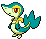
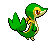

# #495 Snivy (Grass Snake Pokémon)

| Official Artwork | Shiny Artwork |
|------------------|---------------|
|  |  |

**Blaze Black:** It is very intelligent and calm. Being exposed to lots of sunlight makes its movements swifter.

**Volt White:** They photosynthesize by bathing their tails in sunlight. When they are not feeling well, their tails droop.

---

## Media

### Default Sprites

| Front | Shiny | Back | Shiny |
|-------|-------|------|-------|
|  |  |  |  |

### Cries

Latest (Gen VI+):

<audio controls>
<source src='../../assets/cries/snivy/latest.ogg' type='audio/ogg'>
  Your browser does not support the audio element.
</audio>

Legacy:

<audio controls>
<source src='../../assets/cries/snivy/legacy.ogg' type='audio/ogg'>
  Your browser does not support the audio element.
</audio>

---

## Pokédex Data

| National № | Type(s) | Height | Weight | Abilities | Local № |
|------------|---------|--------|--------|-----------|---------|
| #495 | {: width="48"} | 0.6 m / 2.0 ft | 8.1 kg / 17.9 lbs | 1. Overgrow 2. Contrary | N/A |

---

## Base Stats
|   | HP | Attack | Defense | Sp. Atk | Sp. Def | Speed |
|---|----|--------|---------|---------|---------|-------|
| **Base** | 45 | 45 | 55 | 45 | 55 | 63 |
| **Min** | 200 | 85 | 103 | 85 | 103 | 117 |
| **Max** | 294 | 207 | 229 | 207 | 229 | 247 |

The ranges shown above are for a level 100 Pokémon. Maximum values are based on a beneficial nature, 252 EVs, 31 IVs; minimum values are based on a hindering nature, 0 EVs, 0 IVs.

---

## Forms & Evolutions

!!! warning "WARNING"

    Information on evolutions may not be 100% accurate; differences between evolution methods across generations are not accounted for.

### Forms

Snivy has no alternate forms.

### Evolution Line

1. [Snivy](snivy.md/)
    1. Level Up: [Servine](servine.md/)
        1. Level Up: [Serperior](serperior.md/)

---

## Training

| EV Yield | Catch Rate | Base Friendship | Base Exp. | Growth Rate | Held Items |
|----------|------------|-----------------|-----------|-------------|------------|
| 1 Spd | 45 | 0 | 62 | Medium Slow | Miracle Seed (50%) |

---

## Breeding

| Egg Groups | Egg Cycles | Gender | Dimorphic | Color | Shape |
|------------|------------|--------|-----------|-------|-------|
| 1. Ground 2. Plant | 20 | 87.5% Male 12.5% Female | False | Green | Upright |

---

## Moves

!!! warning "WARNING"

    Specific move information may be incorrect. However, the general movepool should be accurate; this includes changes made in Blaze Black and Volt White.

### Level Up Moves

| Lv. | Move | Type | Cat. | Power | Acc. | PP |
| --- | --- | --- | --- | --- | --- | --- |
| 1 | Tackle | {: width="48"} | {: width="36"} | 40 | 100 | 35 |
| 4 | Leer | {: width="48"} | {: width="36"} | — | 100 | 30 |
| 7 | Vine Whip | {: width="48"} | {: width="36"} | 45 | 100 | 25 |
| 10 | Wrap | {: width="48"} | {: width="36"} | 15 | 90 | 20 |
| 13 | Growth | {: width="48"} | {: width="36"} | — | — | 20 |
| 16 | Leaf Tornado | {: width="48"} | {: width="36"} | 65 | 90 | 10 |
| 19 | Leech Seed | {: width="48"} | {: width="36"} | — | 90 | 10 |
| 22 | Mega Drain | {: width="48"} | {: width="36"} | 50 | 100 | 15 |
| 25 | Slam | {: width="48"} | {: width="36"} | 80 | 75 | 20 |
| 28 | Leaf Blade | {: width="48"} | {: width="36"} | 90 | 100 | 15 |
| 31 | Coil | {: width="48"} | {: width="36"} | — | — | 20 |
| 34 | Giga Drain | {: width="48"} | {: width="36"} | 75 | 100 | 10 |
| 37 | Wring Out | {: width="48"} | {: width="36"} | — | 100 | 5 |
| 40 | Gastro Acid | {: width="48"} | {: width="36"} | — | 100 | 10 |
| 43 | Leaf Storm | {: width="48"} | {: width="36"} | 130 | 90 | 5 |

### TM Moves

| TM | Move | Type | Cat. | Power | Acc. | PP |
| --- | --- | --- | --- | --- | --- | --- |
| HM01 | Cut | {: width="48"} | {: width="36"} | 60 | 100% | 25 |
| TM04 | Calm Mind | {: width="48"} | {: width="36"} | — | — | 20 |
| TM06 | Toxic | {: width="48"} | {: width="36"} | — | 90 | 10 |
| TM10 | Hidden Power | {: width="48"} | {: width="36"} | 60 | 100 | 15 |
| TM11 | Sunny Day | {: width="48"} | {: width="36"} | — | — | 5 |
| TM12 | Taunt | {: width="48"} | {: width="36"} | — | 100 | 20 |
| TM16 | Light Screen | {: width="48"} | {: width="36"} | — | — | 30 |
| TM17 | Protect | {: width="48"} | {: width="36"} | — | — | 10 |
| TM20 | Safeguard | {: width="48"} | {: width="36"} | — | — | 25 |
| TM21 | Frustration | {: width="48"} | {: width="36"} | — | 100 | 20 |
| TM22 | Solar Beam | {: width="48"} | {: width="36"} | 120 | 100 | 10 |
| TM27 | Return | {: width="48"} | {: width="36"} | — | 100 | 20 |
| TM32 | Double Team | {: width="48"} | {: width="36"} | — | — | 15 |
| TM33 | Reflect | {: width="48"} | {: width="36"} | — | — | 20 |
| TM40 | Aerial Ace | {: width="48"} | {: width="36"} | 60 | — | 20 |
| TM41 | Torment | {: width="48"} | {: width="36"} | — | 100 | 15 |
| TM42 | Facade | {: width="48"} | {: width="36"} | 70 | 100 | 20 |
| TM44 | Rest | {: width="48"} | {: width="36"} | — | — | 5 |
| TM45 | Attract | {: width="48"} | {: width="36"} | — | 100 | 15 |
| TM48 | Round | {: width="48"} | {: width="36"} | 60 | 100 | 15 |
| TM53 | Energy Ball | {: width="48"} | {: width="36"} | 90 | 100 | 10 |
| TM70 | Flash | {: width="48"} | {: width="36"} | — | 100 | 20 |
| TM75 | Swords Dance | {: width="48"} | {: width="36"} | — | — | 20 |
| TM86 | Grass Knot | {: width="48"} | {: width="36"} | — | 100 | 20 |
| TM87 | Swagger | {: width="48"} | {: width="36"} | — | 85 | 15 |
| TM90 | Substitute | {: width="48"} | {: width="36"} | — | — | 10 |

### Egg Moves

| Move | Type | Cat. | Power | Acc. | PP |
| --- | --- | --- | --- | --- | --- |
| Glare | {: width="48"} | {: width="36"} | — | 100 | 30 |
| Mean Look | {: width="48"} | {: width="36"} | — | — | 5 |
| Pursuit | {: width="48"} | {: width="36"} | 40 | 100 | 20 |
| Sweet Scent | {: width="48"} | {: width="36"} | — | 100 | 20 |
| Iron Tail | {: width="48"} | {: width="36"} | 100 | 75 | 15 |
| Hurricane | {: width="48"} | {: width="36"} | 110 | 70 | 10 |
| Mirror Coat | {: width="48"} | {: width="36"} | — | 100 | 20 |
| Magical Leaf | {: width="48"} | {: width="36"} | 60 | — | 20 |
| Natural Gift | {: width="48"} | {: width="36"} | — | 100 | 15 |
| Captivate | {: width="48"} | {: width="36"} | — | 100 | 20 |

### Tutor Moves

| Move | Type | Cat. | Power | Acc. | PP |
| --- | --- | --- | --- | --- | --- |
| Grass Pledge | {: width="48"} | {: width="36"} | 80 | 100 | 10 |

