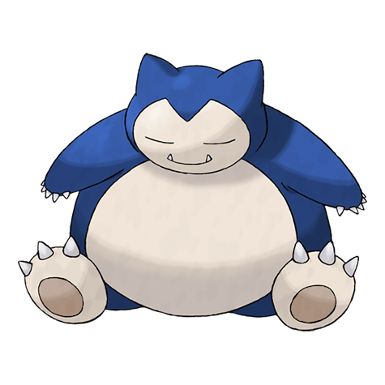

# #143 Snorlax (Sleeping Pokémon)

| Official Artwork | Shiny Artwork |
| --- | --- |
|  |  |

When its belly is full, it becomes too lethargic to even lift a finger, so it is safe to bounce on its belly.

---

## Media

### Sprites

| Front | Back | Front Shiny | Back Shiny |
| --- | --- | --- | --- |
|  |  |  |  |

### Cries

Latest (Gen VI+):

<audio controls>
<source src='../../assets/cries/snorlax/latest.ogg' type='audio/ogg'>
  Your browser does not support the audio element.
</audio>

Legacy:

<audio controls>
<source src='../../assets/cries/snorlax/legacy.ogg' type='audio/ogg'>
  Your browser does not support the audio element.
</audio>

---

## Pokédex Data

| National № | Type(s) | Height | Weight | Abilities | Local № |
|------------|---------|--------|--------|-----------|---------|
| #143 | {: width='48'} | 2.1 m | 460.0 kg | 1. Gluttony 2. Thick-Fat | N/A |

---

## Base Stats
|   | HP | Attack | Defense | Sp. Atk | Sp. Def | Speed |
|---|----|--------|---------|---------|---------|-------|
| **Base** | 160 | 110 | 65 | 65 | 110 | 30 |
| **Min** | 430 | 202 | 121 | 121 | 202 | 58 |
| **Max** | 524 | 350 | 251 | 251 | 350 | 174 |

The ranges shown above are for a level 100 Pokémon. Maximum values are based on a beneficial nature, 252 EVs, 31 IVs; minimum values are based on a hindering nature, 0 EVs, 0 IVs.

---

## Forms & Evolutions

!!! warning "WARNING"

    Information on evolutions may not be 100% accurate; differences between evolution methods across generations are not accounted for.

### Forms

Snorlax has no alternate forms.

### Evolution Line

1. [Munchlax](munchlax.md/)
    1. Level Up: [Snorlax](snorlax.md/)

### Evolution Changes

---

## Training

| EV Yield | Catch Rate | Base Friendship | Base Exp. | Growth Rate | Held Items |
|----------|------------|-----------------|-----------|-------------|------------|
| 2 Hp | 25 | 50 | 189 | Slow | Leftovers (100%) |

---

## Breeding

| Egg Groups | Egg Cycles | Gender | Dimorphic | Color | Shape |
|------------|------------|--------|-----------|-------|-------|
| 1. Monster | 40 | 87.5% Male 12.5% Female | False | Black | Humanoid |

---

## Moves

!!! warning "WARNING"

    Specific move information may be incorrect. However, the general movepool should be accurate; this includes changes made in Blaze Black and Volt White.

### Level Up Moves

| Lv. | Move | Type | Cat. | Power | Acc. | PP |
| --- | --- | --- | --- | --- | --- | --- |
| 1 | Gunk Shot | {: width='48'} | {: width='36'} | 120 | 80 | 5 |
| 1 | Seed Bomb | {: width='48'} | {: width='36'} | 80 | 100 | 15 |
| 1 | Tackle | {: width='48'} | {: width='36'} | 40 | 100 | 35 |
| 4 | Defense Curl | {: width='48'} | {: width='36'} | — | — | 40 |
| 9 | Amnesia | {: width='48'} | {: width='36'} | — | — | 20 |
| 12 | Lick | {: width='48'} | {: width='36'} | 30 | 100 | 30 |
| 17 | Belly Drum | {: width='48'} | {: width='36'} | — | — | 10 |
| 20 | Yawn | {: width='48'} | {: width='36'} | — | — | 10 |
| 25 | Chip Away | {: width='48'} | {: width='36'} | 70 | 100 | 20 |
| 28 | Rest | {: width='48'} | {: width='36'} | — | — | 5 |
| 28 | Snore | {: width='48'} | {: width='36'} | 50 | 100 | 15 |
| 33 | Sleep Talk | {: width='48'} | {: width='36'} | — | — | 10 |
| 36 | Body Slam | {: width='48'} | {: width='36'} | 85 | 100 | 15 |
| 41 | Block | {: width='48'} | {: width='36'} | — | — | 5 |
| 44 | Rollout | {: width='48'} | {: width='36'} | 30 | 90 | 20 |
| 49 | Crunch | {: width='48'} | {: width='36'} | 80 | 100 | 15 |
| 52 | Heavy Slam | {: width='48'} | {: width='36'} | — | 100 | 10 |
| 57 | Giga Impact | {: width='48'} | {: width='36'} | 150 | 90 | 5 |
| 62 | Slack Off | {: width='48'} | {: width='36'} | — | — | 5 |
| 67 | Double Edge | {: width='48'} | {: width='36'} | 120 | 100 | 15 |
| 72 | Self Destruct | {: width='48'} | {: width='36'} | 200 | 100 | 5 |

### TM Moves

| TM | Move | Type | Cat. | Power | Acc. | PP |
| --- | --- | --- | --- | --- | --- | --- |
| HM03 | Surf | {: width='48'} | {: width='36'} | 90 | 100 | 15 |
| HM04 | Strength | {: width='48'} | {: width='36'} | 85 | 100 | 15 |
| TM06 | Toxic | {: width='48'} | {: width='36'} | — | 90 | 10 |
| TM10 | Hidden Power | {: width='48'} | {: width='36'} | 60 | 100 | 15 |
| TM11 | Sunny Day | {: width='48'} | {: width='36'} | — | — | 5 |
| TM13 | Ice Beam | {: width='48'} | {: width='36'} | 90 | 100 | 10 |
| TM14 | Blizzard | {: width='48'} | {: width='36'} | 110 | 70 | 5 |
| TM15 | Hyper Beam | {: width='48'} | {: width='36'} | 150 | 90 | 5 |
| TM17 | Protect | {: width='48'} | {: width='36'} | — | — | 10 |
| TM18 | Rain Dance | {: width='48'} | {: width='36'} | — | — | 5 |
| TM21 | Frustration | {: width='48'} | {: width='36'} | — | 100 | 20 |
| TM22 | Solar Beam | {: width='48'} | {: width='36'} | 120 | 100 | 10 |
| TM23 | Smack Down | {: width='48'} | {: width='36'} | 50 | 100 | 15 |
| TM24 | Thunderbolt | {: width='48'} | {: width='36'} | 90 | 100 | 15 |
| TM25 | Thunder | {: width='48'} | {: width='36'} | 110 | 70 | 10 |
| TM26 | Earthquake | {: width='48'} | {: width='36'} | 100 | 100 | 10 |
| TM27 | Return | {: width='48'} | {: width='36'} | — | 100 | 20 |
| TM29 | Psychic | {: width='48'} | {: width='36'} | 90 | 100 | 10 |
| TM30 | Shadow Ball | {: width='48'} | {: width='36'} | 90 | 100 | 15 |
| TM31 | Brick Break | {: width='48'} | {: width='36'} | 75 | 100 | 15 |
| TM32 | Double Team | {: width='48'} | {: width='36'} | — | — | 15 |
| TM35 | Flamethrower | {: width='48'} | {: width='36'} | 90 | 100 | 15 |
| TM37 | Sandstorm | {: width='48'} | {: width='36'} | — | — | 10 |
| TM38 | Fire Blast | {: width='48'} | {: width='36'} | 110 | 85 | 5 |
| TM39 | Rock Tomb | {: width='48'} | {: width='36'} | 60 | 95 | 15 |
| TM42 | Facade | {: width='48'} | {: width='36'} | 70 | 100 | 20 |
| TM44 | Rest | {: width='48'} | {: width='36'} | — | — | 5 |
| TM45 | Attract | {: width='48'} | {: width='36'} | — | 100 | 15 |
| TM48 | Round | {: width='48'} | {: width='36'} | 60 | 100 | 15 |
| TM52 | Focus Blast | {: width='48'} | {: width='36'} | 120 | 70 | 5 |
| TM56 | Fling | {: width='48'} | {: width='36'} | — | 100 | 10 |
| TM59 | Incinerate | {: width='48'} | {: width='36'} | 50 | 100 | 15 |
| TM67 | Retaliate | {: width='48'} | {: width='36'} | 70 | 100 | 5 |
| TM68 | Giga Impact | {: width='48'} | {: width='36'} | 150 | 90 | 5 |
| TM78 | Bulldoze | {: width='48'} | {: width='36'} | 80 | 100 | 20 |
| TM80 | Rock Slide | {: width='48'} | {: width='36'} | 80 | 95 | 10 |
| TM83 | Work Up | {: width='48'} | {: width='36'} | — | — | 30 |
| TM87 | Swagger | {: width='48'} | {: width='36'} | — | 85 | 15 |
| TM90 | Substitute | {: width='48'} | {: width='36'} | — | — | 10 |
| TM93 | Wild Charge | {: width='48'} | {: width='36'} | 90 | 100 | 15 |
| TM94 | Rock Smash | {: width='48'} | {: width='36'} | 40 | 100 | 15 |

### Egg Moves

| Move | Type | Cat. | Power | Acc. | PP |
| --- | --- | --- | --- | --- | --- |
| Whirlwind | {: width='48'} | {: width='36'} | — | — | 20 |
| Counter | {: width='48'} | {: width='36'} | — | 100 | 20 |
| Fissure | {: width='48'} | {: width='36'} | — | 30 | 5 |
| Lick | {: width='48'} | {: width='36'} | 30 | 100 | 30 |
| Curse | {: width='48'} | {: width='36'} | — | — | 10 |
| Charm | {: width='48'} | {: width='36'} | — | 100 | 20 |
| Pursuit | {: width='48'} | {: width='36'} | 40 | 100 | 20 |
| Natural Gift | {: width='48'} | {: width='36'} | — | 100 | 15 |
| After You | {: width='48'} | {: width='36'} | — | — | 15 |

### Tutor Moves

Snorlax cannot learn any moves from tutors.
