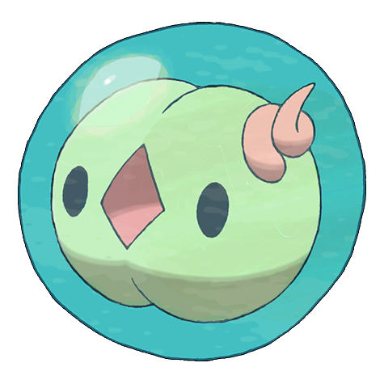

# #577 Solosis (Cell Pokémon)

| Official Artwork | Shiny Artwork |
| --- | --- |
|  |  |

**Blaze Black:** They drive away attackers by unleashing psychic power. They can use telepathy to talk with others.

**Volt White:** Because their bodies are enveloped in a special liquid, they can survive in any environment.

---

## Media

### Sprites

| Front | Back | Front Shiny | Back Shiny |
| --- | --- | --- | --- |
|  |  |  |  |

### Cries

Latest (Gen VI+):

<audio controls>
<source src='../../assets/cries/solosis/latest.ogg' type='audio/ogg'>
  Your browser does not support the audio element.
</audio>

Legacy:

<audio controls>
<source src='../../assets/cries/solosis/legacy.ogg' type='audio/ogg'>
  Your browser does not support the audio element.
</audio>

---

## Pokédex Data

| National № | Type(s) | Height | Weight | Abilities | Local № |
|------------|---------|--------|--------|-----------|---------|
| #577 | {: width='48'} | 0.3 m | 1.0 kg | 1. Regenerator 2. Magic-Guard | #83 |

---

## Base Stats
|   | HP | Attack | Defense | Sp. Atk | Sp. Def | Speed |
|---|----|--------|---------|---------|---------|-------|
| **Base** | 45 | 30 | 40 | 105 | 50 | 20 |
| **Min** | 200 | 58 | 76 | 193 | 94 | 40 |
| **Max** | 294 | 174 | 196 | 339 | 218 | 152 |

The ranges shown above are for a level 100 Pokémon. Maximum values are based on a beneficial nature, 252 EVs, 31 IVs; minimum values are based on a hindering nature, 0 EVs, 0 IVs.

---

## Forms & Evolutions

!!! warning "WARNING"

    Information on evolutions may not be 100% accurate; differences between evolution methods across generations are not accounted for.

### Forms

Solosis has no alternate forms.

### Evolution Line

1. [Solosis](solosis.md/)
    1. Level Up: [Duosion](duosion.md/)
        1. Level Up: [Reuniclus](reuniclus.md/)

---

## Training

| EV Yield | Catch Rate | Base Friendship | Base Exp. | Growth Rate | Held Items |
|----------|------------|-----------------|-----------|-------------|------------|
| 1 Special Attack | 200 | 50 | 58 | Medium-Slow |  |

---

## Breeding

| Egg Groups | Egg Cycles | Gender | Dimorphic | Color | Shape |
|------------|------------|--------|-----------|-------|-------|
| 1. Indeterminate | 20 | 50.0% Male 50.0% Female | False | Green | Ball |

---

## Moves

!!! warning "WARNING"

    Specific move information may be incorrect. However, the general movepool should be accurate; this includes changes made in Blaze Black and Volt White.

### Level Up Moves

| Lv. | Move | Type | Cat. | Power | Acc. | PP |
| --- | --- | --- | --- | --- | --- | --- |
| 1 | Psywave | {: width='48'} | {: width='36'} | — | 100 | 15 |
| 3 | Reflect | {: width='48'} | {: width='36'} | — | — | 20 |
| 7 | Rollout | {: width='48'} | {: width='36'} | 30 | 90 | 20 |
| 10 | Snatch | {: width='48'} | {: width='36'} | — | — | 10 |
| 14 | Hidden Power | {: width='48'} | {: width='36'} | 60 | 100 | 15 |
| 16 | Light Screen | {: width='48'} | {: width='36'} | — | — | 30 |
| 19 | Charm | {: width='48'} | {: width='36'} | — | 100 | 20 |
| 23 | Shock Wave | {: width='48'} | {: width='36'} | 70 | — | 20 |
| 24 | Recover | {: width='48'} | {: width='36'} | — | — | 5 |
| 25 | Psyshock | {: width='48'} | {: width='36'} | 80 | 100 | 10 |
| 28 | Endeavor | {: width='48'} | {: width='36'} | — | 100 | 5 |
| 31 | Future Sight | {: width='48'} | {: width='36'} | 120 | 100 | 10 |
| 32 | Confuse Ray | {: width='48'} | {: width='36'} | — | 100 | 10 |
| 33 | Pain Split | {: width='48'} | {: width='36'} | — | — | 20 |
| 37 | Psychic | {: width='48'} | {: width='36'} | 90 | 100 | 10 |
| 40 | Skill Swap | {: width='48'} | {: width='36'} | — | — | 10 |
| 43 | Magic Coat | {: width='48'} | {: width='36'} | — | — | 15 |
| 46 | Heal Block | {: width='48'} | {: width='36'} | — | 100 | 15 |
| 48 | Wonder Room | {: width='48'} | {: width='36'} | — | — | 10 |

### TM Moves

| TM | Move | Type | Cat. | Power | Acc. | PP |
| --- | --- | --- | --- | --- | --- | --- |
| TM03 | Psyshock | {: width='48'} | {: width='36'} | 80 | 100 | 10 |
| TM04 | Calm Mind | {: width='48'} | {: width='36'} | — | — | 20 |
| TM06 | Toxic | {: width='48'} | {: width='36'} | — | 90 | 10 |
| TM10 | Hidden Power | {: width='48'} | {: width='36'} | 60 | 100 | 15 |
| TM16 | Light Screen | {: width='48'} | {: width='36'} | — | — | 30 |
| TM17 | Protect | {: width='48'} | {: width='36'} | — | — | 10 |
| TM18 | Rain Dance | {: width='48'} | {: width='36'} | — | — | 5 |
| TM19 | Telekinesis | {: width='48'} | {: width='36'} | — | — | 15 |
| TM20 | Safeguard | {: width='48'} | {: width='36'} | — | — | 25 |
| TM21 | Frustration | {: width='48'} | {: width='36'} | — | 100 | 20 |
| TM25 | Thunder | {: width='48'} | {: width='36'} | 110 | 70 | 10 |
| TM27 | Return | {: width='48'} | {: width='36'} | — | 100 | 20 |
| TM29 | Psychic | {: width='48'} | {: width='36'} | 90 | 100 | 10 |
| TM30 | Shadow Ball | {: width='48'} | {: width='36'} | 90 | 100 | 15 |
| TM32 | Double Team | {: width='48'} | {: width='36'} | — | — | 15 |
| TM33 | Reflect | {: width='48'} | {: width='36'} | — | — | 20 |
| TM39 | Rock Tomb | {: width='48'} | {: width='36'} | 60 | 95 | 15 |
| TM42 | Facade | {: width='48'} | {: width='36'} | 70 | 100 | 20 |
| TM44 | Rest | {: width='48'} | {: width='36'} | — | — | 5 |
| TM45 | Attract | {: width='48'} | {: width='36'} | — | 100 | 15 |
| TM48 | Round | {: width='48'} | {: width='36'} | 60 | 100 | 15 |
| TM53 | Energy Ball | {: width='48'} | {: width='36'} | 90 | 100 | 10 |
| TM63 | Embargo | {: width='48'} | {: width='36'} | — | 100 | 15 |
| TM64 | Explosion | {: width='48'} | {: width='36'} | 250 | 100 | 5 |
| TM70 | Flash | {: width='48'} | {: width='36'} | — | 100 | 20 |
| TM73 | Thunder Wave | {: width='48'} | {: width='36'} | — | 90 | 20 |
| TM74 | Gyro Ball | {: width='48'} | {: width='36'} | — | 100 | 5 |
| TM77 | Psych Up | {: width='48'} | {: width='36'} | — | — | 10 |
| TM80 | Rock Slide | {: width='48'} | {: width='36'} | 80 | 95 | 10 |
| TM85 | Dream Eater | {: width='48'} | {: width='36'} | 100 | 100 | 15 |
| TM87 | Swagger | {: width='48'} | {: width='36'} | — | 85 | 15 |
| TM90 | Substitute | {: width='48'} | {: width='36'} | — | — | 10 |
| TM91 | Flash Cannon | {: width='48'} | {: width='36'} | 80 | 100 | 10 |
| TM92 | Trick Room | {: width='48'} | {: width='36'} | — | — | 5 |

### Egg Moves

| Move | Type | Cat. | Power | Acc. | PP |
| --- | --- | --- | --- | --- | --- |
| Night Shade | {: width='48'} | {: width='36'} | — | 100 | 15 |
| Acid Armor | {: width='48'} | {: width='36'} | — | — | 20 |
| Trick | {: width='48'} | {: width='36'} | — | 100 | 10 |
| Imprison | {: width='48'} | {: width='36'} | — | — | 10 |
| Secret Power | {: width='48'} | {: width='36'} | 70 | 100 | 20 |
| Astonish | {: width='48'} | {: width='36'} | 30 | 100 | 15 |

### Tutor Moves

Solosis cannot learn any moves from tutors.
