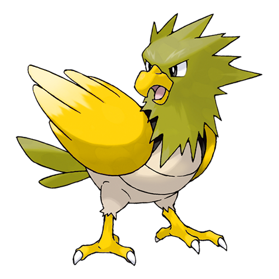
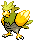
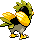

# #021 Spearow (Tiny Bird Pokémon)

| Official Artwork | Shiny Artwork |
|------------------|---------------|
|  |  |

It flaps its small wings busily to fly. Using its beak, it searches in grass for prey.

---

## Media

### Default Sprites

| Front | Shiny | Back | Shiny |
|-------|-------|------|-------|
|  |  |  |  |

### Cries

Latest (Gen VI+):

<audio controls>
<source src='../../assets/cries/spearow/latest.ogg' type='audio/ogg'>
  Your browser does not support the audio element.
</audio>

Legacy:

<audio controls>
<source src='../../assets/cries/spearow/legacy.ogg' type='audio/ogg'>
  Your browser does not support the audio element.
</audio>

---

## Pokédex Data

| National № | Type(s) | Height | Weight | Abilities | Local № |
|------------|---------|--------|--------|-----------|---------|
| #21 | {: width="48"} {: width="48"} | 0.3 m / 1.0 ft | 2.0 kg / 4.4 lbs | 1. Keen Eye 2. Sniper | N/A |

---

## Base Stats
|   | HP | Attack | Defense | Sp. Atk | Sp. Def | Speed |
|---|----|--------|---------|---------|---------|-------|
| **Base** | 40 | 60 | 30 | 31 | 31 | 70 |
| **Min** | 190 | 112 | 58 | 60 | 60 | 130 |
| **Max** | 284 | 240 | 174 | 177 | 177 | 262 |

The ranges shown above are for a level 100 Pokémon. Maximum values are based on a beneficial nature, 252 EVs, 31 IVs; minimum values are based on a hindering nature, 0 EVs, 0 IVs.

---

## Forms & Evolutions

!!! warning "WARNING"

    Information on evolutions may not be 100% accurate; differences between evolution methods across generations are not accounted for.

### Forms

Spearow has no alternate forms.

### Evolution Line

1. [Spearow](spearow.md/)
    1. Level Up: [Fearow](fearow.md/)

---

## Training

| EV Yield | Catch Rate | Base Friendship | Base Exp. | Growth Rate | Held Items |
|----------|------------|-----------------|-----------|-------------|------------|
| 1 Spd | 255 | 70 | 52 | Medium | Sharp Beak (5%) |

---

## Breeding

| Egg Groups | Egg Cycles | Gender | Dimorphic | Color | Shape |
|------------|------------|--------|-----------|-------|-------|
| 1. Flying | 15 | 50.0% Male 50.0% Female | False | Brown | Wings |

---

## Moves

!!! warning "WARNING"

    Specific move information may be incorrect. However, the general movepool should be accurate; this includes changes made in Blaze Black and Volt White.

### Level Up Moves

| Lv. | Move | Type | Cat. | Power | Acc. | PP |
| --- | --- | --- | --- | --- | --- | --- |
| 1 | Growl | {: width="48"} | {: width="36"} | — | 100 | 40 |
| 1 | Peck | {: width="48"} | {: width="36"} | 35 | 100 | 35 |
| 1 | Pursuit | {: width="48"} | {: width="36"} | 40 | 100 | 20 |
| 1 | Sonic Boom | {: width="48"} | {: width="36"} | — | 90 | 20 |
| 5 | Leer | {: width="48"} | {: width="36"} | — | 100 | 30 |
| 9 | Fury Attack | {: width="48"} | {: width="36"} | 15 | 85 | 20 |
| 13 | Steel Wing | {: width="48"} | {: width="36"} | 70 | 90 | 25 |
| 17 | Aerial Ace | {: width="48"} | {: width="36"} | 60 | — | 20 |
| 21 | Mirror Move | {: width="48"} | {: width="36"} | — | — | 20 |
| 25 | Agility | {: width="48"} | {: width="36"} | — | — | 30 |
| 29 | Assurance | {: width="48"} | {: width="36"} | 60 | 100 | 10 |
| 33 | Roost | {: width="48"} | {: width="36"} | — | — | 5 |
| 37 | Drill Peck | {: width="48"} | {: width="36"} | 80 | 100 | 20 |

### TM Moves

| TM | Move | Type | Cat. | Power | Acc. | PP |
| --- | --- | --- | --- | --- | --- | --- |
| HM02 | Fly | {: width="48"} | {: width="36"} | 100 | 100% | 15 |
| TM06 | Toxic | {: width="48"} | {: width="36"} | — | 90 | 10 |
| TM10 | Hidden Power | {: width="48"} | {: width="36"} | 60 | 100 | 15 |
| TM11 | Sunny Day | {: width="48"} | {: width="36"} | — | — | 5 |
| TM17 | Protect | {: width="48"} | {: width="36"} | — | — | 10 |
| TM18 | Rain Dance | {: width="48"} | {: width="36"} | — | — | 5 |
| TM21 | Frustration | {: width="48"} | {: width="36"} | — | 100 | 20 |
| TM27 | Return | {: width="48"} | {: width="36"} | — | 100 | 20 |
| TM32 | Double Team | {: width="48"} | {: width="36"} | — | — | 15 |
| TM40 | Aerial Ace | {: width="48"} | {: width="36"} | 60 | — | 20 |
| TM42 | Facade | {: width="48"} | {: width="36"} | 70 | 100 | 20 |
| TM44 | Rest | {: width="48"} | {: width="36"} | — | — | 5 |
| TM45 | Attract | {: width="48"} | {: width="36"} | — | 100 | 15 |
| TM46 | Thief | {: width="48"} | {: width="36"} | 60 | 100 | 25 |
| TM48 | Round | {: width="48"} | {: width="36"} | 60 | 100 | 15 |
| TM49 | Echoed Voice | {: width="48"} | {: width="36"} | 40 | 100 | 15 |
| TM54 | False Swipe | {: width="48"} | {: width="36"} | 40 | 100 | 40 |
| TM83 | Work Up | {: width="48"} | {: width="36"} | — | — | 30 |
| TM87 | Swagger | {: width="48"} | {: width="36"} | — | 85 | 15 |
| TM88 | Pluck | {: width="48"} | {: width="36"} | 60 | 100 | 20 |
| TM89 | U Turn | {: width="48"} | {: width="36"} | 70 | 100 | 20 |
| TM90 | Substitute | {: width="48"} | {: width="36"} | — | — | 10 |

### Egg Moves

| Move | Type | Cat. | Power | Acc. | PP |
| --- | --- | --- | --- | --- | --- |
| Razor Wind | {: width="48"} | {: width="36"} | 80 | 100 | 10 |
| Whirlwind | {: width="48"} | {: width="36"} | — | — | 20 |
| Quick Attack | {: width="48"} | {: width="36"} | 40 | 100 | 30 |
| Sky Attack | {: width="48"} | {: width="36"} | 140 | 90 | 5 |
| Tri Attack | {: width="48"} | {: width="36"} | 80 | 100 | 10 |
| Scary Face | {: width="48"} | {: width="36"} | — | 100 | 10 |
| Feint Attack | {: width="48"} | {: width="36"} | 60 | — | 20 |
| Steel Wing | {: width="48"} | {: width="36"} | 70 | 90 | 25 |
| Uproar | {: width="48"} | {: width="36"} | 90 | 100 | 10 |
| Feather Dance | {: width="48"} | {: width="36"} | — | 100 | 15 |
| Astonish | {: width="48"} | {: width="36"} | 30 | 100 | 15 |

### Tutor Moves

Spearow cannot learn any moves from tutors.
