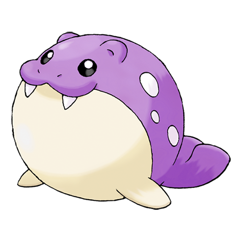

# #363 Spheal (Clap Pokémon)

| Official Artwork | Shiny Artwork |
|------------------|---------------|
|  |  |

It rolls across ice floes to reach shore because its body is poorly shaped for swimming.

---

## Media

### Default Sprites

| Front | Shiny | Back | Shiny |
|-------|-------|------|-------|
|  |  |  |  |

### Cries

Latest (Gen VI+):

<audio controls>
<source src='../../assets/cries/spheal/latest.ogg' type='audio/ogg'>
  Your browser does not support the audio element.
</audio>

Legacy:

<audio controls>
<source src='../../assets/cries/spheal/legacy.ogg' type='audio/ogg'>
  Your browser does not support the audio element.
</audio>

---

## Pokédex Data

| National № | Type(s) | Height | Weight | Abilities | Local № |
|------------|---------|--------|--------|-----------|---------|
| #363 | {: width="48"} {: width="48"} | 0.8 m / 2.6 ft | 39.5 kg / 87.1 lbs | 1. Thick Fat 2. Ice Body | N/A |

---

## Base Stats
|   | HP | Attack | Defense | Sp. Atk | Sp. Def | Speed |
|---|----|--------|---------|---------|---------|-------|
| **Base** | 70 | 40 | 50 | 55 | 50 | 25 |
| **Min** | 250 | 76 | 94 | 103 | 94 | 49 |
| **Max** | 344 | 196 | 218 | 229 | 218 | 163 |

The ranges shown above are for a level 100 Pokémon. Maximum values are based on a beneficial nature, 252 EVs, 31 IVs; minimum values are based on a hindering nature, 0 EVs, 0 IVs.

---

## Forms & Evolutions

!!! warning "WARNING"

    Information on evolutions may not be 100% accurate; differences between evolution methods across generations are not accounted for.

### Forms

Spheal has no alternate forms.

### Evolution Line

1. [Spheal](spheal.md/)
    1. Level Up: [Sealeo](sealeo.md/)
        1. Level Up: [Walrein](walrein.md/)

---

## Training

| EV Yield | Catch Rate | Base Friendship | Base Exp. | Growth Rate | Held Items |
|----------|------------|-----------------|-----------|-------------|------------|
| 1 HP | 255 | 50 | 58 | Medium Slow | N/A |

---

## Breeding

| Egg Groups | Egg Cycles | Gender | Dimorphic | Color | Shape |
|------------|------------|--------|-----------|-------|-------|
| 1. Water1 2. Ground | 20 | 50.0% Male 50.0% Female | False | Blue | Fish |

---

## Moves

!!! warning "WARNING"

    Specific move information may be incorrect. However, the general movepool should be accurate; this includes changes made in Blaze Black and Volt White.

### Level Up Moves

| Lv. | Move | Type | Cat. | Power | Acc. | PP |
| --- | --- | --- | --- | --- | --- | --- |
| 1 | Defense Curl | {: width="48"} | {: width="36"} | — | — | 40 |
| 1 | Growl | {: width="48"} | {: width="36"} | — | 100 | 40 |
| 1 | Powder Snow | {: width="48"} | {: width="36"} | 40 | 100 | 25 |
| 1 | Water Gun | {: width="48"} | {: width="36"} | 40 | 100 | 25 |
| 7 | Encore | {: width="48"} | {: width="36"} | — | 100 | 5 |
| 13 | Ice Ball | {: width="48"} | {: width="36"} | 30 | 90 | 20 |
| 19 | Body Slam | {: width="48"} | {: width="36"} | 85 | 100 | 15 |
| 25 | Aurora Beam | {: width="48"} | {: width="36"} | 75 | 100 | 15 |
| 31 | Hail | {: width="48"} | {: width="36"} | — | — | 10 |
| 37 | Rest | {: width="48"} | {: width="36"} | — | — | 5 |
| 37 | Snore | {: width="48"} | {: width="36"} | 50 | 100 | 15 |
| 43 | Blizzard | {: width="48"} | {: width="36"} | 110 | 70 | 5 |
| 49 | Sheer Cold | {: width="48"} | {: width="36"} | — | 30 | 5 |

### TM Moves

| TM | Move | Type | Cat. | Power | Acc. | PP |
| --- | --- | --- | --- | --- | --- | --- |
| HM03 | Surf | {: width="48"} | {: width="36"} | 90 | 100 | 15 |
| HM04 | Strength | {: width="48"} | {: width="36"} | 100 | 100 | 15 |
| HM05 | Waterfall | {: width="48"} | {: width="36"} | 85 | 100 | 15 |
| HM06 | Dive | {: width="48"} | {: width="36"} | 80 | 100 | 10 |
| TM06 | Toxic | {: width="48"} | {: width="36"} | — | 90 | 10 |
| TM07 | Hail | {: width="48"} | {: width="36"} | — | — | 10 |
| TM10 | Hidden Power | {: width="48"} | {: width="36"} | 60 | 100 | 15 |
| TM13 | Ice Beam | {: width="48"} | {: width="36"} | 90 | 100 | 10 |
| TM14 | Blizzard | {: width="48"} | {: width="36"} | 110 | 70 | 5 |
| TM17 | Protect | {: width="48"} | {: width="36"} | — | — | 10 |
| TM18 | Rain Dance | {: width="48"} | {: width="36"} | — | — | 5 |
| TM21 | Frustration | {: width="48"} | {: width="36"} | — | 100 | 20 |
| TM26 | Earthquake | {: width="48"} | {: width="36"} | 100 | 100 | 10 |
| TM27 | Return | {: width="48"} | {: width="36"} | — | 100 | 20 |
| TM32 | Double Team | {: width="48"} | {: width="36"} | — | — | 15 |
| TM39 | Rock Tomb | {: width="48"} | {: width="36"} | 60 | 95 | 15 |
| TM42 | Facade | {: width="48"} | {: width="36"} | 70 | 100 | 20 |
| TM44 | Rest | {: width="48"} | {: width="36"} | — | — | 5 |
| TM45 | Attract | {: width="48"} | {: width="36"} | — | 100 | 15 |
| TM48 | Round | {: width="48"} | {: width="36"} | 60 | 100 | 15 |
| TM49 | Echoed Voice | {: width="48"} | {: width="36"} | 40 | 100 | 15 |
| TM78 | Bulldoze | {: width="48"} | {: width="36"} | 80 | 100 | 20 |
| TM79 | Frost Breath | {: width="48"} | {: width="36"} | 60 | 90 | 10 |
| TM80 | Rock Slide | {: width="48"} | {: width="36"} | 75 | 90 | 10 |
| TM87 | Swagger | {: width="48"} | {: width="36"} | — | 85 | 15 |
| TM90 | Substitute | {: width="48"} | {: width="36"} | — | — | 10 |
| TM94 | Rock Smash | {: width="48"} | {: width="36"} | 60 | 100 | 15 |

### Egg Moves

| Move | Type | Cat. | Power | Acc. | PP |
| --- | --- | --- | --- | --- | --- |
| Fissure | {: width="48"} | {: width="36"} | — | 30 | 5 |
| Curse | {: width="48"} | {: width="36"} | — | — | 10 |
| Rollout | {: width="48"} | {: width="36"} | 30 | 90 | 20 |
| Sleep Talk | {: width="48"} | {: width="36"} | — | — | 10 |
| Stockpile | {: width="48"} | {: width="36"} | — | — | 20 |
| Spit Up | {: width="48"} | {: width="36"} | — | 100 | 10 |
| Swallow | {: width="48"} | {: width="36"} | — | — | 10 |
| Yawn | {: width="48"} | {: width="36"} | — | — | 10 |
| Signal Beam | {: width="48"} | {: width="36"} | 75 | 100 | 15 |
| Water Sport | {: width="48"} | {: width="36"} | — | — | 15 |
| Water Pulse | {: width="48"} | {: width="36"} | 60 | 100 | 20 |
| Aqua Ring | {: width="48"} | {: width="36"} | — | — | 20 |

### Tutor Moves

Spheal cannot learn any moves from tutors.
