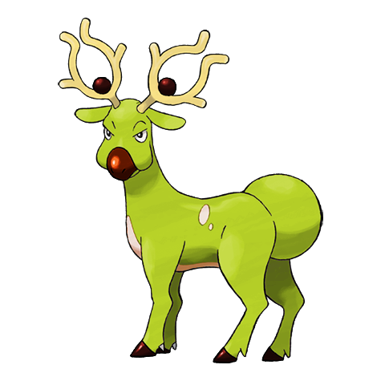

# #234 Stantler (Big Horn Pokémon)

| Official Artwork | Shiny Artwork |
| --- | --- |
|  |  |

Staring at its antlers creates an odd sensation as if one were being drawn into their centers.

---

## Media

### Sprites

| Front | Back | Front Shiny | Back Shiny |
| --- | --- | --- | --- |
|  |  |  |  |

### Cries

Latest (Gen VI+):

<audio controls>
<source src='../../assets/cries/stantler/latest.ogg' type='audio/ogg'>
  Your browser does not support the audio element.
</audio>

Legacy:

<audio controls>
<source src='../../assets/cries/stantler/legacy.ogg' type='audio/ogg'>
  Your browser does not support the audio element.
</audio>

---

## Pokédex Data

| National № | Type(s) | Height | Weight | Abilities | Local № |
|------------|---------|--------|--------|-----------|---------|
| #234 | {: width='48'} | 1.4 m | 71.2 kg | 1. Intimidate 2. Sap-Sipper | N/A |

---

## Base Stats
|   | HP | Attack | Defense | Sp. Atk | Sp. Def | Speed |
|---|----|--------|---------|---------|---------|-------|
| **Base** | 73 | 100 | 62 | 85 | 65 | 85 |
| **Min** | 256 | 184 | 116 | 157 | 121 | 157 |
| **Max** | 350 | 328 | 245 | 295 | 251 | 295 |

The ranges shown above are for a level 100 Pokémon. Maximum values are based on a beneficial nature, 252 EVs, 31 IVs; minimum values are based on a hindering nature, 0 EVs, 0 IVs.

---

## Forms & Evolutions

!!! warning "WARNING"

    Information on evolutions may not be 100% accurate; differences between evolution methods across generations are not accounted for.

### Forms

Stantler has no alternate forms.

### Evolution Line

1. [Stantler](stantler.md/)

### Evolution Changes

---

## Training

| EV Yield | Catch Rate | Base Friendship | Base Exp. | Growth Rate | Held Items |
|----------|------------|-----------------|-----------|-------------|------------|
| 1 Attack | 45 | 70 | 163 | Slow | N/A |

---

## Breeding

| Egg Groups | Egg Cycles | Gender | Dimorphic | Color | Shape |
|------------|------------|--------|-----------|-------|-------|
| 1. Ground | 20 | 50.0% Male 50.0% Female | False | Brown | Quadruped |

---

## Moves

!!! warning "WARNING"

    Specific move information may be incorrect. However, the general movepool should be accurate; this includes changes made in Blaze Black and Volt White.

### Level Up Moves

| Lv. | Move | Type | Cat. | Power | Acc. | PP |
| --- | --- | --- | --- | --- | --- | --- |
| 1 | Tackle | {: width='48'} | {: width='36'} | 40 | 100 | 35 |
| 3 | Leer | {: width='48'} | {: width='36'} | — | 100 | 30 |
| 7 | Astonish | {: width='48'} | {: width='36'} | 30 | 100 | 15 |
| 10 | Hypnosis | {: width='48'} | {: width='36'} | — | 60 | 20 |
| 13 | Stomp | {: width='48'} | {: width='36'} | 65 | 100 | 20 |
| 16 | Sand Attack | {: width='48'} | {: width='36'} | — | 100 | 15 |
| 21 | Take Down | {: width='48'} | {: width='36'} | 90 | 85 | 20 |
| 23 | Confuse Ray | {: width='48'} | {: width='36'} | — | 100 | 10 |
| 27 | Calm Mind | {: width='48'} | {: width='36'} | — | — | 20 |
| 33 | Role Play | {: width='48'} | {: width='36'} | — | — | 10 |
| 38 | Zen Headbutt | {: width='48'} | {: width='36'} | 80 | 90 | 15 |
| 43 | Jump Kick | {: width='48'} | {: width='36'} | 100 | 95 | 10 |
| 45 | Horn Leech | {: width='48'} | {: width='36'} | 90 | 100 | 10 |
| 49 | Imprison | {: width='48'} | {: width='36'} | — | — | 10 |
| 53 | Captivate | {: width='48'} | {: width='36'} | — | 100 | 20 |
| 55 | Me First | {: width='48'} | {: width='36'} | — | — | 20 |
| 58 | Megahorn | {: width='48'} | {: width='36'} | 120 | 85 | 10 |

### TM Moves

| TM | Move | Type | Cat. | Power | Acc. | PP |
| --- | --- | --- | --- | --- | --- | --- |
| TM03 | Psyshock | {: width='48'} | {: width='36'} | 80 | 100 | 10 |
| TM04 | Calm Mind | {: width='48'} | {: width='36'} | — | — | 20 |
| TM05 | Roar | {: width='48'} | {: width='36'} | — | — | 20 |
| TM06 | Toxic | {: width='48'} | {: width='36'} | — | 90 | 10 |
| TM10 | Hidden Power | {: width='48'} | {: width='36'} | 60 | 100 | 15 |
| TM11 | Sunny Day | {: width='48'} | {: width='36'} | — | — | 5 |
| TM16 | Light Screen | {: width='48'} | {: width='36'} | — | — | 30 |
| TM17 | Protect | {: width='48'} | {: width='36'} | — | — | 10 |
| TM18 | Rain Dance | {: width='48'} | {: width='36'} | — | — | 5 |
| TM21 | Frustration | {: width='48'} | {: width='36'} | — | 100 | 20 |
| TM22 | Solar Beam | {: width='48'} | {: width='36'} | 120 | 100 | 10 |
| TM24 | Thunderbolt | {: width='48'} | {: width='36'} | 90 | 100 | 15 |
| TM25 | Thunder | {: width='48'} | {: width='36'} | 110 | 70 | 10 |
| TM26 | Earthquake | {: width='48'} | {: width='36'} | 100 | 100 | 10 |
| TM27 | Return | {: width='48'} | {: width='36'} | — | 100 | 20 |
| TM29 | Psychic | {: width='48'} | {: width='36'} | 90 | 100 | 10 |
| TM30 | Shadow Ball | {: width='48'} | {: width='36'} | 90 | 100 | 15 |
| TM32 | Double Team | {: width='48'} | {: width='36'} | — | — | 15 |
| TM33 | Reflect | {: width='48'} | {: width='36'} | — | — | 20 |
| TM42 | Facade | {: width='48'} | {: width='36'} | 70 | 100 | 20 |
| TM44 | Rest | {: width='48'} | {: width='36'} | — | — | 5 |
| TM45 | Attract | {: width='48'} | {: width='36'} | — | 100 | 15 |
| TM46 | Thief | {: width='48'} | {: width='36'} | 60 | 100 | 25 |
| TM48 | Round | {: width='48'} | {: width='36'} | 60 | 100 | 15 |
| TM53 | Energy Ball | {: width='48'} | {: width='36'} | 90 | 100 | 10 |
| TM57 | Charge Beam | {: width='48'} | {: width='36'} | 50 | 90 | 10 |
| TM67 | Retaliate | {: width='48'} | {: width='36'} | 70 | 100 | 5 |
| TM68 | Giga Impact | {: width='48'} | {: width='36'} | 150 | 90 | 5 |
| TM70 | Flash | {: width='48'} | {: width='36'} | — | 100 | 20 |
| TM73 | Thunder Wave | {: width='48'} | {: width='36'} | — | 90 | 20 |
| TM77 | Psych Up | {: width='48'} | {: width='36'} | — | — | 10 |
| TM78 | Bulldoze | {: width='48'} | {: width='36'} | 80 | 100 | 20 |
| TM83 | Work Up | {: width='48'} | {: width='36'} | — | — | 30 |
| TM85 | Dream Eater | {: width='48'} | {: width='36'} | 100 | 100 | 15 |
| TM87 | Swagger | {: width='48'} | {: width='36'} | — | 85 | 15 |
| TM90 | Substitute | {: width='48'} | {: width='36'} | — | — | 10 |
| TM92 | Trick Room | {: width='48'} | {: width='36'} | — | — | 5 |
| TM93 | Wild Charge | {: width='48'} | {: width='36'} | 90 | 100 | 15 |

### Egg Moves

| Move | Type | Cat. | Power | Acc. | PP |
| --- | --- | --- | --- | --- | --- |
| Double Kick | {: width='48'} | {: width='36'} | 30 | 100 | 30 |
| Thrash | {: width='48'} | {: width='36'} | 120 | 100 | 10 |
| Bite | {: width='48'} | {: width='36'} | 60 | 100 | 25 |
| Disable | {: width='48'} | {: width='36'} | — | 100 | 20 |
| Rage | {: width='48'} | {: width='36'} | 20 | 100 | 20 |
| Spite | {: width='48'} | {: width='36'} | — | 100 | 10 |
| Mud Sport | {: width='48'} | {: width='36'} | — | — | 15 |
| Extrasensory | {: width='48'} | {: width='36'} | 80 | 100 | 20 |
| Me First | {: width='48'} | {: width='36'} | — | — | 20 |
| Zen Headbutt | {: width='48'} | {: width='36'} | 80 | 90 | 15 |

### Tutor Moves

Stantler cannot learn any moves from tutors.
