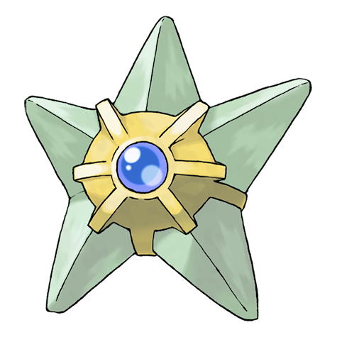

# Staryu (Star Shape Pokémon)

| Official Artwork | Shiny Artwork |
| --- | --- |
|  |  |

If its body is torn, it can grow back if the red core remains. The core flashes at midnight.

---

## Media

### Default Sprites

| Front | Back | Front Shiny | Back Shiny |
| --- | --- | --- | --- |
|  |  |  |  |

### Cries

Latest (Gen VI+):

<audio controls>
<source src='../../assets/cries/staryu/latest.ogg' type='audio/ogg'>
  Your browser does not support the audio element.
</audio>

Legacy:

<audio controls>
<source src='../../assets/cries/staryu/legacy.ogg' type='audio/ogg'>
  Your browser does not support the audio element.
</audio>

---

## Pokédex Data

| National № | Type(s) | Height | Weight | Abilities | Local № |
|------------|---------|--------|--------|-----------|---------|
| #120 | {: width='48'} | 0.8 m | 34.5 kg | 1. Regenerator 2. Natural-Cure | N/A |

---

## Base Stats
|   | HP | Attack | Defense | Sp. Atk | Sp. Def | Speed |
|---|----|--------|---------|---------|---------|-------|
| **Base** | 30 | 45 | 55 | 70 | 55 | 85 |
| **Min** | 170 | 85 | 103 | 130 | 103 | 157 |
| **Max** | 264 | 207 | 229 | 262 | 229 | 295 |

The ranges shown above are for a level 100 Pokémon. Maximum values are based on a beneficial nature, 252 EVs, 31 IVs; minimum values are based on a hindering nature, 0 EVs, 0 IVs.

---

## Forms & Evolutions

!!! warning "WARNING"

    Information on evolutions may not be 100% accurate; differences between evolution methods across generations are not accounted for.

### Forms

Staryu has no alternate forms.

### Evolution Line

1. [Staryu](staryu.md/)
    1. Use Item: [Starmie](starmie.md/)

---

## Training

| EV Yield | Catch Rate | Base Friendship | Base Exp. | Growth Rate | Held Items |
|----------|------------|-----------------|-----------|-------------|------------|
| 1 Speed | 225 | 50 | 68 | Slow | stardust (50%) star-piece (5%) |

---

## Breeding

| Egg Groups | Egg Cycles | Gender | Dimorphic | Color | Shape |
|------------|------------|--------|-----------|-------|-------|
| 1. Water3 | 20 | Genderless | False | Brown | Blob |

---

## Moves

!!! warning "WARNING"

    Specific move information may be incorrect. However, the general movepool should be accurate; this includes changes made in Blaze Black and Volt White.

### Level Up Moves

| Lv. | Move | Type | Cat. | Power | Acc. | PP |
| --- | --- | --- | --- | --- | --- | --- |
| 1 | Harden | {: width='48'} | {: width='36'} | — | — | 30 |
| 1 | Tackle | {: width='48'} | {: width='36'} | 40 | 100 | 35 |
| 6 | Water Gun | {: width='48'} | {: width='36'} | 40 | 100 | 25 |
| 10 | Rapid Spin | {: width='48'} | {: width='36'} | 50 | 100 | 40 |
| 15 | Recover | {: width='48'} | {: width='36'} | — | — | 5 |
| 19 | Camouflage | {: width='48'} | {: width='36'} | — | — | 20 |
| 22 | Signal Beam | {: width='48'} | {: width='36'} | 75 | 100 | 15 |
| 24 | Swift | {: width='48'} | {: width='36'} | 60 | — | 20 |
| 28 | Bubble Beam | {: width='48'} | {: width='36'} | 65 | 100 | 20 |
| 33 | Minimize | {: width='48'} | {: width='36'} | — | — | 10 |
| 37 | Gyro Ball | {: width='48'} | {: width='36'} | — | 100 | 5 |
| 42 | Light Screen | {: width='48'} | {: width='36'} | — | — | 30 |
| 46 | Reflect Type | {: width='48'} | {: width='36'} | — | — | 15 |
| 51 | Power Gem | {: width='48'} | {: width='36'} | 90 | 100 | 20 |
| 55 | Cosmic Power | {: width='48'} | {: width='36'} | — | — | 20 |
| 60 | Hydro Pump | {: width='48'} | {: width='36'} | 110 | 80 | 5 |

### TM Moves

| TM | Move | Type | Cat. | Power | Acc. | PP |
| --- | --- | --- | --- | --- | --- | --- |
| HM03 | Surf | {: width='48'} | {: width='36'} | 90 | 100 | 15 |
| HM05 | Waterfall | {: width='48'} | {: width='36'} | 85 | 100 | 15 |
| HM06 | Dive | {: width='48'} | {: width='36'} | 80 | 100 | 10 |
| TM06 | Toxic | {: width='48'} | {: width='36'} | — | 90 | 10 |
| TM07 | Hail | {: width='48'} | {: width='36'} | — | — | 10 |
| TM10 | Hidden Power | {: width='48'} | {: width='36'} | 60 | 100 | 15 |
| TM13 | Ice Beam | {: width='48'} | {: width='36'} | 90 | 100 | 10 |
| TM14 | Blizzard | {: width='48'} | {: width='36'} | 110 | 70 | 5 |
| TM16 | Light Screen | {: width='48'} | {: width='36'} | — | — | 30 |
| TM17 | Protect | {: width='48'} | {: width='36'} | — | — | 10 |
| TM18 | Rain Dance | {: width='48'} | {: width='36'} | — | — | 5 |
| TM21 | Frustration | {: width='48'} | {: width='36'} | — | 100 | 20 |
| TM24 | Thunderbolt | {: width='48'} | {: width='36'} | 90 | 100 | 15 |
| TM25 | Thunder | {: width='48'} | {: width='36'} | 110 | 70 | 10 |
| TM27 | Return | {: width='48'} | {: width='36'} | — | 100 | 20 |
| TM29 | Psychic | {: width='48'} | {: width='36'} | 90 | 100 | 10 |
| TM32 | Double Team | {: width='48'} | {: width='36'} | — | — | 15 |
| TM33 | Reflect | {: width='48'} | {: width='36'} | — | — | 20 |
| TM42 | Facade | {: width='48'} | {: width='36'} | 70 | 100 | 20 |
| TM44 | Rest | {: width='48'} | {: width='36'} | — | — | 5 |
| TM48 | Round | {: width='48'} | {: width='36'} | 60 | 100 | 15 |
| TM55 | Scald | {: width='48'} | {: width='36'} | 80 | 100 | 15 |
| TM70 | Flash | {: width='48'} | {: width='36'} | — | 100 | 20 |
| TM73 | Thunder Wave | {: width='48'} | {: width='36'} | — | 90 | 20 |
| TM74 | Gyro Ball | {: width='48'} | {: width='36'} | — | 100 | 5 |
| TM77 | Psych Up | {: width='48'} | {: width='36'} | — | — | 10 |
| TM87 | Swagger | {: width='48'} | {: width='36'} | — | 85 | 15 |
| TM90 | Substitute | {: width='48'} | {: width='36'} | — | — | 10 |
| TM91 | Flash Cannon | {: width='48'} | {: width='36'} | 80 | 100 | 10 |

### Egg Moves

Staryu cannot learn any moves by breeding.
### Tutor Moves

Staryu cannot learn any moves from tutors.
