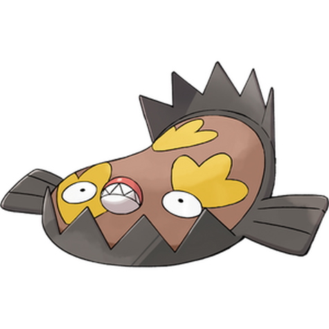
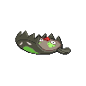
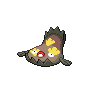
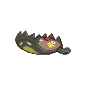

# #10180 Stunfisk Galar (Trap Pokémon)

| Official Artwork | Shiny Artwork |
| --- | --- |
|  |  |

**Blaze Black:** Its skin is very hard, so it is unhurt even if stepped on by sumo wrestlers. It smiles when transmitting electricity.

**Volt White:** It conceals itself in the mud of the seashore. Then it waits. When prey touch it, it delivers a jolt of electricity.

---

## Media

### Sprites

| Front | Back | Front Shiny | Back Shiny |
| --- | --- | --- | --- |
|  |  |  |  |

### Cries

Latest (Gen VI+):

<audio controls>
  <source src='../assets/cries/stunfisk-galar/latest.ogg' type='audio/ogg'>
  Your browser does not support the audio element.
</audio>

---

## Pokédex Data

| National № | Type(s) | Height | Weight | Abilities | Local № |
|------------|---------|--------|--------|-----------|---------|
| #10180 | {: width='48'} {: width='48'} | 0.7 m | 20.5 kg | 1. Mimicry | #124 |

---

## Base Stats
---

## Base Stats
|   | HP | Attack | Defense | Sp. Atk | Sp. Def | Speed |
|---|----|--------|---------|---------|---------|-------|
| **Base** | 109 | 81 | 99 | 66 | 84 | 32 |
| **Min** | 328 | 150 | 182 | 123 | 155 | 62 |
| **Max** | 422 | 287 | 326 | 254 | 293 | 179 |

The ranges shown above are for a level 100 Pokémon. Maximum values are based on a beneficial nature, 252 EVs, 31 IVs; minimum values are based on a hindering nature, 0 EVs, 0 IVs.

---

## Forms & Evolutions

!!! warning "WARNING"

    Some forms may not be available in Blaze Black/Volt White. Also information on evolutions may not be 100% accurate; it is currently quite complex to track generational evolution data.

### Forms

1. [Stunfisk](stunfisk.md/)
2. [Stunfisk-Galar](stunfisk-galar.md/)

### Evolution Line

1. [Stunfisk](stunfisk.md/)

---

## Training

| EV Yield | Catch Rate | Base Friendship | Base Exp. | Growth Rate | Held Items |
|----------|------------|-----------------|-----------|-------------|------------|
| 2 Hp | 75 | 70 | 165 | Medium | N/A |

---

## Breeding

| Egg Groups | Egg Cycles | Gender | Dimorphic | Color | Shape |
|------------|------------|--------|-----------|-------|-------|
| 1. Water1 2. Indeterminate | 20 | 50.0% Male 50.0% Female | False | Brown | Fish |

---

## Moves

!!! warning "WARNING"

    Specific move information may be incorrect. However, the general movepool should be accurate (including changes to learnset).

### Level Up Moves

Lv. | Move | Type | Cat. | Power | Acc. | PP
--- | --- | --- | --- | --- | --- | ---
| 1 | Metal Claw | {: width='48'} | {: width='36'} | 50 | 95 | 35 |
| 1 | Mud Slap | {: width='48'} | {: width='36'} | 20 | 100 | 10 |
| 1 | Tackle | {: width='48'} | {: width='36'} | 40 | 100 | 35 |
| 1 | Water Gun | {: width='48'} | {: width='36'} | 40 | 100 | 25 |
| 5 | Endure | {: width='48'} | {: width='36'} | — | — | 10 |
| 10 | Mud Shot | {: width='48'} | {: width='36'} | 55 | 95 | 15 |
| 15 | Revenge | {: width='48'} | {: width='36'} | 60 | 100 | 10 |
| 20 | Metal Sound | {: width='48'} | {: width='36'} | — | 85 | 40 |
| 25 | Sucker Punch | {: width='48'} | {: width='36'} | 70 | 100 | 5 |
| 30 | Iron Defense | {: width='48'} | {: width='36'} | — | — | 15 |
| 35 | Bounce | {: width='48'} | {: width='36'} | 85 | 85 | 5 |
| 40 | Muddy Water | {: width='48'} | {: width='36'} | 90 | 85 | 10 |
| 45 | Snap Trap | {: width='48'} | {: width='36'} | 35 | 100 | 15 |
| 50 | Flail | {: width='48'} | {: width='36'} | — | 100 | 15 |
| 55 | Fissure | {: width='48'} | {: width='36'} | — | 30 | 5 |

### TM Moves

TM | Move | Type | Cat. | Power | Acc. | PP
--- | --- | --- | --- | --- | --- | ---
| TM14 | Thunder Wave | {: width='48'} | {: width='36'} | — | 90 | 20 |
| TM15 | Dig | {: width='48'} | {: width='36'} | 100 | 100 | 10 |
| TM16 | Screech | {: width='48'} | {: width='36'} | — | 85 | 40 |
| TM21 | Rest | {: width='48'} | {: width='36'} | — | — | 5 |
| TM22 | Rock Slide | {: width='48'} | {: width='36'} | 80 | 95 | 10 |
| TM24 | Snore | {: width='48'} | {: width='36'} | 50 | 100 | 15 |
| TM25 | Protect | {: width='48'} | {: width='36'} | — | — | 10 |
| TM31 | Attract | {: width='48'} | {: width='36'} | — | 100 | 15 |
| TM32 | Sandstorm | {: width='48'} | {: width='36'} | — | — | 10 |
| TM33 | Rain Dance | {: width='48'} | {: width='36'} | — | — | 5 |
| TM39 | Facade | {: width='48'} | {: width='36'} | 70 | 100 | 20 |
| TM42 | Revenge | {: width='48'} | {: width='36'} | 60 | 100 | 10 |
| TM48 | Rock Tomb | {: width='48'} | {: width='36'} | 60 | 95 | 15 |
| TM52 | Bounce | {: width='48'} | {: width='36'} | 85 | 85 | 5 |
| TM53 | Mud Shot | {: width='48'} | {: width='36'} | 55 | 95 | 15 |
| TM57 | Payback | {: width='48'} | {: width='36'} | 50 | 100 | 10 |
| TM67 | Ice Fang | {: width='48'} | {: width='36'} | 75 | 95 | 15 |
| TM76 | Round | {: width='48'} | {: width='36'} | 60 | 100 | 15 |
| TM81 | Bulldoze | {: width='48'} | {: width='36'} | 80 | 100 | 20 |
| TM98 | Stomping Tantrum | {: width='48'} | {: width='36'} | 75 | 100 | 10 |
| TR04 | Surf | {: width='48'} | {: width='36'} | 90 | 100 | 15 |
| TR10 | Earthquake | {: width='48'} | {: width='36'} | 100 | 100 | 10 |
| TR20 | Substitute | {: width='48'} | {: width='36'} | — | — | 10 |
| TR22 | Sludge Bomb | {: width='48'} | {: width='36'} | 90 | 100 | 10 |
| TR26 | Endure | {: width='48'} | {: width='36'} | — | — | 10 |
| TR27 | Sleep Talk | {: width='48'} | {: width='36'} | — | — | 10 |
| TR32 | Crunch | {: width='48'} | {: width='36'} | 80 | 100 | 15 |
| TR35 | Uproar | {: width='48'} | {: width='36'} | 90 | 100 | 10 |
| TR45 | Muddy Water | {: width='48'} | {: width='36'} | 90 | 85 | 10 |
| TR46 | Iron Defense | {: width='48'} | {: width='36'} | — | — | 15 |
| TR67 | Earth Power | {: width='48'} | {: width='36'} | 90 | 100 | 10 |
| TR70 | Flash Cannon | {: width='48'} | {: width='36'} | 80 | 100 | 10 |
| TR75 | Stone Edge | {: width='48'} | {: width='36'} | 100 | 80 | 5 |
| TR76 | Stealth Rock | {: width='48'} | {: width='36'} | — | — | 20 |
| TR78 | Sludge Wave | {: width='48'} | {: width='36'} | 95 | 100 | 10 |
| TR81 | Foul Play | {: width='48'} | {: width='36'} | 95 | 100 | 15 |
| TR84 | Scald | {: width='48'} | {: width='36'} | 80 | 100 | 15 |

### Egg Moves

Move | Type | Cat. | Power | Acc. | PP
--- | --- | --- | --- | --- | ---
| Bind | {: width='48'} | {: width='36'} | 15 | 85 | 20 |
| Counter | {: width='48'} | {: width='36'} | — | 100 | 20 |
| Curse | {: width='48'} | {: width='36'} | — | — | 10 |
| Spite | {: width='48'} | {: width='36'} | — | 100 | 10 |
| Pain Split | {: width='48'} | {: width='36'} | — | — | 20 |
| Yawn | {: width='48'} | {: width='36'} | — | — | 10 |
| Astonish | {: width='48'} | {: width='36'} | 30 | 100 | 15 |
| Reflect Type | {: width='48'} | {: width='36'} | — | — | 15 |

### Tutor Moves

Move | Type | Cat. | Power | Acc. | PP
--- | --- | --- | --- | --- | ---
| Steel Beam | {: width='48'} | {: width='36'} | 140 | 95 | 5 |
| Terrain Pulse | {: width='48'} | {: width='36'} | 50 | 100 | 10 |
| Lash Out | {: width='48'} | {: width='36'} | 75 | 100 | 5 |

