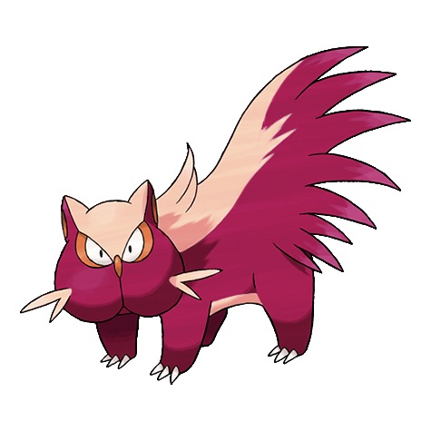
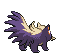
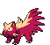
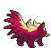

# #434 Stunky (Skunk Pokémon)

| Official Artwork | Shiny Artwork |
| --- | --- |
|  |  |

It sprays a foul fluid from its rear. Its stench spreads over a mile radius, driving Pokémon away.

---

## Media

### Default Sprites

| Front | Back | Front Shiny | Back Shiny |
| --- | --- | --- | --- |
|  |  |  |  |

### Cries

Latest (Gen VI+):

<audio controls>
<source src='../../assets/cries/stunky/latest.ogg' type='audio/ogg'>
  Your browser does not support the audio element.
</audio>

Legacy:

<audio controls>
<source src='../../assets/cries/stunky/legacy.ogg' type='audio/ogg'>
  Your browser does not support the audio element.
</audio>

---

## Pokédex Data

| National № | Type(s) | Height | Weight | Abilities | Local № |
|------------|---------|--------|--------|-----------|---------|
| #434 | {: width='48'} {: width='48'} | 0.4 m / 1.3 ft | 19.2 kg / 42.3 lbs | Stench Aftermath | N/A |

---

## Base Stats
|   | HP | Attack | Defense | Sp. Atk | Sp. Def | Speed |
|---|----|--------|---------|---------|---------|-------|
| **Base** | 65 | 65 | 50 | 40 | 40 | 75 |
| **Min** | 240 | 121 | 94 | 76 | 76 | 139 |
| **Max** | 334 | 251 | 218 | 196 | 196 | 273 |

The ranges shown above are for a level 100 Pokémon. Maximum values are based on a beneficial nature, 252 EVs, 31 IVs; minimum values are based on a hindering nature, 0 EVs, 0 IVs.

---

## Forms & Evolutions

!!! warning "WARNING"

    Information on evolutions may not be 100% accurate; differences between evolution methods across generations are not accounted for.

### Forms

Stunky has no alternate forms.

### Evolution Line

1. [Stunky](stunky.md/)
    1. Level Up: [Skuntank](skuntank.md/)

---

## Training

| EV Yield | Catch Rate | Base Friendship | Base Exp. | Growth Rate | Held Items |
|----------|------------|-----------------|-----------|-------------|------------|
| 1 Speed | 225 | 50 | 66 | Medium | Pecha Berry (5%) |

---

## Breeding

| Egg Groups | Egg Cycles | Gender | Dimorphic | Color | Shape |
|------------|------------|--------|-----------|-------|-------|
| 1. Ground | 20 | 50.0% Male 50.0% Female | False | Purple | Quadruped |

---

## Moves

!!! warning "WARNING"

    Specific move information may be incorrect. However, the general movepool should be accurate; this includes changes made in Blaze Black and Volt White.

### Level Up Moves

| Lv. | Move | Type | Cat. | Power | Acc. | PP |
| --- | --- | --- | --- | --- | --- | --- |
| 1 | Focus Energy | {: width='48'} | {: width='36'} | — | — | 30 |
| 1 | Scratch | {: width='48'} | {: width='36'} | 40 | 100 | 35 |
| 4 | Poison Gas | {: width='48'} | {: width='36'} | — | 90 | 40 |
| 7 | Screech | {: width='48'} | {: width='36'} | — | 85 | 40 |
| 10 | Fury Swipes | {: width='48'} | {: width='36'} | 18 | 80 | 15 |
| 14 | Smokescreen | {: width='48'} | {: width='36'} | — | 100 | 20 |
| 18 | Feint | {: width='48'} | {: width='36'} | 30 | 100 | 10 |
| 18 | Sucker Punch | {: width='48'} | {: width='36'} | 70 | 100 | 5 |
| 22 | Slash | {: width='48'} | {: width='36'} | 70 | 100 | 20 |
| 25 | Flame Burst | {: width='48'} | {: width='36'} | 70 | 100 | 15 |
| 27 | Toxic | {: width='48'} | {: width='36'} | — | 90 | 10 |
| 32 | Acid Spray | {: width='48'} | {: width='36'} | 40 | 100 | 20 |
| 37 | Night Slash | {: width='48'} | {: width='36'} | 70 | 100 | 15 |
| 43 | Memento | {: width='48'} | {: width='36'} | — | 100 | 10 |
| 49 | Explosion | {: width='48'} | {: width='36'} | 250 | 100 | 5 |
| 55 | Foul Play | {: width='48'} | {: width='36'} | 95 | 100 | 15 |

### TM Moves

| TM | Move | Type | Cat. | Power | Acc. | PP |
| --- | --- | --- | --- | --- | --- | --- |
| HM01 | Cut | {: width='48'} | {: width='36'} | 60 | 100% | 25 |
| TM01 | Hone Claws | {: width='48'} | {: width='36'} | — | — | 15 |
| TM05 | Roar | {: width='48'} | {: width='36'} | — | — | 20 |
| TM06 | Toxic | {: width='48'} | {: width='36'} | — | 90 | 10 |
| TM09 | Venoshock | {: width='48'} | {: width='36'} | 65 | 100 | 10 |
| TM10 | Hidden Power | {: width='48'} | {: width='36'} | 60 | 100 | 15 |
| TM11 | Sunny Day | {: width='48'} | {: width='36'} | — | — | 5 |
| TM12 | Taunt | {: width='48'} | {: width='36'} | — | 100 | 20 |
| TM17 | Protect | {: width='48'} | {: width='36'} | — | — | 10 |
| TM18 | Rain Dance | {: width='48'} | {: width='36'} | — | — | 5 |
| TM21 | Frustration | {: width='48'} | {: width='36'} | — | 100 | 20 |
| TM27 | Return | {: width='48'} | {: width='36'} | — | 100 | 20 |
| TM28 | Dig | {: width='48'} | {: width='36'} | 100 | 100 | 10 |
| TM30 | Shadow Ball | {: width='48'} | {: width='36'} | 90 | 100 | 15 |
| TM32 | Double Team | {: width='48'} | {: width='36'} | — | — | 15 |
| TM35 | Flamethrower | {: width='48'} | {: width='36'} | 90 | 100 | 15 |
| TM36 | Sludge Bomb | {: width='48'} | {: width='36'} | 90 | 100 | 10 |
| TM38 | Fire Blast | {: width='48'} | {: width='36'} | 110 | 85 | 5 |
| TM41 | Torment | {: width='48'} | {: width='36'} | — | 100 | 15 |
| TM42 | Facade | {: width='48'} | {: width='36'} | 70 | 100 | 20 |
| TM44 | Rest | {: width='48'} | {: width='36'} | — | — | 5 |
| TM45 | Attract | {: width='48'} | {: width='36'} | — | 100 | 15 |
| TM46 | Thief | {: width='48'} | {: width='36'} | 60 | 100 | 25 |
| TM48 | Round | {: width='48'} | {: width='36'} | 60 | 100 | 15 |
| TM59 | Incinerate | {: width='48'} | {: width='36'} | 50 | 100 | 15 |
| TM64 | Explosion | {: width='48'} | {: width='36'} | 250 | 100 | 5 |
| TM65 | Shadow Claw | {: width='48'} | {: width='36'} | 80 | 100 | 15 |
| TM66 | Payback | {: width='48'} | {: width='36'} | 50 | 100 | 10 |
| TM87 | Swagger | {: width='48'} | {: width='36'} | — | 85 | 15 |
| TM90 | Substitute | {: width='48'} | {: width='36'} | — | — | 10 |
| TM94 | Rock Smash | {: width='48'} | {: width='36'} | 60 | 100 | 15 |
| TM95 | Snarl | {: width='48'} | {: width='36'} | 60 | 95 | 15 |

### Egg Moves

| Move | Type | Cat. | Power | Acc. | PP |
| --- | --- | --- | --- | --- | --- |
| Double Edge | {: width='48'} | {: width='36'} | 120 | 100 | 15 |
| Leer | {: width='48'} | {: width='36'} | — | 100 | 30 |
| Haze | {: width='48'} | {: width='36'} | — | — | 30 |
| Smog | {: width='48'} | {: width='36'} | 30 | 70 | 20 |
| Scary Face | {: width='48'} | {: width='36'} | — | 100 | 10 |
| Pursuit | {: width='48'} | {: width='36'} | 40 | 100 | 20 |
| Iron Tail | {: width='48'} | {: width='36'} | 100 | 75 | 15 |
| Crunch | {: width='48'} | {: width='36'} | 80 | 100 | 15 |
| Astonish | {: width='48'} | {: width='36'} | 30 | 100 | 15 |
| Punishment | {: width='48'} | {: width='36'} | — | 100 | 5 |
| Flame Burst | {: width='48'} | {: width='36'} | 70 | 100 | 15 |
| Foul Play | {: width='48'} | {: width='36'} | 95 | 100 | 15 |

### Tutor Moves

Stunky cannot learn any moves from tutors.
