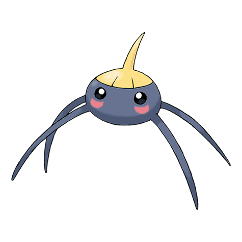

# #283 Surskit (Pond Skater Pokémon)

| Official Artwork | Shiny Artwork |
|------------------|---------------|
|  |  |

It appears as if it is skating on water. It draws prey with a sweet scent from the tip of its head.

---

## Media

### Default Sprites

| Front | Shiny | Back | Shiny |
|-------|-------|------|-------|
|  |  |  |  |

### Cries

Latest (Gen VI+):

<audio controls>
<source src='../../assets/cries/surskit/latest.ogg' type='audio/ogg'>
  Your browser does not support the audio element.
</audio>

Legacy:

<audio controls>
<source src='../../assets/cries/surskit/legacy.ogg' type='audio/ogg'>
  Your browser does not support the audio element.
</audio>

---

## Pokédex Data

| National № | Type(s) | Height | Weight | Abilities | Local № |
|------------|---------|--------|--------|-----------|---------|
| #283 | {: width="48"} {: width="48"} | 0.5 m / 1.6 ft | 1.7 kg / 3.7 lbs | 1. Swift Swim 2. Rain Dish | N/A |

---

## Base Stats
|   | HP | Attack | Defense | Sp. Atk | Sp. Def | Speed |
|---|----|--------|---------|---------|---------|-------|
| **Base** | 40 | 30 | 32 | 50 | 52 | 65 |
| **Min** | 190 | 58 | 62 | 94 | 98 | 121 |
| **Max** | 284 | 174 | 179 | 218 | 223 | 251 |

The ranges shown above are for a level 100 Pokémon. Maximum values are based on a beneficial nature, 252 EVs, 31 IVs; minimum values are based on a hindering nature, 0 EVs, 0 IVs.

---

## Forms & Evolutions

!!! warning "WARNING"

    Information on evolutions may not be 100% accurate; differences between evolution methods across generations are not accounted for.

### Forms

Surskit has no alternate forms.

### Evolution Line

1. [Surskit](surskit.md/)
    1. Level Up: [Masquerain](masquerain.md/)

---

## Training

| EV Yield | Catch Rate | Base Friendship | Base Exp. | Growth Rate | Held Items |
|----------|------------|-----------------|-----------|-------------|------------|
| 1 Spd | 200 | 70 | 54 | Mediu |

---

## Breeding

| Egg Groups | Egg Cycles | Gender | Dimorphic | Color | Shape |
|------------|------------|--------|-----------|-------|-------|
| 1. Water1 2. Bug | 15 | 50.0% Male 50.0% Female | False | Blue | Armor |

---

## Moves

!!! warning "WARNING"

    Specific move information may be incorrect. However, the general movepool should be accurate; this includes changes made in Blaze Black and Volt White.

### Level Up Moves

| Lv. | Move | Type | Cat. | Power | Acc. | PP |
| --- | --- | --- | --- | --- | --- | --- |
| 1 | Bubble | {: width="48"} | {: width="36"} | 40 | 100 | 30 |
| 7 | Quick Attack | {: width="48"} | {: width="36"} | 40 | 100 | 30 |
| 13 | Sweet Scent | {: width="48"} | {: width="36"} | — | 100 | 20 |
| 19 | Water Sport | {: width="48"} | {: width="36"} | — | — | 15 |
| 25 | Bubble Beam | {: width="48"} | {: width="36"} | 75 | 100 | 15 |
| 28 | Psybeam | {: width="48"} | {: width="36"} | 65 | 100 | 20 |
| 31 | Agility | {: width="48"} | {: width="36"} | — | — | 30 |
| 34 | Giga Drain | {: width="48"} | {: width="36"} | 75 | 100 | 10 |
| 37 | Haze | {: width="48"} | {: width="36"} | — | — | 30 |
| 37 | Mist | {: width="48"} | {: width="36"} | — | — | 30 |
| 43 | Baton Pass | {: width="48"} | {: width="36"} | — | — | 40 |

### TM Moves

| TM | Move | Type | Cat. | Power | Acc. | PP |
| --- | --- | --- | --- | --- | --- | --- |
| HM03 | Surf | {: width="48"} | {: width="36"} | 90 | 100 | 15 |
| TM06 | Toxic | {: width="48"} | {: width="36"} | — | 90 | 10 |
| TM10 | Hidden Power | {: width="48"} | {: width="36"} | 60 | 100 | 15 |
| TM11 | Sunny Day | {: width="48"} | {: width="36"} | — | — | 5 |
| TM13 | Ice Beam | {: width="48"} | {: width="36"} | 90 | 100 | 10 |
| TM14 | Blizzard | {: width="48"} | {: width="36"} | 110 | 70 | 5 |
| TM17 | Protect | {: width="48"} | {: width="36"} | — | — | 10 |
| TM18 | Rain Dance | {: width="48"} | {: width="36"} | — | — | 5 |
| TM21 | Frustration | {: width="48"} | {: width="36"} | — | 100 | 20 |
| TM22 | Solar Beam | {: width="48"} | {: width="36"} | 120 | 100 | 10 |
| TM27 | Return | {: width="48"} | {: width="36"} | — | 100 | 20 |
| TM30 | Shadow Ball | {: width="48"} | {: width="36"} | 90 | 100 | 15 |
| TM32 | Double Team | {: width="48"} | {: width="36"} | — | — | 15 |
| TM42 | Facade | {: width="48"} | {: width="36"} | 70 | 100 | 20 |
| TM44 | Rest | {: width="48"} | {: width="36"} | — | — | 5 |
| TM45 | Attract | {: width="48"} | {: width="36"} | — | 100 | 15 |
| TM46 | Thief | {: width="48"} | {: width="36"} | 60 | 100 | 25 |
| TM48 | Round | {: width="48"} | {: width="36"} | 60 | 100 | 15 |
| TM55 | Scald | {: width="48"} | {: width="36"} | 80 | 100 | 15 |
| TM70 | Flash | {: width="48"} | {: width="36"} | — | 100 | 20 |
| TM76 | Struggle Bug | {: width="48"} | {: width="36"} | 50 | 100 | 20 |
| TM77 | Psych Up | {: width="48"} | {: width="36"} | — | — | 10 |
| TM87 | Swagger | {: width="48"} | {: width="36"} | — | 85 | 15 |
| TM90 | Substitute | {: width="48"} | {: width="36"} | — | — | 10 |

### Egg Moves

| Move | Type | Cat. | Power | Acc. | PP |
| --- | --- | --- | --- | --- | --- |
| Hydro Pump | {: width="48"} | {: width="36"} | 110 | 80 | 5 |
| Psybeam | {: width="48"} | {: width="36"} | 65 | 100 | 20 |
| Mind Reader | {: width="48"} | {: width="36"} | — | — | 5 |
| Foresight | {: width="48"} | {: width="36"} | — | — | 40 |
| Endure | {: width="48"} | {: width="36"} | — | — | 10 |
| Signal Beam | {: width="48"} | {: width="36"} | 75 | 100 | 15 |
| Mud Shot | {: width="48"} | {: width="36"} | 55 | 95 | 15 |
| Bug Bite | {: width="48"} | {: width="36"} | 60 | 100 | 20 |
| Aqua Jet | {: width="48"} | {: width="36"} | 40 | 100 | 20 |

### Tutor Moves

Surskit cannot learn any moves from tutors.
