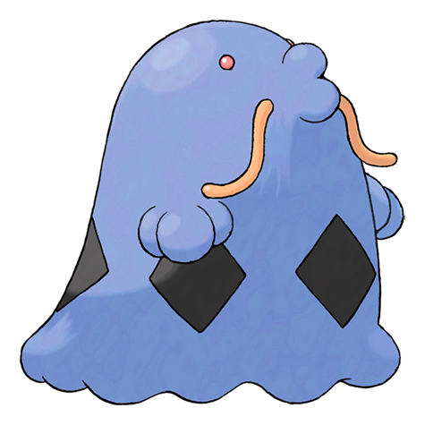

# #317 Swalot (Poison Bag Pokémon)

| Official Artwork | Shiny Artwork |
|------------------|---------------|
|  |  |

It swallows anything whole. It sweats toxic fluids from its follicles to douse foes.

---

## Media

### Default Sprites

| Front | Shiny | Back | Shiny |
|-------|-------|------|-------|
|  |  |  |  |

### Female Sprites

| Front | Shiny | Back | Shiny |
|-------|-------|------|-------|
|  |  |  |  |

### Cries

Latest (Gen VI+):

<audio controls>
<source src='../../assets/cries/swalot/latest.ogg' type='audio/ogg'>
  Your browser does not support the audio element.
</audio>

Legacy:

<audio controls>
<source src='../../assets/cries/swalot/legacy.ogg' type='audio/ogg'>
  Your browser does not support the audio element.
</audio>

---

## Pokédex Data

| National № | Type(s) | Height | Weight | Abilities | Local № |
|------------|---------|--------|--------|-----------|---------|
| #317 | {: width="48"} | 1.7 m / 5.6 ft | 80.0 kg / 176.4 lbs | 1. Liquid Ooze 2. Gluttony | N/A |

---

## Base Stats
|   | HP | Attack | Defense | Sp. Atk | Sp. Def | Speed |
|---|----|--------|---------|---------|---------|-------|
| **Base** | 100 | 73 | 83 | 103 | 83 | 55 |
| **Min** | 310 | 135 | 153 | 189 | 153 | 103 |
| **Max** | 404 | 269 | 291 | 335 | 291 | 229 |

The ranges shown above are for a level 100 Pokémon. Maximum values are based on a beneficial nature, 252 EVs, 31 IVs; minimum values are based on a hindering nature, 0 EVs, 0 IVs.

---

## Forms & Evolutions

!!! warning "WARNING"

    Information on evolutions may not be 100% accurate; differences between evolution methods across generations are not accounted for.

### Forms

Swalot has no alternate forms.

### Evolution Line

1. [Gulpin](gulpin.md/)
    1. Level Up: [Swalot](swalot.md/)

---

## Training

| EV Yield | Catch Rate | Base Friendship | Base Exp. | Growth Rate | Held Items |
|----------|------------|-----------------|-----------|-------------|------------|
| 2 HP | 75 | 70 | 163 | Fast Then Very Slow | Big Pearl (5%) |

---

## Breeding

| Egg Groups | Egg Cycles | Gender | Dimorphic | Color | Shape |
|------------|------------|--------|-----------|-------|-------|
| 1. Indeterminate | 20 | 50.0% Male 50.0% Female | True | Purple | Arms |

---

## Moves

!!! warning "WARNING"

    Specific move information may be incorrect. However, the general movepool should be accurate; this includes changes made in Blaze Black and Volt White.

### Level Up Moves

| Lv. | Move | Type | Cat. | Power | Acc. | PP |
| --- | --- | --- | --- | --- | --- | --- |
| 1 | Pain Split | {: width="48"} | {: width="36"} | — | — | 20 |
| 1 | Poison Gas | {: width="48"} | {: width="36"} | — | 90 | 40 |
| 1 | Pound | {: width="48"} | {: width="36"} | 40 | 100 | 35 |
| 1 | Seed Bomb | {: width="48"} | {: width="36"} | 80 | 100 | 15 |
| 1 | Sludge | {: width="48"} | {: width="36"} | 75 | 100 | 15 |
| 1 | Yawn | {: width="48"} | {: width="36"} | — | — | 10 |
| 6 | Yawn | {: width="48"} | {: width="36"} | — | — | 10 |
| 9 | Poison Gas | {: width="48"} | {: width="36"} | — | 90 | 40 |
| 14 | Sludge | {: width="48"} | {: width="36"} | 75 | 100 | 15 |
| 17 | Amnesia | {: width="48"} | {: width="36"} | — | — | 20 |
| 23 | Encore | {: width="48"} | {: width="36"} | — | 100 | 5 |
| 26 | Body Slam | {: width="48"} | {: width="36"} | 85 | 100 | 15 |
| 30 | Toxic | {: width="48"} | {: width="36"} | — | 90 | 10 |
| 38 | Acid Spray | {: width="48"} | {: width="36"} | 40 | 100 | 20 |
| 45 | Spit Up | {: width="48"} | {: width="36"} | — | 100 | 10 |
| 45 | Stockpile | {: width="48"} | {: width="36"} | — | — | 20 |
| 45 | Swallow | {: width="48"} | {: width="36"} | — | — | 10 |
| 52 | Sludge Bomb | {: width="48"} | {: width="36"} | 90 | 100 | 10 |
| 59 | Gastro Acid | {: width="48"} | {: width="36"} | — | 100 | 10 |
| 66 | Wring Out | {: width="48"} | {: width="36"} | — | 100 | 5 |
| 73 | Gunk Shot | {: width="48"} | {: width="36"} | 120 | 80 | 5 |

### TM Moves

| TM | Move | Type | Cat. | Power | Acc. | PP |
| --- | --- | --- | --- | --- | --- | --- |
| HM04 | Strength | {: width="48"} | {: width="36"} | 100 | 100 | 15 |
| TM06 | Toxic | {: width="48"} | {: width="36"} | — | 90 | 10 |
| TM09 | Venoshock | {: width="48"} | {: width="36"} | 65 | 100 | 10 |
| TM10 | Hidden Power | {: width="48"} | {: width="36"} | 60 | 100 | 15 |
| TM11 | Sunny Day | {: width="48"} | {: width="36"} | — | — | 5 |
| TM13 | Ice Beam | {: width="48"} | {: width="36"} | 90 | 100 | 10 |
| TM15 | Hyper Beam | {: width="48"} | {: width="36"} | 150 | 90 | 5 |
| TM17 | Protect | {: width="48"} | {: width="36"} | — | — | 10 |
| TM18 | Rain Dance | {: width="48"} | {: width="36"} | — | — | 5 |
| TM21 | Frustration | {: width="48"} | {: width="36"} | — | 100 | 20 |
| TM22 | Solar Beam | {: width="48"} | {: width="36"} | 120 | 100 | 10 |
| TM26 | Earthquake | {: width="48"} | {: width="36"} | 100 | 100 | 10 |
| TM27 | Return | {: width="48"} | {: width="36"} | — | 100 | 20 |
| TM30 | Shadow Ball | {: width="48"} | {: width="36"} | 90 | 100 | 15 |
| TM32 | Double Team | {: width="48"} | {: width="36"} | — | — | 15 |
| TM34 | Sludge Wave | {: width="48"} | {: width="36"} | 95 | 100 | 10 |
| TM36 | Sludge Bomb | {: width="48"} | {: width="36"} | 90 | 100 | 10 |
| TM42 | Facade | {: width="48"} | {: width="36"} | 70 | 100 | 20 |
| TM44 | Rest | {: width="48"} | {: width="36"} | — | — | 5 |
| TM45 | Attract | {: width="48"} | {: width="36"} | — | 100 | 15 |
| TM48 | Round | {: width="48"} | {: width="36"} | 60 | 100 | 15 |
| TM64 | Explosion | {: width="48"} | {: width="36"} | 250 | 100 | 5 |
| TM68 | Giga Impact | {: width="48"} | {: width="36"} | 150 | 90 | 5 |
| TM78 | Bulldoze | {: width="48"} | {: width="36"} | 80 | 100 | 20 |
| TM85 | Dream Eater | {: width="48"} | {: width="36"} | 100 | 100 | 15 |
| TM87 | Swagger | {: width="48"} | {: width="36"} | — | 85 | 15 |
| TM90 | Substitute | {: width="48"} | {: width="36"} | — | — | 10 |
| TM94 | Rock Smash | {: width="48"} | {: width="36"} | 60 | 100 | 15 |

### Egg Moves

Swalot cannot learn any moves by breeding.
### Tutor Moves

Swalot cannot learn any moves from tutors.
