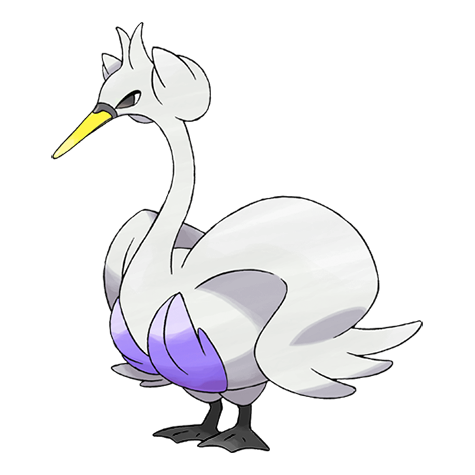
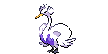
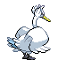
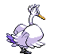

# #581 Swanna (White Bird Pokémon)

| Official Artwork | Shiny Artwork |
|------------------|---------------|
|  |  |

**Blaze Black:** Swanna start to dance at dusk. The one dancing in the middle is the leader of the flock.

**Volt White:** It administers sharp, powerful pecks with its bill. It whips its long neck to deliver forceful repeated strikes.

---

## Media

### Default Sprites

| Front | Shiny | Back | Shiny |
|-------|-------|------|-------|
|  |  |  |  |

### Cries

Latest (Gen VI+):

<audio controls>
<source src='../../assets/cries/swanna/latest.ogg' type='audio/ogg'>
  Your browser does not support the audio element.
</audio>

Legacy:

<audio controls>
<source src='../../assets/cries/swanna/legacy.ogg' type='audio/ogg'>
  Your browser does not support the audio element.
</audio>

---

## Pokédex Data

| National № | Type(s) | Height | Weight | Abilities | Local № |
|------------|---------|--------|--------|-----------|---------|
| #581 | {: width="48"} {: width="48"} | 1.3 m / 4.3 ft | 24.2 kg / 53.4 lbs | 1. Hydration 2. Big Pecks | N/A |

---

## Base Stats
|   | HP | Attack | Defense | Sp. Atk | Sp. Def | Speed |
|---|----|--------|---------|---------|---------|-------|
| **Base** | 75 | 97 | 63 | 97 | 63 | 108 |
| **Min** | 260 | 179 | 117 | 179 | 117 | 198 |
| **Max** | 354 | 322 | 247 | 322 | 247 | 346 |

The ranges shown above are for a level 100 Pokémon. Maximum values are based on a beneficial nature, 252 EVs, 31 IVs; minimum values are based on a hindering nature, 0 EVs, 0 IVs.

---

## Forms & Evolutions

!!! warning "WARNING"

    Information on evolutions may not be 100% accurate; differences between evolution methods across generations are not accounted for.

### Forms

Swanna has no alternate forms.

### Evolution Line

1. [Ducklett](ducklett.md/)
    1. Level Up: [Swanna](swanna.md/)

---

## Training

| EV Yield | Catch Rate | Base Friendship | Base Exp. | Growth Rate | Held Items |
|----------|------------|-----------------|-----------|-------------|------------|
| 2 Spd | 45 | 70 | 166 | Medium | N/A |

---

## Breeding

| Egg Groups | Egg Cycles | Gender | Dimorphic | Color | Shape |
|------------|------------|--------|-----------|-------|-------|
| 1. Water1 2. Flying | 20 | 50.0% Male 50.0% Female | False | White | Wings |

---

## Moves

!!! warning "WARNING"

    Specific move information may be incorrect. However, the general movepool should be accurate; this includes changes made in Blaze Black and Volt White.

### Level Up Moves

| Lv. | Move | Type | Cat. | Power | Acc. | PP |
| --- | --- | --- | --- | --- | --- | --- |
| 1 | Defog | {: width="48"} | {: width="36"} | — | — | 15 |
| 1 | Heat Wave | {: width="48"} | {: width="36"} | 95 | 90 | 10 |
| 1 | Water Gun | {: width="48"} | {: width="36"} | 40 | 100 | 25 |
| 1 | Water Sport | {: width="48"} | {: width="36"} | — | — | 15 |
| 1 | Wing Attack | {: width="48"} | {: width="36"} | 75 | 100 | 35 |
| 3 | Water Sport | {: width="48"} | {: width="36"} | — | — | 15 |
| 6 | Defog | {: width="48"} | {: width="36"} | — | — | 15 |
| 9 | Wing Attack | {: width="48"} | {: width="36"} | 75 | 100 | 35 |
| 13 | Water Pulse | {: width="48"} | {: width="36"} | 60 | 100 | 20 |
| 15 | Aerial Ace | {: width="48"} | {: width="36"} | 60 | — | 20 |
| 19 | Bubble Beam | {: width="48"} | {: width="36"} | 75 | 100 | 15 |
| 21 | Feather Dance | {: width="48"} | {: width="36"} | — | 100 | 15 |
| 24 | Aqua Ring | {: width="48"} | {: width="36"} | — | — | 20 |
| 27 | Air Slash | {: width="48"} | {: width="36"} | 75 | 95 | 15 |
| 30 | Roost | {: width="48"} | {: width="36"} | — | — | 5 |
| 34 | Rain Dance | {: width="48"} | {: width="36"} | — | — | 5 |
| 35 | Acrobatics | {: width="48"} | {: width="36"} | 55 | 100 | 15 |
| 40 | Tailwind | {: width="48"} | {: width="36"} | — | — | 15 |
| 47 | Brave Bird | {: width="48"} | {: width="36"} | 120 | 100 | 15 |
| 55 | Hurricane | {: width="48"} | {: width="36"} | 110 | 70 | 10 |

### TM Moves

| TM | Move | Type | Cat. | Power | Acc. | PP |
| --- | --- | --- | --- | --- | --- | --- |
| HM02 | Fly | {: width="48"} | {: width="36"} | 100 | 100% | 15 |
| HM03 | Surf | {: width="48"} | {: width="36"} | 90 | 100 | 15 |
| HM06 | Dive | {: width="48"} | {: width="36"} | 80 | 100 | 10 |
| TM06 | Toxic | {: width="48"} | {: width="36"} | — | 90 | 10 |
| TM07 | Hail | {: width="48"} | {: width="36"} | — | — | 10 |
| TM10 | Hidden Power | {: width="48"} | {: width="36"} | 60 | 100 | 15 |
| TM13 | Ice Beam | {: width="48"} | {: width="36"} | 90 | 100 | 10 |
| TM15 | Hyper Beam | {: width="48"} | {: width="36"} | 150 | 90 | 5 |
| TM17 | Protect | {: width="48"} | {: width="36"} | — | — | 10 |
| TM18 | Rain Dance | {: width="48"} | {: width="36"} | — | — | 5 |
| TM21 | Frustration | {: width="48"} | {: width="36"} | — | 100 | 20 |
| TM27 | Return | {: width="48"} | {: width="36"} | — | 100 | 20 |
| TM32 | Double Team | {: width="48"} | {: width="36"} | — | — | 15 |
| TM40 | Aerial Ace | {: width="48"} | {: width="36"} | 60 | — | 20 |
| TM42 | Facade | {: width="48"} | {: width="36"} | 70 | 100 | 20 |
| TM44 | Rest | {: width="48"} | {: width="36"} | — | — | 5 |
| TM45 | Attract | {: width="48"} | {: width="36"} | — | 100 | 15 |
| TM48 | Round | {: width="48"} | {: width="36"} | 60 | 100 | 15 |
| TM55 | Scald | {: width="48"} | {: width="36"} | 80 | 100 | 15 |
| TM62 | Acrobatics | {: width="48"} | {: width="36"} | 55 | 100 | 15 |
| TM68 | Giga Impact | {: width="48"} | {: width="36"} | 150 | 90 | 5 |
| TM87 | Swagger | {: width="48"} | {: width="36"} | — | 85 | 15 |
| TM88 | Pluck | {: width="48"} | {: width="36"} | 60 | 100 | 20 |
| TM90 | Substitute | {: width="48"} | {: width="36"} | — | — | 10 |

### Egg Moves

Swanna cannot learn any moves by breeding.
### Tutor Moves

Swanna cannot learn any moves from tutors.
