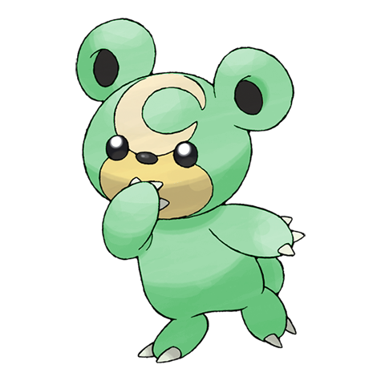
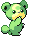
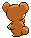

# #216 Teddiursa (Little Bear Pokémon)

| Official Artwork | Shiny Artwork |
|------------------|---------------|
|  |  |

It lets honey soak into its paws so it can lick them all the time. Every set of paws tastes unique.

---

## Media

### Default Sprites

| Front | Shiny | Back | Shiny |
|-------|-------|------|-------|
|  |  |  |  |

### Cries

Latest (Gen VI+):

<audio controls>
<source src='../../assets/cries/teddiursa/latest.ogg' type='audio/ogg'>
  Your browser does not support the audio element.
</audio>

Legacy:

<audio controls>
<source src='../../assets/cries/teddiursa/legacy.ogg' type='audio/ogg'>
  Your browser does not support the audio element.
</audio>

---

## Pokédex Data

| National № | Type(s) | Height | Weight | Abilities | Local № |
|------------|---------|--------|--------|-----------|---------|
| #216 | {: width="48"} | 0.6 m / 2.0 ft | 8.8 kg / 19.4 lbs | 1. Pickup 2. Honey Gather | N/A |

---

## Base Stats
|   | HP | Attack | Defense | Sp. Atk | Sp. Def | Speed |
|---|----|--------|---------|---------|---------|-------|
| **Base** | 60 | 80 | 50 | 50 | 50 | 40 |
| **Min** | 230 | 148 | 94 | 94 | 94 | 76 |
| **Max** | 324 | 284 | 218 | 218 | 218 | 196 |

The ranges shown above are for a level 100 Pokémon. Maximum values are based on a beneficial nature, 252 EVs, 31 IVs; minimum values are based on a hindering nature, 0 EVs, 0 IVs.

---

## Forms & Evolutions

!!! warning "WARNING"

    Information on evolutions may not be 100% accurate; differences between evolution methods across generations are not accounted for.

### Forms

Teddiursa has no alternate forms.

### Evolution Line

1. [Teddiursa](teddiursa.md/)
    1. Level Up: [Ursaring](ursaring.md/)

---

## Training

| EV Yield | Catch Rate | Base Friendship | Base Exp. | Growth Rate | Held Items |
|----------|------------|-----------------|-----------|-------------|------------|
| 1 Atk | 120 | 70 | 66 | Mediu |

---

## Breeding

| Egg Groups | Egg Cycles | Gender | Dimorphic | Color | Shape |
|------------|------------|--------|-----------|-------|-------|
| 1. Ground | 20 | 50.0% Male 50.0% Female | False | Brown | Upright |

---

## Moves

!!! warning "WARNING"

    Specific move information may be incorrect. However, the general movepool should be accurate; this includes changes made in Blaze Black and Volt White.

### Level Up Moves

| Lv. | Move | Type | Cat. | Power | Acc. | PP |
| --- | --- | --- | --- | --- | --- | --- |
| 1 | Covet | {: width="48"} | {: width="36"} | 60 | 100 | 25 |
| 1 | Fake Tears | {: width="48"} | {: width="36"} | — | 100 | 20 |
| 1 | Leer | {: width="48"} | {: width="36"} | — | 100 | 30 |
| 1 | Lick | {: width="48"} | {: width="36"} | 30 | 100 | 30 |
| 1 | Scratch | {: width="48"} | {: width="36"} | 40 | 100 | 35 |
| 8 | Fury Swipes | {: width="48"} | {: width="36"} | 18 | 80 | 15 |
| 15 | Feint Attack | {: width="48"} | {: width="36"} | 60 | — | 20 |
| 22 | Sweet Scent | {: width="48"} | {: width="36"} | — | 100 | 20 |
| 29 | Slash | {: width="48"} | {: width="36"} | 70 | 100 | 20 |
| 36 | Charm | {: width="48"} | {: width="36"} | — | 100 | 20 |
| 43 | Rest | {: width="48"} | {: width="36"} | — | — | 5 |
| 43 | Snore | {: width="48"} | {: width="36"} | 50 | 100 | 15 |
| 50 | Thrash | {: width="48"} | {: width="36"} | 120 | 100 | 10 |
| 57 | Fling | {: width="48"} | {: width="36"} | — | 100 | 10 |

### TM Moves

| TM | Move | Type | Cat. | Power | Acc. | PP |
| --- | --- | --- | --- | --- | --- | --- |
| HM01 | Cut | {: width="48"} | {: width="36"} | 60 | 100% | 25 |
| HM04 | Strength | {: width="48"} | {: width="36"} | 100 | 100 | 15 |
| TM01 | Hone Claws | {: width="48"} | {: width="36"} | — | — | 15 |
| TM05 | Roar | {: width="48"} | {: width="36"} | — | — | 20 |
| TM06 | Toxic | {: width="48"} | {: width="36"} | — | 90 | 10 |
| TM08 | Bulk Up | {: width="48"} | {: width="36"} | — | — | 20 |
| TM10 | Hidden Power | {: width="48"} | {: width="36"} | 60 | 100 | 15 |
| TM11 | Sunny Day | {: width="48"} | {: width="36"} | — | — | 5 |
| TM12 | Taunt | {: width="48"} | {: width="36"} | — | 100 | 20 |
| TM17 | Protect | {: width="48"} | {: width="36"} | — | — | 10 |
| TM18 | Rain Dance | {: width="48"} | {: width="36"} | — | — | 5 |
| TM21 | Frustration | {: width="48"} | {: width="36"} | — | 100 | 20 |
| TM26 | Earthquake | {: width="48"} | {: width="36"} | 100 | 100 | 10 |
| TM27 | Return | {: width="48"} | {: width="36"} | — | 100 | 20 |
| TM28 | Dig | {: width="48"} | {: width="36"} | 100 | 100 | 10 |
| TM31 | Brick Break | {: width="48"} | {: width="36"} | 75 | 100 | 15 |
| TM32 | Double Team | {: width="48"} | {: width="36"} | — | — | 15 |
| TM39 | Rock Tomb | {: width="48"} | {: width="36"} | 60 | 95 | 15 |
| TM40 | Aerial Ace | {: width="48"} | {: width="36"} | 60 | — | 20 |
| TM41 | Torment | {: width="48"} | {: width="36"} | — | 100 | 15 |
| TM42 | Facade | {: width="48"} | {: width="36"} | 70 | 100 | 20 |
| TM44 | Rest | {: width="48"} | {: width="36"} | — | — | 5 |
| TM45 | Attract | {: width="48"} | {: width="36"} | — | 100 | 15 |
| TM46 | Thief | {: width="48"} | {: width="36"} | 60 | 100 | 25 |
| TM48 | Round | {: width="48"} | {: width="36"} | 60 | 100 | 15 |
| TM56 | Fling | {: width="48"} | {: width="36"} | — | 100 | 10 |
| TM65 | Shadow Claw | {: width="48"} | {: width="36"} | 80 | 100 | 15 |
| TM66 | Payback | {: width="48"} | {: width="36"} | 50 | 100 | 10 |
| TM67 | Retaliate | {: width="48"} | {: width="36"} | 70 | 100 | 5 |
| TM75 | Swords Dance | {: width="48"} | {: width="36"} | — | — | 20 |
| TM78 | Bulldoze | {: width="48"} | {: width="36"} | 80 | 100 | 20 |
| TM80 | Rock Slide | {: width="48"} | {: width="36"} | 75 | 90 | 10 |
| TM83 | Work Up | {: width="48"} | {: width="36"} | — | — | 30 |
| TM87 | Swagger | {: width="48"} | {: width="36"} | — | 85 | 15 |
| TM90 | Substitute | {: width="48"} | {: width="36"} | — | — | 10 |
| TM94 | Rock Smash | {: width="48"} | {: width="36"} | 60 | 100 | 15 |

### Egg Moves

| Move | Type | Cat. | Power | Acc. | PP |
| --- | --- | --- | --- | --- | --- |
| Take Down | {: width="48"} | {: width="36"} | 90 | 85 | 20 |
| Double Edge | {: width="48"} | {: width="36"} | 120 | 100 | 15 |
| Counter | {: width="48"} | {: width="36"} | — | 100 | 20 |
| Seismic Toss | {: width="48"} | {: width="36"} | — | 100 | 20 |
| Belly Drum | {: width="48"} | {: width="36"} | — | — | 10 |
| Sleep Talk | {: width="48"} | {: width="36"} | — | — | 10 |
| Metal Claw | {: width="48"} | {: width="36"} | 50 | 95 | 35 |
| Cross Chop | {: width="48"} | {: width="36"} | 100 | 80 | 5 |
| Crunch | {: width="48"} | {: width="36"} | 80 | 100 | 15 |
| Yawn | {: width="48"} | {: width="36"} | — | — | 10 |
| Fake Tears | {: width="48"} | {: width="36"} | — | 100 | 20 |
| Close Combat | {: width="48"} | {: width="36"} | 120 | 100 | 5 |
| Night Slash | {: width="48"} | {: width="36"} | 70 | 100 | 15 |
| Chip Away | {: width="48"} | {: width="36"} | 70 | 100 | 20 |

### Tutor Moves

Teddiursa cannot learn any moves from tutors.
