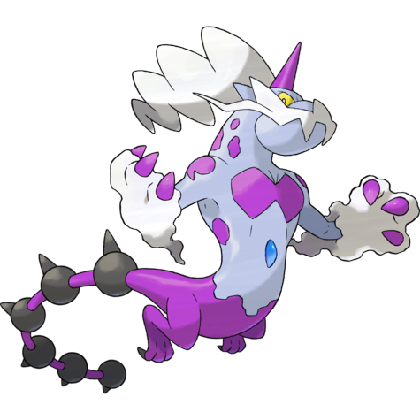
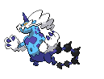
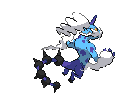
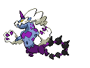
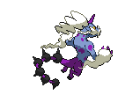

# #10020 Thundurus Therian (Bolt Strike Pokémon)

| Official Artwork | Shiny Artwork |
| --- | --- |
|  |  |

**Blaze Black:** Countless charred remains mar the landscape of places through which Thundurus has passed.

**Volt White:** The spikes on its tail discharge immense bolts of lightning. It flies around the Unova region firing off lightning bolts.

---

## Media

### Default Sprites

| Front | Back | Front Shiny | Back Shiny |
| --- | --- | --- | --- |
|  |  |  |  |

### Cries

Latest (Gen VI+):

<audio controls>
<source src='../../assets/cries/thundurus-therian/latest.ogg' type='audio/ogg'>
  Your browser does not support the audio element.
</audio>

---

## Pokédex Data

| National № | Type(s) | Height | Weight | Abilities | Local № |
|------------|---------|--------|--------|-----------|---------|
| #10020 | {: width='48'} {: width='48'} | 3.0 m | 61.0 kg | 1. Volt-Absorb | #148 |

---

## Base Stats
|   | HP | Attack | Defense | Sp. Atk | Sp. Def | Speed |
|---|----|--------|---------|---------|---------|-------|
| **Base** | 79 | 105 | 70 | 145 | 80 | 101 |
| **Min** | 268 | 193 | 130 | 265 | 148 | 186 |
| **Max** | 362 | 339 | 262 | 427 | 284 | 331 |

The ranges shown above are for a level 100 Pokémon. Maximum values are based on a beneficial nature, 252 EVs, 31 IVs; minimum values are based on a hindering nature, 0 EVs, 0 IVs.

---

## Forms & Evolutions

!!! warning "WARNING"

    Information on evolutions may not be 100% accurate; differences between evolution methods across generations are not accounted for.

### Forms

1. [Thundurus Incarnate](thundurus-incarnate.md/)

2. [Thundurus Therian](thundurus-therian.md/)

### Evolution Line

1. [Thundurus Incarnate](thundurus-incarnate.md/)

1. [Thundurus Therian](thundurus-therian.md/)

---

## Training

| EV Yield | Catch Rate | Base Friendship | Base Exp. | Growth Rate | Held Items |
|----------|------------|-----------------|-----------|-------------|------------|
| 3 Special Attack | 3 | 90 | 290 | Slow | N/A |

---

## Breeding

| Egg Groups | Egg Cycles | Gender | Dimorphic | Color | Shape |
|------------|------------|--------|-----------|-------|-------|
| 1. No-Eggs | 120 | 100.0% Male 0.0% Female | False | Blue | Arms |

---

## Moves

!!! warning "WARNING"

    Specific move information may be incorrect. However, the general movepool should be accurate; this includes changes made in Blaze Black and Volt White.

### Level Up Moves

| Lv. | Move | Type | Cat. | Power | Acc. | PP |
| --- | --- | --- | --- | --- | --- | --- |
| 1 | Astonish | {: width='48'} | {: width='36'} | 30 | 100 | 15 |
| 1 | Hammer Arm | {: width='48'} | {: width='36'} | 100 | 90 | 10 |
| 1 | Nasty Plot | {: width='48'} | {: width='36'} | — | — | 20 |
| 1 | Swagger | {: width='48'} | {: width='36'} | — | 85 | 15 |
| 1 | Thrash | {: width='48'} | {: width='36'} | 120 | 100 | 10 |
| 1 | Thunder Shock | {: width='48'} | {: width='36'} | 40 | 100 | 30 |
| 1 | Uproar | {: width='48'} | {: width='36'} | 90 | 100 | 10 |
| 7 | Bite | {: width='48'} | {: width='36'} | 60 | 100 | 25 |
| 13 | Revenge | {: width='48'} | {: width='36'} | 60 | 100 | 10 |
| 19 | Shock Wave | {: width='48'} | {: width='36'} | 70 | — | 20 |
| 25 | Heal Block | {: width='48'} | {: width='36'} | — | 100 | 15 |
| 31 | Agility | {: width='48'} | {: width='36'} | — | — | 30 |
| 37 | Discharge | {: width='48'} | {: width='36'} | 80 | 100 | 15 |
| 43 | Crunch | {: width='48'} | {: width='36'} | 80 | 100 | 15 |
| 49 | Charge | {: width='48'} | {: width='36'} | — | — | 20 |
| 55 | Nasty Plot | {: width='48'} | {: width='36'} | — | — | 20 |
| 61 | Thunder | {: width='48'} | {: width='36'} | 110 | 70 | 10 |
| 67 | Dark Pulse | {: width='48'} | {: width='36'} | 90 | 100 | 15 |
| 73 | Hammer Arm | {: width='48'} | {: width='36'} | 100 | 90 | 10 |
| 79 | Thrash | {: width='48'} | {: width='36'} | 120 | 100 | 10 |

### TM Moves

| TM | Move | Type | Cat. | Power | Acc. | PP |
| --- | --- | --- | --- | --- | --- | --- |
| TM06 | Toxic | {: width='48'} | {: width='36'} | — | 90 | 10 |
| TM08 | Bulk Up | {: width='48'} | {: width='36'} | — | — | 20 |
| TM10 | Hidden Power | {: width='48'} | {: width='36'} | 60 | 100 | 15 |
| TM100 | Confide | {: width='48'} | {: width='36'} | — | — | 20 |
| TM12 | Taunt | {: width='48'} | {: width='36'} | — | 100 | 20 |
| TM15 | Hyper Beam | {: width='48'} | {: width='36'} | 150 | 90 | 5 |
| TM17 | Protect | {: width='48'} | {: width='36'} | — | — | 10 |
| TM18 | Rain Dance | {: width='48'} | {: width='36'} | — | — | 5 |
| TM21 | Frustration | {: width='48'} | {: width='36'} | — | 100 | 20 |
| TM23 | Smack Down | {: width='48'} | {: width='36'} | 50 | 100 | 15 |
| TM24 | Thunderbolt | {: width='48'} | {: width='36'} | 90 | 100 | 15 |
| TM25 | Thunder | {: width='48'} | {: width='36'} | 110 | 70 | 10 |
| TM27 | Return | {: width='48'} | {: width='36'} | — | 100 | 20 |
| TM29 | Psychic | {: width='48'} | {: width='36'} | 90 | 100 | 10 |
| TM31 | Brick Break | {: width='48'} | {: width='36'} | 75 | 100 | 15 |
| TM32 | Double Team | {: width='48'} | {: width='36'} | — | — | 15 |
| TM34 | Sludge Wave | {: width='48'} | {: width='36'} | 95 | 100 | 10 |
| TM36 | Sludge Bomb | {: width='48'} | {: width='36'} | 90 | 100 | 10 |
| TM41 | Torment | {: width='48'} | {: width='36'} | — | 100 | 15 |
| TM42 | Facade | {: width='48'} | {: width='36'} | 70 | 100 | 20 |
| TM44 | Rest | {: width='48'} | {: width='36'} | — | — | 5 |
| TM45 | Attract | {: width='48'} | {: width='36'} | — | 100 | 15 |
| TM46 | Thief | {: width='48'} | {: width='36'} | 60 | 100 | 25 |
| TM48 | Round | {: width='48'} | {: width='36'} | 60 | 100 | 15 |
| TM52 | Focus Blast | {: width='48'} | {: width='36'} | 120 | 70 | 5 |
| TM56 | Fling | {: width='48'} | {: width='36'} | — | 100 | 10 |
| TM57 | Charge Beam | {: width='48'} | {: width='36'} | 50 | 90 | 10 |
| TM58 | Sky Drop | {: width='48'} | {: width='36'} | 80 | 100 | 10 |
| TM59 | Brutal Swing | {: width='48'} | {: width='36'} | 60 | 100 | 20 |
| TM63 | Embargo | {: width='48'} | {: width='36'} | — | 100 | 15 |
| TM66 | Payback | {: width='48'} | {: width='36'} | 50 | 100 | 10 |
| TM68 | Giga Impact | {: width='48'} | {: width='36'} | 150 | 90 | 5 |
| TM72 | Volt Switch | {: width='48'} | {: width='36'} | 70 | 100 | 20 |
| TM73 | Thunder Wave | {: width='48'} | {: width='36'} | — | 90 | 20 |
| TM76 | Fly | {: width='48'} | {: width='36'} | 100 | 100% | 15 |
| TM86 | Grass Knot | {: width='48'} | {: width='36'} | — | 100 | 20 |
| TM87 | Swagger | {: width='48'} | {: width='36'} | — | 85 | 15 |
| TM88 | Sleep Talk | {: width='48'} | {: width='36'} | — | — | 10 |
| TM89 | U Turn | {: width='48'} | {: width='36'} | 70 | 100 | 20 |
| TM90 | Substitute | {: width='48'} | {: width='36'} | — | — | 10 |
| TM91 | Flash Cannon | {: width='48'} | {: width='36'} | 80 | 100 | 10 |
| TM93 | Wild Charge | {: width='48'} | {: width='36'} | 90 | 100 | 15 |
| TM97 | Dark Pulse | {: width='48'} | {: width='36'} | 90 | 100 | 15 |

### Egg Moves

Thundurus Therian cannot learn any moves by breeding.
### Tutor Moves

| Move | Type | Cat. | Power | Acc. | PP |
| --- | --- | --- | --- | --- | --- |
| Thunder Punch | {: width='48'} | {: width='36'} | 80 | 100 | 15 |
| Snore | {: width='48'} | {: width='36'} | 50 | 100 | 15 |
| Iron Tail | {: width='48'} | {: width='36'} | 100 | 75 | 15 |
| Uproar | {: width='48'} | {: width='36'} | 90 | 100 | 10 |
| Role Play | {: width='48'} | {: width='36'} | — | — | 10 |
| Superpower | {: width='48'} | {: width='36'} | 120 | 100 | 5 |
| Knock Off | {: width='48'} | {: width='36'} | 65 | 100 | 20 |
| Shock Wave | {: width='48'} | {: width='36'} | 70 | — | 20 |
| Defog | {: width='48'} | {: width='36'} | — | — | 15 |
| Foul Play | {: width='48'} | {: width='36'} | 95 | 100 | 15 |
| Electroweb | {: width='48'} | {: width='36'} | 55 | 95 | 15 |

