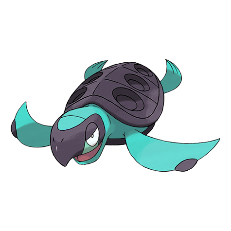
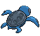
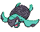
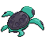

# #564 Tirtouga (Prototurtle Pokémon)

| Official Artwork | Shiny Artwork |
| --- | --- |
|  |  |

**Blaze Black:** Restored from a fossil, this Pokémon can dive to depths beyond half a mile.

**Volt White:** About 100 million years ago, these Pokémon swam in oceans. It is thought they also went on land to attack prey.

---

## Media

### Default Sprites

| Front | Back | Front Shiny | Back Shiny |
| --- | --- | --- | --- |
|  |  |  |  |

### Cries

Latest (Gen VI+):

<audio controls>
<source src='../../assets/cries/tirtouga/latest.ogg' type='audio/ogg'>
  Your browser does not support the audio element.
</audio>

Legacy:

<audio controls>
<source src='../../assets/cries/tirtouga/legacy.ogg' type='audio/ogg'>
  Your browser does not support the audio element.
</audio>

---

## Pokédex Data

| National № | Type(s) | Height | Weight | Abilities | Local № |
|------------|---------|--------|--------|-----------|---------|
| #564 | {: width="48"} {: width="48"} | 0.7 m / 2.3 ft | 16.5 kg / 36.4 lbs | Solid Rock Sturdy | #70 |

---

## Base Stats
|   | HP | Attack | Defense | Sp. Atk | Sp. Def | Speed |
|---|----|--------|---------|---------|---------|-------|
| **Base** | 54 | 78 | 103 | 53 | 45 | 22 |
| **Min** | 218 | 144 | 189 | 99 | 85 | 44 |
| **Max** | 312 | 280 | 335 | 225 | 207 | 157 |

The ranges shown above are for a level 100 Pokémon. Maximum values are based on a beneficial nature, 252 EVs, 31 IVs; minimum values are based on a hindering nature, 0 EVs, 0 IVs.

---

## Forms & Evolutions

!!! warning "WARNING"

    Information on evolutions may not be 100% accurate; differences between evolution methods across generations are not accounted for.

### Forms

Tirtouga has no alternate forms.

### Evolution Line

1. [Tirtouga](tirtouga.md/)
    1. Level Up: [Carracosta](carracosta.md/)

---

## Training

| EV Yield | Catch Rate | Base Friendship | Base Exp. | Growth Rate | Held Items |
|----------|------------|-----------------|-----------|-------------|------------|
| 1 Defense | 45 | 50 | 71 | Medium | N/A |

---

## Breeding

| Egg Groups | Egg Cycles | Gender | Dimorphic | Color | Shape |
|------------|------------|--------|-----------|-------|-------|
| 1. Water1 2. Water3 | 30 | 87.5% Male 12.5% Female | False | Blue | Quadruped |

---

## Moves

!!! warning "WARNING"

    Specific move information may be incorrect. However, the general movepool should be accurate; this includes changes made in Blaze Black and Volt White.

### Level Up Moves

| Lv. | Move | Type | Cat. | Power | Acc. | PP |
| --- | --- | --- | --- | --- | --- | --- |
| 1 | Bide | {: width="48"} | {: width="36"} | — | — | 10 |
| 1 | Water Gun | {: width="48"} | {: width="36"} | 40 | 100 | 25 |
| 1 | Withdraw | {: width="48"} | {: width="36"} | — | — | 40 |
| 5 | Rollout | {: width="48"} | {: width="36"} | 30 | 90 | 20 |
| 8 | Bite | {: width="48"} | {: width="36"} | 60 | 100 | 25 |
| 11 | Protect | {: width="48"} | {: width="36"} | — | — | 10 |
| 15 | Aqua Jet | {: width="48"} | {: width="36"} | 40 | 100 | 20 |
| 18 | Ancient Power | {: width="48"} | {: width="36"} | 60 | 100 | 5 |
| 21 | Crunch | {: width="48"} | {: width="36"} | 80 | 100 | 15 |
| 25 | Wide Guard | {: width="48"} | {: width="36"} | — | — | 10 |
| 28 | Scald | {: width="48"} | {: width="36"} | 80 | 100 | 15 |
| 31 | Smack Down | {: width="48"} | {: width="36"} | 50 | 100 | 15 |
| 35 | Curse | {: width="48"} | {: width="36"} | — | — | 10 |
| 38 | Shell Smash | {: width="48"} | {: width="36"} | — | — | 15 |
| 41 | Aqua Tail | {: width="48"} | {: width="36"} | 90 | 90 | 10 |
| 45 | Rock Slide | {: width="48"} | {: width="36"} | 75 | 90 | 10 |
| 48 | Rain Dance | {: width="48"} | {: width="36"} | — | — | 5 |
| 51 | Hydro Pump | {: width="48"} | {: width="36"} | 110 | 80 | 5 |

### TM Moves

| TM | Move | Type | Cat. | Power | Acc. | PP |
| --- | --- | --- | --- | --- | --- | --- |
| HM03 | Surf | {: width="48"} | {: width="36"} | 90 | 100 | 15 |
| HM04 | Strength | {: width="48"} | {: width="36"} | 100 | 100 | 15 |
| HM05 | Waterfall | {: width="48"} | {: width="36"} | 85 | 100 | 15 |
| HM06 | Dive | {: width="48"} | {: width="36"} | 80 | 100 | 10 |
| TM06 | Toxic | {: width="48"} | {: width="36"} | — | 90 | 10 |
| TM10 | Hidden Power | {: width="48"} | {: width="36"} | 60 | 100 | 15 |
| TM13 | Ice Beam | {: width="48"} | {: width="36"} | 90 | 100 | 10 |
| TM14 | Blizzard | {: width="48"} | {: width="36"} | 110 | 70 | 5 |
| TM17 | Protect | {: width="48"} | {: width="36"} | — | — | 10 |
| TM18 | Rain Dance | {: width="48"} | {: width="36"} | — | — | 5 |
| TM21 | Frustration | {: width="48"} | {: width="36"} | — | 100 | 20 |
| TM23 | Smack Down | {: width="48"} | {: width="36"} | 50 | 100 | 15 |
| TM26 | Earthquake | {: width="48"} | {: width="36"} | 100 | 100 | 10 |
| TM27 | Return | {: width="48"} | {: width="36"} | — | 100 | 20 |
| TM28 | Dig | {: width="48"} | {: width="36"} | 100 | 100 | 10 |
| TM32 | Double Team | {: width="48"} | {: width="36"} | — | — | 15 |
| TM37 | Sandstorm | {: width="48"} | {: width="36"} | — | — | 10 |
| TM39 | Rock Tomb | {: width="48"} | {: width="36"} | 60 | 95 | 15 |
| TM42 | Facade | {: width="48"} | {: width="36"} | 70 | 100 | 20 |
| TM44 | Rest | {: width="48"} | {: width="36"} | — | — | 5 |
| TM45 | Attract | {: width="48"} | {: width="36"} | — | 100 | 15 |
| TM48 | Round | {: width="48"} | {: width="36"} | 60 | 100 | 15 |
| TM55 | Scald | {: width="48"} | {: width="36"} | 80 | 100 | 15 |
| TM69 | Rock Polish | {: width="48"} | {: width="36"} | — | — | 20 |
| TM71 | Stone Edge | {: width="48"} | {: width="36"} | 100 | 80 | 5 |
| TM78 | Bulldoze | {: width="48"} | {: width="36"} | 80 | 100 | 20 |
| TM80 | Rock Slide | {: width="48"} | {: width="36"} | 75 | 90 | 10 |
| TM87 | Swagger | {: width="48"} | {: width="36"} | — | 85 | 15 |
| TM90 | Substitute | {: width="48"} | {: width="36"} | — | — | 10 |
| TM94 | Rock Smash | {: width="48"} | {: width="36"} | 60 | 100 | 15 |

### Egg Moves

| Move | Type | Cat. | Power | Acc. | PP |
| --- | --- | --- | --- | --- | --- |
| Slam | {: width="48"} | {: width="36"} | 80 | 75 | 20 |
| Body Slam | {: width="48"} | {: width="36"} | 85 | 100 | 15 |
| Rock Throw | {: width="48"} | {: width="36"} | 50 | 90 | 15 |
| Bide | {: width="48"} | {: width="36"} | — | — | 10 |
| Flail | {: width="48"} | {: width="36"} | — | 100 | 15 |
| Whirlpool | {: width="48"} | {: width="36"} | 35 | 85 | 15 |
| Knock Off | {: width="48"} | {: width="36"} | 65 | 100 | 20 |
| Iron Defense | {: width="48"} | {: width="36"} | — | — | 15 |
| Water Pulse | {: width="48"} | {: width="36"} | 60 | 100 | 20 |

### Tutor Moves

Tirtouga cannot learn any moves from tutors.
