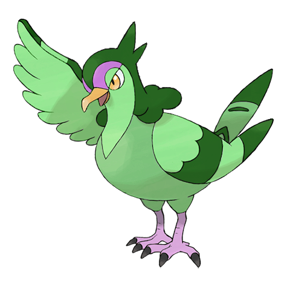

# #520 Tranquill (Wild Pigeon Pokémon)

| Official Artwork | Shiny Artwork |
| --- | --- |
|  |  |

**Blaze Black:** It can return to its Trainer’s location regardless of the distance separating them.

**Volt White:** Many people believe that, deep in the forest where Tranquill live, there is a peaceful place where there is no war.

---

## Media

### Default Sprites

| Front | Back | Front Shiny | Back Shiny |
| --- | --- | --- | --- |
|  |  |  |  |

### Cries

Latest (Gen VI+):

<audio controls>
<source src='../../assets/cries/tranquill/latest.ogg' type='audio/ogg'>
  Your browser does not support the audio element.
</audio>

Legacy:

<audio controls>
<source src='../../assets/cries/tranquill/legacy.ogg' type='audio/ogg'>
  Your browser does not support the audio element.
</audio>

---

## Pokédex Data

| National № | Type(s) | Height | Weight | Abilities | Local № |
|------------|---------|--------|--------|-----------|---------|
| #520 | {: width="48"} {: width="48"} | 0.6 m / 2.0 ft | 15.0 kg / 33.1 lbs | Rivalry Super Luck | #26 |

---

## Base Stats
|   | HP | Attack | Defense | Sp. Atk | Sp. Def | Speed |
|---|----|--------|---------|---------|---------|-------|
| **Base** | 62 | 50 | 42 | 77 | 62 | 65 |
| **Min** | 234 | 94 | 80 | 143 | 116 | 121 |
| **Max** | 328 | 218 | 201 | 278 | 245 | 251 |

The ranges shown above are for a level 100 Pokémon. Maximum values are based on a beneficial nature, 252 EVs, 31 IVs; minimum values are based on a hindering nature, 0 EVs, 0 IVs.

---

## Forms & Evolutions

!!! warning "WARNING"

    Information on evolutions may not be 100% accurate; differences between evolution methods across generations are not accounted for.

### Forms

Tranquill has no alternate forms.

### Evolution Line

1. [Pidove](pidove.md/)
    1. Level Up: [Tranquill](tranquill.md/)
        1. Level Up: [Unfezant](unfezant.md/)

---

## Training

| EV Yield | Catch Rate | Base Friendship | Base Exp. | Growth Rate | Held Items |
|----------|------------|-----------------|-----------|-------------|------------|
| 2 Atk | 120 | 50 | 125 | Medium Slow | N/A |

---

## Breeding

| Egg Groups | Egg Cycles | Gender | Dimorphic | Color | Shape |
|------------|------------|--------|-----------|-------|-------|
| 1. Flying | 15 | 50.0% Male 50.0% Female | False | Gray | Wings |

---

## Moves

!!! warning "WARNING"

    Specific move information may be incorrect. However, the general movepool should be accurate; this includes changes made in Blaze Black and Volt White.

### Level Up Moves

| Lv. | Move | Type | Cat. | Power | Acc. | PP |
| --- | --- | --- | --- | --- | --- | --- |
| 1 | Growl | {: width="48"} | {: width="36"} | — | 100 | 40 |
| 1 | Gust | {: width="48"} | {: width="36"} | 40 | 100 | 35 |
| 1 | Leer | {: width="48"} | {: width="36"} | — | 100 | 30 |
| 1 | Quick Attack | {: width="48"} | {: width="36"} | 40 | 100 | 30 |
| 4 | Growl | {: width="48"} | {: width="36"} | — | 100 | 40 |
| 8 | Leer | {: width="48"} | {: width="36"} | — | 100 | 30 |
| 11 | Swift | {: width="48"} | {: width="36"} | 60 | — | 20 |
| 15 | Air Cutter | {: width="48"} | {: width="36"} | 60 | 95 | 25 |
| 18 | Roost | {: width="48"} | {: width="36"} | — | — | 5 |
| 23 | Detect | {: width="48"} | {: width="36"} | — | — | 5 |
| 27 | Taunt | {: width="48"} | {: width="36"} | — | 100 | 20 |
| 32 | Air Slash | {: width="48"} | {: width="36"} | 75 | 95 | 15 |
| 36 | Hyper Voice | {: width="48"} | {: width="36"} | 90 | 100 | 10 |
| 41 | Feather Dance | {: width="48"} | {: width="36"} | — | 100 | 15 |
| 45 | Swagger | {: width="48"} | {: width="36"} | — | 85 | 15 |
| 50 | Facade | {: width="48"} | {: width="36"} | 70 | 100 | 20 |
| 54 | Tailwind | {: width="48"} | {: width="36"} | — | — | 15 |
| 59 | Hurricane | {: width="48"} | {: width="36"} | 110 | 70 | 10 |

### TM Moves

| TM | Move | Type | Cat. | Power | Acc. | PP |
| --- | --- | --- | --- | --- | --- | --- |
| HM02 | Fly | {: width="48"} | {: width="36"} | 100 | 100% | 15 |
| TM06 | Toxic | {: width="48"} | {: width="36"} | — | 90 | 10 |
| TM10 | Hidden Power | {: width="48"} | {: width="36"} | 60 | 100 | 15 |
| TM11 | Sunny Day | {: width="48"} | {: width="36"} | — | — | 5 |
| TM12 | Taunt | {: width="48"} | {: width="36"} | — | 100 | 20 |
| TM17 | Protect | {: width="48"} | {: width="36"} | — | — | 10 |
| TM18 | Rain Dance | {: width="48"} | {: width="36"} | — | — | 5 |
| TM21 | Frustration | {: width="48"} | {: width="36"} | — | 100 | 20 |
| TM27 | Return | {: width="48"} | {: width="36"} | — | 100 | 20 |
| TM32 | Double Team | {: width="48"} | {: width="36"} | — | — | 15 |
| TM40 | Aerial Ace | {: width="48"} | {: width="36"} | 60 | — | 20 |
| TM42 | Facade | {: width="48"} | {: width="36"} | 70 | 100 | 20 |
| TM44 | Rest | {: width="48"} | {: width="36"} | — | — | 5 |
| TM45 | Attract | {: width="48"} | {: width="36"} | — | 100 | 15 |
| TM48 | Round | {: width="48"} | {: width="36"} | 60 | 100 | 15 |
| TM49 | Echoed Voice | {: width="48"} | {: width="36"} | 40 | 100 | 15 |
| TM83 | Work Up | {: width="48"} | {: width="36"} | — | — | 30 |
| TM87 | Swagger | {: width="48"} | {: width="36"} | — | 85 | 15 |
| TM88 | Pluck | {: width="48"} | {: width="36"} | 60 | 100 | 20 |
| TM89 | U Turn | {: width="48"} | {: width="36"} | 70 | 100 | 20 |
| TM90 | Substitute | {: width="48"} | {: width="36"} | — | — | 10 |

### Egg Moves

Tranquill cannot learn any moves by breeding.
### Tutor Moves

Tranquill cannot learn any moves from tutors.
