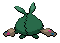
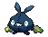

# #568 Trubbish (Trash Bag Pokémon)

| Official Artwork | Shiny Artwork |
| --- | --- |
|  |  |

**Blaze Black:** Inhaling the gas they belch will make you sleep for a week. They prefer unsanitary places.

**Volt White:** The combination of garbage bags and industrial waste caused the chemical reaction that created this Pokémon.

---

## Media

### Default Sprites

| Front | Back | Front Shiny | Back Shiny |
| --- | --- | --- | --- |
|  |  |  |  |

### Cries

Latest (Gen VI+):

<audio controls>
<source src='../../assets/cries/trubbish/latest.ogg' type='audio/ogg'>
  Your browser does not support the audio element.
</audio>

Legacy:

<audio controls>
<source src='../../assets/cries/trubbish/legacy.ogg' type='audio/ogg'>
  Your browser does not support the audio element.
</audio>

---

## Pokédex Data

| National № | Type(s) | Height | Weight | Abilities | Local № |
|------------|---------|--------|--------|-----------|---------|
| #568 | {: width="48"} | 0.6 m / 2.0 ft | 31.0 kg / 68.3 lbs | Stench Sticky Hold | #74 |

---

## Base Stats
|   | HP | Attack | Defense | Sp. Atk | Sp. Def | Speed |
|---|----|--------|---------|---------|---------|-------|
| **Base** | 50 | 50 | 62 | 40 | 62 | 65 |
| **Min** | 210 | 94 | 116 | 76 | 116 | 121 |
| **Max** | 304 | 218 | 245 | 196 | 245 | 251 |

The ranges shown above are for a level 100 Pokémon. Maximum values are based on a beneficial nature, 252 EVs, 31 IVs; minimum values are based on a hindering nature, 0 EVs, 0 IVs.

---

## Forms & Evolutions

!!! warning "WARNING"

    Information on evolutions may not be 100% accurate; differences between evolution methods across generations are not accounted for.

### Forms

Trubbish has no alternate forms.

### Evolution Line

1. [Trubbish](trubbish.md/)
    1. Level Up: [Garbodor](garbodor.md/)

---

## Training

| EV Yield | Catch Rate | Base Friendship | Base Exp. | Growth Rate | Held Items |
|----------|------------|-----------------|-----------|-------------|------------|
| 1 Speed | 190 | 50 | 66 | Medium | Nugget (1%) Black Sludge (5%) |

---

## Breeding

| Egg Groups | Egg Cycles | Gender | Dimorphic | Color | Shape |
|------------|------------|--------|-----------|-------|-------|
| 1. Mineral | 20 | 50.0% Male 50.0% Female | False | Green | Humanoid |

---

## Moves

!!! warning "WARNING"

    Specific move information may be incorrect. However, the general movepool should be accurate; this includes changes made in Blaze Black and Volt White.

### Level Up Moves

| Lv. | Move | Type | Cat. | Power | Acc. | PP |
| --- | --- | --- | --- | --- | --- | --- |
| 1 | Poison Gas | {: width="48"} | {: width="36"} | — | 90 | 40 |
| 1 | Pound | {: width="48"} | {: width="36"} | 40 | 100 | 35 |
| 3 | Recycle | {: width="48"} | {: width="36"} | — | — | 10 |
| 7 | Toxic Spikes | {: width="48"} | {: width="36"} | — | — | 20 |
| 12 | Acid Spray | {: width="48"} | {: width="36"} | 40 | 100 | 20 |
| 14 | Double Slap | {: width="48"} | {: width="36"} | 15 | 85 | 10 |
| 16 | Rollout | {: width="48"} | {: width="36"} | 30 | 90 | 20 |
| 18 | Sludge | {: width="48"} | {: width="36"} | 75 | 100 | 15 |
| 21 | Curse | {: width="48"} | {: width="36"} | — | — | 10 |
| 23 | Stockpile | {: width="48"} | {: width="36"} | — | — | 20 |
| 23 | Swallow | {: width="48"} | {: width="36"} | — | — | 10 |
| 25 | Take Down | {: width="48"} | {: width="36"} | 90 | 85 | 20 |
| 27 | Rock Blast | {: width="48"} | {: width="36"} | 25 | 90 | 10 |
| 29 | Sludge Bomb | {: width="48"} | {: width="36"} | 90 | 100 | 10 |
| 32 | Pain Split | {: width="48"} | {: width="36"} | — | — | 20 |
| 34 | Clear Smog | {: width="48"} | {: width="36"} | 50 | — | 15 |
| 36 | Toxic | {: width="48"} | {: width="36"} | — | 90 | 10 |
| 40 | Amnesia | {: width="48"} | {: width="36"} | — | — | 20 |
| 45 | Gunk Shot | {: width="48"} | {: width="36"} | 120 | 80 | 5 |
| 47 | Explosion | {: width="48"} | {: width="36"} | 250 | 100 | 5 |
| 49 | Self Destruct | {: width="48"} | {: width="36"} | 200 | 100 | 5 |

### TM Moves

| TM | Move | Type | Cat. | Power | Acc. | PP |
| --- | --- | --- | --- | --- | --- | --- |
| TM06 | Toxic | {: width="48"} | {: width="36"} | — | 90 | 10 |
| TM09 | Venoshock | {: width="48"} | {: width="36"} | 65 | 100 | 10 |
| TM10 | Hidden Power | {: width="48"} | {: width="36"} | 60 | 100 | 15 |
| TM11 | Sunny Day | {: width="48"} | {: width="36"} | — | — | 5 |
| TM17 | Protect | {: width="48"} | {: width="36"} | — | — | 10 |
| TM18 | Rain Dance | {: width="48"} | {: width="36"} | — | — | 5 |
| TM21 | Frustration | {: width="48"} | {: width="36"} | — | 100 | 20 |
| TM27 | Return | {: width="48"} | {: width="36"} | — | 100 | 20 |
| TM32 | Double Team | {: width="48"} | {: width="36"} | — | — | 15 |
| TM34 | Sludge Wave | {: width="48"} | {: width="36"} | 95 | 100 | 10 |
| TM36 | Sludge Bomb | {: width="48"} | {: width="36"} | 90 | 100 | 10 |
| TM42 | Facade | {: width="48"} | {: width="36"} | 70 | 100 | 20 |
| TM44 | Rest | {: width="48"} | {: width="36"} | — | — | 5 |
| TM45 | Attract | {: width="48"} | {: width="36"} | — | 100 | 15 |
| TM46 | Thief | {: width="48"} | {: width="36"} | 60 | 100 | 25 |
| TM48 | Round | {: width="48"} | {: width="36"} | 60 | 100 | 15 |
| TM64 | Explosion | {: width="48"} | {: width="36"} | 250 | 100 | 5 |
| TM66 | Payback | {: width="48"} | {: width="36"} | 50 | 100 | 10 |
| TM87 | Swagger | {: width="48"} | {: width="36"} | — | 85 | 15 |
| TM90 | Substitute | {: width="48"} | {: width="36"} | — | — | 10 |

### Egg Moves

| Move | Type | Cat. | Power | Acc. | PP |
| --- | --- | --- | --- | --- | --- |
| Sand Attack | {: width="48"} | {: width="36"} | — | 100 | 15 |
| Haze | {: width="48"} | {: width="36"} | — | — | 30 |
| Self Destruct | {: width="48"} | {: width="36"} | 200 | 100 | 5 |
| Curse | {: width="48"} | {: width="36"} | — | — | 10 |
| Spikes | {: width="48"} | {: width="36"} | — | — | 20 |
| Rollout | {: width="48"} | {: width="36"} | 30 | 90 | 20 |
| Mud Sport | {: width="48"} | {: width="36"} | — | — | 15 |
| Rock Blast | {: width="48"} | {: width="36"} | 25 | 90 | 10 |

### Tutor Moves

Trubbish cannot learn any moves from tutors.
