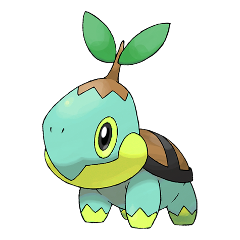

# #387 Turtwig (Tiny Leaf Pokémon)

| Official Artwork | Shiny Artwork |
| --- | --- |
|  |  |

The shell on its back is made of soil. On a very healthy Turtwig, the shell should feel moist.

---

## Media

### Sprites

| Front | Back | Front Shiny | Back Shiny |
| --- | --- | --- | --- |
|  |  |  |  |

### Cries

Latest (Gen VI+):

<audio controls>
<source src='../../assets/cries/turtwig/latest.ogg' type='audio/ogg'>
  Your browser does not support the audio element.
</audio>

Legacy:

<audio controls>
<source src='../../assets/cries/turtwig/legacy.ogg' type='audio/ogg'>
  Your browser does not support the audio element.
</audio>

---

## Pokédex Data

| National № | Type(s) | Height | Weight | Abilities | Local № |
|------------|---------|--------|--------|-----------|---------|
| #387 | {: width='48'} | 0.4 m | 10.2 kg | 1. Overgrow 2. Sturdy | N/A |

---

## Base Stats
|   | HP | Attack | Defense | Sp. Atk | Sp. Def | Speed |
|---|----|--------|---------|---------|---------|-------|
| **Base** | 55 | 68 | 64 | 45 | 55 | 31 |
| **Min** | 220 | 126 | 119 | 85 | 103 | 60 |
| **Max** | 314 | 258 | 249 | 207 | 229 | 177 |

The ranges shown above are for a level 100 Pokémon. Maximum values are based on a beneficial nature, 252 EVs, 31 IVs; minimum values are based on a hindering nature, 0 EVs, 0 IVs.

---

## Forms & Evolutions

!!! warning "WARNING"

    Information on evolutions may not be 100% accurate; differences between evolution methods across generations are not accounted for.

### Forms

Turtwig has no alternate forms.

### Evolution Line

1. [Turtwig](turtwig.md/)
    1. Level Up: [Grotle](grotle.md/)
        1. Level Up: [Torterra](torterra.md/)

### Evolution Changes

---

## Training

| EV Yield | Catch Rate | Base Friendship | Base Exp. | Growth Rate | Held Items |
|----------|------------|-----------------|-----------|-------------|------------|
| 1 Attack | 45 | 70 | 64 | Medium-Slow | N/A |

---

## Breeding

| Egg Groups | Egg Cycles | Gender | Dimorphic | Color | Shape |
|------------|------------|--------|-----------|-------|-------|
| 1. Monster 2. Plant | 20 | 87.5% Male 12.5% Female | False | Green | Quadruped |

---

## Moves

!!! warning "WARNING"

    Specific move information may be incorrect. However, the general movepool should be accurate; this includes changes made in Blaze Black and Volt White.

### Level Up Moves

| Lv. | Move | Type | Cat. | Power | Acc. | PP |
| --- | --- | --- | --- | --- | --- | --- |
| 1 | Tackle | {: width='48'} | {: width='36'} | 40 | 100 | 35 |
| 5 | Withdraw | {: width='48'} | {: width='36'} | — | — | 40 |
| 9 | Absorb | {: width='48'} | {: width='36'} | 50 | 100 | 25 |
| 13 | Razor Leaf | {: width='48'} | {: width='36'} | 55 | 95 | 25 |
| 17 | Curse | {: width='48'} | {: width='36'} | — | — | 10 |
| 21 | Bite | {: width='48'} | {: width='36'} | 60 | 100 | 25 |
| 25 | Mega Drain | {: width='48'} | {: width='36'} | 50 | 100 | 15 |
| 29 | Leech Seed | {: width='48'} | {: width='36'} | — | 90 | 10 |
| 33 | Synthesis | {: width='48'} | {: width='36'} | — | — | 5 |
| 37 | Crunch | {: width='48'} | {: width='36'} | 80 | 100 | 15 |
| 41 | Giga Drain | {: width='48'} | {: width='36'} | 75 | 100 | 10 |
| 45 | Leaf Storm | {: width='48'} | {: width='36'} | 130 | 90 | 5 |
| 49 | Seed Bomb | {: width='48'} | {: width='36'} | 80 | 100 | 15 |

### TM Moves

| TM | Move | Type | Cat. | Power | Acc. | PP |
| --- | --- | --- | --- | --- | --- | --- |
| HM01 | Cut | {: width='48'} | {: width='36'} | 60 | 100 | 20 |
| HM04 | Strength | {: width='48'} | {: width='36'} | 85 | 100 | 15 |
| TM06 | Toxic | {: width='48'} | {: width='36'} | — | 90 | 10 |
| TM10 | Hidden Power | {: width='48'} | {: width='36'} | 60 | 100 | 15 |
| TM11 | Sunny Day | {: width='48'} | {: width='36'} | — | — | 5 |
| TM16 | Light Screen | {: width='48'} | {: width='36'} | — | — | 30 |
| TM17 | Protect | {: width='48'} | {: width='36'} | — | — | 10 |
| TM20 | Safeguard | {: width='48'} | {: width='36'} | — | — | 25 |
| TM21 | Frustration | {: width='48'} | {: width='36'} | — | 100 | 20 |
| TM22 | Solar Beam | {: width='48'} | {: width='36'} | 120 | 100 | 10 |
| TM27 | Return | {: width='48'} | {: width='36'} | — | 100 | 20 |
| TM32 | Double Team | {: width='48'} | {: width='36'} | — | — | 15 |
| TM33 | Reflect | {: width='48'} | {: width='36'} | — | — | 20 |
| TM42 | Facade | {: width='48'} | {: width='36'} | 70 | 100 | 20 |
| TM44 | Rest | {: width='48'} | {: width='36'} | — | — | 5 |
| TM45 | Attract | {: width='48'} | {: width='36'} | — | 100 | 15 |
| TM48 | Round | {: width='48'} | {: width='36'} | 60 | 100 | 15 |
| TM53 | Energy Ball | {: width='48'} | {: width='36'} | 90 | 100 | 10 |
| TM70 | Flash | {: width='48'} | {: width='36'} | — | 100 | 20 |
| TM75 | Swords Dance | {: width='48'} | {: width='36'} | — | — | 20 |
| TM86 | Grass Knot | {: width='48'} | {: width='36'} | — | 100 | 20 |
| TM87 | Swagger | {: width='48'} | {: width='36'} | — | 85 | 15 |
| TM90 | Substitute | {: width='48'} | {: width='36'} | — | — | 10 |
| TM94 | Rock Smash | {: width='48'} | {: width='36'} | 40 | 100 | 15 |

### Egg Moves

| Move | Type | Cat. | Power | Acc. | PP |
| --- | --- | --- | --- | --- | --- |
| Body Slam | {: width='48'} | {: width='36'} | 85 | 100 | 15 |
| Thrash | {: width='48'} | {: width='36'} | 120 | 100 | 10 |
| Double Edge | {: width='48'} | {: width='36'} | 120 | 100 | 15 |
| Growth | {: width='48'} | {: width='36'} | — | — | 20 |
| Amnesia | {: width='48'} | {: width='36'} | — | — | 20 |
| Stockpile | {: width='48'} | {: width='36'} | — | — | 20 |
| Spit Up | {: width='48'} | {: width='36'} | — | 100 | 10 |
| Swallow | {: width='48'} | {: width='36'} | — | — | 10 |
| Superpower | {: width='48'} | {: width='36'} | 120 | 100 | 5 |
| Tickle | {: width='48'} | {: width='36'} | — | 100 | 20 |
| Sand Tomb | {: width='48'} | {: width='36'} | 35 | 85 | 15 |
| Worry Seed | {: width='48'} | {: width='36'} | — | 100 | 10 |
| Earth Power | {: width='48'} | {: width='36'} | 90 | 100 | 10 |
| Wide Guard | {: width='48'} | {: width='36'} | — | — | 10 |

### Tutor Moves

| Move | Type | Cat. | Power | Acc. | PP |
| --- | --- | --- | --- | --- | --- |
| Grass Pledge | {: width='48'} | {: width='36'} | 100 | 100 | 10 |

