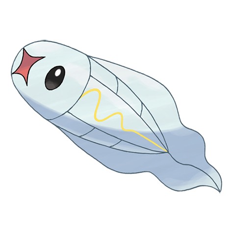

# #602 Tynamo (EleFish Pokémon)

| Official Artwork | Shiny Artwork |
| --- | --- |
|  |  |

**Blaze Black:** While one alone doesn’t have much power, a chain of many Tynamo can be as powerful as lightning.

**Volt White:** These Pokémon move in schools. They have an electricity-generating organ, so they discharge electricity if in danger.

---

## Media

### Default Sprites

| Front | Back | Front Shiny | Back Shiny |
| --- | --- | --- | --- |
|  |  |  |  |

### Cries

Latest (Gen VI+):

<audio controls>
<source src='../../assets/cries/tynamo/latest.ogg' type='audio/ogg'>
  Your browser does not support the audio element.
</audio>

Legacy:

<audio controls>
<source src='../../assets/cries/tynamo/legacy.ogg' type='audio/ogg'>
  Your browser does not support the audio element.
</audio>

---

## Pokédex Data

| National № | Type(s) | Height | Weight | Abilities | Local № |
|------------|---------|--------|--------|-----------|---------|
| #602 | {: width='48'} | 0.2 m | 0.3 kg | 1. Levitate | #108 |

---

## Base Stats
|   | HP | Attack | Defense | Sp. Atk | Sp. Def | Speed |
|---|----|--------|---------|---------|---------|-------|
| **Base** | 35 | 55 | 40 | 45 | 40 | 60 |
| **Min** | 180 | 103 | 76 | 85 | 76 | 112 |
| **Max** | 274 | 229 | 196 | 207 | 196 | 240 |

The ranges shown above are for a level 100 Pokémon. Maximum values are based on a beneficial nature, 252 EVs, 31 IVs; minimum values are based on a hindering nature, 0 EVs, 0 IVs.

---

## Forms & Evolutions

!!! warning "WARNING"

    Information on evolutions may not be 100% accurate; differences between evolution methods across generations are not accounted for.

### Forms

Tynamo has no alternate forms.

### Evolution Line

1. [Tynamo](tynamo.md/)
    1. Level Up: [Eelektrik](eelektrik.md/)
        1. Use Item: [Eelektross](eelektross.md/)

---

## Training

| EV Yield | Catch Rate | Base Friendship | Base Exp. | Growth Rate | Held Items |
|----------|------------|-----------------|-----------|-------------|------------|
| 1 Speed | 190 | 70 | 55 | Slow | N/A |

---

## Breeding

| Egg Groups | Egg Cycles | Gender | Dimorphic | Color | Shape |
|------------|------------|--------|-----------|-------|-------|
| 1. Indeterminate | 20 | 50.0% Male 50.0% Female | False | White | Fish |

---

## Moves

!!! warning "WARNING"

    Specific move information may be incorrect. However, the general movepool should be accurate; this includes changes made in Blaze Black and Volt White.

### Level Up Moves

| Lv. | Move | Type | Cat. | Power | Acc. | PP |
| --- | --- | --- | --- | --- | --- | --- |
| 1 | Charge Beam | {: width='48'} | {: width='36'} | 50 | 90 | 10 |
| 1 | Spark | {: width='48'} | {: width='36'} | 65 | 100 | 20 |
| 1 | Tackle | {: width='48'} | {: width='36'} | 40 | 100 | 35 |
| 1 | Thunder Wave | {: width='48'} | {: width='36'} | — | 90 | 20 |

### TM Moves

Tynamo cannot learn any TM moves.
### Egg Moves

Tynamo cannot learn any moves by breeding.
### Tutor Moves

Tynamo cannot learn any moves from tutors.
