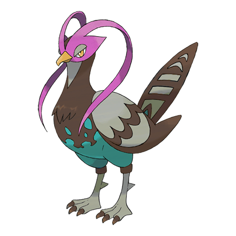
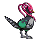
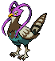
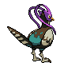
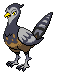
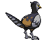
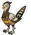
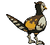

# #521 Unfezant (Proud Pokémon)

| Official Artwork | Shiny Artwork |
| --- | --- |
|  |  |

**Blaze Black:** Males swing their head plumage to threaten opponents. The females’ flying abilities surpass those of the males.

**Volt White:** Males have plumage on their heads. They will never let themselves feel close to anyone other than their Trainers.

---

## Media

### Sprites

| Front | Back | Front Shiny | Back Shiny |
| --- | --- | --- | --- |
|  |  |  |  |

### Female Sprites

| Front | Back | Front Shiny | Back Shiny |
| --- | --- | --- | --- |
|  |  |  |  |

### Cries

Latest (Gen VI+):

<audio controls>
  <source src='../assets/cries/521/latest.ogg' type='audio/ogg'>
  Your browser does not support the audio element.
</audio>

Legacy:

<audio controls>
  <source src='../assets/cries/521/legacy.ogg' type='audio/ogg'>
  Your browser does not support the audio element.
</audio>

---

## Pokédex Data

| National № | Type(s) | Height | Weight | Abilities | Local № |
|------------|---------|--------|--------|-----------|---------|
| #521 | {: width='48'} {: width='48'} | 1.2 m | 29.0 kg | 1. Serene-Grace 2. Super-Luck | #27 |

---

## Base Stats
---

## Base Stats
|   | HP | Attack | Defense | Sp. Atk | Sp. Def | Speed |
|---|----|--------|---------|---------|---------|-------|
| **Base** | 80 | 65 | 55 | 115 | 100 | 103 |
| **Min** | 270 | 121 | 103 | 211 | 184 | 189 |
| **Max** | 364 | 251 | 229 | 361 | 328 | 335 |

The ranges shown above are for a level 100 Pokémon. Maximum values are based on a beneficial nature, 252 EVs, 31 IVs; minimum values are based on a hindering nature, 0 EVs, 0 IVs.

---

## Forms & Evolutions

!!! warning "WARNING"

    Some forms may not be available in Blaze Black/Volt White. Also information on evolutions may not be 100% accurate; it is currently quite complex to track generational evolution data.

### Forms

Unfezant has no alternate forms.

### Evolution Line

1. [Pidove](pidove.md/)
1. Level Up: [Tranquill](tranquill.md/)
1. Level Up: [Unfezant](unfezant.md/)

---

## Training

| EV Yield | Catch Rate | Base Friendship | Base Exp. | Growth Rate | Held Items |
|----------|------------|-----------------|-----------|-------------|------------|
| 3 Attack | 45 | 50 | 244 | Medium-Slow | N/A |

---

## Breeding

| Egg Groups | Egg Cycles | Gender | Dimorphic | Color | Shape |
|------------|------------|--------|-----------|-------|-------|
| 1. Flying | 15 | 50.0% Male 50.0% Female | True | Gray | Wings |

---

## Moves

!!! warning "WARNING"

    Specific move information may be incorrect. However, the general movepool should be accurate (including changes to learnset).

### Level Up Moves

Lv. | Move | Type | Cat. | Power | Acc. | PP
--- | --- | --- | --- | --- | --- | ---
| 1 | Growl | {: width='48'} | {: width='36'} | — | 100 | 40 |
| 1 | Gust | {: width='48'} | {: width='36'} | 40 | 100 | 35 |
| 1 | Heat Wave | {: width='48'} | {: width='36'} | 95 | 90 | 10 |
| 1 | Hypnosis | {: width='48'} | {: width='36'} | — | 60 | 20 |
| 1 | Leer | {: width='48'} | {: width='36'} | — | 100 | 30 |
| 1 | Morning Sun | {: width='48'} | {: width='36'} | — | — | 5 |
| 1 | Ominous Wind | {: width='48'} | {: width='36'} | 60 | 100 | 5 |
| 1 | Quick Attack | {: width='48'} | {: width='36'} | 40 | 100 | 30 |
| 1 | Silver Wind | {: width='48'} | {: width='36'} | 60 | 100 | 5 |
| 4 | Growl | {: width='48'} | {: width='36'} | — | 100 | 40 |
| 8 | Leer | {: width='48'} | {: width='36'} | — | 100 | 30 |
| 11 | Swift | {: width='48'} | {: width='36'} | 60 | — | 20 |
| 15 | Air Cutter | {: width='48'} | {: width='36'} | 60 | 95 | 25 |
| 18 | Roost | {: width='48'} | {: width='36'} | — | — | 5 |
| 23 | Detect | {: width='48'} | {: width='36'} | — | — | 5 |
| 27 | Taunt | {: width='48'} | {: width='36'} | — | 100 | 20 |
| 33 | Air Slash | {: width='48'} | {: width='36'} | 75 | 95 | 15 |
| 38 | Hyper Voice | {: width='48'} | {: width='36'} | 90 | 100 | 10 |
| 44 | Feather Dance | {: width='48'} | {: width='36'} | — | 100 | 15 |
| 49 | Swagger | {: width='48'} | {: width='36'} | — | 85 | 15 |
| 55 | Facade | {: width='48'} | {: width='36'} | 70 | 100 | 20 |
| 60 | Tailwind | {: width='48'} | {: width='36'} | — | — | 15 |
| 66 | Hurricane | {: width='48'} | {: width='36'} | 110 | 70 | 10 |

### TM Moves

TM | Move | Type | Cat. | Power | Acc. | PP
--- | --- | --- | --- | --- | --- | ---
| HM02 | Fly | {: width='48'} | {: width='36'} | 100 | 100 | 15 |
| TM06 | Toxic | {: width='48'} | {: width='36'} | — | 90 | 10 |
| TM10 | Hidden Power | {: width='48'} | {: width='36'} | 60 | 100 | 15 |
| TM11 | Sunny Day | {: width='48'} | {: width='36'} | — | — | 5 |
| TM12 | Taunt | {: width='48'} | {: width='36'} | — | 100 | 20 |
| TM15 | Hyper Beam | {: width='48'} | {: width='36'} | 150 | 90 | 5 |
| TM17 | Protect | {: width='48'} | {: width='36'} | — | — | 10 |
| TM18 | Rain Dance | {: width='48'} | {: width='36'} | — | — | 5 |
| TM21 | Frustration | {: width='48'} | {: width='36'} | — | 100 | 20 |
| TM27 | Return | {: width='48'} | {: width='36'} | — | 100 | 20 |
| TM32 | Double Team | {: width='48'} | {: width='36'} | — | — | 15 |
| TM40 | Aerial Ace | {: width='48'} | {: width='36'} | 60 | — | 20 |
| TM42 | Facade | {: width='48'} | {: width='36'} | 70 | 100 | 20 |
| TM44 | Rest | {: width='48'} | {: width='36'} | — | — | 5 |
| TM45 | Attract | {: width='48'} | {: width='36'} | — | 100 | 15 |
| TM48 | Round | {: width='48'} | {: width='36'} | 60 | 100 | 15 |
| TM49 | Echoed Voice | {: width='48'} | {: width='36'} | 40 | 100 | 15 |
| TM68 | Giga Impact | {: width='48'} | {: width='36'} | 150 | 90 | 5 |
| TM77 | Psych Up | {: width='48'} | {: width='36'} | — | — | 10 |
| TM83 | Work Up | {: width='48'} | {: width='36'} | — | — | 30 |
| TM87 | Swagger | {: width='48'} | {: width='36'} | — | 85 | 15 |
| TM88 | Pluck | {: width='48'} | {: width='36'} | 60 | 100 | 20 |
| TM89 | U Turn | {: width='48'} | {: width='36'} | 70 | 100 | 20 |
| TM90 | Substitute | {: width='48'} | {: width='36'} | — | — | 10 |

### Egg Moves

Unfezant cannot learn any moves by breeding.
### Tutor Moves

Unfezant cannot learn any moves from tutors.
