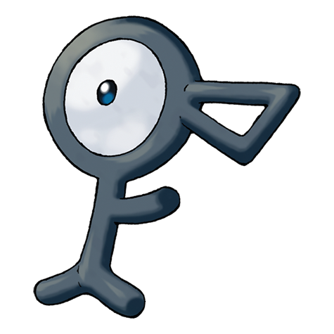

# #201 Unown (Symbol Pokémon)

| Official Artwork | Shiny Artwork |
| --- | --- |
|  |  |

When alone, nothing happens. However, if there are two or more, an odd power is said to emerge.

---

## Media

### Sprites

| Front | Back | Front Shiny | Back Shiny |
| --- | --- | --- | --- |
|  |  |  |  |

### Cries

Latest (Gen VI+):

<audio controls>
  <source src='../assets/cries/unown/latest.ogg' type='audio/ogg'>
  Your browser does not support the audio element.
</audio>

Legacy:

<audio controls>
  <source src='../assets/cries/unown/legacy.ogg' type='audio/ogg'>
  Your browser does not support the audio element.
</audio>

---

## Pokédex Data

| National № | Type(s) | Height | Weight | Abilities | Local № |
|------------|---------|--------|--------|-----------|---------|
| #201 | {: width='48'} | 0.5 m | 5.0 kg | 1. Levitate | #N/A |

---

## Base Stats
---

## Base Stats
|   | HP | Attack | Defense | Sp. Atk | Sp. Def | Speed |
|---|----|--------|---------|---------|---------|-------|
| **Base** | 48 | 112 | 48 | 112 | 48 | 88 |
| **Min** | 206 | 206 | 90 | 206 | 90 | 162 |
| **Max** | 300 | 355 | 214 | 355 | 214 | 302 |

The ranges shown above are for a level 100 Pokémon. Maximum values are based on a beneficial nature, 252 EVs, 31 IVs; minimum values are based on a hindering nature, 0 EVs, 0 IVs.

---

## Forms & Evolutions

!!! warning "WARNING"

    Some forms may not be available in Blaze Black/Volt White. Also information on evolutions may not be 100% accurate; it is currently quite complex to track generational evolution data.

### Forms

Unown has no alternate forms.

### Evolution Line

1. [Unown](unown.md/)

---

## Training

| EV Yield | Catch Rate | Base Friendship | Base Exp. | Growth Rate | Held Items |
|----------|------------|-----------------|-----------|-------------|------------|
| 1 Attack 1 Special Attack | 225 | 70 | 118 | Medium | N/A |

---

## Breeding

| Egg Groups | Egg Cycles | Gender | Dimorphic | Color | Shape |
|------------|------------|--------|-----------|-------|-------|
| 1. No-Eggs | 40 | Genderless | False | Black | Ball |

---

## Moves

!!! warning "WARNING"

    Specific move information may be incorrect. However, the general movepool should be accurate (including changes to learnset).

### Level Up Moves

Lv. | Move | Type | Cat. | Power | Acc. | PP
--- | --- | --- | --- | --- | --- | ---
| 1 | Hidden Power | {: width='48'} | {: width='36'} | 60 | 100 | 15 |
| 11 | Secret Power | {: width='48'} | {: width='36'} | 70 | 100 | 20 |
| 21 | Nature Power | {: width='48'} | {: width='36'} | — | — | 20 |
| 31 | Ancient Power | {: width='48'} | {: width='36'} | 60 | 100 | 5 |
| 41 | Cosmic Power | {: width='48'} | {: width='36'} | — | — | 20 |
| 51 | Earth Power | {: width='48'} | {: width='36'} | 90 | 100 | 10 |
| 61 | Stored Power | {: width='48'} | {: width='36'} | 20 | 100 | 10 |

### TM Moves

Unown cannot learn any TM moves.
### Egg Moves

Unown cannot learn any moves by breeding.
### Tutor Moves

Unown cannot learn any moves from tutors.
