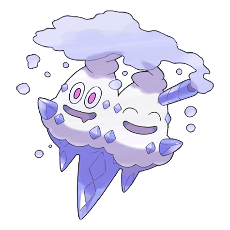

# #584 Vanilluxe (Snowstorm Pokémon)

| Official Artwork | Shiny Artwork |
| --- | --- |
|  |  |

**Blaze Black:** Swallowing large amounts of water, they make snow clouds inside their bodies and attack their foes with violent blizzards.

**Volt White:** If both heads get angry simultaneously, this Pokémon expels a blizzard, burying everything in snow.

---

## Media

### Default Sprites

| Front | Back | Front Shiny | Back Shiny |
| --- | --- | --- | --- |
|  |  |  |  |

### Cries

Latest (Gen VI+):

<audio controls>
<source src='../../assets/cries/vanilluxe/latest.ogg' type='audio/ogg'>
  Your browser does not support the audio element.
</audio>

Legacy:

<audio controls>
<source src='../../assets/cries/vanilluxe/legacy.ogg' type='audio/ogg'>
  Your browser does not support the audio element.
</audio>

---

## Pokédex Data

| National № | Type(s) | Height | Weight | Abilities | Local № |
|------------|---------|--------|--------|-----------|---------|
| #584 | {: width='48'} | 1.3 m | 57.5 kg | 1. Ice-Body 2. Weak-Armor | #90 |

---

## Base Stats
|   | HP | Attack | Defense | Sp. Atk | Sp. Def | Speed |
|---|----|--------|---------|---------|---------|-------|
| **Base** | 70 | 70 | 80 | 145 | 90 | 80 |
| **Min** | 250 | 130 | 148 | 265 | 166 | 148 |
| **Max** | 344 | 262 | 284 | 427 | 306 | 284 |

The ranges shown above are for a level 100 Pokémon. Maximum values are based on a beneficial nature, 252 EVs, 31 IVs; minimum values are based on a hindering nature, 0 EVs, 0 IVs.

---

## Forms & Evolutions

!!! warning "WARNING"

    Information on evolutions may not be 100% accurate; differences between evolution methods across generations are not accounted for.

### Forms

Vanilluxe has no alternate forms.

### Evolution Line

1. [Vanillite](vanillite.md/)
    1. Level Up: [Vanillish](vanillish.md/)
        1. Level Up: [Vanilluxe](vanilluxe.md/)

---

## Training

| EV Yield | Catch Rate | Base Friendship | Base Exp. | Growth Rate | Held Items |
|----------|------------|-----------------|-----------|-------------|------------|
| 3 Special Attack | 45 | 50 | 268 | Slow |  |

---

## Breeding

| Egg Groups | Egg Cycles | Gender | Dimorphic | Color | Shape |
|------------|------------|--------|-----------|-------|-------|
| 1. Mineral | 20 | 50.0% Male 50.0% Female | False | White | Heads |

---

## Moves

!!! warning "WARNING"

    Specific move information may be incorrect. However, the general movepool should be accurate; this includes changes made in Blaze Black and Volt White.

### Level Up Moves

| Lv. | Move | Type | Cat. | Power | Acc. | PP |
| --- | --- | --- | --- | --- | --- | --- |
| 1 | Astonish | {: width='48'} | {: width='36'} | 30 | 100 | 15 |
| 1 | Autotomize | {: width='48'} | {: width='36'} | — | — | 15 |
| 1 | Harden | {: width='48'} | {: width='36'} | — | — | 30 |
| 1 | Icicle Spear | {: width='48'} | {: width='36'} | 25 | 100 | 30 |
| 1 | Magnet Rise | {: width='48'} | {: width='36'} | — | — | 10 |
| 1 | Uproar | {: width='48'} | {: width='36'} | 90 | 100 | 10 |
| 1 | Weather Ball | {: width='48'} | {: width='36'} | 50 | 100 | 10 |
| 4 | Harden | {: width='48'} | {: width='36'} | — | — | 30 |
| 7 | Astonish | {: width='48'} | {: width='36'} | 30 | 100 | 15 |
| 10 | Uproar | {: width='48'} | {: width='36'} | 90 | 100 | 10 |
| 13 | Icy Wind | {: width='48'} | {: width='36'} | 55 | 95 | 15 |
| 16 | Mist | {: width='48'} | {: width='36'} | — | — | 30 |
| 19 | Avalanche | {: width='48'} | {: width='36'} | 60 | 100 | 10 |
| 22 | Taunt | {: width='48'} | {: width='36'} | — | 100 | 20 |
| 24 | Water Pulse | {: width='48'} | {: width='36'} | 60 | 100 | 20 |
| 26 | Mirror Shot | {: width='48'} | {: width='36'} | 65 | 85 | 10 |
| 29 | Ice Shard | {: width='48'} | {: width='36'} | 40 | 100 | 30 |
| 31 | Acid Armor | {: width='48'} | {: width='36'} | — | — | 20 |
| 33 | Extrasensory | {: width='48'} | {: width='36'} | 80 | 100 | 20 |
| 36 | Ice Beam | {: width='48'} | {: width='36'} | 90 | 100 | 10 |
| 42 | Hail | {: width='48'} | {: width='36'} | — | — | 10 |
| 50 | Mirror Coat | {: width='48'} | {: width='36'} | — | 100 | 20 |
| 59 | Blizzard | {: width='48'} | {: width='36'} | 110 | 70 | 5 |
| 67 | Sheer Cold | {: width='48'} | {: width='36'} | — | 30 | 5 |

### TM Moves

| TM | Move | Type | Cat. | Power | Acc. | PP |
| --- | --- | --- | --- | --- | --- | --- |
| TM06 | Toxic | {: width='48'} | {: width='36'} | — | 90 | 10 |
| TM07 | Hail | {: width='48'} | {: width='36'} | — | — | 10 |
| TM10 | Hidden Power | {: width='48'} | {: width='36'} | 60 | 100 | 15 |
| TM12 | Taunt | {: width='48'} | {: width='36'} | — | 100 | 20 |
| TM13 | Ice Beam | {: width='48'} | {: width='36'} | 90 | 100 | 10 |
| TM14 | Blizzard | {: width='48'} | {: width='36'} | 110 | 70 | 5 |
| TM15 | Hyper Beam | {: width='48'} | {: width='36'} | 150 | 90 | 5 |
| TM16 | Light Screen | {: width='48'} | {: width='36'} | — | — | 30 |
| TM17 | Protect | {: width='48'} | {: width='36'} | — | — | 10 |
| TM18 | Rain Dance | {: width='48'} | {: width='36'} | — | — | 5 |
| TM21 | Frustration | {: width='48'} | {: width='36'} | — | 100 | 20 |
| TM27 | Return | {: width='48'} | {: width='36'} | — | 100 | 20 |
| TM30 | Shadow Ball | {: width='48'} | {: width='36'} | 90 | 100 | 15 |
| TM32 | Double Team | {: width='48'} | {: width='36'} | — | — | 15 |
| TM42 | Facade | {: width='48'} | {: width='36'} | 70 | 100 | 20 |
| TM44 | Rest | {: width='48'} | {: width='36'} | — | — | 5 |
| TM45 | Attract | {: width='48'} | {: width='36'} | — | 100 | 15 |
| TM48 | Round | {: width='48'} | {: width='36'} | 60 | 100 | 15 |
| TM53 | Energy Ball | {: width='48'} | {: width='36'} | 90 | 100 | 10 |
| TM64 | Explosion | {: width='48'} | {: width='36'} | 250 | 100 | 5 |
| TM68 | Giga Impact | {: width='48'} | {: width='36'} | 150 | 90 | 5 |
| TM79 | Frost Breath | {: width='48'} | {: width='36'} | 60 | 90 | 10 |
| TM86 | Grass Knot | {: width='48'} | {: width='36'} | — | 100 | 20 |
| TM87 | Swagger | {: width='48'} | {: width='36'} | — | 85 | 15 |
| TM90 | Substitute | {: width='48'} | {: width='36'} | — | — | 10 |
| TM91 | Flash Cannon | {: width='48'} | {: width='36'} | 80 | 100 | 10 |

### Egg Moves

Vanilluxe cannot learn any moves by breeding.
### Tutor Moves

Vanilluxe cannot learn any moves from tutors.
