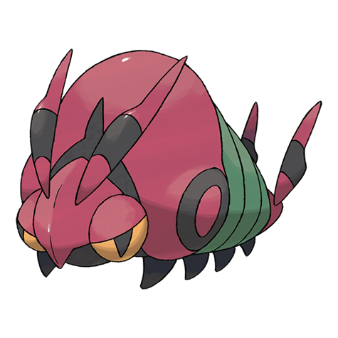
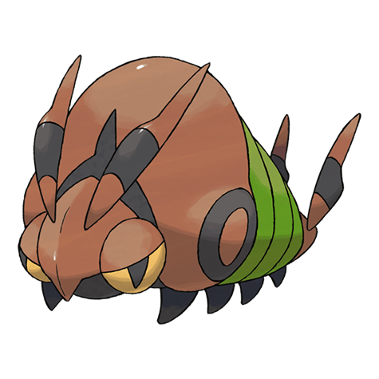
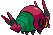
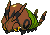
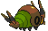

# #543 Venipede (Centipede Pokémon)

| Official Artwork | Shiny Artwork |
| --- | --- |
|  |  |

**Blaze Black:** Its bite injects a potent poison, enough to paralyze large bird Pokémon that try to prey on it.

**Volt White:** It discovers what is going on around it by using the feelers on its head and tail. It is brutally aggressive.

---

## Media

### Sprites

| Front | Back | Front Shiny | Back Shiny |
| --- | --- | --- | --- |
|  |  |  |  |

### Cries

Latest (Gen VI+):

<audio controls>
  <source src='../assets/cries/543/latest.ogg' type='audio/ogg'>
  Your browser does not support the audio element.
</audio>

Legacy:

<audio controls>
  <source src='../assets/cries/543/legacy.ogg' type='audio/ogg'>
  Your browser does not support the audio element.
</audio>

---

## Pokédex Data

| National № | Type(s) | Height | Weight | Abilities | Local № |
|------------|---------|--------|--------|-----------|---------|
| #543 | {: width='48'} {: width='48'} | 0.4 m | 5.3 kg | 1. Poison-Point 2. Swarm | #49 |

---

## Base Stats
---

## Base Stats
|   | HP | Attack | Defense | Sp. Atk | Sp. Def | Speed |
|---|----|--------|---------|---------|---------|-------|
| **Base** | 30 | 45 | 59 | 30 | 39 | 57 |
| **Min** | 170 | 85 | 110 | 58 | 74 | 107 |
| **Max** | 264 | 207 | 238 | 174 | 194 | 234 |

The ranges shown above are for a level 100 Pokémon. Maximum values are based on a beneficial nature, 252 EVs, 31 IVs; minimum values are based on a hindering nature, 0 EVs, 0 IVs.

---

## Forms & Evolutions

!!! warning "WARNING"

    Some forms may not be available in Blaze Black/Volt White. Also information on evolutions may not be 100% accurate; it is currently quite complex to track generational evolution data.

### Forms

Venipede has no alternate forms.

### Evolution Line

1. [Venipede](venipede.md/)
1. Level Up: [Whirlipede](whirlipede.md/)
1. Level Up: [Scolipede](scolipede.md/)

---

## Training

| EV Yield | Catch Rate | Base Friendship | Base Exp. | Growth Rate | Held Items |
|----------|------------|-----------------|-----------|-------------|------------|
| 1 Defense | 255 | 50 | 52 | Medium-Slow | Pecha Berry (50%) Poison Barb (5%) |

---

## Breeding

| Egg Groups | Egg Cycles | Gender | Dimorphic | Color | Shape |
|------------|------------|--------|-----------|-------|-------|
| 1. Bug | 15 | 50.0% Male 50.0% Female | False | Red | Armor |

---

## Moves

!!! warning "WARNING"

    Specific move information may be incorrect. However, the general movepool should be accurate (including changes to learnset).

### Level Up Moves

Lv. | Move | Type | Cat. | Power | Acc. | PP
--- | --- | --- | --- | --- | --- | ---
| 1 | Defense Curl | {: width='48'} | {: width='36'} | — | — | 40 |
| 1 | Rollout | {: width='48'} | {: width='36'} | 30 | 90 | 20 |
| 5 | Poison Sting | {: width='48'} | {: width='36'} | 15 | 100 | 35 |
| 8 | Screech | {: width='48'} | {: width='36'} | — | 85 | 40 |
| 12 | Pursuit | {: width='48'} | {: width='36'} | 40 | 100 | 20 |
| 15 | Protect | {: width='48'} | {: width='36'} | — | — | 10 |
| 17 | Twineedle | {: width='48'} | {: width='36'} | 25 | 100 | 20 |
| 17 | Twineedle | {: width='48'} | {: width='36'} | 25 | 100 | 20 |
| 19 | Poison Tail | {: width='48'} | {: width='36'} | 50 | 100 | 25 |
| 22 | Bug Bite | {: width='48'} | {: width='36'} | 60 | 100 | 20 |
| 26 | Venoshock | {: width='48'} | {: width='36'} | 65 | 100 | 10 |
| 29 | Agility | {: width='48'} | {: width='36'} | — | — | 30 |
| 33 | Steamroller | {: width='48'} | {: width='36'} | 80 | 100 | 20 |
| 36 | Toxic | {: width='48'} | {: width='36'} | — | 90 | 10 |
| 40 | Rock Climb | {: width='48'} | {: width='36'} | 90 | 85 | 20 |
| 43 | Double Edge | {: width='48'} | {: width='36'} | 120 | 100 | 15 |

### TM Moves

TM | Move | Type | Cat. | Power | Acc. | PP
--- | --- | --- | --- | --- | --- | ---
| TM06 | Toxic | {: width='48'} | {: width='36'} | — | 90 | 10 |
| TM09 | Venoshock | {: width='48'} | {: width='36'} | 65 | 100 | 10 |
| TM10 | Hidden Power | {: width='48'} | {: width='36'} | 60 | 100 | 15 |
| TM11 | Sunny Day | {: width='48'} | {: width='36'} | — | — | 5 |
| TM17 | Protect | {: width='48'} | {: width='36'} | — | — | 10 |
| TM21 | Frustration | {: width='48'} | {: width='36'} | — | 100 | 20 |
| TM22 | Solar Beam | {: width='48'} | {: width='36'} | 120 | 100 | 10 |
| TM27 | Return | {: width='48'} | {: width='36'} | — | 100 | 20 |
| TM32 | Double Team | {: width='48'} | {: width='36'} | — | — | 15 |
| TM36 | Sludge Bomb | {: width='48'} | {: width='36'} | 90 | 100 | 10 |
| TM42 | Facade | {: width='48'} | {: width='36'} | 70 | 100 | 20 |
| TM44 | Rest | {: width='48'} | {: width='36'} | — | — | 5 |
| TM45 | Attract | {: width='48'} | {: width='36'} | — | 100 | 15 |
| TM48 | Round | {: width='48'} | {: width='36'} | 60 | 100 | 15 |
| TM66 | Payback | {: width='48'} | {: width='36'} | 50 | 100 | 10 |
| TM74 | Gyro Ball | {: width='48'} | {: width='36'} | — | 100 | 5 |
| TM76 | Struggle Bug | {: width='48'} | {: width='36'} | 50 | 100 | 20 |
| TM84 | Poison Jab | {: width='48'} | {: width='36'} | 80 | 100 | 20 |
| TM87 | Swagger | {: width='48'} | {: width='36'} | — | 85 | 15 |
| TM90 | Substitute | {: width='48'} | {: width='36'} | — | — | 10 |
| TM94 | Rock Smash | {: width='48'} | {: width='36'} | 40 | 100 | 15 |

### Egg Moves

Move | Type | Cat. | Power | Acc. | PP
--- | --- | --- | --- | --- | ---
| Take Down | {: width='48'} | {: width='36'} | 90 | 85 | 20 |
| Pin Missile | {: width='48'} | {: width='36'} | 25 | 95 | 20 |
| Spikes | {: width='48'} | {: width='36'} | — | — | 20 |
| Toxic Spikes | {: width='48'} | {: width='36'} | — | — | 20 |
| Rock Climb | {: width='48'} | {: width='36'} | 90 | 85 | 20 |

### Tutor Moves

Venipede cannot learn any moves from tutors.
