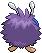

# #048 Venonat (Insect Pokémon)

| Official Artwork | Shiny Artwork |
| --- | --- |
|  |  |

Its big eyes are actually clusters of tiny eyes. At night, its kind is drawn by light.

---

## Media

### Sprites

| Front | Back | Front Shiny | Back Shiny |
| --- | --- | --- | --- |
|  |  |  |  |

### Cries

Latest (Gen VI+):

<audio controls>
<source src='../../assets/cries/venonat/latest.ogg' type='audio/ogg'>
  Your browser does not support the audio element.
</audio>

Legacy:

<audio controls>
<source src='../../assets/cries/venonat/legacy.ogg' type='audio/ogg'>
  Your browser does not support the audio element.
</audio>

---

## Pokédex Data

| National № | Type(s) | Height | Weight | Abilities | Local № |
|------------|---------|--------|--------|-----------|---------|
| #48 | {: width='48'} {: width='48'} | 1.0 m | 30.0 kg | 1. Compoundeyes 2. Tinted-Lens | N/A |

---

## Base Stats
|   | HP | Attack | Defense | Sp. Atk | Sp. Def | Speed |
|---|----|--------|---------|---------|---------|-------|
| **Base** | 60 | 55 | 50 | 40 | 55 | 45 |
| **Min** | 230 | 103 | 94 | 76 | 103 | 85 |
| **Max** | 324 | 229 | 218 | 196 | 229 | 207 |

The ranges shown above are for a level 100 Pokémon. Maximum values are based on a beneficial nature, 252 EVs, 31 IVs; minimum values are based on a hindering nature, 0 EVs, 0 IVs.

---

## Forms & Evolutions

!!! warning "WARNING"

    Information on evolutions may not be 100% accurate; differences between evolution methods across generations are not accounted for.

### Forms

Venonat has no alternate forms.

### Evolution Line

1. [Venonat](venonat.md/)
    1. Level Up: [Venomoth](venomoth.md/)

### Evolution Changes

---

## Training

| EV Yield | Catch Rate | Base Friendship | Base Exp. | Growth Rate | Held Items |
|----------|------------|-----------------|-----------|-------------|------------|
| 1 Special Defense | 190 | 70 | 61 | Medium | N/A |

---

## Breeding

| Egg Groups | Egg Cycles | Gender | Dimorphic | Color | Shape |
|------------|------------|--------|-----------|-------|-------|
| 1. Bug | 20 | 50.0% Male 50.0% Female | False | Purple | Humanoid |

---

## Moves

!!! warning "WARNING"

    Specific move information may be incorrect. However, the general movepool should be accurate; this includes changes made in Blaze Black and Volt White.

### Level Up Moves

| Lv. | Move | Type | Cat. | Power | Acc. | PP |
| --- | --- | --- | --- | --- | --- | --- |
| 1 | Disable | {: width='48'} | {: width='36'} | — | 100 | 20 |
| 1 | Foresight | {: width='48'} | {: width='36'} | — | — | 40 |
| 1 | Leech Life | {: width='48'} | {: width='36'} | 80 | 100 | 10 |
| 1 | Tackle | {: width='48'} | {: width='36'} | 40 | 100 | 35 |
| 5 | Supersonic | {: width='48'} | {: width='36'} | — | 55 | 20 |
| 11 | Confusion | {: width='48'} | {: width='36'} | 50 | 100 | 25 |
| 13 | Poison Powder | {: width='48'} | {: width='36'} | — | 75 | 35 |
| 17 | Signal Beam | {: width='48'} | {: width='36'} | 75 | 100 | 15 |
| 23 | Stun Spore | {: width='48'} | {: width='36'} | — | 75 | 30 |
| 25 | Psybeam | {: width='48'} | {: width='36'} | 65 | 100 | 20 |
| 29 | Sleep Powder | {: width='48'} | {: width='36'} | — | 75 | 15 |
| 37 | Zen Headbutt | {: width='48'} | {: width='36'} | 80 | 90 | 15 |
| 41 | Poison Fang | {: width='48'} | {: width='36'} | 50 | 100 | 15 |
| 47 | Psychic | {: width='48'} | {: width='36'} | 90 | 100 | 10 |

### TM Moves

| TM | Move | Type | Cat. | Power | Acc. | PP |
| --- | --- | --- | --- | --- | --- | --- |
| TM06 | Toxic | {: width='48'} | {: width='36'} | — | 90 | 10 |
| TM09 | Venoshock | {: width='48'} | {: width='36'} | 65 | 100 | 10 |
| TM10 | Hidden Power | {: width='48'} | {: width='36'} | 60 | 100 | 15 |
| TM11 | Sunny Day | {: width='48'} | {: width='36'} | — | — | 5 |
| TM17 | Protect | {: width='48'} | {: width='36'} | — | — | 10 |
| TM21 | Frustration | {: width='48'} | {: width='36'} | — | 100 | 20 |
| TM22 | Solar Beam | {: width='48'} | {: width='36'} | 120 | 100 | 10 |
| TM27 | Return | {: width='48'} | {: width='36'} | — | 100 | 20 |
| TM29 | Psychic | {: width='48'} | {: width='36'} | 90 | 100 | 10 |
| TM32 | Double Team | {: width='48'} | {: width='36'} | — | — | 15 |
| TM36 | Sludge Bomb | {: width='48'} | {: width='36'} | 90 | 100 | 10 |
| TM42 | Facade | {: width='48'} | {: width='36'} | 70 | 100 | 20 |
| TM44 | Rest | {: width='48'} | {: width='36'} | — | — | 5 |
| TM45 | Attract | {: width='48'} | {: width='36'} | — | 100 | 15 |
| TM46 | Thief | {: width='48'} | {: width='36'} | 60 | 100 | 25 |
| TM48 | Round | {: width='48'} | {: width='36'} | 60 | 100 | 15 |
| TM70 | Flash | {: width='48'} | {: width='36'} | — | 100 | 20 |
| TM76 | Struggle Bug | {: width='48'} | {: width='36'} | 50 | 100 | 20 |
| TM87 | Swagger | {: width='48'} | {: width='36'} | — | 85 | 15 |
| TM90 | Substitute | {: width='48'} | {: width='36'} | — | — | 10 |

### Egg Moves

| Move | Type | Cat. | Power | Acc. | PP |
| --- | --- | --- | --- | --- | --- |
| Agility | {: width='48'} | {: width='36'} | — | — | 30 |
| Screech | {: width='48'} | {: width='36'} | — | 85 | 40 |
| Giga Drain | {: width='48'} | {: width='36'} | 75 | 100 | 10 |
| Baton Pass | {: width='48'} | {: width='36'} | — | — | 40 |
| Morning Sun | {: width='48'} | {: width='36'} | — | — | 5 |
| Skill Swap | {: width='48'} | {: width='36'} | — | — | 10 |
| Secret Power | {: width='48'} | {: width='36'} | 70 | 100 | 20 |
| Signal Beam | {: width='48'} | {: width='36'} | 75 | 100 | 15 |
| Toxic Spikes | {: width='48'} | {: width='36'} | — | — | 20 |
| Bug Bite | {: width='48'} | {: width='36'} | 60 | 100 | 20 |
| Rage Powder | {: width='48'} | {: width='36'} | — | — | 20 |

### Tutor Moves

Venonat cannot learn any moves from tutors.
