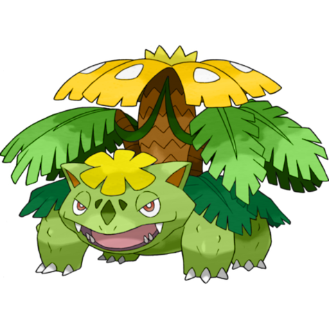
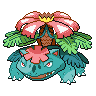
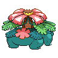
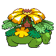
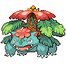

# #10033 Venusaur Mega (Seed Pokémon)

| Official Artwork | Shiny Artwork |
| --- | --- |
|  |  |

After a rainy day, the flower on its back smells stronger. The scent attracts other Pokémon.

---

## Media

### Sprites

| Front | Back | Front Shiny | Back Shiny |
| --- | --- | --- | --- |
|  |  |  |  |

### Female Sprites

| Front |
| --- |
|  |

### Cries

Latest (Gen VI+):

<audio controls>
  <source src='../assets/cries/venusaur-mega/latest.ogg' type='audio/ogg'>
  Your browser does not support the audio element.
</audio>

---

## Pokédex Data

| National № | Type(s) | Height | Weight | Abilities | Local № |
|------------|---------|--------|--------|-----------|---------|
| #10033 | {: width='48'} {: width='48'} | 2.4 m | 155.5 kg | 1. Thick-Fat | #N/A |

---

## Base Stats
---

## Base Stats
|   | HP | Attack | Defense | Sp. Atk | Sp. Def | Speed |
|---|----|--------|---------|---------|---------|-------|
| **Base** | 80 | 100 | 123 | 122 | 120 | 80 |
| **Min** | 270 | 184 | 225 | 224 | 220 | 148 |
| **Max** | 364 | 328 | 379 | 377 | 372 | 284 |

The ranges shown above are for a level 100 Pokémon. Maximum values are based on a beneficial nature, 252 EVs, 31 IVs; minimum values are based on a hindering nature, 0 EVs, 0 IVs.

---

## Forms & Evolutions

!!! warning "WARNING"

    Some forms may not be available in Blaze Black/Volt White. Also information on evolutions may not be 100% accurate; it is currently quite complex to track generational evolution data.

### Forms

1. [Venusaur](venusaur.md/)
2. [Venusaur-Mega](venusaur-mega.md/)
3. [Venusaur-Gmax](venusaur-gmax.md/)

### Evolution Line

1. [Bulbasaur](bulbasaur.md/)
1. Level Up: [Ivysaur](ivysaur.md/)
1. Level Up: [Venusaur](venusaur.md/)

---

## Training

| EV Yield | Catch Rate | Base Friendship | Base Exp. | Growth Rate | Held Items |
|----------|------------|-----------------|-----------|-------------|------------|
| 2 Special Attack 1 Special Defense | 45 | 50 | 281 | Medium-Slow | N/A |

---

## Breeding

| Egg Groups | Egg Cycles | Gender | Dimorphic | Color | Shape |
|------------|------------|--------|-----------|-------|-------|
| 1. Monster 2. Plant | 20 | 87.5% Male 12.5% Female | True | Green | Quadruped |

---

## Moves

!!! warning "WARNING"

    Specific move information may be incorrect. However, the general movepool should be accurate (including changes to learnset).

### Level Up Moves

Lv. | Move | Type | Cat. | Power | Acc. | PP
--- | --- | --- | --- | --- | --- | ---
| 0 | Petal Dance | {: width='48'} | {: width='36'} | 120 | 100 | 10 |
| 1 | Growl | {: width='48'} | {: width='36'} | — | 100 | 40 |
| 1 | Leech Seed | {: width='48'} | {: width='36'} | — | 90 | 10 |
| 1 | Petal Dance | {: width='48'} | {: width='36'} | 120 | 100 | 10 |
| 1 | Tackle | {: width='48'} | {: width='36'} | 40 | 100 | 35 |
| 1 | Vine Whip | {: width='48'} | {: width='36'} | 45 | 100 | 25 |
| 3 | Growl | {: width='48'} | {: width='36'} | — | 100 | 40 |
| 7 | Leech Seed | {: width='48'} | {: width='36'} | — | 90 | 10 |
| 9 | Vine Whip | {: width='48'} | {: width='36'} | 45 | 100 | 25 |
| 13 | Poison Powder | {: width='48'} | {: width='36'} | — | 75 | 35 |
| 13 | Sleep Powder | {: width='48'} | {: width='36'} | — | 75 | 15 |
| 15 | Take Down | {: width='48'} | {: width='36'} | 90 | 85 | 20 |
| 20 | Razor Leaf | {: width='48'} | {: width='36'} | 55 | 95 | 25 |
| 23 | Sweet Scent | {: width='48'} | {: width='36'} | — | 100 | 20 |
| 28 | Growth | {: width='48'} | {: width='36'} | — | — | 20 |
| 31 | Double Edge | {: width='48'} | {: width='36'} | 120 | 100 | 15 |
| 39 | Worry Seed | {: width='48'} | {: width='36'} | — | 100 | 10 |
| 45 | Synthesis | {: width='48'} | {: width='36'} | — | — | 5 |
| 50 | Petal Blizzard | {: width='48'} | {: width='36'} | 90 | 100 | 15 |
| 53 | Solar Beam | {: width='48'} | {: width='36'} | 120 | 100 | 10 |

### TM Moves

TM | Move | Type | Cat. | Power | Acc. | PP
--- | --- | --- | --- | --- | --- | ---
| TM01 | Work Up | {: width='48'} | {: width='36'} | — | — | 30 |
| TM05 | Roar | {: width='48'} | {: width='36'} | — | — | 20 |
| TM06 | Toxic | {: width='48'} | {: width='36'} | — | 90 | 10 |
| TM09 | Venoshock | {: width='48'} | {: width='36'} | 65 | 100 | 10 |
| TM10 | Hidden Power | {: width='48'} | {: width='36'} | 60 | 100 | 15 |
| TM100 | Confide | {: width='48'} | {: width='36'} | — | — | 20 |
| TM11 | Sunny Day | {: width='48'} | {: width='36'} | — | — | 5 |
| TM15 | Hyper Beam | {: width='48'} | {: width='36'} | 150 | 90 | 5 |
| TM16 | Light Screen | {: width='48'} | {: width='36'} | — | — | 30 |
| TM17 | Protect | {: width='48'} | {: width='36'} | — | — | 10 |
| TM20 | Safeguard | {: width='48'} | {: width='36'} | — | — | 25 |
| TM21 | Frustration | {: width='48'} | {: width='36'} | — | 100 | 20 |
| TM22 | Solar Beam | {: width='48'} | {: width='36'} | 120 | 100 | 10 |
| TM26 | Earthquake | {: width='48'} | {: width='36'} | 100 | 100 | 10 |
| TM27 | Return | {: width='48'} | {: width='36'} | — | 100 | 20 |
| TM32 | Double Team | {: width='48'} | {: width='36'} | — | — | 15 |
| TM36 | Sludge Bomb | {: width='48'} | {: width='36'} | 90 | 100 | 10 |
| TM42 | Facade | {: width='48'} | {: width='36'} | 70 | 100 | 20 |
| TM44 | Rest | {: width='48'} | {: width='36'} | — | — | 5 |
| TM45 | Attract | {: width='48'} | {: width='36'} | — | 100 | 15 |
| TM48 | Round | {: width='48'} | {: width='36'} | 60 | 100 | 15 |
| TM49 | Echoed Voice | {: width='48'} | {: width='36'} | 40 | 100 | 15 |
| TM53 | Energy Ball | {: width='48'} | {: width='36'} | 90 | 100 | 10 |
| TM68 | Giga Impact | {: width='48'} | {: width='36'} | 150 | 90 | 5 |
| TM75 | Swords Dance | {: width='48'} | {: width='36'} | — | — | 20 |
| TM78 | Bulldoze | {: width='48'} | {: width='36'} | 80 | 100 | 20 |
| TM86 | Grass Knot | {: width='48'} | {: width='36'} | — | 100 | 20 |
| TM87 | Swagger | {: width='48'} | {: width='36'} | — | 85 | 15 |
| TM88 | Sleep Talk | {: width='48'} | {: width='36'} | — | — | 10 |
| TM90 | Substitute | {: width='48'} | {: width='36'} | — | — | 10 |
| TM96 | Nature Power | {: width='48'} | {: width='36'} | — | — | 20 |

### Egg Moves

Venusaur Mega cannot learn any moves by breeding.
### Tutor Moves

Move | Type | Cat. | Power | Acc. | PP
--- | --- | --- | --- | --- | ---
| Bind | {: width='48'} | {: width='36'} | 15 | 85 | 20 |
| Snore | {: width='48'} | {: width='36'} | 50 | 100 | 15 |
| Outrage | {: width='48'} | {: width='36'} | 120 | 100 | 10 |
| Giga Drain | {: width='48'} | {: width='36'} | 75 | 100 | 10 |
| Synthesis | {: width='48'} | {: width='36'} | — | — | 5 |
| Knock Off | {: width='48'} | {: width='36'} | 65 | 100 | 20 |
| Block | {: width='48'} | {: width='36'} | — | — | 5 |
| Frenzy Plant | {: width='48'} | {: width='36'} | 150 | 90 | 5 |
| Worry Seed | {: width='48'} | {: width='36'} | — | 100 | 10 |
| Seed Bomb | {: width='48'} | {: width='36'} | 80 | 100 | 15 |
| Grass Pledge | {: width='48'} | {: width='36'} | 100 | 100 | 10 |
| Stomping Tantrum | {: width='48'} | {: width='36'} | 75 | 100 | 10 |

