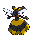
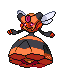
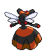

# #416 Vespiquen (Beehive Pokémon)

| Official Artwork | Shiny Artwork |
| --- | --- |
|  |  |

It releases various pheromones to make the grubs in its body do its bidding while fighting foes.

---

## Media

### Sprites

| Front | Back | Front Shiny | Back Shiny |
| --- | --- | --- | --- |
|  |  |  |  |

### Cries

Latest (Gen VI+):

<audio controls>
<source src='../../assets/cries/vespiquen/latest.ogg' type='audio/ogg'>
  Your browser does not support the audio element.
</audio>

Legacy:

<audio controls>
<source src='../../assets/cries/vespiquen/legacy.ogg' type='audio/ogg'>
  Your browser does not support the audio element.
</audio>

---

## Pokédex Data

| National № | Type(s) | Height | Weight | Abilities | Local № |
|------------|---------|--------|--------|-----------|---------|
| #416 | {: width='48'} {: width='48'} | 1.2 m | 38.5 kg | 1. Pressure 2. Intimidate | N/A |

---

## Base Stats
|   | HP | Attack | Defense | Sp. Atk | Sp. Def | Speed |
|---|----|--------|---------|---------|---------|-------|
| **Base** | 70 | 80 | 102 | 80 | 102 | 40 |
| **Min** | 250 | 148 | 188 | 148 | 188 | 76 |
| **Max** | 344 | 284 | 333 | 284 | 333 | 196 |

The ranges shown above are for a level 100 Pokémon. Maximum values are based on a beneficial nature, 252 EVs, 31 IVs; minimum values are based on a hindering nature, 0 EVs, 0 IVs.

---

## Forms & Evolutions

!!! warning "WARNING"

    Information on evolutions may not be 100% accurate; differences between evolution methods across generations are not accounted for.

### Forms

Vespiquen has no alternate forms.

### Evolution Line

1. [Combee](combee.md/)
    1. Level Up: [Vespiquen](vespiquen.md/)

---

## Training

| EV Yield | Catch Rate | Base Friendship | Base Exp. | Growth Rate | Held Items |
|----------|------------|-----------------|-----------|-------------|------------|
| 1 Defense 1 Special Defense | 45 | 50 | 166 | Medium-Slow | Poison Barb (5%) |

---

## Breeding

| Egg Groups | Egg Cycles | Gender | Dimorphic | Color | Shape |
|------------|------------|--------|-----------|-------|-------|
| 1. Bug | 15 | 0.0% Male 100.0% Female | False | Yellow | Bug-Wings |

---

## Moves

!!! warning "WARNING"

    Specific move information may be incorrect. However, the general movepool should be accurate; this includes changes made in Blaze Black and Volt White.

### Level Up Moves

| Lv. | Move | Type | Cat. | Power | Acc. | PP |
| --- | --- | --- | --- | --- | --- | --- |
| 1 | Gust | {: width='48'} | {: width='36'} | 40 | 100 | 35 |
| 1 | Sweet Scent | {: width='48'} | {: width='36'} | — | 100 | 20 |
| 3 | Poison Sting | {: width='48'} | {: width='36'} | 15 | 100 | 35 |
| 7 | Confuse Ray | {: width='48'} | {: width='36'} | — | 100 | 10 |
| 9 | Fury Cutter | {: width='48'} | {: width='36'} | 40 | 95 | 20 |
| 13 | Defend Order | {: width='48'} | {: width='36'} | — | — | 10 |
| 15 | Pursuit | {: width='48'} | {: width='36'} | 40 | 100 | 20 |
| 19 | Fury Swipes | {: width='48'} | {: width='36'} | 18 | 80 | 15 |
| 21 | Power Gem | {: width='48'} | {: width='36'} | 90 | 100 | 20 |
| 23 | Silver Wind | {: width='48'} | {: width='36'} | 60 | 100 | 5 |
| 25 | Heal Order | {: width='48'} | {: width='36'} | — | — | 10 |
| 27 | Toxic | {: width='48'} | {: width='36'} | — | 90 | 10 |
| 29 | Acrobatics | {: width='48'} | {: width='36'} | 55 | 100 | 15 |
| 31 | Slash | {: width='48'} | {: width='36'} | 70 | 100 | 20 |
| 33 | Captivate | {: width='48'} | {: width='36'} | — | 100 | 20 |
| 37 | Attack Order | {: width='48'} | {: width='36'} | 90 | 100 | 15 |
| 39 | Swagger | {: width='48'} | {: width='36'} | — | 85 | 15 |
| 43 | Destiny Bond | {: width='48'} | {: width='36'} | — | — | 5 |

### TM Moves

| TM | Move | Type | Cat. | Power | Acc. | PP |
| --- | --- | --- | --- | --- | --- | --- |
| HM01 | Cut | {: width='48'} | {: width='36'} | 60 | 100 | 20 |
| TM01 | Hone Claws | {: width='48'} | {: width='36'} | — | — | 15 |
| TM06 | Toxic | {: width='48'} | {: width='36'} | — | 90 | 10 |
| TM09 | Venoshock | {: width='48'} | {: width='36'} | 65 | 100 | 10 |
| TM10 | Hidden Power | {: width='48'} | {: width='36'} | 60 | 100 | 15 |
| TM11 | Sunny Day | {: width='48'} | {: width='36'} | — | — | 5 |
| TM15 | Hyper Beam | {: width='48'} | {: width='36'} | 150 | 90 | 5 |
| TM17 | Protect | {: width='48'} | {: width='36'} | — | — | 10 |
| TM18 | Rain Dance | {: width='48'} | {: width='36'} | — | — | 5 |
| TM21 | Frustration | {: width='48'} | {: width='36'} | — | 100 | 20 |
| TM27 | Return | {: width='48'} | {: width='36'} | — | 100 | 20 |
| TM32 | Double Team | {: width='48'} | {: width='36'} | — | — | 15 |
| TM36 | Sludge Bomb | {: width='48'} | {: width='36'} | 90 | 100 | 10 |
| TM40 | Aerial Ace | {: width='48'} | {: width='36'} | 60 | — | 20 |
| TM42 | Facade | {: width='48'} | {: width='36'} | 70 | 100 | 20 |
| TM44 | Rest | {: width='48'} | {: width='36'} | — | — | 5 |
| TM45 | Attract | {: width='48'} | {: width='36'} | — | 100 | 15 |
| TM46 | Thief | {: width='48'} | {: width='36'} | 60 | 100 | 25 |
| TM48 | Round | {: width='48'} | {: width='36'} | 60 | 100 | 15 |
| TM56 | Fling | {: width='48'} | {: width='36'} | — | 100 | 10 |
| TM60 | Quash | {: width='48'} | {: width='36'} | — | 100 | 15 |
| TM68 | Giga Impact | {: width='48'} | {: width='36'} | 150 | 90 | 5 |
| TM70 | Flash | {: width='48'} | {: width='36'} | — | 100 | 20 |
| TM76 | Struggle Bug | {: width='48'} | {: width='36'} | 50 | 100 | 20 |
| TM81 | X Scissor | {: width='48'} | {: width='36'} | 80 | 100 | 15 |
| TM87 | Swagger | {: width='48'} | {: width='36'} | — | 85 | 15 |
| TM89 | U Turn | {: width='48'} | {: width='36'} | 70 | 100 | 20 |
| TM90 | Substitute | {: width='48'} | {: width='36'} | — | — | 10 |

### Egg Moves

Vespiquen cannot learn any moves by breeding.
### Tutor Moves

Vespiquen cannot learn any moves from tutors.
