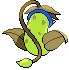

# #071 Victreebel (Flycatcher Pokémon)

| Official Artwork | Shiny Artwork |
|------------------|---------------|
|  |  |

It pools in its mouth a fluid with a honeylike scent, which is really an acid that dissolves anything.

---

## Media

### Default Sprites

| Front | Shiny | Back | Shiny |
|-------|-------|------|-------|
|  |  |  |  |

### Cries

Latest (Gen VI+):

<audio controls>
<source src='../../assets/cries/victreebel/latest.ogg' type='audio/ogg'>
  Your browser does not support the audio element.
</audio>

Legacy:

<audio controls>
<source src='../../assets/cries/victreebel/legacy.ogg' type='audio/ogg'>
  Your browser does not support the audio element.
</audio>

---

## Pokédex Data

| National № | Type(s) | Height | Weight | Abilities | Local № |
|------------|---------|--------|--------|-----------|---------|
| #71 | {: width="48"} {: width="48"} | 1.7 m / 5.6 ft | 15.5 kg / 34.2 lbs | 1. Chlorophyll 2. Intimidate | N/A |

---

## Base Stats
|   | HP | Attack | Defense | Sp. Atk | Sp. Def | Speed |
|---|----|--------|---------|---------|---------|-------|
| **Base** | 90 | 115 | 65 | 100 | 70 | 80 |
| **Min** | 290 | 211 | 121 | 184 | 130 | 148 |
| **Max** | 384 | 361 | 251 | 328 | 262 | 284 |

The ranges shown above are for a level 100 Pokémon. Maximum values are based on a beneficial nature, 252 EVs, 31 IVs; minimum values are based on a hindering nature, 0 EVs, 0 IVs.

---

## Forms & Evolutions

!!! warning "WARNING"

    Information on evolutions may not be 100% accurate; differences between evolution methods across generations are not accounted for.

### Forms

Victreebel has no alternate forms.

### Evolution Line

1. [Bellsprout](bellsprout.md/)
    1. Level Up: [Weepinbell](weepinbell.md/)
        1. Use Item: [Victreebel](victreebel.md/)

---

## Training

| EV Yield | Catch Rate | Base Friendship | Base Exp. | Growth Rate | Held Items |
|----------|------------|-----------------|-----------|-------------|------------|
| 3 Atk | 45 | 70 | 221 | Medium Slow | N/A |

---

## Breeding

| Egg Groups | Egg Cycles | Gender | Dimorphic | Color | Shape |
|------------|------------|--------|-----------|-------|-------|
| 1. Plant | 20 | 50.0% Male 50.0% Female | False | Green | Blob |

---

## Moves

!!! warning "WARNING"

    Specific move information may be incorrect. However, the general movepool should be accurate; this includes changes made in Blaze Black and Volt White.

### Level Up Moves

| Lv. | Move | Type | Cat. | Power | Acc. | PP |
| --- | --- | --- | --- | --- | --- | --- |
| 1 | Razor Leaf | {: width="48"} | {: width="36"} | 55 | 95 | 25 |
| 1 | Sleep Powder | {: width="48"} | {: width="36"} | — | 75 | 15 |
| 1 | Spit Up | {: width="48"} | {: width="36"} | — | 100 | 10 |
| 1 | Stockpile | {: width="48"} | {: width="36"} | — | — | 20 |
| 1 | Swallow | {: width="48"} | {: width="36"} | — | — | 10 |
| 1 | Sweet Scent | {: width="48"} | {: width="36"} | — | 100 | 20 |
| 1 | Vine Whip | {: width="48"} | {: width="36"} | 45 | 100 | 25 |
| 1 | Weather Ball | {: width="48"} | {: width="36"} | 50 | 100 | 10 |
| 17 | Sucker Punch | {: width="48"} | {: width="36"} | 70 | 100 | 5 |
| 27 | Leaf Tornado | {: width="48"} | {: width="36"} | 65 | 90 | 10 |
| 37 | Crunch | {: width="48"} | {: width="36"} | 80 | 100 | 15 |
| 47 | Leaf Blade | {: width="48"} | {: width="36"} | 90 | 100 | 15 |
| 47 | Leaf Storm | {: width="48"} | {: width="36"} | 130 | 90 | 5 |

### TM Moves

| TM | Move | Type | Cat. | Power | Acc. | PP |
| --- | --- | --- | --- | --- | --- | --- |
| HM01 | Cut | {: width="48"} | {: width="36"} | 60 | 100% | 25 |
| TM06 | Toxic | {: width="48"} | {: width="36"} | — | 90 | 10 |
| TM09 | Venoshock | {: width="48"} | {: width="36"} | 65 | 100 | 10 |
| TM10 | Hidden Power | {: width="48"} | {: width="36"} | 60 | 100 | 15 |
| TM11 | Sunny Day | {: width="48"} | {: width="36"} | — | — | 5 |
| TM15 | Hyper Beam | {: width="48"} | {: width="36"} | 150 | 90 | 5 |
| TM17 | Protect | {: width="48"} | {: width="36"} | — | — | 10 |
| TM21 | Frustration | {: width="48"} | {: width="36"} | — | 100 | 20 |
| TM22 | Solar Beam | {: width="48"} | {: width="36"} | 120 | 100 | 10 |
| TM27 | Return | {: width="48"} | {: width="36"} | — | 100 | 20 |
| TM32 | Double Team | {: width="48"} | {: width="36"} | — | — | 15 |
| TM33 | Reflect | {: width="48"} | {: width="36"} | — | — | 20 |
| TM36 | Sludge Bomb | {: width="48"} | {: width="36"} | 90 | 100 | 10 |
| TM42 | Facade | {: width="48"} | {: width="36"} | 70 | 100 | 20 |
| TM44 | Rest | {: width="48"} | {: width="36"} | — | — | 5 |
| TM45 | Attract | {: width="48"} | {: width="36"} | — | 100 | 15 |
| TM46 | Thief | {: width="48"} | {: width="36"} | 60 | 100 | 25 |
| TM48 | Round | {: width="48"} | {: width="36"} | 60 | 100 | 15 |
| TM53 | Energy Ball | {: width="48"} | {: width="36"} | 90 | 100 | 10 |
| TM68 | Giga Impact | {: width="48"} | {: width="36"} | 150 | 90 | 5 |
| TM70 | Flash | {: width="48"} | {: width="36"} | — | 100 | 20 |
| TM75 | Swords Dance | {: width="48"} | {: width="36"} | — | — | 20 |
| TM86 | Grass Knot | {: width="48"} | {: width="36"} | — | 100 | 20 |
| TM87 | Swagger | {: width="48"} | {: width="36"} | — | 85 | 15 |
| TM90 | Substitute | {: width="48"} | {: width="36"} | — | — | 10 |

### Egg Moves

Victreebel cannot learn any moves by breeding.
### Tutor Moves

Victreebel cannot learn any moves from tutors.
